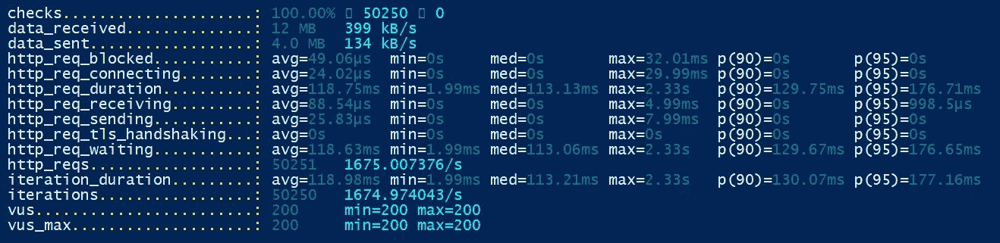

# Nginx 负载平衡和与 Docker 一起使用

> 原文：<https://levelup.gitconnected.com/nginx-load-balancing-and-using-with-docker-7e16c49f5d9>


来源:[芝士堡](https://cheezburger.com/1639595264)

所以这张照片说明了负载平衡不是什么。我们先简单说一下负载均衡。

多个应用程序的负载平衡是优化响应性、可用性和资源利用率的常用技术。负载平衡器管理服务器和客户端之间的流量。它们将流量分配给资源池中的不同服务器，以确保没有一台服务器超负荷工作。它们可以是硬件或软件解决方案。


来源:[森皮克](https://www.sempeak.com/blog/load-balancer-nedir)

Nginx 可以作为一个很好的负载平衡器，将传入的流量分配给服务器，并将响应从选定的服务器返回给客户端。Nginx 比其他负载均衡器有一些优势；

*   它支持多种平衡方法，适用于许多情况
*   它支持静态和动态缓存
*   每个 Nginx 实例完全支持多个不同的应用程序
*   它可以基于动态请求头、cookies、变量甚至查询参数来管理分发
*   速率限制、加权和会话管理


来源: [pngegg](https://www.pngegg.com/)

Nginx 开源支持四种负载平衡方法，Nginx Plus 支持另外两种方法。

1.  **循环法:**如果您没有指定任何内容，这是默认方法。在这种方法中，请求将被平均分配给后端服务。或者您可以指定要在分配中使用的权重。
2.  **最少连接数:**在这种方法中，请求被发送到当时活动连接数最少的服务器。您也可以用这种方法指定权重。
3.  **IP Hash:** 在其他平衡方法中，来自客户端的每个请求都可以被发送到不同的服务器。如果您在应用程序中使用会话，则不能提供持久性。在这种情况下，你有两种选择:你可以在你的服务器之间使用共享会话，比如 Redis，或者在 Nginx 上使用 IP 哈希方法。在这种方法中，Nginx 使用客户端 IP 地址作为密钥，将来自相同 IP 的请求发送到相同的服务器。这确保了客户端总是被重定向到相同的服务器。
4.  **通用散列:**在这个方法中，你可以使用你自己的变量来指定请求将被发送到哪个服务器。这些变量可以是请求头、客户端 IP 或请求参数。

让我们用 docker 和一个简单的 node.js API 创建一个例子来测试这些方法，看看它们如何影响我们的请求。我将使用 [k6](https://k6.io/) 对端点进行负载测试。k6 是开源的负载测试工具，也是 API 性能测试的云服务。

首先，我创建了一个简单的 node.js API，带有一个默认的 get 端点。它将返回当前的主机名，因此我将能够检测哪些请求被重定向到哪个主机。它将监听 dockerfile 中定义的 3003 端口。

现在我们有了一个 docker-compose 文件，它将在 docker 上构建 nginx 和我们的 API 映像。

在 nginx.dockerfile 中，我将使用 nginx 映像，并将本地 nginx.conf 文件复制到主机上的 nginx 目录中。

在第一个测试中，我将把 API 作为一个实例进行测试。在 nginx.conf 文件中，它将监听 5100 端口，并将这些请求重定向到监听 3003 端口的 API 端点。

在 k6 测试脚本中，它将创建一个对 localhost:5001 的请求，并记录 200 个状态结果和响应，其中包括 API 主机名，我将使用这个日志来检查主机的请求计数。

在运行测试时，我将使用相同的时间长度和相同的虚拟用户数来比较测试结果。它将是 30 秒长，有 200 个虚拟用户。

```
k6 run -u 200 -d 30s — summary-export=export.json — out json=my_test_result.json script.js
```


在单实例测试中，它总共进行了 30426 次测试，每秒 1014 个请求。现在，我将使用 nginx 负载平衡方法进行测试，并分享结果。

1.  **循环赛**

对于这个测试，我将扩展 3 个 API 实例，nginx 将传入的请求重定向到这些实例。

```
docker-compose up — scale api=3 -d
```


正如您从 k6 结果中看到的，它创建了比单实例更多的请求，总共 52545 个请求，每秒 1751 个请求。nginx 也将这些请求平均分配给 API 实例。

如果我们给 nginx 配置文件中的一个服务器一个权重，并再次尝试这个测试:



k6 测试结果与前一个几乎相同，但是请求分布结果非常不同。因为我们的 api_1 的权重=2，所以它的请求数是其他 api 的两倍。

2.**最少人脉**

在此方法中，请求将被重定向到具有最少活动连接的服务器。因为我们同时提出请求，所以循环赛也会有同样的结果。


从结果可以看出，它与循环法的结果大致相同。总共 49998 个请求，每秒 1666 个请求。nginx 也将这些请求平均分配给 API 实例。

3. **IP 哈希**

在这种方法中，nginx 使用客户端 ip 地址向哪个实例发送请求。当我从 localhost 发出所有请求时，它将对所有请求使用相同的 API 实例。但是让我们看看测试结果。


正如您从结果中看到的，虽然我有 3 个 API 服务器实例，nginx 将所有传入请求重定向到第一个实例。和 k6 结果与单实例结果大致相同。

在这篇文章中，我试图告诉你 nginx 负载平衡如何与 docker 和简单测试一起工作。您可以在我的 github repo 上找到所有文件，如下所示。如果你还有其他问题，可以问我。

[](https://github.com/mrceylan/DockerNginxLoadBalancer) [## mrceylan/dockernginxloadbancer

### 在 GitHub 上创建一个帐户，为 mrceylan/dockernginxloadbancer 的开发做出贡献。

github.com](https://github.com/mrceylan/DockerNginxLoadBalancer)