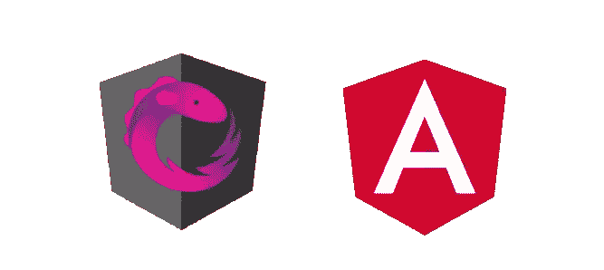

# NgRx 和角形路线防护装置

> 原文：<https://levelup.gitconnected.com/ngrx-and-angular-route-guards-a3fc3d5255f8>

## NgRx 在实践中

## NgRx 与角形路线防护装置集成指南

Angular 中我最喜欢的特性之一是预取路由事件组件数据的能力。预取改善了用户体验，并确保在激活路由时数据已经就位。这允许我们在导航到组件之前处理错误。当组件下面没有数据时，导航到组件是没有意义的。从最终用户的角度来看，保持对当前组件的关注并处理来自该页面的错误反馈要好得多。

# 预取组件数据

假设我们有一个带独立路由配置的惰性加载的`FundsModule`:

在路线上有一个`resolve`属性负责取出`fund`并注入`FundComponent`内部。通常预取可以使用 *Resolve Guard:* 以如下方式实现

您只需要从路由配置中获取实体 id，然后使用该 id 将请求发送到 API 服务，最后返回数据。这个响应将被注入到路由数据中，以便您可以从子组件中访问它。例如:

这个想法很简单。但是，这段代码有一个问题。如果您希望使用 store 和 reducers 一致地管理您的应用程序数据，您不能返回一个已解析的基金并将其注入到组件中。它必须放在商店里，因为商店负责提供访问和管理数据。

# 使用 NgRx 存储预取

不使用*解决* *防护*，可以使用*激活防护。*这种保护通常用于强制用户在访问组件之前进行身份验证。您可能想要阻止或限制访问，直到用户的帐户通过身份验证。通常，您可以像这样创建*激活保护*:

守卫返回可观察的布尔值作为结果。如果值为 true，导航将继续到目标组件。否则，导航停止。在我们的例子中，这个守卫的角色实际上是检查我们的存储是否有数据，如果没有数据，就发出一个 API 请求:

虽然这段代码有点复杂，但仍然可读。首先，我们尝试使用`FundFacade`从商店中提取`getFund()`。如果存储中没有与基金相关的数据，将通过调用`loadFunds()`方法来获取。在外观之下，`loadFunds()`将分派一个动作，该动作最终将触发一个 API 请求(下一节将详细介绍)。如果没有从 API 接收到数据，守卫返回`of(false)` 作为结果，从而阻止导航过程。成功后，守卫返回`of(true)`，让用户导航到组件。

值得一提的是，如果商店中没有资金数据，门卫会发出 API 请求。这样，商店将在路线导航完成之前被填充。

# 关于门面模式

如果您想将商店相关的逻辑与代码的其他部分分开，我在上面的代码中使用的 [Facade 模式](https://en.wikipedia.org/wiki/Facade_pattern)非常有用。从经验上讲，将 NgRx 相关的操作放在门面后面有助于组织和维护代码。facade 本身通常负责调度动作，并使用选择器从存储中获取数据。

让我给你看看它可能是什么样子。

如您所见，通过调用`loadFunds()`，将会分派一个动作。另一方面，`funds$` 可观察对象是通过选择特征存储的一部分来创建的。好的一面是，我们可能甚至没有意识到 NgRx 隐藏在表面之后。这就是这种模式的美妙之处。

# 动作和效果

为了使整个画面完整，以下是商店管理的其他元素。这些是您可能已经见过很多次的非常传统的代码示例。

动作和效果是基于 [*创作者*](https://medium.com/angular-in-depth/ngrx-action-creators-redesigned-d396960e46da) *用新的方法创作出来的。在以前的 NgRx 版本中，为了创建一个动作，你必须创建一个动作类型，创建一个类，最后创建一个动作联合。*

现在，为了实现更大的灵活性，可以通过分别使用`createAction`、`createReducer`和`createEffect`工厂函数，以一种不太冗长的方式创建动作、减少器和效果。`createAction`函数的第一个参数是动作类型，可选的第二个参数是额外的元数据，或动作的“道具”。

当您将角度路由防护与 NgRx 结合使用时，这种方法非常有效。我强烈建议你在你的 Angular 应用中加入 NgRx 来进行状态管理，因为这绝对是提高生产力和代码可维护性的重要一步。

# 包裹

我向您展示了如果当前存储中没有数据，如何使用 Route Guard 发出 API 请求，以及如何在路线导航完成之前用数据填充存储。

这太棒了。