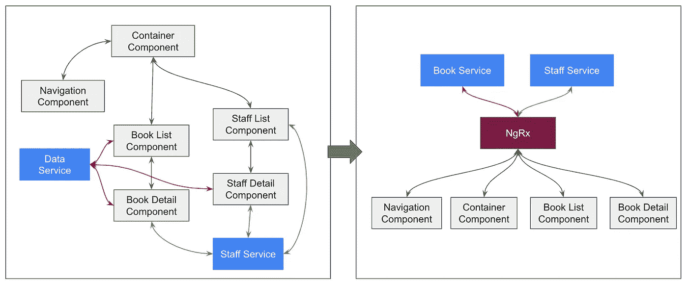
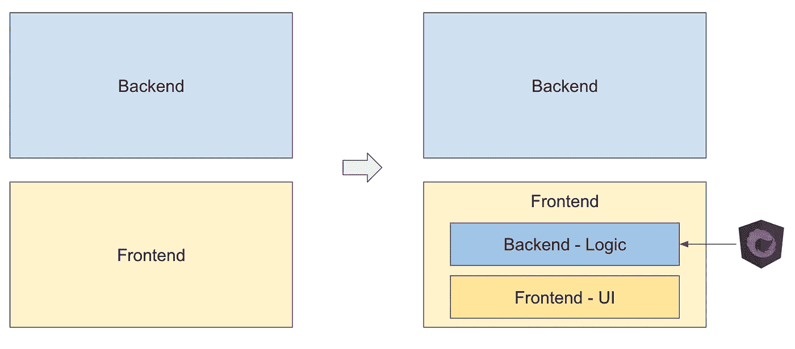
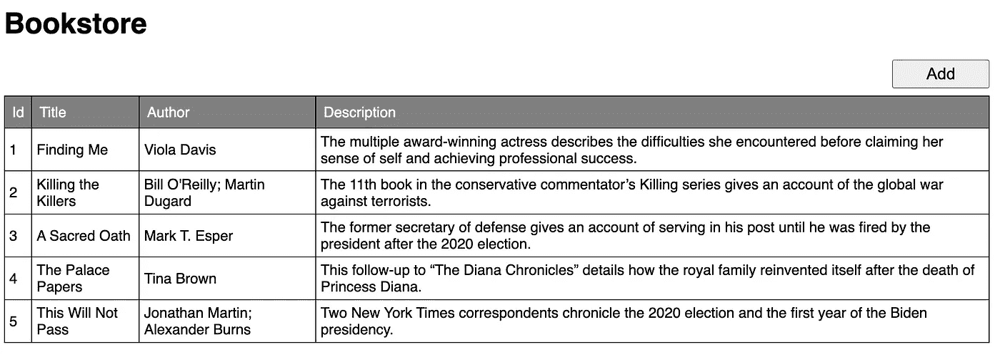
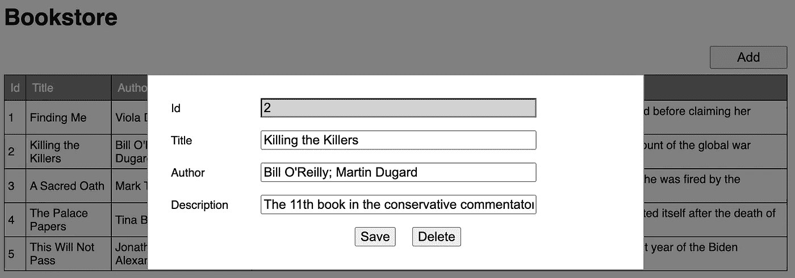
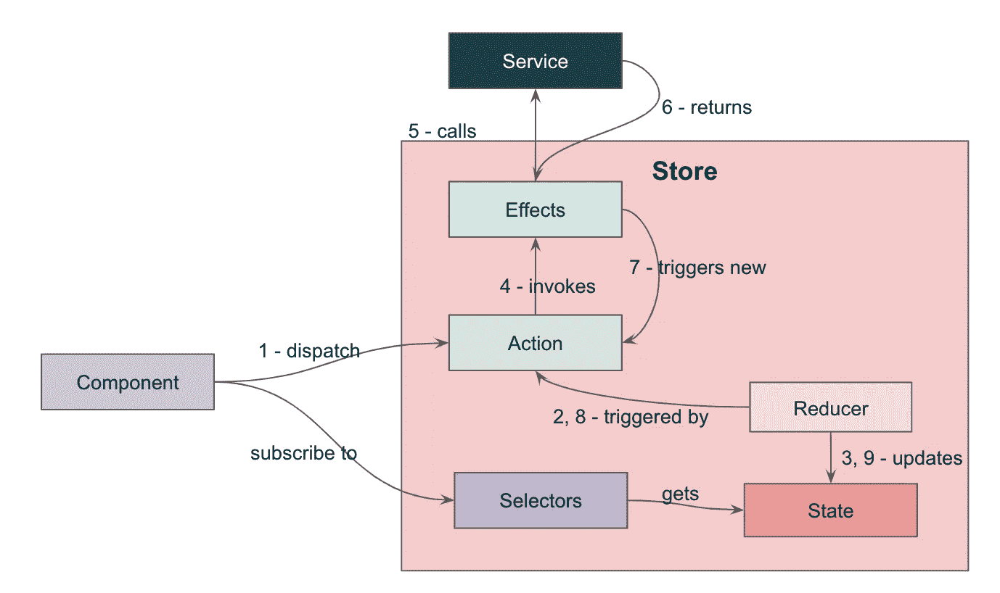

# NgRx 解释道

> 原文：<https://levelup.gitconnected.com/ngrx-explained-3891da35eeea>



很多时候，当我们的角度应用程序增长时，我们的代码变得很难理解。我们有多个组件，引用无数的服务，我们需要创建各种通道，以便在子组件和父组件之间传递数据。这使得我们所谓的用户界面前端应用程序被逻辑污染，代码变得更加难以理解。

就像 IT 解决方案一样，将所有数据的管理外包给一个框架是很自然的事情。这样做，我们不再将任何服务直接注入到我们的组件中，并且我们不会仅仅为了传递数据而在我们的父子组件之间创建不必要的事件发射器和输入。相反，我们只是关注我们的 UI 中需要什么，当我们需要数据时，我们只是引用框架。因此，我们有效地将“后端”部分从前端应用程序中分离出来。



这代表了我们开发前端应用程序的模式转变。我们没有让单个组件管理它们自己的数据，而是将整个应用程序中所有组件所需的所有数据组合起来，通过一个`store`引用。我们称这些数据为`state`。

假设我们有一个用 angular 编写的简单 CRUD 应用程序来管理书籍，它应该在一个表格中显示书籍列表，并且当用户想要创建新书或更新任何现有书籍时，它应该显示一个弹出窗口来显示书籍的详细信息。



我们通过运行`npm install @ngrx/store --save`将 ngrx 添加到应用程序中。

我们做的第一步是定义我们的状态，我们将需要哪些数据，以及它们各自的数据类型。它就像我们前端应用程序的`database`。所以我们创建一个名为`state`的文件夹，并在新创建的文件夹中创建一个新文件`books.state.ts`。

和所有数据库一样，我们不直接访问数据，但是我们创建 getter 方法来访问`state`。为了确保我们的组件总是拥有最新的`state`，而不是静态的 getter 方法，我们创建了`selectors`来返回各个状态的`[Observables](https://rxjs.dev/guide/observable)`，并让我们的组件订阅它。通过这种方式，`state`变更将自动更新到我们的组件中，并且它们可以相应地对其做出反应。因此创建了一个新的`books.selector.ts`来合并选择器。

ngrx 提供了`createFeatureSelector`方法来帮助我们通过名称和泛型参数类型直接选择状态。这就是为什么我们在一个`AppState`下创建了实际的状态`bookStore`，这样我们就可以选择一个名称。`createSelector`方法在第一个参数中接受其他选择器，然后最后一个参数接受一个方法，该方法将使用传入的选择器到达较低层次中的状态。尽管示例中没有，但是请注意，如果您的选择器依赖于多个选择器来确定要获得哪个状态，那么您可以在参数中传递多达 8 个选择器。

我们从不使用 setter 方法直接更新`state`。相反，`state`只会基于某些规定的事件而改变。所以我们有`actions`来定义可能发生的事件。然后我们有`reducers`，它定义了应用程序的初始状态，以及状态将如何根据发生的动作和动作发生前的状态而改变。

动作由一个字符串标识，它的有效负载将被传递给 reducer。Ngrx 提供了`createAction`方法，该方法接受动作的标识字符串，以及泛型参数中有效负载的数据类型。和往常一样，创建一个`books.actions.ts`来合并操作。

给定动作和当前状态，Reducers 是返回新状态的纯函数。所以为了有一个状态来处理，它需要一个在 ngrx 提供的`createReducer`方法的第一个参数中定义的初始状态。然后是每个动作的后续`on`方法。然后会创建一个`books.reducer.ts`。

请注意，这只会降低`bookStore`状态，而不会降低最高级别`AppState`。因此，如果在此`bookStore`的同一级别有其他状态，则可以创建不同的 reducer 文件。这有助于保持代码的整洁和易读。那么问题来了——`how then do we map the reducer to the state?`。当我们导入 StoreModule - `StoreModule.forRoot({bookStore: booksReducer})`时，我们在`forRoot`中添加链接。所以这个模块看起来会像这样。

还要注意，并不是所有的动作都有一个缩减器，例如，`loadBooks`动作就缺少一个缩减器。这是因为缩减器的目的仅仅是更新状态，如果动作不改变状态，就不需要缩减器。

到目前为止，您可能已经注意到缺少了一些东西，我们在哪里调用我们的服务来获取、更新、创建、删除数据呢？这将由副作用来处理。是的，副作用！因为无论何时发生任何事情，我们的 reducer 都应该提供最新的状态，并且我们有订阅它的组件，所以我们不能在 reducer 中运行异步流程。这就是为什么我们分别有一个`loadData`和一个`dataLoaded`动作。就像我们如何定义每个动作的缩减器一样，我们也可以定义基于哪个动作被触发而运行的副作用。这些副作用将处理异步作业来调用服务，当作业完成时，它将触发另一个动作。然后新动作的缩减器可以再次更新状态。

要有副作用，需要和`npm install @ngrx/effects --save`分开安装。像往常一样，我们创造了`books.effects.ts`。

由于我们为效果导入了一个新的模块，我们需要将它添加到 ngModule 的`imports`数组中，并且我们必须在 forRoot - `EffectsModule.forRoot([BooksEffects])`中传递效果类的列表。所以我们更新后的模块会变成这样。

我们已经为我们的部分创建了所有的后端，现在让我们来看看如何使用它。首先，我们需要将`@ngrx\store`导入到我们的组件中，并将其注入到构造函数中。

```
import {Store} from "@ngrx/store";constructor(private store: Store) {
}
```

然后，我们在`ngOnInit`中订阅组件中需要的所有选择器。注意，我们使用`this.store.select(<selector>)`来引用我们之前创建的选择器。

如果有什么被触发，比如当点击 add 按钮时，我们不发出事件或处理逻辑，而是简单地调用`this.store.dispatch(<action>)`来触发动作。

```
addBook(): void {
  this.store.dispatch(BookStoreActions.newBook())
}
```

如果动作是用有效负载定义的，我们只需在动作的参数中传递数据。

```
showBook(book: Book): void {
  this.store.dispatch(BookStoreActions.showBook({book}))
}
```

因此，当动作被触发时，reducer 更新状态，因为我们已经通过选择器订阅了状态更改，所以只要有状态更改，我们的组件就会被更新。从`Selector.showDetail`的订阅中可以看出，当`showDetail`状态改变时，应用程序将运行`showPopup()`或`dismissPopup()`。

应用程序的数据流在视觉上也是如此。



本文中描述的示例应用程序可以在 https://github.com/thecodinganalyst/bookstore 的[上获得。](https://github.com/thecodinganalyst/bookstore)

*本文原载于*[*https://the coding analyst . github . io/knowledge base/ngrx-explained/*](https://thecodinganalyst.github.io/knowledgebase/ngrx-explained/)