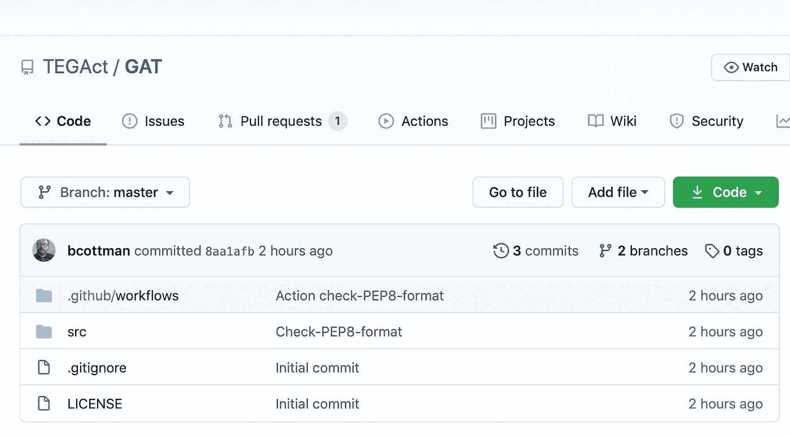
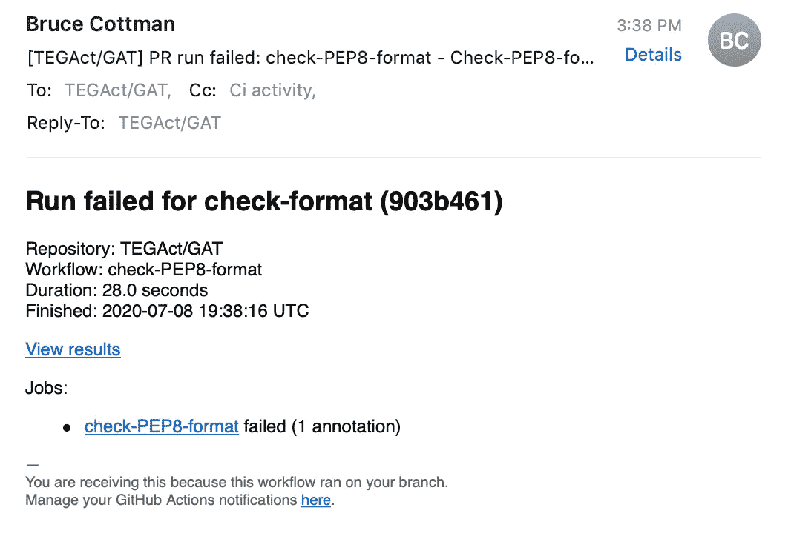
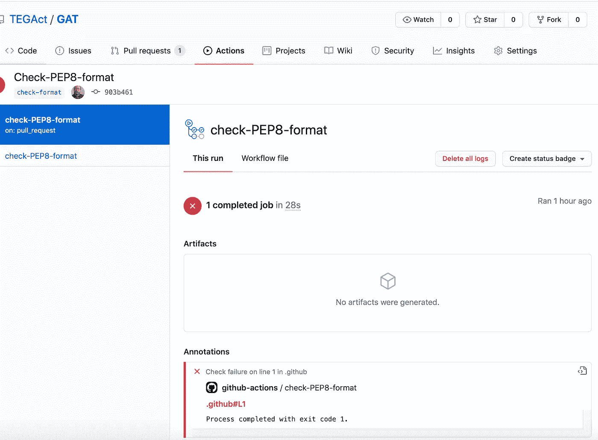
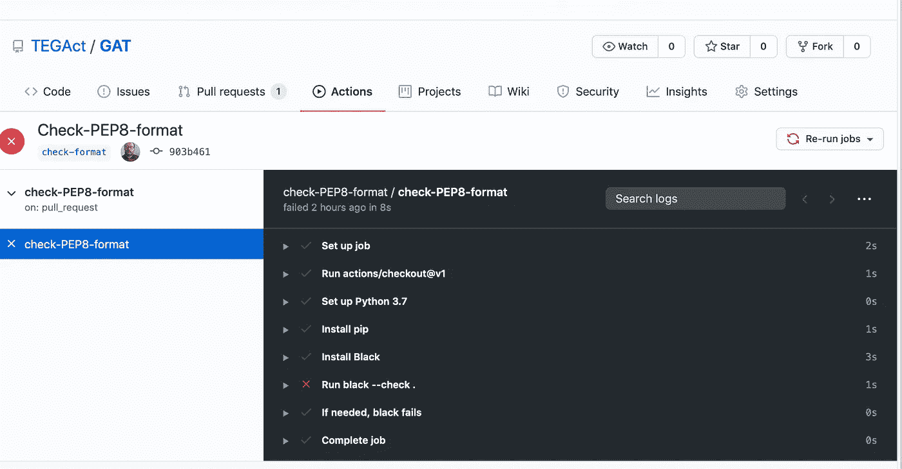
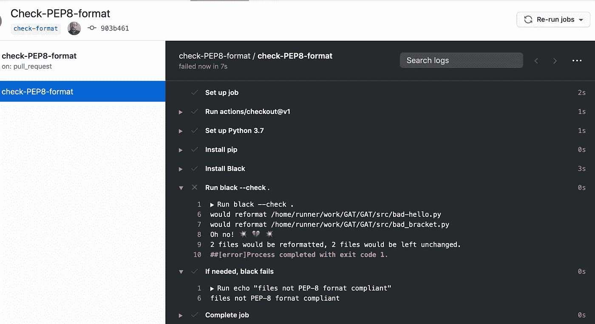

# Github 行动可以杀死 Jenkins 的 19 个理由

> 原文：<https://levelup.gitconnected.com/nineteen-reasons-that-github-actions-kills-off-jenkins-558d1c9ef0f4>

是的，标题有点争议。然而，根据我们的经验，我们预测 **GitHub** **动作**将成为持续开发、持续集成和持续部署 **GitHub** 的主要选择。我们列出了 19 个理由，说明为什么我们更喜欢 **GitHub** **动作**而不是**詹金斯。**我们完成了创建并运行一个**GitHub****Actions**脚本来自动检查 PEP-8 格式的演练。


Jenkins 等 CI/CD 工具能上濒危技术名单吗？资料来源:联合国人类住区规划署

## 我们涵盖的内容

1.  我们提供了 CD/CI/CD 的简短定义；
2.  我们给**詹金斯**一个简明的定义；
3.  我们列出了我们从 **Jenkins** 切换到 **Github 动作的原因；**
4.  我们通过展示持续开发中第一步脚本的实现来解释 Github 动作。

## 我们没有解释的是

这是一篇文章，不是一本书。我们列出了 CD/CI/CD ( **C** 持续 **D** 开发、 **C** 持续**集成**、 **C** 持续 **D** 部署)管道中需要理解和使用的几个主题。

我们在最后列出了 ***资源*** 部分的参考文献..对于每一个我们认为需要更多研究的课题，

> 注:我们使用 CD/CI/CD 和传统的缩写 CI/CD 可互换。唯一的区别是我们更喜欢将持续集成分成**持续开发**测试，开发(开发组活动)，和**持续集成**，测试(测试组活动)。
> 
> 注意:小组(职能专家和责任)不是团队。团队围绕一个项目组织起来，并由跨职能人员组成。

我们做**不是**封面:

1.  CD ( **C** 连续 **I** 集成)和 CD ( **C** 连续 **D** 部署)使用 **Github 动作；我们将在另一篇文章中讨论这个问题。在这篇文章中，我们确实提到了持续发展。**
2.  在本地服务器上运行 **GitHub** **动作**([自主持跑者](https://docs.github.com/en/actions/hosting-your-own-runners/using-self-hosted-runners-in-a-workflow))；您至少有两个好的选择，我们将在以后的文章中详细介绍。
3.  测试、测试金字塔和测试分支(例如，模拟数据等)。测试是一个巨大的主题，是我们 CD/CI 管道的核心。
4.  **Jenkins** 实现，相当于 **GitHub** **动作；**
5.  **GitHub** cloud 和 **git** 版本控制系统；什么是 CD/CI/CD？

## 什么是 CD/CI/CD？

*持续开发* t 是指来自本地*回购*的任何推送都转到项目版本控制*开发回购。*在 **GitHub** *Dev repo，CD/CI* 脚本运行 PEP-8 格式一致性、单元测试、文档测试和代码质量评审。

*持续开发*是传统*持续集成*过程的第一部分。是我们后面展示的 **GitHub** 动作脚本的核心基础。

我们已经选择将*持续集成*分成*持续开发*和*持续集成*，这在大多数广泛的开源项目中都会发生。这种分离使我们能够更加独立地工作(分布式**敏捷**过程)。

*当来自*Dev*repo*repo*的任何推送到 **GitHub** 测试 repo*时，持续集成*发生。*在*测试*服务器上，执行整个测试金字塔流程并发送报告。一个测试区域例外是*验收测试。*

*测试*开发者创建新的*在*测试***GitHub***repo*上拉*当他们 *git 从他们的本地 repo 推*到 **GitHub** *测试 repo 时。他们正在推动新的测试，通常是针对增加的单元测试、*集成测试*和*系统测试。Test* 从每日 *Dev* 和*pull*那里接收关于任何新文件、PEP-8 格式、覆盖率、代码质量和单元测试覆盖率的不同报告。*

*测试* **GitHub** *回购*推至*阶段* **GitHub** *回购。**连续交付*流程包括首先*在一系列硬件、操作系统和语言版本上运行*用户验收测试(UAT)。

第二部分是决定*阶段*是否准备好推向(通常是公开的)**GitHub***prod repo*。

按下**GitHub***prod repo*会导致一个或多个自动*连续交付*动作发生:

1.  建立 **zip** 、 **tar** 和/或 **whl** 分发文件；
2.  在 PyPi 上创建了一个包。
3.  文件被发送到 [readthedoc](https://readthedocs.org/) 。

## 詹金斯是什么？

詹金斯于 2011 年 2 月出生(首次发布)。它最初是一个 Java 构建工具。后来，随着 CI/CD 成为一个术语，它演变成了第一批 CI/CD 工具之一。

> 詹金斯是一个[免费开源](https://en.wikipedia.org/wiki/Free_and_open-source_software)自动化服务器。它有助于自动化[软件开发](https://en.wikipedia.org/wiki/Software_development)中与[构建](https://en.wikipedia.org/wiki/Software_build)、[测试](https://en.wikipedia.org/wiki/Test_automation)和[部署](https://en.wikipedia.org/wiki/Software_deployment)相关的部分，便于[持续集成](https://en.wikipedia.org/wiki/Continuous_integration)和[持续交付](https://en.wikipedia.org/wiki/Continuous_delivery)。它是一个基于服务器的系统，运行在 [servlet 容器](https://en.wikipedia.org/wiki/Java_Servlet#Container_servers)中，如[Apache Tomcat](https://en.wikipedia.org/wiki/Apache_Tomcat)…**Jenkins**功能可以用[插件](https://en.wikipedia.org/wiki/Plug-in_(computing))扩展。来自维基百科。

## 什么是 Github Actions？

**Github** **动作**是创建和维护持续开发/持续集成/持续部署(CD/CI/CD)工作流(IOHO)的最佳方式。

为什么？

1.  一个**动作**脚本是任何 **Github** 事件。事件包括 ***推送*** 、拉取、发布、评论、欢迎新成员加入、克隆、发布到 PyPI、发布到喜爱的云供应商、关闭陈旧问题等等，包括您自己独特的代码审查工具。
2.  如果你想自动化一个特定的手动步骤，它可能已经被编码、测试，并在**Github****market place 上开源为 **Github 动作**脚本。**
3.  你可以在大多数计算机语言中使用它。
4.  你可以在大多数硬件/操作系统环境下使用它，比如 **Ubuntu** 、 **Windows** 和 **macOS** 。(可以用于 **iOS** 和 **AndroidOS** ，但是 **GitHub** 云端不支持这些 OS。)
5.  可以用它持续部署到 **Azure** 、 **AWS** 、 **Google** 等云平台。

我们正在为我们工作的项目投入或替换基于 **Jenkins** 的 CI/CD 和基于 **GitHub Actions** 的 CD/CI/CD。

# 将 Jenkins 与 GitHub 行为进行比较的固执己见的列表

第三方对**詹金斯**和 **GitHub 操作之间差异的总结。**

 [## 从 Jenkins 迁移到 GitHub 操作

### GitHub Actions 和 Jenkins 有许多相似之处，这使得迁移到 GitHub Actions 相对…

help.github.com](https://help.github.com/en/actions/migrating-to-github-actions/migrating-from-jenkins-to-github-actions) 

> 注意:我们已经尽力保持我们关于***GitHub******动作*** 和**詹金斯**目标的推理。如果你发现任何抱怨，请告诉我们。此外，请给我们留下任何反对或同意的理由。

我们知道我们正在积累一定数量的技术债务，但我们已经在使用 **Github。**此外，大部分其他 **Git 云**都有*几乎*等价的 CI/CD 类动作。一个典型的例子是 **GitLab 管道**。

我们不会觉得比一个**詹金斯**或 **circleci** 文件更受束缚。诚然，我们的个人偏好是 **GitHub Actions。**

> 注意: **circleci** 是开源人群经常使用的 CI/CD 工具。 **circleci** 使用`***.yaml***`文件。我们经常看到 **circleci** 与 **GitHub 动作混合在一起。由于 circleci 已经推出多年，这可能意味着一些开源软件正在转变。**

我们跳上 **GitHub Actions** 并且*没有*重新考虑曾经和 **Jenkins 在一起。**也许已经在用 **GitHub** 跟我们的偏见有很大关系。然而，久而久之，我们越来越确信我们的决定是正确的。


**GitHub Actions** 实现了一个基于组件的异步 CI/CD 作业图。资料来源:联合国人类住区规划署

我们对 **Jenkins** 和 **GitHub 行为的逐项比较是**基于我们的个人经验。

1.  我们正在从 CI/CD 线性顺序整体管道( **Jenkins)** 、瀑布流程，转变为更接近于**敏捷**流程 **(GitHub Actions)** 的基于组件的异步管道。
2.  **Jenkins** 不是为云设计的。 **GitHub 动作**在云端。您可以选择在本地服务器(称为 runner)上安装 **GitHub Actions** 。
3.  詹金斯服务器需要安装。 **GitHub 动作**不需要安装。
4.  **Jenkins** 以构建(Java)为中心，通过插件扩展到 CI/CD。 **GitHub** 对任何 GitHub 事件都有一个**动作**。例如 git 克隆和问题管理的通知。
5.  **GitHub** **詹金斯**拥有超过 1000 个不同的**插件发布**大约十年，100 个/年的速度。
6.  我们正在为 **GitHub** 事件执行(从 **GitHub Marketplace** 复制)我们在 **Jenkins** 因其难度而推迟的活动。
7.  Jenkins 继续研究插件和版本控制是一笔很大的开销。Github Actions 要求我们阅读他们发布的新功能。
8.  **Jenkins** 比 **GitHub Action 的维护成本高。**我们与**詹金斯**的经验是，我们需要 1.5 到 2 名全职员工。有了 **GitHub Actions，**我们需要 0.25 到 0.5 名全职员工，到目前为止，需求似乎逐月下降。
9.  **Github** **动作**涵盖了 **GitHub** 中的每一种事件类型，比传统 CI/CD 涵盖的范围要广得多。 **Jenkins** 有一个完全不同的设计，基于账户和触发器，有时与 **GitHub** 事件不对应。
10.  乍一看**，詹金斯**似乎比**GitHub****动作更灵活，如果你使用 **GitHub** 的话。但是，您可以创建一个本地 **GitHub** repo，在本地运行 **GitHub Actions** ，然后推送至 **GitLab** 或任何您想要使用的云版本存储。作为您的版本控制云供应商，您没有被锁定在私有或公共的 **GitHub** repo 中。**
11.  **你应该在一个 **Docker** 镜像中运行 **Jenkins** 才能在不同版本的**硬件、OSs、**和 **Python** 包**上运行**Jenkins 服务器环境**。**你不必用 **GitHub 动作**来做这件事，因为它会为每个 **GitHub 工作流旋转一个云服务器实例。****
12.  **我们有一个专用于**詹金斯**的服务器，我们不需要一个用于 **GitHub 动作的服务器；****
13.  **似乎没有人将 **Jenkins** 用于开源 **Python** 项目。我们遇到了 CI/CD 工具 **circleCI** 和 **GitHub 动作。我们认为 **Jenkins** 用于一些开源项目。我们没见过**。如果我们看看 Java 开源空间，我们可能会有更好的运气。******
14.  **我们把**詹金斯**版本和插件扭曲放到 **Docker** 图片中。我们将这些不同的版本置于 **GitHub** 版本控制下！**
15.  **有一个“ [**牛逼**](https://github.com/sdras/awesome-actions)”**GitHub**回购为 **GitHub** **动作**；**
16.  **我们配置了一个一次性的 GitHub repo 来测试新的 Jenkins 脚本和 GitHub 动作。测试一个新的 **Jenkins** 脚本比测试一个 **GitHub Actions** 脚本要多得多。**
17.  **初级用户喜欢**詹金斯**向导。软件工程师#！$%詹金斯的**向导**。**
18.  **Jenkins 和其他 CI/CD 工具执行流水线工作流程。 **Github** 动作执行组件动作图。**
19.  ****GitHub 动作**原生于 **Github。詹金斯**不是原生于 **GitHub。****

> **注意: **Github 动作**对私人回购不免费。**
> 
> **注意:你可以创建一个本地 **GitHub** repo，在本地运行 **GitHub Actions** ，然后推送到 **GitLab** 或者任何你想使用的云版本存储。我们将在以后的文章中向您展示我们是如何做到这一点的。**
> 
> **注意: **Github Actions** 与几个不同的脚本或一个大的工作流一起运行。尽管这可能是一种浪费，但是云服务器会为每个工作流(和作业)启动，我们喜欢为我们的 CD/CI/CD 管道使用组件脚本。随着我们对 **Github 动作**越来越熟悉，我们将把一些工作流合并成更少的包含多个作业的工作流。**
> 
> **注意:如果回购是私有的，你必须为 Github 动作运行时间付费，因为维护成本，我们仍然会使用组件脚本。**
> 
> **注意:如果我们使用多个 **Git** 云供应商 **(GitHub、GitLab、Bitbucket、…)，**这将是在 **circleci** 和 **Github 动作之间的掷硬币。**然而**，Github 动作**是原生 **GitHub CI/CD** 解决方案**。有一些额外的功能我们在 circleci** 中很难实现。**
> 
> **注意:我们不会详细比较 **circleci** 和 **Github 动作。在本文中，我们不考虑混合使用 **circleci** 和 **GitHub Actions** 脚本。****
> 
> **注意:我们可以为 GitHub **动作**提供一个本地专用服务器，而不是使用付费分钟进行私人回购。**
> 
> **注意: **Docker** 图像用于 **GitHub 动作**你想要完全控制的地方，而不是在云服务器实例**中。**我们不使用 **Docker** 图像，因为我们没有遇到任何问题。**

# **TEGAct/GAT 报告的 GitHub 行动**

## **1.创建一个新的 GitHub 帐户。**

**为了安全起见，我们将创建一个新的 GitHub 帐户。默认情况下， **GitHub 动作**在一个帐户下的所有存储库(代表)上启用。**

**我们称我们的 **GitHub** 账号为`TEGAct`(灭虫: **GitHub Actions)。**不幸的是，你必须给你的测试 **GitHub** 账号起个别的名字。**

> **注意:保留此 **GitHub** 账户，以备将来 **GitHub** 动作测试之用。**
> 
> **注意:如果您没有 **Github** 帐户:**

 **[## 注册一个新的 GitHub 账户

### GitHub 为个人提供用户账户，为团队成员提供组织账户。更多信息…

docs.github.com](https://docs.github.com/en/github/getting-started-with-github/signing-up-for-a-new-github-account)** 

## **2.为这些演练创建本地和远程 GitHub repos。**

> **注意:你需要知道如何创建一个 **GitHub** repo，你可以从这里开始:**

 **[## GitHub 入门

### 了解 GitHub 的产品，注册帐户，探索 GitHub 社区。

docs.github.com](https://docs.github.com/en/github/getting-started-with-github)** 

**你需要从我们的 **GitHub** repo `TEGASource`中获取 **GitHub 动作**文件和`src**/*.py**` 到你的本地项目目录。**

> **注意:一定要先在`*cd <directory/path>/PROJECTS*`或任何你想要的地方本地克隆这个 repo。如果你不理解这些克隆的东西，请阅读 git。你需要在你的简历上写上 git。**

```
git clone [https://github.com/bcottman/TEGASource](https://github.com/bcottman/TEGASource)
```

**现在，创建一个远程公共回购，在你的 **GitHub** 账户中将其命名为`GAT`。将`.gitignore`和`LICENSE` 文件添加到回购由您决定。将远程`GAT`克隆到本地`GAT`。**

```
git clone [https://github.com/<your account name>/G](https://github.com/bcottman/test_actions)AT
cd GAT
git status
```

**输出= >**

```
On branch master
Your branch is up to date with 'origin/master'.
nothing to commit, working tree clean
```

## **3.在 GAT repo 中创建本地目录。**

**您应该执行一些 **Unix/Linux** shell 命令(在 **MS Windows** 上有所不同)，然后在`=>`之后看到类似的内容:**

```
Macie: brucecottman$ pwd
=>
<your-directory-path>/PROJECTS/GATMacie: brucecottman$ mkdir src
Macie: brucecottman$ mkdir -p .github/workflow
Macie: brucecottman$ ls -a
=>
.  .git  .gitignore src
..  .github  LICENSE
```

## **4.在远程 GitHub 文件 TEGAct/GAT /中加入 PEP-8 格式强制 GitHub 操作。github/workflow check-pep 8-format . YAML。**

**文件`.github/workflow/check-PEP8-format.yaml:`**

```
*# GitHub Action that uses the Black tool to check PEP-8 format an a repo pull request.
# If all Python code in the pull request is compliant with Black then this Action does nothing.
# Othewrwise, a warning message is issued**# (Action)  Workflow is entire file* name: check-PEP8-format
*# The name of the (Action) workflow file (optional)* on: [pull_request]
*# GitHub event [pull_request] that triggers the workflow. (required)
# The available events
# ref:* [*https://docs.github.com/en/actions/reference/events-that-trigger-workflows#in-this-article*](https://docs.github.com/en/actions/reference/events-that-trigger-workflows#in-this-article)jobs:
*# start jobs in workflow. In this case one job named check-PEP8-format* check-PEP8-format:
    runs-on: ubuntu-latest
    steps:
*#steps in job* - uses: actions/checkout@v1
      - name: Set up Python 3.7
        uses: actions/setup-python@v1
        with:
          python-version: 3.7
      - name: Install pip
        run: python -m pip install --upgrade pip
      - name: Install Black
        run: pip install black
      - name: Run black --check .
        run: black --check .
      - name: If needed, black fails
        if: failure()
        run: |
          echo "files not PEP-8 fornat compliant"
```

**被上移至**GitHub**回购 **

```
Macie: brucecottman$ pwd
=>
*<directory/path>*/PROJECTS/GATMacie: brucecottman$ cd .github/workflow
Macie: brucecottman$ cp <your-directory-path>/PROJECTS/TGASource/actions/check-PEP8-format.yml .
Macie brucecottman$ ls -a
=>
.   ..   check-PEP8-format.ymlMacie: brucecottman$ git add .github/
Macie: brucecottman$ git status
=>On branch master
Your branch is up to date with 'origin/master'.Changes to be committed:new file:   .github/workflows/check-PEP8-format.ymlMacie: brucecottman$ git add src
Macie: brucecottman$ git commit -m 'Action check-PEP8-format'
=>
[master e58104c] Action check-PEP8-format
1 file changed, 32 insertions(+)
create mode 100644 .github/workflows/check-PEP8-format.yml(base) Macie:GAT brucecottman$ git push origin master
=>
Counting objects: 5, done.
Delta compression using up to 24 threads.
Compressing objects: 100% (3/3), done.
Writing objects: 100% (5/5), 969 bytes | 969.00 KiB/s, done.
Total 5 (delta 0), reused 0 (delta 0)
To [https://github.com/TEGAct/GAT.git](https://github.com/TEGAct/GAT.git)
a6a3fcb..e58104c  master -> master
```

## **5.在远程 GitHub 帐户 TEGAct repos 中触发 PEP-8 格式强制 GitHub 操作。**

**`src`文件上移至**GitHub**回购 **

```
Macie: brucecottman$ pwd
=>
<your-directory-path>/PROJECTS/GATMacie: brucecottman$ cd src
Macie: brucecottman$ cp <your-directory-path>/PROJECTS/TGASource//src/* .Macie: brucecottman$ ls -a
=>
.  bad-hello.py good-hello.py
..  bad_braxket.py good_bracket.pyMacie: brucecottman$cd ..
Macie: brucecottman$ git commit -m 'Check-PEP8-format'
=>
[master 65ce58d] Check-PEP8-format
4 files changed, 22 insertions(+)
create mode 100644 src/bad-hello.py
create mode 100644 src/bad_bracket.py
create mode 100644 src/good-hello.py
create mode 100644 src/good_bracket.py(base) Macie:GAT brucecottman$
+>
Counting objects: 7, done.
Delta compression using up to 24 threads.
Compressing objects: 100% (7/7), done.
Writing objects: 100% (7/7), 834 bytes | 834.00 KiB/s, done.
Total 7 (delta 1), reused 0 (delta 0)
remote: Resolving deltas: 100% (1/1), completed with 1 local object.
To [https://github.com/TEGAct/GAT.git](https://github.com/TEGAct/GAT.git)
e58104c..65ce58d  master -> master
```

**现在转到你的 **GitHub** repo，点击 repo 名称下面的功能区栏中的`Pull requests`。**

****

**GitHub repo TEGAct/GAT**

**，您应该会收到一封电子邮件:**

****

**触发 GitHub 操作 check-PEP8-format.yml 的 pull 生成的电子邮件**

**点击电子邮件中的网址`View format`:**

****

**GitHub-操作/检查-pep 8-格式**

**现在，点击电子邮件中的 URL `Check-PEP8 Results`:**

****

**`Check-PEP8 Results log of the status the GitHub Action steps`**

**点击步骤`Run black --check .`以获得关于此故障的更多详细信息。**

****

**`Step: 'black --check .' log detail.`**

**如您所见，您可以获得非常详细的报告，而无需任何 CI/CD 编程编码。**

## **摘要**

**GitHub Actions 的强大之处在于将代码投入生产的繁琐工作的自动化。下面是一些你应该知道的非可选的行动项目和概念。**

1.  **默认情况下， **GitHub 动作**在一个帐户下的所有存储库(repos)上启用。**
2.  **`.github/workflow` 目录对于每个回购是唯一的，因此<动作>。放在该目录中的 yaml 对于该 repo 是唯一的。**
3.  ****GitHub 动作**可以 ***不可以*** 将代码变更推入回购。作为一个有效的安全功能，它可以防止恶意代码粉碎你的回购。此外，它还可以防止你安装一个 bug**GitHub Action**来破坏你的 repos。**

> **注意:陈述#1 和#2 并不矛盾。重述的声明#1 是 **GitHub 动作**t on。 **GitHub** 可能指的是**动作可用，**因为这是两年前不存在的功能。**

**我们在 GitHub 上免费使用公共回购。目的是让开源软件在 **GitHub 上免费搭车。**约束条件是:**

*   **公共存储库每月 2000 分钟 **GitHub 操作**免费。我们的`.github/workflow/check-PEP8-format.yaml` **GitHub 动作**运行**大约需要 28 秒。****
*   **500 MB GitHub 为公共存储库打包存储。**

****GitHub** 上的一些(大于 10000)**Python**开源项目有 **numpy、sklearn、pandas、pytorch、**和 **Keras** 。**

**我希望我们是根据 GitHub Actions 的优点说服你的。随着 **GitHub 行动的进展，我们计划写更多的文章。****

## **资源**

**[](https://realpython.com/tutorials/testing/) [## Python 测试教程—真正的 Python

### 在这个页面上，你可以找到关于如何测试不同类型的 Python 应用程序的教程，从命令行应用程序到所有…

realpython.com](https://realpython.com/tutorials/testing/) [](http://softwaretestingfundamentals.com/integration-testing/) [## 集成测试—软件测试基础

### 集成测试是软件测试的一个层次，其中将单个单元作为一个组进行组合和测试。的…

softwaretestingfundamentals.com](http://softwaretestingfundamentals.com/integration-testing/) [](https://medium.com/@cjolowicz/hypermodern-python-2-testing-ae907a920260) [## 超现代 Python 2:测试

### 现代 Python 工具指南，侧重于简单性和极简主义。本章包括使用 Pytest 进行测试…

medium.com](https://medium.com/@cjolowicz/hypermodern-python-2-testing-ae907a920260)  [## 从 Jenkins 迁移到 GitHub 操作

### GitHub Actions 和 Jenkins 有许多相似之处，这使得迁移到 GitHub Actions 相对…

docs.github.com](https://docs.github.com/en/actions/migrating-to-github-actions/migrating-from-jenkins-to-github-actions) [](https://medium.com/@vanflymen/blazing-fast-ci-with-github-actions-poetry-black-and-pytest-9e74299dd4a5) [## GitHub 动作，诗歌，黑色和 Pytest 的快速 CI

### 为现代 Django 项目设置 GitHub 操作

medium.com](https://medium.com/@vanflymen/blazing-fast-ci-with-github-actions-poetry-black-and-pytest-9e74299dd4a5)  [## GitHub 操作文档

### 使用 GitHub Actions 在您的存储库中自动化、定制和执行您的软件开发工作流。你…

docs.github.com](https://docs.github.com/en/actions) [](https://medium.com/@wkrzywiec/how-to-write-good-quality-python-code-with-github-actions-2f635a2ab09a) [## 如何用 GitHub 动作编写高质量的 Python 代码

### 在这篇博文中，我想与你分享如何在你的 Python 项目中设置 GitHub Actions 工作流，以使…

medium.com](https://medium.com/@wkrzywiec/how-to-write-good-quality-python-code-with-github-actions-2f635a2ab09a) [](https://www.jenkins.io/doc/tutorials/) [## 教程概述

### 这个页面有帮助吗？请通过此快速表格提交您对此页面的反馈。或者，如果你不…

www.jenkins.io](https://www.jenkins.io/doc/tutorials/)  [## 教程

### 使用与您的平台相关的教程来了解在中可能实现的定制…

circleci.com](https://circleci.com/docs/2.0/tutorials/)  [## Git 教程和培训|亚特兰大 Git 教程

### 通过这个全面的 Git 培训学习 Git 的基础知识。涵盖了分支、拉请求、合并等更多内容…

www.atlassian.com](https://www.atlassian.com/git/tutorials) [](https://medium.com/@george.seif94/a-full-tutorial-on-how-to-use-github-88466bac7d42) [## 关于如何使用 GitHub 的完整教程

### 你最近开始使用 Git 了吗？或者，也许你已经使用了一段时间，但它的许多奥秘仍然…

medium.com](https://medium.com/@george.seif94/a-full-tutorial-on-how-to-use-github-88466bac7d42) [](https://medium.com/@abhishekj/an-intro-to-git-and-github-1a0e2c7e3a2f) [## Git 和 GitHub 简介

### Git 和 GitHub 已经成为软件开发过程中的流行标准。这里介绍了您可以如何…

medium.com](https://medium.com/@abhishekj/an-intro-to-git-and-github-1a0e2c7e3a2f)**