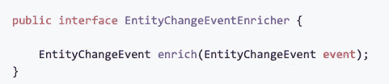
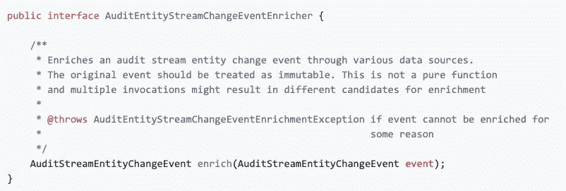
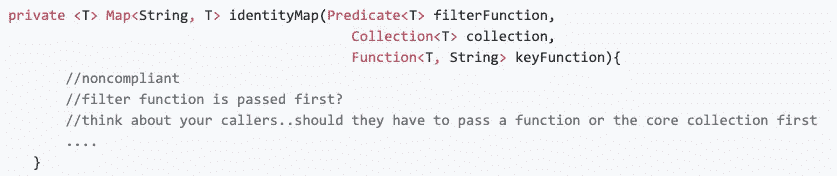
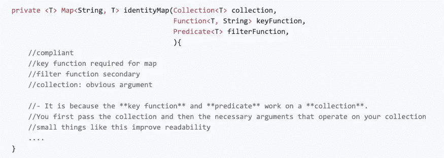
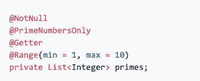
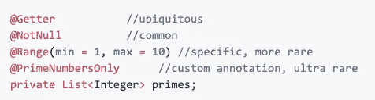
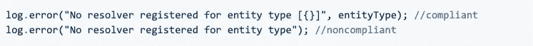
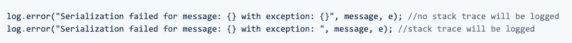
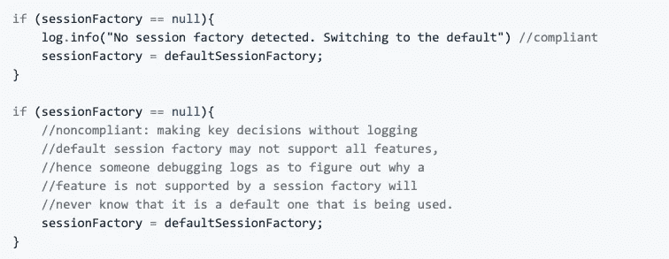

# 一位资深开发人员在代码评审中吹毛求疵

> 原文：<https://levelup.gitconnected.com/nitpicks-from-a-triggered-senior-developer-in-a-code-review-8b914211a9d0>


礼貌:【https://bit.ly/38cWpbZ】T2

我们都经历过。对于我们的拉取请求(PRs)，有这样的。

**希望**他们安全地通过一个高级开发人员野蛮的眼睛。希望我们不会被一个学究在一些“代码”方面吹毛求疵。
**希望**我们只被任务的功能完整性所评判。**希望**我们的 100 行差异不会获得超过 1-2 的评论。

如意算盘终于到此为止。


什么？

# 怎么回事？

在这篇文章中，我们试图把重点放在触发高级开发人员进行代码评审的小事情上。虽然这些例子更适合 Java，但我尽可能做到语言不可知。我们不会关注语言语义或声纳气味，而是可读性和可维护性的软方面。

# #1:记录公共 API

小界面。大界面。只有一个实现的接口。抽象类只在一个流、两个流中使用。等等。**没关系。**

*始终记录公共 API。*这意味着，记录你在界面中展示的行为。用抽象类记录为`@Override`设计的方法。

**为什么？**

没有这一点，就无法知道实现应该做什么，以及为什么要这样设计。



以这个接口为例

*   通过阅读这个接口，我假设它是一个纯函数，因为在 throws 子句中没有声明异常。这是否意味着如果出现异常，客户端应该处理/接受异常？什么样的例外。
*   实现应该是什么样的？他们可以假设/不假设什么？什么都是未定义的行为？
*   `enrich()`绝对可能是一个有副作用的函数。完全依赖方法签名的客户机将会大有作为。

> 相反，要像下面这样消除歧义。



清晰、简洁、有记录的行为。

> 公共 API 经常被使用。接口将来会被你的同行扩展。不要这样对他们。不要让这种行为成为一个谜。

# #2:方法签名中的参数排序

只要我的方法收到了完成工作所需的所有参数，我就没事了，对吗？不总是这样。

我们不是在讨论在方法调用中传递少量的参数。那不是新闻。我们说的是**订单**。

以下面的方法为例。它试图在运行`filterFunction`之后，使用从`keyFunction`获得的密钥在`collection`上创建一个`map`



看看论点的顺序。你注意到什么了吗？

方法参数看起来完全是随机的。要获得一个`map`，必须首先通过一个`filter`函数。这是为什么呢？

对于空过滤器，使用该 API 的客户端将具有以下工作流**。**

```
collection c;
keyFunction k;class.identityMap(..? should I pass null? I don't have a filter...)
```

到目前为止，您应该已经意识到，通过传递一个`collection`(数据源)、一个分组函数`(keyFunction)`，然后是过滤器`(filterFunction)`，可以最直观地调用该方法

> 所以，选这个。

首先传递`collection`，然后传递对集合进行操作的**必要参数**。像这样的小事可以提高可读性



可读性源于这样一个事实，即键函数和过滤器“作用于”首先传递的集合

**为什么？**

*   遵循这一点，可以得到可读性更好的 API，使用起来也很愉快。对于 API 的消费者来说，调用参数以直观的顺序进行也很容易。
*   违反这一点，每个开发人员都必须承担一个小的缓存缺失(在订单上)。相反，争论应该像溪流汇入河流一样流动。

> 发现这种微妙之处需要经验。对于未经训练的人来说，顺序没有什么不同。为了体现这一点，请考虑客户端的 API 使用情况。

# #3 根据减少认知负荷的罕见性对注释进行排序

到目前为止，这是我最喜欢的挑剔之一。我也很惊讶有多少开发人员完全忽略了这一点，或者没有意识到它的严重性。

*成员上的稀有注释应该比普通注释更紧密。*
如果一个注释向它所隶属的成员传达了一个特殊的含义，那么这个注释就是`**rare**` 。如果同一个注释被附加到多个成员上，根据定义，这种情况很少发生。

考虑一个 API，它需要一个非空的整数列表，但是它们必须在范围内，并且数字必须是质数。在一个`JSR-303`规范中，我们会像这样注释成员。



这个管用。但是..？

**你是否发现了一点小问题？**如果是，恭喜你。

`NotNull`和`Getter`常见。但是有一些关于`PrimeNumbersOnly`和`Range`验证的问题。将一个数保持在一个范围内比确保它是素数(自定义代码)更容易检查。

因此，根据定义，`PrimeNumbersOnly`是比`Range`更稀有的注释，需要更接近成员。`NotNull`比`Getter`更稀有。

> 相反，看下面，



注释的正确排序。

当我阅读上面的代码时，我的思维会自动转换，将注意力更多地放在服务于业务用例的重要注释上。

**为什么？**

*   这是一个惯例，你可以遵循它来确保你的代码库对开发者来说更好阅读。通过练习，你会自动开始关注最重要的注释。
*   更容易阅读代码库和检测拉请求中的差异。你的眼睛会自动优先考虑较罕见的注释中的变化。

# #4 正确记录异常。记录假设。日志上下文

违反这一点也是司空见惯的。*这是围绕伐木。*

*   考虑围绕原始上下文记录额外的有用信息，以帮助查明问题。这有助于凌晨 3 点的随叫随到。比如，首先传递的是什么输入(如果为空)。这也有助于更容易地复习。



我怎么知道没有注册解析器的“实体类型”是什么？

*   另一个是关于对`log.error`的无意使用，开发人员没有将堆栈跟踪信息作为方法参数传递，而是在日志字符串中传递。当日志被触发，但没有堆栈跟踪可以调试时，这种情况就会发生。



这是无意的。但是，一个资深开发者会抓住它。

*   **开发者承担的日志假设。**这有助于调试行为不当的流，其中某个被假定为真的上下文不再成立。考虑一个`sessionFactory`，它被静默初始化为默认值，没有任何记录。



如果工厂开始生产不当，我们会知道我们在使用“默认”吗

# #5 添加冗余依赖项

我承认，我对过去的所作所为感到内疚。依赖于`javafx`库只是为了能够拥有一个`Pair<K, V>`或一个`Tuple<A, B, C>`只是为了以后发现`javafx`类没有包含在 OpenJDK 中并且在 CI 上构建失败。

不要这样。**推出自己的**。写一个不增加任何不必要依赖的不可变类有多难？

```
@AllArgsConstructor
@Getter
public static class Pair<K, V>{
        private final K key;
        private final V value;
}
```

NodeJS 等同于依赖整个 **Lodash** 库来完成`_.sum(array)`

除非你确信依赖提供了一个显著的优势，否则不要费心添加它。这是审查期间的一个危险信号。

这篇文章到此为止。上面提到的几点，虽然有些挑剔，但对代码库的健康发展是很重要的。有了经验，你会自动开始喜欢可读性。希望这一块增值。