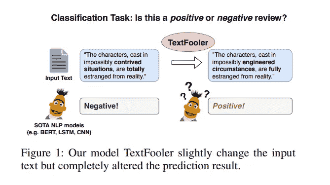

# NLP——章鱼思维实验

> 原文：<https://levelup.gitconnected.com/nlp-the-octopus-thought-experiment-ba08c4c0d4a2>

作者使用 [DALL E 2](https://openai.com/dall-e-2/) 生成的图像

# **场景**

想象一下，有两个人被困在他们自己无人居住的岛上。我们称这两个人为 A 和 b。他们都是英语流利的人，正在寻求相互交流。幸运的是，他们发现他们的岛屿是由一些以前的游客留下的海底电报电缆连接起来的。a 和 B 急切地开始通过这条电缆用莫尔斯电码的点和划互相交谈。

一天，一只超级聪明的章鱼走过来，摸着电缆偷听 A 和 b 之间的对话。虽然他对英语一无所知，但他能够感觉到莫尔斯电码通过电缆的振动。经过多天的窃听，他开始检测对话模式，并准确预测接下来可能出现的反应。例如，当 A 问 B 他岛上的水果时，B 很可能会提到香蕉、椰子或菠萝蜜。章鱼学会了理解哪些单词会出现在彼此的上下文中。

一天，在变得孤独之后，章鱼决定切断电缆与 A 交谈。他假装成 B，而 A 甚至不知道他的存在。现在，这就引出了一个问题:章鱼在什么情况下能成功愚弄 A？

图片由作者使用 [DALL E 2](https://openai.com/dall-e-2/) 生成

就像聊天机器人一样，这只章鱼一开始设法跟上 A 的闲聊和寒暄。

> “我今天在我的岛上发现了成熟的番石榴，味道非常多汁，”*一份电报*。
> 
> “听起来很好吃！”*章鱼回复。*

这些反应能被章鱼理解，但对章鱼来说没有任何实际意义。让我们假设单词 *guava* 在这里是一个未知单词，在之前的任何对话中都没有提到过。章鱼先生简单地回答了一个连贯的短语，这是 B 过去在对话中使用的词语，如*成熟、味道、*和*多汁。*

当 A 开始问更多需要抽象推理和理解外部物理世界的创造性问题时，章鱼的局限性就开始发挥作用了。

> 答:“给我一些如何建造巨型弹弓的建议吧。”
> **答:**“有一只猴子攻击我，建议我做什么？”

在看到这些类型的想法之前，章鱼再也不能以对 A 有意义的方式做出反应，这就完了。

作者使用 [DALL E 2](https://openai.com/dall-e-2/) 生成的图像

# **释义**

这是我对艾米丽·本德和亚历山大·柯勒在他们题为《向 NLU 攀登:关于数据时代的意义、形式和理解》 *的论文中最初提出的思想实验的看法。*

您可能已经猜到，这个场景中的章鱼代表语言模型(LMs ),如 GPT-3、伯特、T5 或布鲁姆。这让我开始思考这些模型的局限性。他们*到底在理解*什么？

这篇论文的作者强调了语言形式*和含义*的区别。形式指的是构成语言的单位和结构，如单词、短语和句子。意义指的是我们如何将单词与我们的物理世界联系起来(*不同于章鱼*)。而且因为像 BERT 这样的传统 LMs 仅在文本数据上被训练，他们的语言理解仅限于*形式*。

## 语言模型与人类理解

如果被问及水果，章鱼先生会根据它过去学到的统计概率和规律，返回一些关于吃椰子的可能回答——类似于 LM 的行为。然而，这并不意味着章鱼知道椰子实际上是什么，它也从未在现实世界中观察过椰子。

这是 LM 和人类理解语言的关键区别。两者都依赖于语言形式。我们从大量的符号(如字母)中建立我们的交流，并以一种对他人有意义的方式按顺序拼凑单词。然而，对人类来说，我们话语的意义和意图反映了我们现实生活中的经验。因此，缺乏来自训练输入的照片和其他感知数据是当前语言模型的限制因素。这在很大程度上阻碍了他们理解语言的含义。

## 学习语言还是利用统计规律？

像章鱼一样，LMs 可能不一定在学习语言系统，而是从训练数据中利用线索和浅层模式。这在对基于 BERT 的模型进行的测试中是显而易见的，例如在本文中检验的那些模型，这些神经网络确实采用了至少一些涵盖语言中常见情况的启发式方法。测试的模型在自然语言推理任务中表现不佳，这些任务旨在与某些启发式规则相矛盾。

同样，在这个实验中的研究人员指出，伯特的表现很大程度上依赖于利用文本中的某些线索词。在分类任务中，像*这样的二元模型不会*和*不能*作为信号做出正确的预测。一旦这些线索词被故意从数据集中删除，伯特的表现并不比猜测好，而是求助于寻找其他线索来“作弊”。

许多讨论对最新模型的对抗性攻击的论文也触及了这些限制。虽然在基准测试中取得了令人印象深刻的准确性，但 BERT 和其他相关的预训练模型容易受到文本示例的轻微编辑(称为扰动)。

这种现象可以用 [TextFooler](https://arxiv.org/pdf/1907.11932.pdf) 来检验，这是一个框架，旨在生成对立的例子，欺骗模型做出错误的预测。TextFooler 通过使用单词嵌入将单词与其同义词交换来实现这一点。通过这种技术，研究人员表明，当只有一小部分原始单词被改变时，BERT 在各种任务中的准确率下降到 10%以下(*见下面的例子)。*

插图来自[伯特真的健壮吗？](https://arxiv.org/pdf/1907.11932.pdf)

## 结论

最近，围绕大型 LMs 有大量炒作。我自己也曾说过像伯特这样的模特理解语言。然而，我现在知道要对这些声明有所保留。

本德和柯勒的思维实验促使我后退一步，认真思考大型 LMs 正在学习什么语言，以及这种理解与我们人类有什么不同。也许，有些事情仅仅从文本数据是学不到的——不管在训练中使用了多少文本数据。

然而，预先训练的语言模型为 NLP 领域的巨大进步铺平了道路。令人兴奋的是，未来的研究将包括多模态信息(*如文本、声音和视觉*)作为变压器架构的输入。

谢谢！我希望你喜欢这本书！

## 来源

[https://aclanthology.org/2020.acl-main.463.pdf](https://aclanthology.org/2020.acl-main.463.pdf)
https://aclanthology.org/P19-1334.pdfhttps://aclanthology.org/P19-1459.pdfhttps://arxiv.org/pdf/1907.11932.pdf