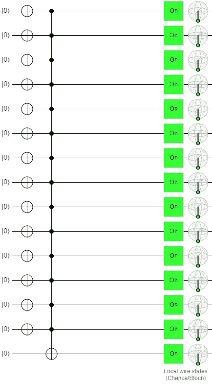
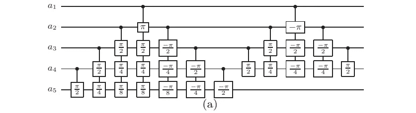

# 不-安西拉 MCX

> 原文：<https://levelup.gitconnected.com/no-ancilla-mcx-e59f455bb9f6>



[https://algassert.com/quirk](https://algassert.com/quirk)

# 因为量子位仍然供不应求

[2022 Classiq 编码竞赛](https://www.classiq.io/competition)的挑战之一是设计一个 14CX 门，一个具有 14 个控制量子位和 1 个目标量子位的门，具有最少的电路深度和最低的 CNOT 计数。问题是，如果你允许我这么说的话，你只能用五个安西拉量子比特来建造它。我提交了一个我认为应该很有竞争力的解决方案，但我继续不时地重新审视这个挑战，以防我能想到任何改进它的方法。

比赛快结束时，我发现了一篇论文，题目是“无辅助设备的 n 量子比特托夫里门的[线性深度量子电路”，作者是南加州大学电气工程系的 Mehdi Saeedi 和 Massoud Pedram。在其中，作者设计了一个 4CX 门，一个有四个控制和一个目标的门，使用零辅助量子位。虽然比赛允许使用多达五个量子位，但并不要求使用其中任何一个。因此，当我试用了 no-ancilla 4CX 并取得成功后，我决定将其扩展为 14CX 门。](https://arxiv.org/abs/1303.3557)

## 放弃

以下不是最佳代码。这不是本次提交的目的。由于其电路深度和 CNOT 计数，这一提交没有机会赢得前三名奖之一。因此，唯一的目标仅仅是正常运行，以便它有机会赢得一个创造和创新的竞赛奖项。事实上，我最终赢得了这些奖项中的一个，尽管在我写这篇文章的时候我不知道这是不是赢得了它。



[https://arxiv.org/pdf/1303.3557.pdf](https://arxiv.org/pdf/1303.3557.pdf)

## 密码

我注意到的第一件事是有正旋转，接着是负旋转，接着是更多的正旋转，然后是更多的负旋转。每个循环块都可以通过嵌套的 FOR 循环生成，如下所示。

```
for i in range(13,-1,-1):
    if (i == 0):
        exponent = 0
    else:
        exponent = 1
    for j in range(i+1,15):
        qc.crx(pi/(2**exponent), q[i], q[j])
        exponent += 1

for i in range(1,14):
    exponent = 1
    for j in range(i+1,15):
        qc.crx(-pi/(2**exponent), q[i], q[j])
        exponent += 1for i in range(12,0,-1):
    if (i == 0):
        exponent = 0
    else:
        exponent = 1
    for j in range(i+1,14):
        qc.crx(pi/(2**exponent), q[i], q[j])
        exponent += 1for i in range(0,14):
    if (i == 0):
        exponent = 0
    else:
        exponent = 1
    for j in range(i+1,14):
        qc.crx(-pi/(2**exponent), q[i], q[j])
        exponent += 1
```

棘手的部分包括:

*   中点重复旋转(例如，π/2，π/4，π/8，然后又是π/8)
*   不同的树高(右边的树忽略一个量子位)
*   交替中点符号(正在左边，负在右边)

最明显的改进需求之一是硬编码的量子位分配。这肯定应该动态地完成。再说一次，我只是想让它工作。模拟显示，当所有 14 个控制量子位都处于它们的|1 >状态时，目标量子位仅发生位翻转，因此任务完成。我把它交了上去，开始着手准备我的下一个作品。

## 结论

作者展示了构建 4CX 的其他方法，并讨论了优化，这些我都没有探究。我只是拿了一张电路图，构建了电路，测试了电路，并在成功测试后运行了它。因此，本文可能包含一个更好的方法来构建一个无辅助 MCX，我的代码肯定可以改进，但这里有一个无辅助 14CX 可以作为您的无辅助 MCX 需求的起点。

你可以在它的 [GitHub 库](https://github.com/bsiegelwax/no-ancilla-MCX)查看我提交的笔记本。

# # ClassiqCodingCompetition 竞赛系列

*   [街区上的新大门](https://bsiegelwax.medium.com/new-gates-on-the-block-9cad1bc583fd)
*   [我从 Classiq 的编码竞赛中学到了什么](https://bsiegelwax.medium.com/what-i-learned-from-classiqs-coding-competition-9ebfbb6816bb)
*   [Classiq 的哈密顿问题](https://bsiegelwax.medium.com/classiqs-hamiltonian-problem-31e2992903d0)
*   [Classiq 的分配问题](https://bsiegelwax.medium.com/classiqs-distribution-problem-8e3c7a74afaa)
*   [Classiq 的托夫里问题](https://bsiegelwax.medium.com/classiqs-toffoli-problem-54b7e5084833)
*   [Classiq 的可满足性问题](https://bsiegelwax.medium.com/classiqs-satisfiability-problem-c8e78502f82b)
*   [非安西利亚 MCX](/no-ancilla-mcx-e59f455bb9f6)
*   [回顾:Wolfram 量子框架](/review-wolfram-quantum-framework-1fdb23d61be9)
*   [一个土生土长的托夫里门](/a-native-toffoli-gate-970093e4770c)