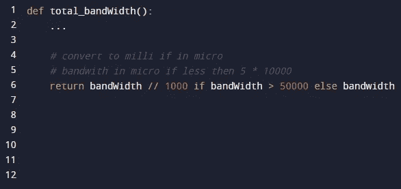
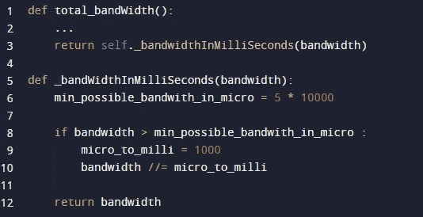

# 无注释(在代码库中)。

> 原文：<https://levelup.gitconnected.com/no-comment-in-the-codebase-9d483d7d2e5b>

## 一个严格的无评论政策如何促使我成为一名更好的开发人员。

马克斯·本德在 [Unsplash](https://unsplash.com/s/photos/shhh?utm_source=unsplash&utm_medium=referral&utm_content=creditCopyText) 上的照片

我在一个工作场所呆了四年，在代码审查中严格禁止注释。我有时会感到沮丧，但这也促使我成为一名**更好的开发者**。以下是我一路走来学到的一些东西。

# **我正出于正确的原因写评论，但结果却相反**

我真心希望帮助别人阅读我的代码；我以为我节省了别人的时间，是个好同事。

但是添加评论会适得其反

# 评论不太可能被保留

代码更改。错误的代码会导致错误，所以必须修复它，否则业务会受到影响。错误或无关的评论没有这种影响，很可能被忽略。

免责声明是，忽略不相关的错误取决于你工作场所的文化。比如，也许你的公司非常关注每一条评论。

即便如此，这也增加了开销，因为在代码审查过程中，必须找到、阅读和验证每一行注释。

总结这一部分——我们要么忽略评论，要么最终为它们工作，而不是让它们为我们工作。

# 但是，没有注释，我们怎么能达到清晰的代码目标呢？

**命名**

对于任何试图使代码更干净的人来说，这并不是一个新概念，保持变量、方法和类具有清晰的、自我解释的名称。

**破碎成大块**

牢记单一责任原则，将一段代码分成更小的部分。什么时候分手？

有些规则是-

*   方法体应该适合屏幕。
*   每四行代码可能需要放入一个帮助器方法。
*   此外，始终为每个文件保留一个类。
*   每节课一个责任。

**一个真实的展示窗口**

让我们考虑这段注释代码-

我们知道它在带宽上做了一些操作，如果我们读了评论，我们就知道需要——我们需要把单位从毫秒转换成微秒，但只是在某些情况下。

现在考虑这个自我记录的代码-

当然，这需要更多的台词。

如果您必须深入到逻辑中去修复一个 bug，哪个代码可以让您理解逻辑流程？

# 什么时候无路可走？

例如，如果代码与以某种方式运行的外部 API 或第三方代码相关，您可能除了添加注释，甚至是相关源代码的链接之外，找不到其他解决方法。

# **总之**

注释可能是一个有用的工具，但是它们也会给读者和维护者带来开销。

在添加注释之前，问问你自己——我会改进我的代码吗？