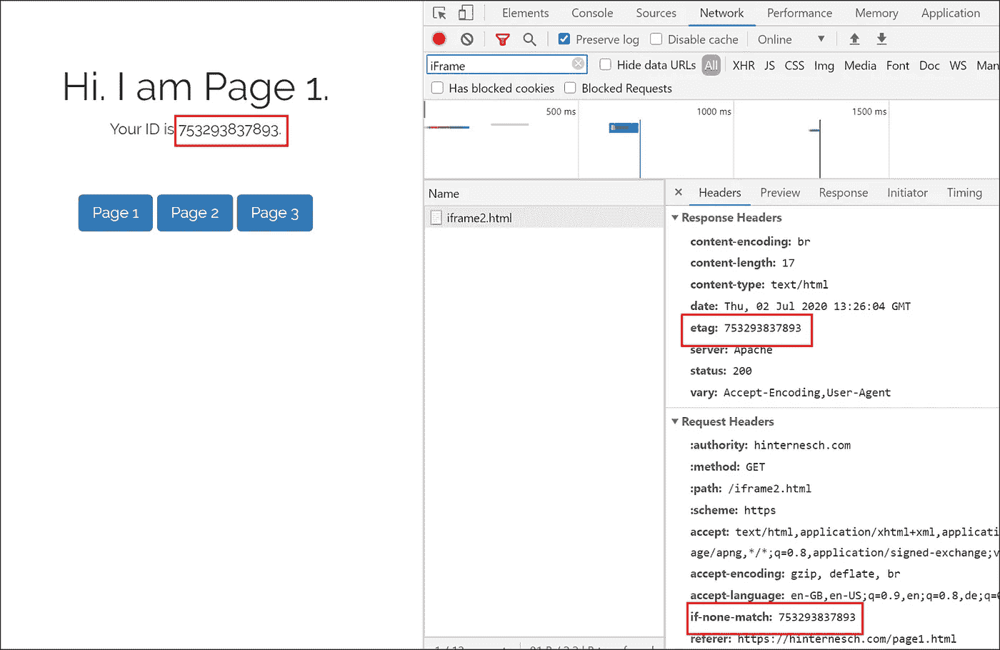
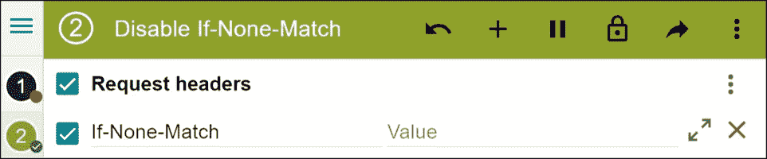
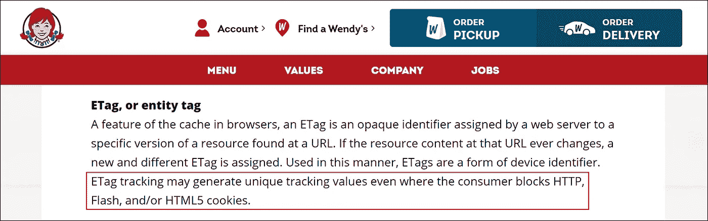

# 没有 Cookies，没有问题——使用 ETags 进行用户跟踪

> 原文：<https://levelup.gitconnected.com/no-cookies-no-problem-using-etags-for-user-tracking-3e745544176b>

作为[领先国际分析供应商](https://www.atinternet.com/en/)的[高级数字分析顾问](https://hinternesch.com/?at_medium=affiliate&at_campaign=Medium&at_creation=ETags&at_format=link)，我一直在密切关注当前现代网络浏览器对 cookie 技术的讨伐。

事实证明，有一种方法可以在不使用 cookies 的情况下跟踪单个未登录用户。我实现了。以下是方法。

一些简短的开场白:这篇文章的全部目的是在业界和用户中引发讨论和意识。就我个人而言，我从不提倡采用这些跟踪实践，我很高兴能为一家分析供应商工作，该供应商总是将隐私、透明和诚信放在第一位。此外，从法律角度来看，这种技术没有规避 GDPR 或类似的隐私法。仅仅因为 ETags 在技术上是*而不是 cookies* ，并不意味着它们不在这样的指南中，也不需要用户同意。

[***我建这个网站就是一个例子。看一看。***](https://hinternesch.com/page1)

点击浏览三个页面→相同 ID。
关闭浏览器窗口，重新打开站点→相同 ID。
关了电脑明天再来→同一个 ID。
[检查你的 cookies](http://www.editthiscookie.com/) →站点既不丢弃也不读取任何 cookies。
检查 URL →没有可疑的查询字符串。

那么，我如何保存 ID 并知道您的特定设备正在返回站点，而不需要您登录，也不需要丢弃 cookie 呢？

# 饼干正在被淘汰

如果你是一个比较活跃的互联网用户，你应该听说过关于浏览器 cookies 及其使用方式的争议。目前，cookie 技术越来越多地被浏览器淘汰，并受到隐私准则的严格监管，如 GDPR 和 CCPA T21。虽然这一发展肯定是朝着更加注重隐私的互联网迈出的重要一步，但它也对大多数网站的核心功能、UX、互联网的经济结构和数字分析行业产生了巨大影响。虽然浏览器 cookie 作为返回用户的可靠标识符的消亡几乎是肯定的，但仍有其他 web 技术依赖于在本地机器上存储信息。

# 缓存的作用

进入: [**缓存**](https://cachingexplained.com/) 。本质上，web 缓存意味着将 web 上的数据存储在您的设备上，这样当以后再次请求相同的资源时，浏览器可以重用这些数据。例如，当用户第一次加载网页时，服务器会将整个页面发送回浏览器。当页面被缓存并且用户在第二天再次请求相同的页面时，浏览器*记住*它，服务器不必再次发送它，并且它可以马上从浏览器缓存中显示出来。这要快得多，并且节省带宽。总的来说，缓存技术大大提高了 web 内容的交付速度，同时也减少了服务器端需要做的工作。

缓存可以通过使用 ETags 来执行。ETags 是附加到由服务器交付的每个资源(例如，网页或图像)的 id。这是服务器知道用户是否缓存了最新版本的资源的方式。当服务器上的资源发生变化时，会为该资源生成一个新的 ETag ID。

*   **星期一**
    用户第一次请求网站→请求中没有 ETag→站点用 ETag 123 发回→站点存储(*缓存*)在本地设备上
*   **星期二**
    用户再次请求同一个站点→请求中包含 ETag 123 服务器检查资源是否已更改(*‘ETag ID 是否仍然相同？’* ) →如果 ETag 没有改变，服务器指示浏览器简单地使用周一交付并缓存的站点→不必再次发送资源，节省了时间和带宽

# 使用缓存技术跟踪和识别用户

虽然 ETags 在用于缓存时很有用，但该特性也可能被劫持并被有意滥用于用户跟踪。

下面是我在上面的例子中是如何做到的:

*   我建了一个三页的网站
*   我在每一页上都嵌入了相同的 iFrame。这个 iFrame 只是一个白色的 1x1 像素，用户是看不见的。
*   当请求这个 iFrame 资源时，我在服务器端通过 PHP 创建一个随机 ID。我使用这个 ID 来覆盖 iFrame 的 ETag ID，它通常是自动发布的。
*   每当用户请求三个页面中的一个页面时(因此请求 iFrame)，我的 ETag ID 就会包含在请求中。然后，我在服务器端检查该 ID 是否存在，或者这是否是没有 ETag 的第一次请求。
    →如果 ETag 存在:回访者。保留 ID，将相同的 ID 寄回。
    →如果 ETag 不存在:新访客。新身份证。从那时起，该 ID 将包含在该用户设备在站点上的所有请求头中。
*   最后一步——下面是这个 ETag ID 如何进入分析:
    我在服务器端的 iFrame 中打印请求/响应头的 ID。对于用户来说是不可见的，这个 iFrame 现在包含了用户的 ID 。然后，我在客户端通过 JavaScript 获取它，并简单地将这个 ID 而不是 cookie ID 包含在我的分析跟踪请求中。

使用 Chrome DevTools 查找 iFrame 的 ETag ID

# 如何防止 ETag 追踪

防止 ETag 跟踪可能相当困难。它不依赖于 cookies 或本地浏览器存储。ETag 交换不需要 JavaScript 也能工作。并且它不使用用户代理。

然而，用户有几个选择来**保护自己免受 ETag 跟踪**:

*   **在浏览器设置
    中禁用缓存**这里要小心——如上所述，缓存非常有用，有很多优点。
*   **使用浏览器插件修改标题**
    虽然大多数浏览器本身并不提供修改标题的选项，但有大量的浏览器扩展可用，如 [ModHeader](https://chrome.google.com/webstore/detail/modheader/idgpnmonknjnojddfkpgkljpfnnfcklj?hl=en) 。为什么会这样？ETag 功能依赖于请求和响应头来交换 ID。例如，如果用户在每次请求时都将 *If-None-Match* 标题设置为空白，那么每次页面请求都会生成一个新的 ETag 值。这可以防止用户的设备被识别。

# 为什么这很重要

为什么我要测试这些东西？我为什么要写这篇文章？我当然不打算大规模使用它。但是尽管 ETags 可以被用来作恶，这个例子证明了更重要的一点:像大多数其他技术一样，默认情况下它不一定是有害的。它总是取决于应用。

我相信让每个人都意识到这些方法的存在是很重要的。它们可能会被利用。过去有不少网站非法使用这种特殊的 ETag 劫持的例子。其中一些案件通过诉讼解决了。这种方法很有可能会越来越多地被惊恐的广告行业再次采用，广告行业正眼睁睁地看着它的主要基石之一:饼干崩溃。

网络上众多 ETag 示例中的一个可以在[温迪的 Cookies 和跟踪技术政策](https://www.wendys.com/cookies-and-tracking-2020)中找到:

*来源:*[*【https://www.wendys.com/cookies-and-tracking-2020】*](https://www.wendys.com/cookies-and-tracking-2020)

上面的简介似乎是许多网站在隐私政策中使用的现成蓝图。需要明确的是:这本身既不是坏事，也不违法。当然，ETag 值必须是唯一的。这就是他们为了缓存而工作的全部意义。然而，该部分的措辞非常含糊不清，尤其是在说明这些 ETag 值是否用于跟踪时。这就是我觉得麻烦的地方。在联系 Wendy 的隐私团队时，他们回复了一封标准化的复制粘贴电子邮件，确认不使用 ETags 进行跟踪。然而，隐私政策却敞开了大门。这正是我感到担忧的地方。

我相信行业内**公开透明的知识转移**——在分析供应商、出版商、广告行业和互联网用户之间。在我看来，这种缺乏是我们最终陷入这场混乱的饼干大战的主要原因之一:**互联网生态系统一直缺乏透明度**。技术发展太快，立法跟不上步伐，普通大众也不可能理解像 cookies 这样的网络技术的来龙去脉。当它们被不恰当地使用时，用户会感到被侵犯，这是可以理解的。但最终扼杀这项技术似乎是一个典型的治标不治本的例子。事实上，许多科技公司滥用 cookies 等技术，在公众眼中不公平地诋毁它们。进而导致浏览器和立法采取不相称的措施。虽然这些措施在个人隐私方面有很多好处，但它们同时也损害了有益和有意义的技术创新。

总有细微差别。**我坚信认真的数字分析的合法性和重要性**——只要它是在适当的隐私合规水平下执行的。当涉及到合法访客身份识别时，下一步会发生什么？ETags 肯定是不可持续的。但有一点是肯定的:这个行业永远不会无聊。

*—如果你想讨论上面的例子，或者如果你认为你已经找到了用户识别的新圣杯，请随时* [*联系*](https://hinternesch.com/?at_medium=affiliate&at_campaign=Medium&at_creation=ETags&at_format=link) *。—*