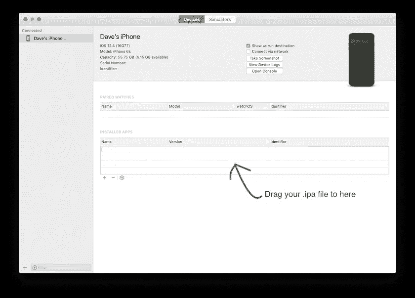

# 不，我发誓我的 iOS 应用在启动时不会崩溃！

> 原文：<https://levelup.gitconnected.com/no-i-swear-my-ios-app-doesnt-crash-on-startup-84abdabc4799>

## 作为一名企业架构师，我学到的关于独立 iOS 游戏开发的简单一课


乔治·贝尔在 [Unsplash](https://unsplash.com?utm_source=medium&utm_medium=referral) 上的照片

虽然我白天专注于企业软件架构(也称为服务器端开发)，但我仍然在兼职编写基于 Swift 的 iOS 应用程序。尽管这两个软件工程学科可能非常不同，但它们有时比我想象的有更多的共同点。

不久前，我向 App Store 提交了我的 Word Wad iOS 游戏的小更新。这些变化主要是装饰性的:添加回我发现已经丢失的图像，并在应用程序的故事板中引入自动布局。除此之外，我没有做太多的代码修改。


我的应用程序，Word Wad，以其非崩溃的形式。

我在一些模拟器上测试了我的改变，也在我的 iPhone 上测试了。一切看起来都很棒，所以我升级了我的应用程序的版本号，创建了一个版本，验证了这个版本，并最终提交了它。

我期待着快速获胜，但几天后，当我收到苹果公司的拒绝信时，我感到很惊讶，信中说，“当我们启动应用程序时，你的应用程序崩溃了”。

我觉得向苹果提交这样一个漏洞百出的应用有点愚蠢，于是我很快在模拟器中启动了 Word Wad。它运行良好。考虑到全新安装可能会崩溃，我重置了模拟器的设置并再次尝试。没有撞车。

我试了几个不同的模拟器，结果都一样。

我开始有点担心，然后把我的 iPhone 和我的 MacBook 连接起来，删除了之前的 Word Wad，并在我的手机上用 Xcode 启动了 Word Wad。还是没问题！我试过我的 iPad。同样的事情。

到目前为止，我还不能重现那次事故。那我该怎么解决呢？事实证明，苹果在拒绝通知中包含了一个崩溃日志。所以我打开来看看会有多大帮助。(*字母洗牌*，你可以从 crashlog 中猜出，是*单词 Wad’*的原名)。

```
Incident Identifier:  DAB41DAD-9A48-42B0-9115-7AB25B8FC81F
CrashReporter Key:   2b4341567d2bf6ee1c2ada8d72b26769dd6a74ff
Hardware Model:      xxx
Process:             Letter Shuffle [57833]
Path:                /private/var/containers/Bundle/Application/78F17500-4B84-3D89-8E2A-8B4F4A6B7D163/Letter Shuffle.app/Letter Shuffle
Identifier:           com.taubler.lettershuffle
Version:             6 (1.3)
AppStoreTools:       10G3
Code Type:           ARM-64 (Native)
Role:                Non UI
Parent Process:      launchd [1]
Coalition:           com.taubler.lettershuffle [5459]
OS Version:          iPhone OS 12.4 (16G77)
Baseband Version:    7.80.04
Report Version:      104
Exception Type:  EXC_BREAKPOINT (SIGTRAP)
Exception Codes: 0x0000000000000001, 0x000000010024f19c
Termination Signal: Trace/BPT trap: 5
Termination Reason: Namespace SIGNAL, Code 0x5
Terminating Process: exc handler [57833]
Triggered by Thread:  0
Thread 0 name:  Dispatch queue: com.apple.main-thread
Thread 0 Crashed:
0   Letter Shuffle                0x000000010024f19c 0x100228000 + 160156
1   Letter Shuffle                0x00000001002474e0 0x100228000 + 128224
2   libdispatch.dylib             0x00000001c64cc7d4 0x1c646c000 + 395220
3   libdispatch.dylib             0x00000001c646feb8 0x1c646c000 + 16056
4   libswiftCore.dylib            0x00000001f44b3e40 0x1f420d000 + 2780736
5   Letter Shuffle                0x0000000100245798 0x100228000 + 120728
6   Letter Shuffle                0x000000010024563c 0x100228000 + 120380
7   Letter Shuffle                0x00000001002453f4 0x100228000 + 119796
8   Letter Shuffle                0x0000000100245520 0x100228000 + 120096
9   UIKitCore                     0x00000001f2b23224 0x1f2810000 + 3224100
10  UIKitCore                     0x00000001f2b23628 0x1f2810000 + 3225128
```

*<剪>*

```
Binary Images:
0x100228000 - 0x10026bfff Letter Shuffle arm64  <a4b1de4970b3301da64458d6bc22f513> /var/containers/Bundle/Application/96F17500-2B52-4D89-8E2A-B4F4A6B7D76E/Letter Shuffle.app/Letter Shuffle
0x100688000 - 0x1006dffff dyld arm64  <06f3d9add3a233cea57df42b73686817> /usr/lib/dyld
0x100748000 - 0x100753fff libobjc-trampolines.dylib arm64  <065bd8006d513c358dc14e2a8ff1ba31> /usr/lib/libobjc-trampolines.dylib
0x1c5bf6000 - 0x1c5bf7fff libSystem.B.dylib arm64  <8a05d5f48f0a376abe6bd1caf4fc8138> /usr/lib/libSystem.B.dylib
```

*<剪>*

完全没有共鸣，几乎毫无用处。所以我上网想办法让日志更有用。我发现[这篇苹果技术笔记](https://developer.apple.com/library/archive/technotes/tn2151/_index.html)讨论了一个叫做 *atos 的命令行工具。atos* 通过一个长的终端命令来帮助表示碰撞日志。

所以我打开了一个文本编辑器，开始编写这个命令。技术说明提供了细节，但基于我的崩溃日志，我创建了以下内容:

```
atos -arch arm64 -o /Users/dave/Library/Developer/Xcode/Archives/2019-07-31/Letter\ Shuffle\ 7-31-19\,\ 10.32\ PM.xcarchive/dSYMs/Letter\ Shuffle.app.dSYM/Contents/Resources/DWARF/Letter\ Shuffle -l 0x100228000 0x000000010024f19c
```

为了找出可执行文件的路径，我进入 Xcode 并打开管理器(*窗口* > *管理器*)。在*档案*标签下，我按住 control 键点击这个麻烦的构建，并选择*在 Finder* 中显示。然后我控制点击了*。用* > *终端*打开在 Finder 中出现并选中*的*文件。此时，只需在终端中输入 *pwd* 命令，就可以得到文件的路径；不幸的是，我需要自己添加转义字符。

运行上面的 *atos* 命令产生了以下结果:

```
GameRound.init(number:letters:phrase:numRows:numCols:mixMoves:) (in Letter Shuffle) (<compiler-generated>:0)
```

好吧。所以我有一个有问题的函数( *GameRound.init* )，但是没有这个函数的确切位置。在这种情况下，就需要浏览代码并猜测问题可能出在哪里。有一个方面给我留下了特别的印象:一个项目数组被传递给了 *init* 方法，还有一些行和列，用于将数组转换成矩阵。尽管不太可能，但可以想象数组长度与行数乘以列数不匹配，这将导致数组越界异常。考虑到这可能是问题所在，我添加了一些防御代码，并在许多模拟器和设备中彻底测试了我的更改。没有遇到错误，我创建了一个新的构建并提交了它。

几天后，苹果审查了该版本。他们遇到了完全相同的事情:“当我们启动应用程序时，您的应用程序崩溃了”。

*叹息*

在这一点上，我是盲目的。我对问题发生在的地方的*了解有限，不知道问题*实际上是什么*。更糟糕的是，尽管我尽了最大努力，我还是无法重现这个问题。我担心我不得不使用苹果的审查程序来检验我解决问题的盲目尝试。这显然不是一种可持续的方法。*

我突然想到:与其把我的 iPhone 插到我的笔记本电脑上，然后从 Xcode 启动一个可执行文件，也许我应该在我的设备上运行我提交给苹果的版本本身。所以我这样做了，通过以下步骤:

1.  打开 Xcode 的管理器，如上所述
2.  在 Archives 选项卡下，选择有问题的构建并单击*分发应用*按钮
3.  选择*临时*作为选项
4.  按照剩余的提示操作，最终将归档文件保存在本地
5.  将 iPhone 插入笔记本电脑，然后打开 Xcode 的设备窗口(*窗口* > *设备和模拟器*)
6.  在左侧窗格中选择 iPhone。
7.  拖动*。ipa* 文件从 Finder 放到右侧窗格的*已安装应用程序*部分。



这样就在我的 iPhone 上安装了特定的版本。我启动了它，然后……***嘭*** ！应用崩溃了。

吼吼！我现在可以让我的应用可靠地崩溃了。

所以问题似乎不在于代码本身，而在于编译过程。

既然我可以让我的应用程序在我自己的设备上崩溃，下一步就是查看新生成的崩溃日志。虽然我可以从手机上直接访问新的崩溃日志，但它并没有为我提供更多关于崩溃确切原因的信息。然而，我可以猜测如何修复这个问题，并在提交新版本到 App Store 之前在本地测试这些修复。

崩溃似乎仍然发生在 *GameRound.init* 方法周围，所以我重新检查了那个代码。结果是我执行了一些我真的不需要做的多余操作，所以我删除了那些代码，稍微简化了一下。然后我创建了一个新的构建，并作为一个新的特设归档文件在本地分发。我又在手机上安装了存档，启动了，然后……又死机了。

但是看看新的 crashlog，在调用栈的顶部引用了一个不同的类—*nullgamoround*。*nullgamoround*是“ [null object](https://www.geeksforgeeks.org/null-object-design-pattern/) ”设计模式的实现，扩展了我的应用程序的*gamoround*类，并有效地用无操作实现覆盖了某些功能。

编译器不喜欢这种模式吗？

虽然这是一个很方便的模式，但是我很容易就在我的游戏中删除了对*nullgamoround*的使用。所以我就这样做了，在我的手机上创建并安装了一个新版本，然后运行它。

而且成功了。

这个故事的寓意不是要避免在 Swift 项目中使用空对象模式(尽管…真的吗？为什么这会造成问题呢？)有时，Swift 编译器会将问题引入您的发行版本，而这些问题不会出现在您的测试版本中。

对我来说，Swift 和 iOS 开发是我业余时间做的一件有趣的事情。正如我前面提到的，我白天从事企业服务。随着部署我们后端服务的容器技术(例如 [Docker](https://www.docker.com/) 和 [Kubernetes](https://kubernetes.io/) )的出现，我们测试最终将被部署到生产环境中的完全相同的可执行文件已经变得很容易了。

事后看来，这似乎是显而易见的，但移动开发也应该如此，即使是像我这样的兼职独立开发人员。回想起来，我可能很幸运，编译器引入了苹果审查团队遇到的全面崩溃场景，而不是一个不太明显但更阴险的错误，它本来可以通过 App Store 的批准，但后来却困扰了我的应用程序的用户。

此后，我向苹果提交了修复版本，他们审查并批准了它。但是如果我在实际提交之前运行我计划提交给苹果*的相同版本，我可以节省很多时间和压力，并且不会无意中把苹果的评论者视为我的应用程序的 beta 测试者。*

*觉得这个故事有用吗？想多读点？只需* [*订阅此处*](https://dt-23597.medium.com/subscribe) *即可将我的最新故事直接发送到您的收件箱。*

*你也可以通过* [*成为今天的*](https://dt-23597.medium.com/membership) *灵媒会员来支持我和我的写作，并获得无限量的故事。*