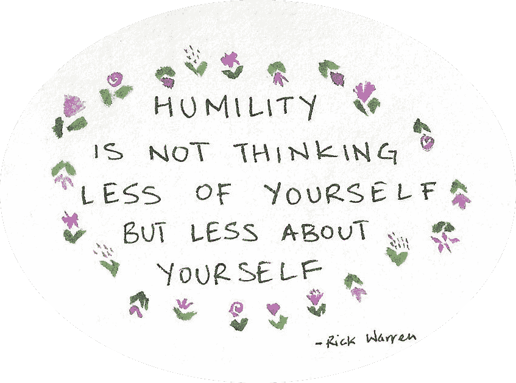
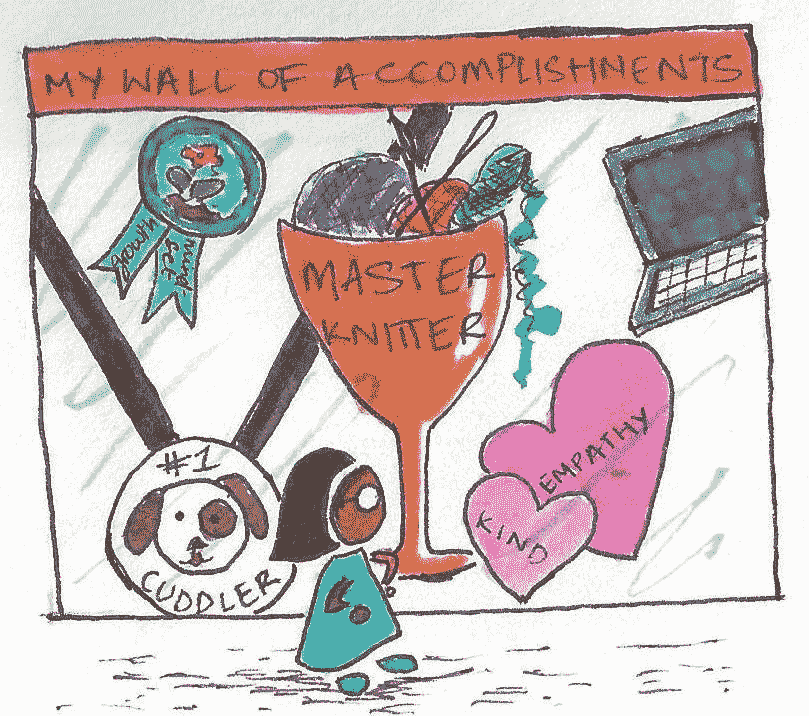
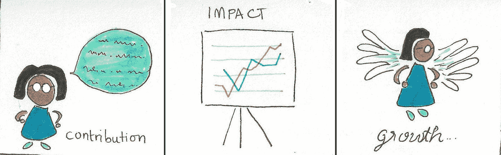
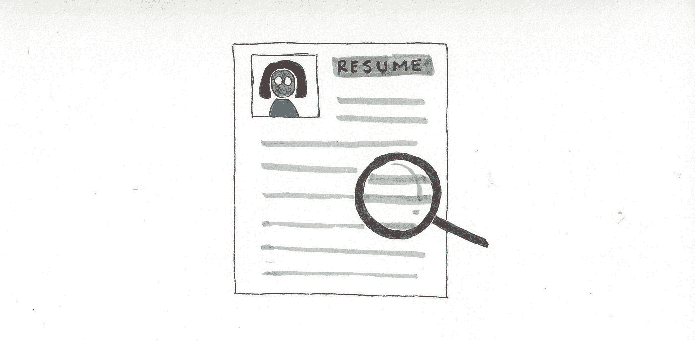
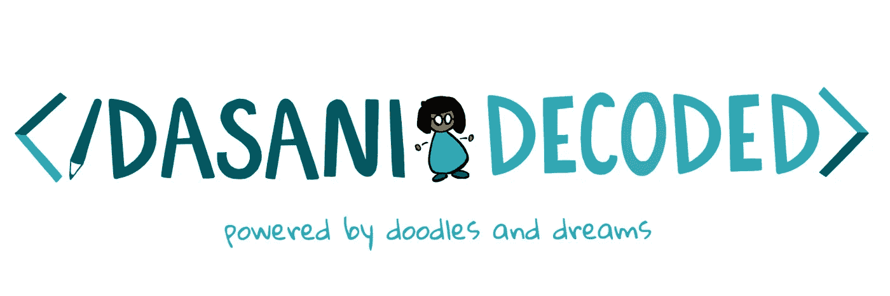

# 不，你不是在吹牛，还有其他制作简历的技巧

> 原文：<https://levelup.gitconnected.com/no-youre-not-bragging-and-other-tips-for-creating-your-resume-23809d8c8d30>

老实说，我不喜欢制作我的简历。尤其是第一次是这样的挣扎。我必须想好在简历上写些什么，因为我没有任何“真正的”经验，而且我觉得我所做的一切都与我想要的工作无关。

写个人文章和谈论自己绝对不是我的强项(虽然我想这就是我现在正在做的事情，哈哈)。对我来说，这感觉不自然，有点像吹牛。我不是在一个使用大量“我”陈述的文化中长大的。每一项成就都是团队的成就，没有别人的建议或帮助是无法完成的。明确地承认自己做错了一些事情。

直到今天，我仍然觉得谈论我自己或我的成就很不舒服。我仍然觉得告诉别人我擅长某事很奇怪。然而，我逐渐认识到，对自己所做的事情给予肯定并没有错。确定你的能力和价值有很大的价值。为自己辩护是有力量的。而你不定义自己，别人会替你定义。所以，不，你不是在吹牛，你只是在证明你的价值。如果你像我一样，觉得谈论自己非常不舒服，那么写一份简历是定义自己的第一步。

确定自己的价值并为自己辩护是我仍在努力的事情。这些年来，我已经走了很长的路，我学到了很多。以下是我定义你的价值和制作简历的方法

# 1.列出你的成就

创建简历时，我做的第一件事是列出我曾经完成的所有事情。不管有多微不足道，我都会把所有的事情列成一个清单:奖项、奖学金、我做过的项目、我上过的课，以及我经历过的其他随机事件。

不要去想这些经历与你想申请的工作是否相关，也不要去担心它会是什么样子。

当我列出这个清单的时候，我也会写一段话来解释我所获得的经验或成就，就好像我在向一个陌生人解释一样。虽然这看起来像是做一份简历的大量工作，但肯定会有回报的。这不仅会帮助你制作一份出色的简历，还会帮助你把相关的故事带到面试问题和学术论文中，并帮助你庆祝你真正的成就！

# 2.贡献、影响和增长

现在你已经有了一个解释你做了什么的清单，你需要把它归结为三个要点——你的贡献是什么？你的总体影响是什么？你是怎么成长的？简化段落的第一步是关注你自己。不要提及这位朋友是如何帮助你的，或者你们是如何一起工作的。这无关紧要。这个练习是关于定义你自己的。

一旦你这样做了，把它分成三个部分:

1.贡献:你做了什么？你有没有为一个应用程序开发一个功能，帮助高中生学习数学，批改试卷？

2.影响:你是如何让事情变得更好的？你辅导的人是否取得了更好的成绩，提高了原有功能的效率？

3.成长:你学到了什么？你是否学会了用一种新的语言编写代码，变得更善于给出建设性的批评，学会了如何在团队中工作？

这里有一个例子:

我与大学的社区拓展中心合作，成立了一个女孩分支机构，她们在附近的课外项目中编写代码。我和另一位助教一起制定了教案，我们每周都去参加课后活动，教高中女生如何编程。虽然我们没有留住多少人，但我们希望有几个女孩最终真正喜欢如何编程，甚至在俱乐部时间之外继续学习。这对我来说真的很可怕，因为我不是最有主见的人，过去只和学生一对一地合作过。

我想把上述段落浓缩成以下几段:

1.贡献:我建立了一个女孩编码分支，并教授高中女孩基本的编码技能

2.影响:我鼓励并指导高中女生追求她们的编程兴趣

3.成长:我学会了如何制定课程计划、领导团队以及变得更加自信

# 3.过滤、调整和过滤

现在你需要弄清楚哪些部分与你申请的工作相关。为了做到这一点，你需要弄清楚你所寻找的角色的期望是什么。不要只看职位描述。职位描述通常不是最新的，而且通常不会提到对工作很重要的软技能。当然，如果这份工作需要你了解 Python，并且你曾经使用 Python 做过一个项目，那么一定要提到它，但是不要完全依赖职位描述来理解这个角色的期望。问问以前做过类似工作的人，他们认为对这个职位来说什么是重要的，查看 LinkedIn 上的个人资料，了解他们做了什么，在线调查——你想知道的一切都在互联网上的某个地方。

一旦你知道这个职位需要什么样的技术和软技能，你就可以利用这些技能来决定包括哪些经验以及如何展示这些经验。

例如，如果我申请助教职位，我会强调以下几点:

1.我在教学方面的表达能力——我会加上我当家庭教师的经历

2.我在该领域的能力(好成绩、相关项目等)

3.我接受并给出建设性反馈的能力——包括我作为导师的经历

诸如此类…

如果我申请项目管理职位，我会强调以下几点:

1.我在团队中工作的能力——我可能包括我作为常驻助理的经历

2.我的技术能力(以前的实习经历、成绩、技能)

3.我的领导技能——我可能包括我创办和经营俱乐部的经历

诸如此类…

当我为自己这样做时，我发现我有比我意识到的更多的相关经验，我只需要想出如何以正确的方式呈现它！

# 4.更精细的细节——展示

最后但同样重要的是，你的陈述很重要。现在你已经有了所有相关的内容，你需要更好地组织它。请确保您的演示中包含以下内容:

1.使用单页(单面)

2.有一个可读的字体(至少 10 磅)

3.你的联系信息在最上面，并且清晰地呈现出来

4.您的文档是 PDF 格式的

如果你有一些空间，你也可以提到一些有趣的兴趣，如体育，艺术，编织等。让雇主对你有更全面的了解。

除此之外，你可以创造性地展示和组织你的内容。下面是一些有启发的简历模板:[https://www.overleaf.com/gallery/tagged/cv](https://www.overleaf.com/gallery/tagged/cv)

我希望这能帮助你创建一份令人惊叹的简历，并开始寻找自己的价值和定义自己的旅程。你比你想象的更有价值！

## 关于作者

达萨尼是微软的一名项目经理。她使用 Dasani Decoded 来解码和民主化她所学到的东西！[联系她获取更多有价值的内容。](https://www.dasanidecoded.com/connect-with-me)

