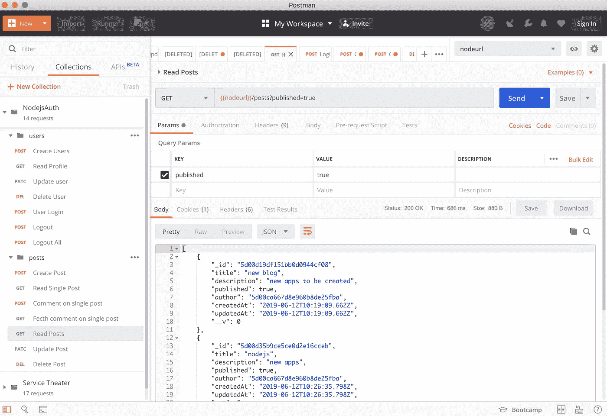
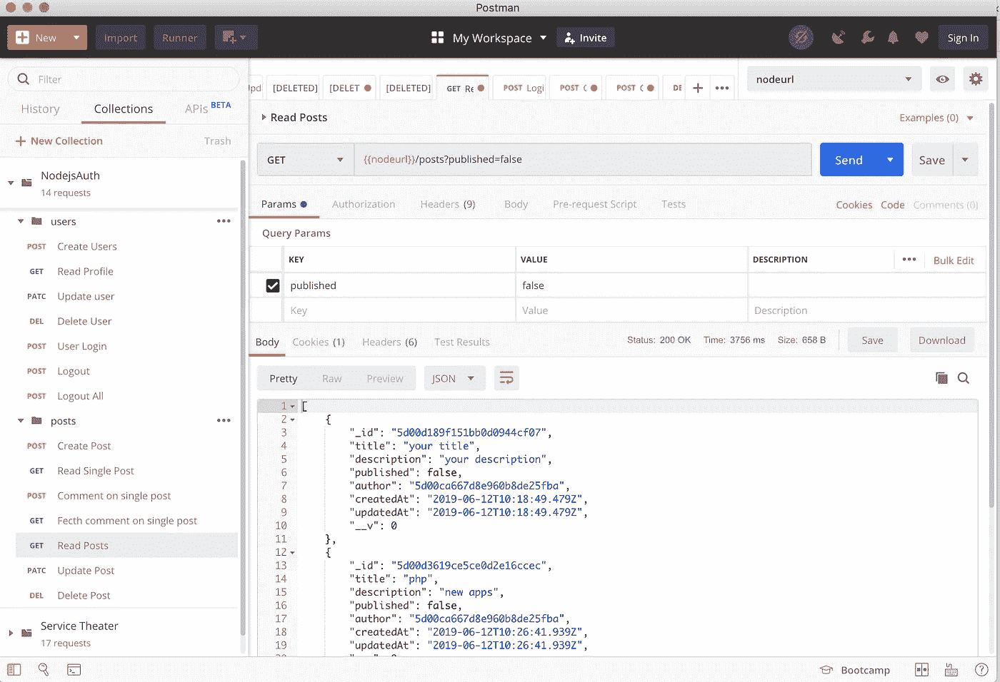
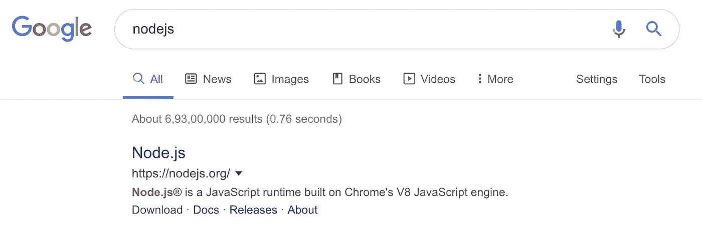
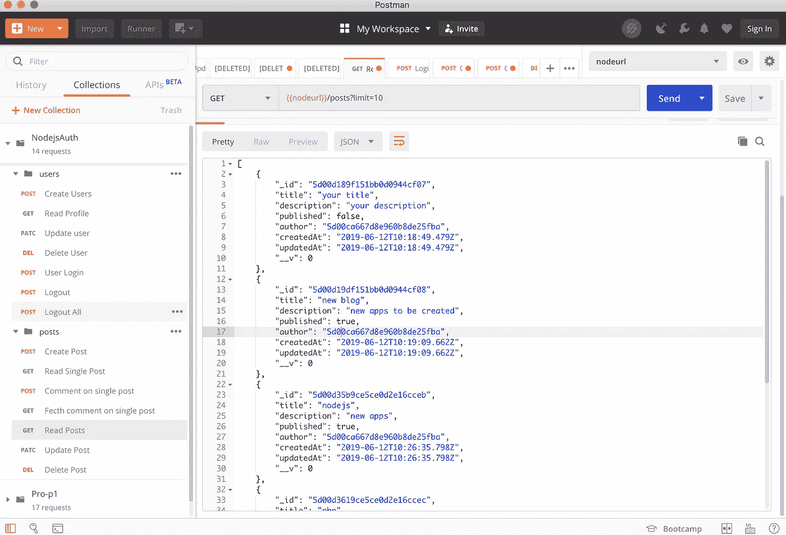
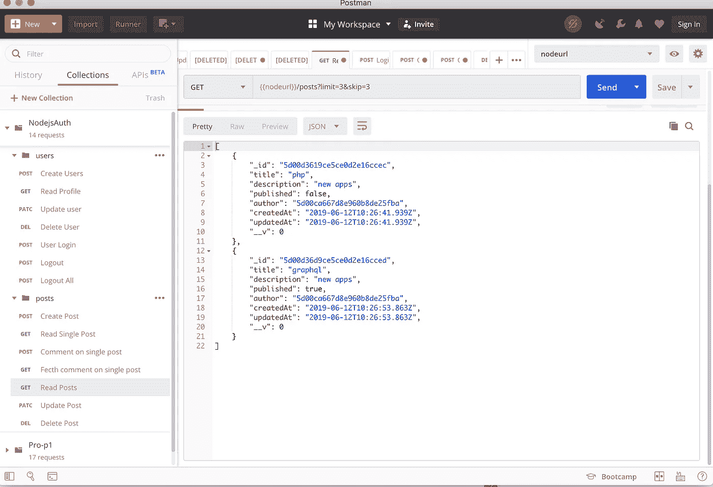
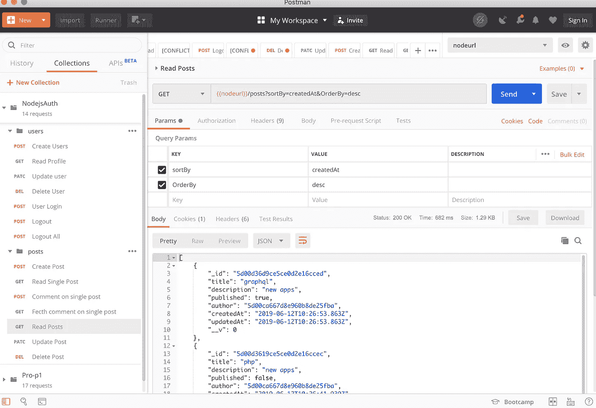
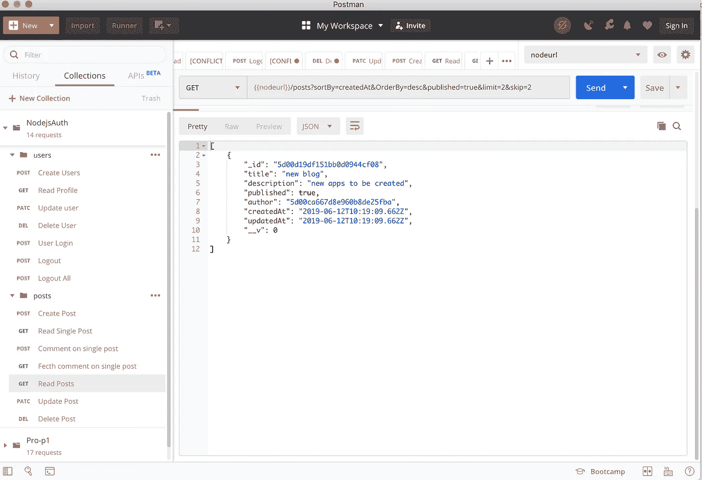

# Node.js:过滤、排序和分页

> 原文：<https://levelup.gitconnected.com/node-js-filtering-sorting-and-pagination-50ce6c90d0ad>

[“使用 Node.js 处理认证](https://blog.usejournal.com/handling-authentication-with-nodejs-24fc29265e0f)”—在本文中，我们看到了如何使用各种技术栈在现实应用中处理认证。

 [## 使用 Nodejs 处理身份验证

### 信息的机密性和完整性是相辅相成的。它需要处理进程访问管理…

blog.usejournal.com](https://blog.usejournal.com/handling-authentication-with-nodejs-24fc29265e0f) 

> 我们看到了如何完整地设置一个 nodejs 应用程序，如何使用 JWT 令牌验证应用程序用户，如何在 Heroku 上部署我们的应用程序，以及如何使用 Postman 测试 API

 [## 用邮递员测试 Nodejs 应用程序

### 如今，Postman 正在成为测试 API 的标准。这是许多开发人员必备的工具之一…

www.topcoder.com](https://www.topcoder.com/blog/testing-nodejs-application-with-postman/) 

在本文中，我们将继续我们的应用程序开发，并添加更多的特性，例如过滤我们的帖子，按创建日期对它们进行排序，以及对大量数据进行分页。

我们将看到如何在路由器中使用查询参数传递数据，并利用它进行排序、过滤和分页。

我们使用 **MongoDB** 作为我们的主要数据库，我们最终可以假设我们的应用程序将包含大量数据，因为它会随着时间的推移而增长，所以我们将过滤尚未发布的帖子，反之亦然。我们将利用 **MongoDB** 选项相应地获取数据。

 [## 编写面试问题

### 一个完整的平台，在这里我会教你找到下一份工作所需的一切，以及…

技术开发](https://skilled.dev) 

## 过滤

正如我们看到的路由器(`/router/post.js`)****GET**posts 请求方法，它获取属于用户的所有帖子。**

**我们将自定义填充，不再传递文章字符串。相反，我们将提供一个对象。**

**对象期望我们需要在下面的路径上设置属性名，这里的路径是`/posts`。我们将重构允许我们探索新选项的对象，我们可以访问的新选项之一是匹配。一个**匹配**是一个对象，它精确地指定了我们试图匹配的帖子。例如，我们可以匹配 published 设置为 true 或 published 设置为 false 的帖子。**

**我已经从我们的应用程序 GitHub 链接中设置了 postman 集合，我们将设置点击`/posts` API 的路径**

***请通过链接设置项目和邮递员集合:***

** [## 使用 Nodejs 处理身份验证

### 信息的机密性和完整性是相辅相成的。它需要处理进程访问管理…

blog.usejournal.com](https://blog.usejournal.com/handling-authentication-with-nodejs-24fc29265e0f) 

**邮递员集合**

 [## desaijay315/nodejs_auth

### 通过在 GitHub 上创建帐户，为 desaijay315/nodejs_auth 开发做出贡献。

github.com](https://github.com/desaijay315/nodejs_auth/blob/master/NodejsAuth.postman_collection.json) 

**编辑路由器文件** `**/router/post.js**` **并插入修改后的代码:**

如上所述，我们不再在填充函数中提供 posts 字符串。我们正在设置匹配对象来查找所有设置为`true`或`false`的帖子。path 属性将是 API 被触发的路径。

`**req.query**` —包含 URL 查询参数(在 URL 中的`?`之后)。由于我们已经传递了发布的参数，我们将在 match 对象属性中设置，并检查提供的字符串是真还是假。如果 URL 中没有传递查询参数，将返回所有帖子。

**我们将通过邮递员**对此进行测试

已发布=真

已发布=假

## 页码

分页是添加连续数字以标识页面顺序号的过程。它表示一系列相关内容存在于多个页面中。

例如，获取大量数据并只在一个页面上显示列表可能会增加应用程序的延迟。因此，将内容分解并跨多个页面显示将满足分页的要求。

**示例:**

如你所见，在搜索主题 nodejs 时，谷歌提供给我们总共约 6900 万条记录，但在它们的第一页只显示了其中的几条，其余的链接在其他页面。

我们将进一步修改我们的`/posts`路由以使用分页逻辑，并通过 req.query 对象为我们的查询提供选项。

有两个选项支持分页，`limit`和`skip`。它们都将是一个数字。如果您想要 10 条记录，我们需要将查询参数作为`/posts?limit=10` 发送，另一部分`skip` 将允许您迭代页面:`/posts/limit=10&skip=0` **。这会让我们看到第一页。路线`/posts/limit=10&skip=10`，会跳过前 10 条记录，给你第二页 10 条记录(如果有的话)。**

***我们将和邮递员*** 一起测试一下

limit =10 将给出 10 条记录

limit = 3 & skip = 3 将跳过前 3 条记录，并提供从索引-4 开始的数据

## 整理

排序将帮助我们按照日期字段对文章进行排序，并得到文章是升序还是降序。

我们将修改`/posts`路由器**获取**的方法进行同样的修改。

通过邮递员向 populate 和 check 提供排序选项。我们将提供`createdAt`作为关键字，因为我们按照`asc`或`desc`的顺序整理帖子:

**插入下面修改后的排序代码，其工作方式与上面类似:**

`**sortBy**` —输入需要排序的字段名称

`**orderBy**` —按升序或降序排序的输入。(1 表示升序，-1 表示降序)

**现在，让我们通过 Postman** 测试排序 API

## ***现在，让我们一起来检查一下——过滤、排序和分页***

我们已经设置了查询参数来获取发布的最新帖子。

**已发布** —设置为 true，我们将只获取已发布的帖子

**limit & skip** —两个值都设置为 2，我们将迭代到有 2 条记录的第二页(如果有的话)

**sortBy** —设置为 createdAt。将对其执行排序的字段

**order by**—这被设置为 desc。它将按降序排列文章。

如果你也热衷于学习**Node.js/Javascript 应用安全**，你可以点击下面的链接:

 [## Nodejs 应用安全

### Nodejs 是流行的服务器端脚本语言，也是 javascript 世界中广泛使用的语言之一。也许…

blog.usejournal.com](https://blog.usejournal.com/nodejs-application-security-80d5150a0366)  [## JavaScript Web 应用程序安全指南

### 如果我们谈论自 1995 年发布以来的 web 开发，JavaScript 是最流行的语言。它在上升…

blog.usejournal.com](https://blog.usejournal.com/javascript-web-application-security-guide-fdade350e373) 

## 结论

在本文中，我们学习了如何为现实应用程序过滤、排序和分页数据。我希望，你们都能够理解这样做的实际方法。

我已经在我的 [**Github**](https://github.com/desaijay315/nodejs_auth) 上创建了这个 app 的**库，请随意分叉代码并尝试运行我上面提到的所有命令/代码**

> 我也想感谢所有大力支持我之前博客的人。这让我有动力继续写最新的技术。非常感谢！

如果你有任何问题，请随时联系我。请在离开本页之前留下您的回答和掌声。

> 在[推特](http://www.twitter.com/beingjaydesai)上关注我|查看我的 [LinkedIn](https://www.linkedin.com/in/iamjaydesai/) |查看我的 [GitHub](https://github.com/desaijay315)**