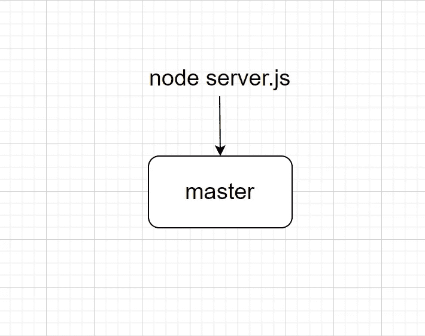
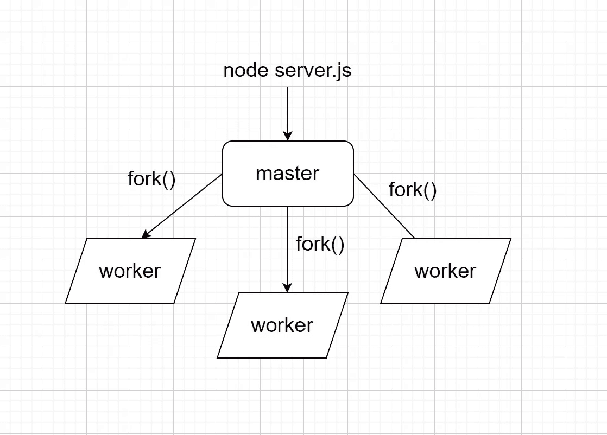

# Node.js:如何优化服务器性能？

> 原文：<https://levelup.gitconnected.com/node-js-how-to-optimise-server-performance-35c85421db18>


*如果你是 Python 或编程的新手，可以看看我的新书《Python 学习指南》**’***下面:**

[](https://bamaniaashish.gumroad.com/l/python-book) [## 学习 Python 的无牛指南

### 你是一个正在考虑学习编程却不知道从哪里开始的人吗？我有适合你的解决方案…

bamaniaashish.gumroad.com](https://bamaniaashish.gumroad.com/l/python-book) 

Node.js 运行一个**单线程**来计算并返回对传入请求的响应。

## 当一些请求需要大量计算时间时会发生什么？

我们的服务器将被封锁所有路线的新请求。

让我们来看看实际情况。

# 创建 Express 服务器

我们将首先创建一个 Express 服务器，它有到两个 GET 请求的路由。

根('/')路由返回字符串' Welcome！'。

```
const express = require("express");const app = express();app.get("/", (req, res) => {
    res.send("Welcome!");
});
```

为了使第二个路由请求耗时，让我们创建一个函数来延迟对传入请求的响应。

```
function delay(duration){
    const start_time = Date.now();

    while(Date.now() - start_time < duration){
    //do nothing
    };
};
```

该函数将在指定的时间内延迟服务器响应。

让我们为它创建一条路线('/delay ')，并将其添加到我们的 Express 服务器中。

```
const express = require("express");const app = express();app.get("/", (req, res) => {
    res.send("Welcome!");
});app.get("/delay", (req, res) => {
    delay(5000);
    res.send("Delayed welcome!")
    };
);app.listen(3000, () => console.log("The server is running on port 3000"));
```

当我们在 Express 服务器上向'/delay '路由发出请求时，响应会延迟 5000 毫秒(5 秒)。

这将阻塞我们的服务器，并且发送到根('/')路由的任何请求也将被延迟。


[Kelly Sikkema](https://unsplash.com/@kellysikkema?utm_source=medium&utm_medium=referral) 在 [Unsplash](https://unsplash.com?utm_source=medium&utm_medium=referral) 上拍摄的照片

# 如何优化？

为了避免此类问题并优化服务器性能，我们希望使用多个进程来处理我们的请求。

因为 Node.js 是单线程的，所以我们不能并行运行多个线程。

> **这可以通过创建我们的 Express 服务器代码的多个副本并在我们的服务器机器的不同内核上运行它们来解决。**

我们先来看看 Node.js 是如何运行一个服务器的。

## 节点的内部工作。射流研究…

当在我们的终端上执行“node server.js”时，会创建一个“主”进程。

这个过程运行我们的服务器代码。



我们可以从这个“主”流程创建多个子流程。

这些被称为“工人”进程。

每个工作进程将运行我们的服务器代码的一个实例。

我们将使用 Node.js 模块来帮助我们。

## Node.js 集群模块

为了使用这个模块，我们将它导入到我们的服务器代码中。

```
const cluster = require("cluster");
```

使用`[.fork()](https://nodejs.org/api/child_process.html#child_processforkmodulepath-args-options)`方法生成工作进程。

## 改变我们的服务器代码

我们将在服务器代码中添加以下条件来使用工作进程。

```
if (cluster.isMaster) {
    console.log("Master process is running");cluster.fork();
    cluster.fork();
    cluster.fork();} else {
    console.log("Worker process is running");app.listen(3000, () => console.log("The server is running on port 3000"));
};
```

这将从父“主”进程创建三个“工作”进程。



> 我们如何预先知道，我们应该创建多少个“工人”流程？

# 根据 CPU 内核进行优化

我们将使用所有 CPU 内核来运行工作进程，以使我们的服务器应用程序最高效。


克里斯蒂安·威迪格在 [Unsplash](https://unsplash.com?utm_source=medium&utm_medium=referral) 上拍摄的照片

这可以通过根据服务器中可用的 CPU 内核数量生成“工作”进程来实现。

```
const os = require("os");const NUM_WORKERS = os.cpus().length;//This gives the number of the CPU cores available in our machine.
```

我们的代码可以更新如下。

```
if (cluster.isMaster) {
    console.log("Master process is running");for (let i=0; i <=NUM_WORKERS ;i++){
        cluster.fork();
    };} else {
    console.log("Worker process is running");app.listen(3000, () => console.log("The server is running on          port 3000"));
};
```

# 负载平衡

为了将传入的请求分发到我们的服务器，使用了**循环**负载平衡方法。

在循环算法中，第一个请求被发送到第一个服务器，然后是第二个，依此类推，直到最后一个。然后再次启动，将下一个请求分配给第一个服务器，依此类推。

该算法可以被加权，使得最强大的单元接收最大数量的请求并首先接收它们。

这就是优化服务器性能的方法！

# 完整的代码

```
const express = require("express");
const os = require("os");const app = express();function delay(duration){
    const start_time = Date.now();

    while(Date.now() - start_time < duration){
    //do nothing
    };
};app.get("/", (req, res) => {
    res.send("Welcome!");
});app.get("/delay", (req, res) => {
    delay(5000);
    res.send("Delayed welcome!")
    };
);if (cluster.isMaster) {
    console.log("Master process is running");const NUM_WORKERS = os.cpus().length;for (let i=0; i <=NUM_WORKERS ;i++){
        cluster.fork();
    };} else {
    console.log("Worker process is running");app.listen(3000, () => console.log("The server is running on          port 3000"));
};
```

链接到节点集群文档:
[https://nodejs.org/api/cluster.html](https://nodejs.org/api/cluster.html)

阅读更多关于负载均衡的内容:[https://en . Wikipedia . org/wiki/Load _ Balancing _(计算)# Static _ Load _ distribution _ without _ prior _ knowledge](https://en.wikipedia.org/wiki/Load_balancing_(computing)#Static_load_distribution_without_prior_knowledge)

*感谢您阅读本文！*

*如果你是 Python 或编程的新手，可以看看我的新书《没有公牛**t 学习 Python 指南**’***》:**

[](https://bamaniaashish.gumroad.com/l/python-book) [## 学习 Python 的无牛指南

### 你是一个正在考虑学习编程却不知道从哪里开始的人吗？我有适合你的解决方案…

bamaniaashish.gumroad.com](https://bamaniaashish.gumroad.com/l/python-book) [](https://bamania-ashish.medium.com/membership) [## 通过我的推荐链接加入 Medium-Ashish Bama nia 博士

### 阅读 Ashish Bamania 博士(以及 Medium 上成千上万的其他作家)的每一个故事。您的会员费直接…

bamania-ashish.medium.com](https://bamania-ashish.medium.com/membership) 

# 分级编码

```
Thanks for being a part of our community! More content in the [Level Up Coding publication](https://levelup.gitconnected.com/).Follow: [Twitter](https://twitter.com/gitconnected), [LinkedIn](https://www.linkedin.com/company/gitconnected), [Newsletter](https://newsletter.levelup.dev/)Level Up is transforming tech recruiting 👉 [**Join our talent collective**](https://jobs.levelup.dev/talent/welcome?referral=true)
```