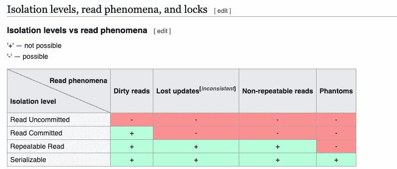

# Node.js MySQL 事务:一步一步的教程，包含一个真实的例子

> 原文：<https://levelup.gitconnected.com/node-js-mysql-transaction-5713b33c53e8>

事务是关系数据库的重要特征之一。在 Node.js MySQL 事务演练中，我们将研究它如何帮助您实现数据一致性，将困难的事情推到数据库级别。我们开始吧！

## 什么是数据库事务？

定义关系数据库事务的最简单的方法是“要么全部要么全无”。您可以运行一系列 SQL 查询，例如，您可以运行 4 个 SQL 查询。如果第三个数据库出现问题，整个过程都可以回滚，将数据状态恢复到运行任何查询之前的状态。

维基百科说:

> 数据库事务象征着在数据库管理系统(或类似系统)中针对数据库执行的一个工作单元，并且以独立于其他事务的一致和可靠的方式来处理。事务通常代表数据库中的任何变化。

一个典型的例子是两个银行账户之间的资金转移。要么该操作应该完全发生，要么根本不发生。数据不应处于过渡状态，即从转让人的账户中扣除资金，但不记入受让人的账户。

## 锁和隔离级别的重要性

对于数据库事务，我们的目标是保持数据的一致性。关于数据一致性，数据库行锁和隔离级别总是它的一部分。理解数据库隔离的最简单方法是，当没有其他并发运行的事务可能竞争相同的行/资源时，数据库允许事务执行的能力。

为了实现良好的隔离，锁定开始发挥作用。所以我们可以锁定表中的一些行，更新它们，然后提交它。当行被更新时，我们可以阻止其他查询读取这些行。如果我们允许读取未提交的行/数据，这被称为脏读。

当然，这不是一个简单的用 100 个词来描述的话题，所以我强烈推荐阅读这篇关于[数据库隔离和锁定](https://retool.com/blog/isolation-levels-and-locking-in-relational-databases/)的文章。下面是来自维基百科的 4 个隔离级别的总结:

数据库中的隔离级别

MySQL 的默认事务隔离级别是根据其[文档](https://dev.mysql.com/doc/refman/5.6/en/set-transaction.html#set-transaction-isolation-level)的可重复读取。在我们的示例中，我们将使用不同的隔离级别。

这让我们明白了为什么关系数据库对事务和数据的一致性如此严格。这是因为酸性合规性，这将在下一部分讨论:

## 酸性顺应性

ACID 代表原子性一致性隔离持久性，它保证可靠地处理数据库事务。 [Essential SQL](https://www.essentialsql.com/sql-acid-database-properties-explained/) 已经给出了银行转账的经典例子来解释 ACID。在示例中，它阐述了:

> 原子意味着要么整个银行转账将通过，要么什么都不会发生。一致性确保审计跟踪，这意味着在交易回滚的情况下，两个帐户都将恢复到原始余额。

此外，帖子描述:

> 隔离确保其他银行交易不会影响这一特定余额转移的结果。其他竞争事务将等待该事务完成。最后，持久性意味着一旦事务被保存或提交，即使在断电或系统崩溃的情况下，它也是可用的(不会丢失)。基本上，安全地保存到磁盘。

你也可以在这个 [BMC 博客](https://www.bmc.com/blogs/acid-atomic-consistent-isolated-durable/)上了解更多。

MySQL 尤其是 InnoDB 引擎，T4 说它与 ACID 模型紧密结合。但是，不用说，关于它有不同的[意见](https://dba.stackexchange.com/questions/177569/is-mysql-acid-compliant)也是因为旧的 MyISAM 引擎是[非事务性的](https://www.percona.com/blog/2016/10/11/mysql-8-0-end-myisam/)，但它不是现在的默认引擎。

同样，您可能想多读一点关于[上限定理](https://en.wikipedia.org/wiki/CAP_theorem)的内容——一致性、可用性和分区容差。除非你相信[谷歌扳手](https://www.dbta.com/Columns/Emerging-Technologies/Emerging-Technologies-Spanner-Stretches-the-CAP-Theorem-131092.aspx)拥有这三样东西中的全部三样，否则你只能拥有其中的两样。

多读一点关于基础——基本上可用的软状态，最终的一致性)将有助于理解 [NoSQL 数据库](https://www.freecodecamp.org/news/nosql-databases-5f6639ed9574/)的“速度”以及它们所采取的权衡。简单说一下，我将留给你们这幅关于最终一致性的巧妙漫画，可能出自[米科拉](https://twitter.com/mykola/status/1101337299525267457):

用一张图简单解释最终的一致性

回到正题，让我们深入到代码或 Node.js MySQL 事务示例中。

## Node.js MySQL 事务示例

在本教程中，我们将以一种特殊的在线商店为例。这家商店是一家虚构的政府经营的网上商店，出售必需品，因为 COVID 只向养老金领取者提供短缺。对于这个 MySQL 事务示例，我们将有两个表 sales_order 和 product(也有库存计数)。以下是这个虚拟商店的规则:

1.  它只卖卫生纸、米饭、意大利面、鸡胸肉和洗手液。总共只有 5 个项目。
2.  在一份订单中，您最多只能购买 1 件以上物品(每天/每人)。这样做是为了使逻辑非常简单。
3.  为了简单和更容易计算，所有价格都以美分存储，以美元显示。
4.  对于这个过于简单的例子，我们不关心客户或支付数据，在现实生活中，这些东西是至关重要的。

利用上述规则来简化事务，在接下来的步骤中，我们将创建表、一些记录并为 Node.js MySQL 事务插图编写代码。

## Node.js MySQL 事务表

基于上述假设，让我们创建两个过于简化的表，产品和销售订单，如下所示:

这是两个不同的表，没有任何关系。因为这是一个非常简单的例子，sales_order 将有 items 列，这是一个逗号分隔的产品名称值。让我们添加这 5 个项目，每个项目 500 个，如下所示:

我们创造了我们销售的 5 种产品。除了卫生纸，他们每个人都有 500 个数量。我们稍后将使用卫生纸来测试脱销场景。

## Node.js MySQL 事务代码

在写代码之前，我们先分析一下动作的过程。这是非常重要的，也是我认为初级工程师缺乏的技能之一。先解决问题，再写代码是最重要的[编码技巧](https://geshan.com.np/blog/2018/12/the-most-important-tip-for-beginner-software-engineers-is/)。解决这个问题的步骤如下:

1.  我们将隔离级别设置为“READ COMMITTED”
2.  开始交易
3.  锁定 SKU 的行，因为 SKU 是独一无二的。
4.  阅读库存行
5.  计算订单总额和项目
6.  在订单表中插入订单
7.  更新产品扣除数量 1。
8.  提交事务
9.  如果第 3 步到第 8 步之间有问题，它将回滚整个事务

下面是带有创建订单功能的订单服务，其中包含 Node.js MySQL 事务:

如果你想快速体验一下，你可以在这个开源的 [GitHub 资源库](https://github.com/geshan/nodejs-mysql-transaction)中找到代码。

## MySQL 事务代码如何工作

是时候看看代码是如何组织的了:

*   首先需要 MySQL2 库，我们用`npm install --save mysql2`从 NPM 安装了这个库，并在 config.js 文件中为我们的 MySQL 服务器配置了凭证。
*   我们有一个`createOrder`函数来完成所有繁重的工作。
*   首先创建一个到数据库的连接，我们将使用这个连接来处理所有相关的查询。
*   然后，我们将隔离级别设置为`READ COMMITTED`，这意味着只有在当前锁定事务提交/回滚后，其他事务才能读取锁定的行。
*   因此，我们从`beginTransaction`开始交易
*   之后，我们锁定第 5 行商品的 SKU 行，它们是`RI0002`和`CB0004`。
*   随后，我们得到相同产品的名称、数量和价格。
*   然后，我们循环遍历每个项目，查看它是否有库存(数量不小于 1)，如果它没有库存，我们抛出一个错误，回滚事务，否则它将继续进行。
*   之后，我们计算订单总数，并将名称压入`orderItems`数组
*   因此，我们在`sales_order`表中插入一行，包含计算出的订单总数，并用逗号`,`连接`orderItems`的名称。
*   然后，我们将订单中的项目数量减去 1(记住每个订单 1 个项目的规则)
*   最后，我们提交事务来密封整个流程。
*   如果事务中有任何问题，我们在 catch 部分有一个回滚。
*   我们有一个`testOrderCreate`函数，它只调用`createOrder`并退出进程。

让我们测试一下我们的代码，看看它能做我们想要做的事情。

## 测试 Node.js MySQL 事务代码

我们可以运行两个并发和竞争的事务，但是由于我们的隔离和锁定级别是最佳的，所以其中一个会等待另一个完成。如果它是一个 API，我们可以在完全相同的时间(毫秒或微秒)获得对相同项目的 2 个或更多请求，但我们的代码仍然可以很好地处理它。测试我们的代码(目前只是一个脚本)最简单的方法之一是使用 Tmux。

Tmux 也被称为终端多路复用器，它就像是你终端中的一个窗口管理器。我们可以将终端分成多个“窗格”。我们还可以使用[同步窗格](https://medium.com/@bingorabbit/tmux-propagate-to-all-panes-9d2bfb969f01)设置在多个窗格中传播相同的命令。我们将使用相同的 synchronize panes“on”设置在两个窗格中运行该命令，模拟两个竞争事务，如下所示:

正在进行的竞争性交易

正如我们所看到的，上面的窗格首先被执行，因为它读取数量为 484，并下了 id 为 17 的订单。然后，在上述事务的提交操作释放锁之后，下面的窗格从 product 表中读取行。它显示大米和鸡胸肉的数量都是 483，订单 id 是 18。接下来，让我们看看如果两个人想同时订购最后一个项目会发生什么，从逻辑上讲，其中一个人应该退出库存消息。

## 处理缺货问题的交易

你可能知道，在 2020 年 3 月初，人们为卫生纸而疯狂。以至于他们诉诸[打斗](https://www.abc.net.au/news/2020-03-08/coronavirus-toilet-paper-fight-at-woolworths-leads-to-charges/12037046)和扯头发来争夺最后一卷卫生纸。我们将重演这场战斗，没有人受伤，我们不需要涉及任何执法人员。

由于我们的商店是在线的，所以争论的焦点将是谁先点击“立即付款”按钮:)。卫生纸的数量是 1。即使两个人同时使用数据库行锁和正确的隔离级别，也不会产生任何争论，怎么做呢？

> 通过正确的隔离和锁定，对于 place order 事务，一个竞争事务将等待另一个成功。

因此，等待中的顾客会收到如下“缺货”错误:

缺货测试，库存中的最后一件商品

您可以在这个[拉动请求](https://github.com/geshan/nodejs-mysql-transaction/pull/7/files)中查看我们对库存示例中的最后一卷卫生纸所做的代码更改。在下方屏幕上下单的人收到了订单，而在上方屏幕上不走运的人收到了缺货信息。另一种测试方法是使用 [promise.allSettled](https://rknn.de/blog/major-promise-allsettled-vs-promise-all-difference-by-example) 。我把这种探索留给你:)。

当行被及时锁定而另一个竞争事务正在等待时，系统的这种正常行为是可能的。当第一个交易完成时，它将数量设置为 0，因此第二个交易读取的数量为 0，从而产生有效的缺货消息。

## 结论

锁定、隔离级别和事务在关系数据库环境中非常重要和有用。

> 如果您必须编写一系列 SQL 查询来写入数据，或者多个 SQL 查询需要将数据写入多个表，那么您可能需要一个数据库事务来保持数据的完整性。

好好使用事务，希望你能远离[数据库死锁](https://vladmihalcea.com/database-deadlock/):)，继续编码！