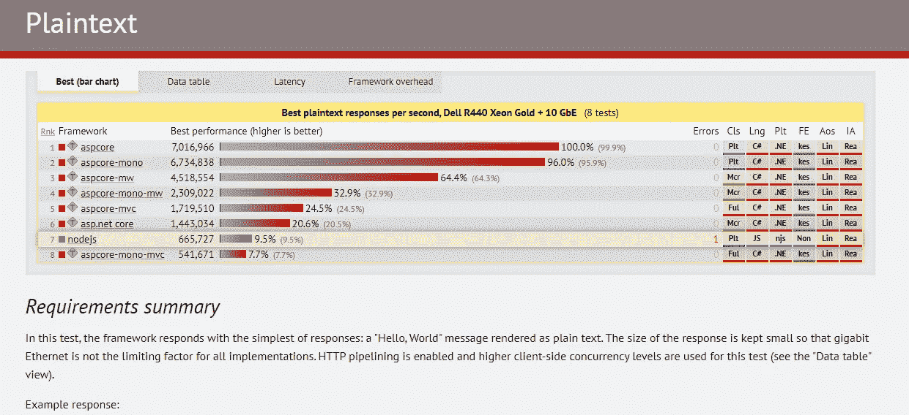
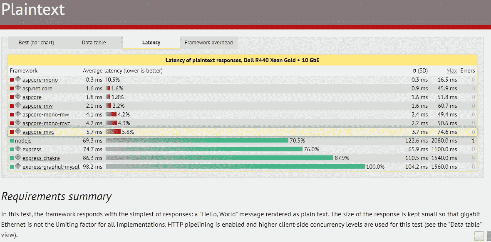
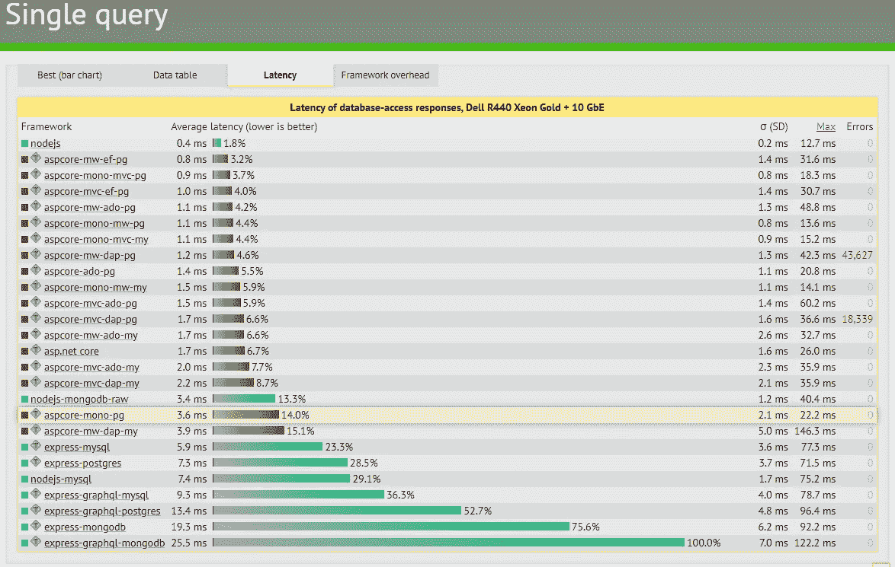
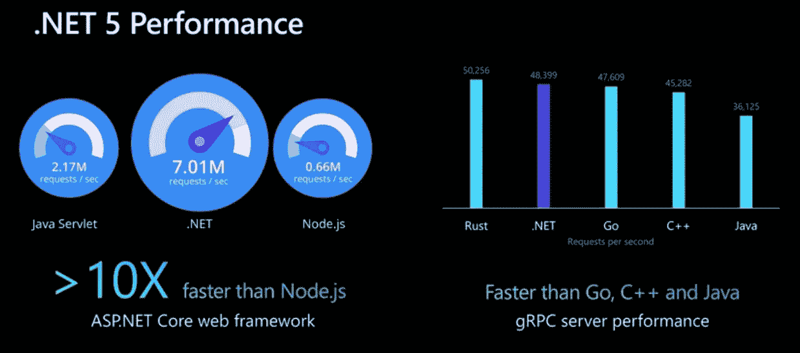
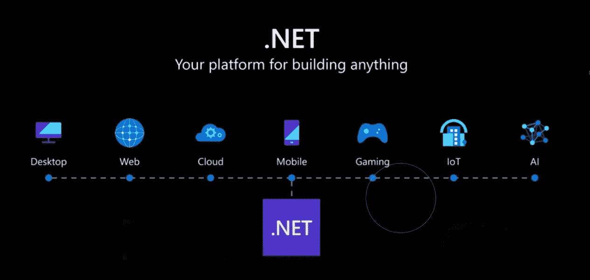

# Node.js vs .NET Core 谁更胜一筹？

> 原文：<https://levelup.gitconnected.com/node-js-vs-net-core-the-winner-5ba06efb4c35>

## 是的，我们有一个赢家

这是一个简单的演示，任何人都可以从中了解这两项领先技术的进展。我想知道同样的问题，想知道是否有一个真正的赢家

如果你愿意支持我成为一名作家，考虑注册[成为一名媒体成员](https://freelancingcult.medium.com/membership)。每月只需 5 美元，你就可以无限制地使用 Medium。

我注意到的一件事是。NET core 得到了微软非常积极的支持。这真的很好，有了微软的标签，它就用 Visual Studio 这样的支持工具创建了一个专业级的编程环境。Visual Studio 使构建、调试和发布。NET C#代码在多种平台和设备上运行。

 [## 托管 React 应用的最简单方式(Azure + VS 代码)

### 初学者一步一步来

medium.com](https://medium.com/geekculture/easiest-way-to-host-your-react-app-azure-vs-code-8046f9f7fb0b) 

# 介绍

# 。网络核心

。NET 是一个开源软件开发框架，最初由微软所有，然后发布给开源社区。最初，它有两个分支。net framework，它只能在 Windows 上运行，而。net 核心是跨平台的。而是来自。net core 版本 3，微软停的比较早。net 框架支持。所有未来的版本都只是。net Core 版本，它们被重新命名为. NET。NET Core 以构建支持云的现代互联网应用程序而闻名。

 [## 了解实时网络应用背后的东西

### 这是我撰写的关于如何使用 ASP 的系列文章的第一篇。NET Core SignalR 创建实时…

medium.com](https://medium.com/geekculture/understand-whats-behind-real-time-web-apps-e60168129480) 

# 节点. js

Node.js 是一个开源运行时环境，用于开发快速和可伸缩的网络应用程序。Node js 建立在 chromes javascript 运行时之上，该运行时被称为 V8 引擎。Node js 在数据密集型实时应用程序中非常受欢迎，因为它使用事件驱动的非阻塞 I/O 模型。在开发诸如视频和音频处理之类的高效处理应用程序时，Node js 并不是首选。

 [## Windows 11 有什么新功能

### 新功能、系统要求和升级规模

levelup.gitconnected.com](/whats-new-in-windows-11-88278e668b7) 

# 处理模型差异

# 节点. js

Node.js 在单线程上运行，因此它比传统的流程请求方法使用更少的资源。在 node.js 请求处理中发生的事情是，它接受一个请求，如果可以立即处理，就发送响应。如果它是一个耗时的 API 调用或长时间运行的作业，则将它传递给事件循环，并继续处理下一个传入的请求。事件循环处理完请求后，使用回调函数发回响应。

# 。网络核心

有人可能认为。NET core 可能只是在用老的阻塞线程池方法来处理请求，我一开始也是这么想的。酪 Net core 为使用异步编程模式提供了极好的支持。

一个例子`DbContext.SaveChanges`是保存到数据库的同步(阻塞)方法，而`DbContext.SaveChangesAsync`可以用来异步保存数据。
Net core 也有一个 I/O 完成方法来处理异步请求，其中分配的线程不等待响应到达。NET core 还可以处理大量消耗资源的请求，如编码和解码视频和音频。。NET core 在处理并发任务方面具有很强的竞争力。但正如我所说 node.js 输给了。当请求成为 CPU 密集型时，使用. NET。

# 表演

照片由[卢克·切瑟](https://unsplash.com/@lukechesser?utm_source=unsplash&utm_medium=referral&utm_content=creditCopyText)在 [Unsplash](https://unsplash.com/s/photos/performance-charts?utm_source=unsplash&utm_medium=referral&utm_content=creditCopyText) 拍摄

当谈到性能时，我们必须非常小心用于测量性能的用例。我们必须明白的是，快速运行和处理负载是两种不同的情况。就像每个用例中的性能不同一样。
一个服务器在每秒处理一个请求的时候可能会很快**，而在每秒处理 500 个请求的时候会很慢**负载**。**

**节点 js 在处理负载方面很受欢迎。因为。NET 为线程池中的每个请求分配一个线程。当它脱离线程时，请求就会被阻塞。但是如果请求是非阻塞的，就不会再有问题了。因此，您可以看到请求的类型也会影响性能。**

**不仅如此，它呈现的网页类型也很重要。用于呈现静态页面。Net core 胜出可能是因为它内置了 IIS 服务器。IIS 使用内核模式缓存，这意味着请求静态页面的请求甚至不会离开内核**

**从。net 核心端，可以比 node.js .和更好的处理 CPU 高度密集的任务。Net core 在每一个版本中都在不断地提升自己的极限。它的最新版本。Net core gRPC 服务器的性能高于其他主流语言，如 Java、Go 和 C++。**

# **。网络核心**

**我偶然发现了一种被不同的 YouTubers 使用，甚至在官方中提到的标杆网站。微软的. NET 核心演示。所以我从[Techempower.com](http://Techempower.com)得到了下面的基准图表**

# **来自 Techempower.com 的基准点**

## ****每秒最佳明文响应，戴尔 R440 至强金牌+ 10 GbE** (8 项测试)**

**这些简单的请求得到 Hello World 的文本响应。**

****

# **潜伏**

**请记住，延迟越低越好。尽管图表显示了巨大的差异，但这些差异是以毫秒为单位的。除非您正在构建具有大量请求的项目，否则效果不会很好**

****

# **处理单个查询**

**发送了一个查询请求来获取响应。**

# **需求摘要**

**在这个测试中，通过从一个简单的数据库表中提取一行来处理每个请求。然后，该行被序列化为 JSON 响应。**

## **示例响应**

****

## ****每秒最佳数据库访问响应，单一查询，戴尔 R440 至强金牌+ 10 GbE** (26 项测试)**

****

****数据库访问响应延迟，戴尔 R440 至强金牌+ 10 GbE****

****

**这里，节点 js 具有最低的延迟，但它是以毫秒为单位的，这是可以协商的。**

# **处理多个查询**

# **需求摘要**

**在这个测试中，通过从一个简单的数据库表中获取多行并将这些行序列化为一个 JSON 响应来处理每个请求。测试运行多次:对每个请求测试 1、5、10、15 和 20 个查询。所有测试都在 512 并发下运行。**

## **10 个查询的示例响应**

****

## ****每个请求 20 次查询时的每秒响应，戴尔 R440 至强金牌+ 10 GbE** (25 次测试)**

****

**多个查询**

## **多次查询延迟**

****

**多次查询延迟**

**用[techempower.com](https://www.techempower.com/)的性能图表。Net core 在各个方面都表现出了明显的高性能。我做了同样的测试，将物理数据库改为云数据库，没有任何区别。Net Core 显示了更高的性能。**

****

**以上是取自的性能指标评测。微软开发者 youtube 频道上的. Net 6 入门视频。有新的更新。Net 随着性能的提高而更加优化。**

# **社区支持**

****

**安妮·斯普拉特在 [Unsplash](https://unsplash.com/s/photos/collaboration?utm_source=unsplash&utm_medium=referral&utm_content=creditCopyText) 上的照片**

**谈到社区支持，他们都有积极和强大的社区支持。Node.js 从一开始就在 GitHub 上，所以它在 GitHub 中有强大的社区支持。而。Net Core 在栈溢出方面有巨大的社区支持。**

**

dotnet Youtube 频道** 

**好像是。NET core 也随着它的社区支持而蓬勃发展。官方 [Dotnet youtube 频道](https://www.youtube.com/c/dotNET/featured)每天上传有价值的内容，以积极的方式吸引社区。**

# **平台支持**

****

**Amy Hirschi 在 [Unsplash](https://unsplash.com/collections/3784571/stock-image-collection-1-9-19?utm_source=unsplash&utm_medium=referral&utm_content=creditCopyText) 上的照片**

**Node.js 从一开始就运行在多个平台上。这是它越来越受欢迎的原因。它正式支持 Windows、Linux、macOS、SmartOS 和 IBM。**

**。NET core 有一个独立的方法，它最初只是为了在 Windows 平台上工作而构建的。但从 2018 年开始，它经历了一场巨大的革命，从 NET core 3.1 版本开始在 Windows、Linux 和 macOS 上运行。**

# **Node.js 用例**

**由于其单线程事件循环，Node.js 更擅长同时处理多个任务。Node.js 被设计成 Apache HTTP Server 的替代产品。Node.js 基于 javascript，开发者可以使用一种语言编写前端和后端。**

**开发人员可以使用来自[节点包管理器(npm)](https://www.npmjs.com/) 的预写代码，并使用这些模块进行快速高效的编程。**

**Node.js 可以在稳定需求的情况下处理大量流量，而无需增加服务器容量。Node.js 倾向于通过其高速 V8 引擎和单线程异步模型以异步方式处理所有请求。**

# **使用 Node.js 的优势**

*   **可以使用单一语言 JavaScript 来执行前端和后端开发**
*   **节点是跨平台和异步的。**
*   **支持 NPM 软件包管理器使用外部模块**
*   **代码模块化减少了项目内部的依赖性，导出的模块可以在多个项目中使用，而不会对现有代码产生任何副作用。**

# **。网络核心用例**

****

**。NET core 是基于面向对象的编程语言 C#。它也可以用于用 F#语言构建项目。的。NET 核心生态系统提供了预构建的类库，包括简单和复杂的数据结构。Net core 还为数据库访问、安全性、加密和数据库访问提供了特定的库。这些库可用于图形渲染项目、数据库交互和 XML 操作。**

**。NET core 也开启了跨平台应用程序开发的可能性。Net core 可用于各种各样的开发需求，如桌面、Web、云、移动、游戏、物联网和人工智能。
由于其模块化和可扩展的特性。NET 可以用来构建微服务。所以。NET 可用于构建具有微服务的高可伸缩性系统，以提供高效的用户体验。**

# **Office 外接程序开发**

**大多数公司和企业在工作中使用 Ms office 或 office 365。使用. Net 可以开发 office 插件来扩展 ms office 的功能。**

# **使用的优势。网络核心**

*   **关注点分离的可能性**
*   **内置库缩短了编码时间**
*   **安全性**
*   **使用 Visual Studio 的支持性编码环境和工具**
*   **跨平台支持**
*   **跨云、物联网、桌面等多个平台的开发和部署。**

# **转向 Node.js 的热门公司**

**贝宝、网飞、优步、领英、易贝**

# **受欢迎的公司转移到。网络核心**

**Chipotle，UPS，GoDaddy，Asgard Systems，Siemens Healthineers**

# **结论**

**在整个探索过程中，尽管大多数基准测试结果都是朝着。网芯。事情可能取决于项目的要求，以及托管要求。但我注意到了。Net core 在微软的支持及其企业级的影响力下，已经开始超越节点向前发展。所以我认为。net core 在所有这些基准测试和云支持方面处于领先地位。**

**Node.js 是在同样使用 C++的 V8 之上编写的。所以 node 下面还有一层，包括编译代码时的额外工作。酪 NET core 创建了一个更接近机器可读的. dll。因为最终，重要的是代码编译的速度。**

**也请分享你的看法！！似乎评论区正在:D 变得火热**

**我希望你喜欢读这篇文章。如果你愿意支持我成为一名作家，考虑注册[成为一名媒体成员](https://freelancingcult.medium.com/membership)。每月只需 5 美元，你就可以无限制地使用 Medium。**

# **分级编码**

**感谢您成为我们社区的一员！升级正在改变技术招聘。 [**在最好的公司**找到你最完美的工作](https://jobs.levelup.dev/talent) **，而不只是你的*下一份工作*。****

** [## 提升——改变招聘流程

### 🔥让软件工程师找到他们热爱的完美角色🧠招聘人才是最痛苦的部分…

作业. levelup.dev](https://jobs.levelup.dev/talent)**