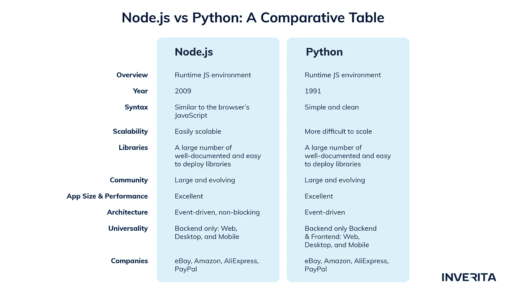

# node . js vs Python:2022 年哪种技术最好？

> 原文：<https://levelup.gitconnected.com/node-js-vs-python-which-technology-is-the-best-in-2022-c457f80a1b20>

Python 和 Node.js 被设计在不同的时间表中，用于不同的目的，在 web 开发方面成为了竞争对手。

Python 和 Node.js 都提供了各种各样的特性来满足性能需求。古语有云，编程语言没有好坏之分，一切取决于你项目的需求。让我们看看哪一个最适合你的项目。

# **node . js vs Python——有什么区别？**

Node.js 与 Python 的主要区别在于，Node.js 是一种异步事件驱动的 JavaScript **运行时环境**，而 Python 是一种成熟的面向对象的**编程语言。**

## **什么是 Node.js —简要概述**

Node.js 于 2009 年发布，用于构建可伸缩的服务器端和网络应用。它是一个开源的、跨平台的 JS 运行时，构建在 Google Chrome 的 V8 JS 引擎上，这是一个由内置解释器、编译器和优化器组成的虚拟机。Node.js 有一个事件驱动的架构，支持异步 I/O。

Node.js 有一个庞大且不断增长的社区，该社区开发了许多框架来加快开发过程。

[inVerita 开发团队](https://inveritasoft.com/)更喜欢 Node.js 在客户端和服务器端都使用 js。

## **什么是 Python —简要概述**

Python 是一种开源、面向对象的通用编程语言，发布于 1991 年。Python 的主要原则是可读性和不重复的概念(DRY)。简化的语法、极其庞大的库和包生态系统以及多功能性使 Python 成为新开发人员的首选语言。

# **Python 和 node . js——哪个更受欢迎？**

从公司的角度来看，技术的受欢迎程度起着重要的作用，因为它决定了培养具有熟练人才的开发团队的难易程度，以及可用于更快更好地构建的可用资源的数量。

根据[**Stack Overflow Developer Survey 2022**](https://survey.stackoverflow.co/2022/#most-popular-technologies-webframe-learn)，几乎 68%尝试过使用 Python 的开发者表示愿意继续使用它。同一调查表明，17%从未使用过 Python 的开发人员对使用 Python 进行开发表现出了兴趣。

Node.js 在专业开发人员和学习编码的人最常用的 web 技术中排名第一，分别有 46%和 52%的开发人员选择它。

[**TIOBE 指数**](https://www.tiobe.com/tiobe-index/) 将 Python 评为其他软件开发语言之首。

该评级基于全球熟练程序员的数量、可用课程和第三方供应商。

[**SimilarWeb**](https://www.similartech.com/compare/nodejs-vs-python) 说用 Node.js 搭建的网站有 235917 个，用 Python 搭建的网站有 122545 个。根据 SimilarWeb 的说法，Python 最常用于科学教育和重工业工程，而 Node.js 的使用覆盖面更广，有 20 多个类别。

# **Python vs Node.js —详细对比**

## **#1 语法**

**Python** 有一个清晰明了的语法，方便了测试驱动的开发，使 Python 成为开发人员-初学者的首选。

Node.js 的语法类似于浏览器的 JavaScript，因此熟悉 JavaScript 的开发人员可以轻松使用 Node.js

## **#2 架构**

**Node.js**

异步 I/O 允许应用程序重叠处理 I/O 操作，这样程序就永远不会锁定。与同步 I/O 相反，在同步 I/O 中，线程会等待整个操作完成，而异步 I/O 特性使线程在操作过程中不会等待。它使应用程序能够在 I/O 处理过程中有更多的 CPU 时间来执行其他处理。

Node.js 最关键的模块是 V8 和 LIBUV，但是，也使用了很多其他的库，比如 HTTP、C-ARES、Zlib 和 OpenSSL。

大多数 Node.js 核心模块都是围绕**事件驱动架构构建的。**这意味着当应用程序中发生重要的事情时，例如，一个请求到达服务器，这些事件发射器发出命名的事件，事件监听器挑选开发者设置的事件，结果触发附加到每个监听器的功能。

简单地说，事件驱动架构允许直接对同一事件做出多次响应。

**Python**

Python 不是这样工作的。它没有异步 I/O，所以开发人员必须在调用其他进程之前完成一个进程。尽管开发人员仍然可以使用特殊的工具用 Python 编写异步代码。

## **#3 可扩展性**

要构建一个 MVP，你几乎可以使用任何技术，尽管要给应用程序添加新的特性和功能，你需要选择一种语言或一个学习环境，允许容易的扩展。

使用 **Node.js** 你可以创建一组微服务和模块，它们动态地运行自己的进程，而不是创建一个核心并围绕它扩展一切。此外，Node.js web 应用程序可以通过添加新节点方便地进行水平扩展，也可以通过添加额外资源方便地进行垂直扩展。

Python 在 Node.js 的可伸缩性方面损失了一点。由于构建在全局解释器锁之上，Python 解释器不能同时执行几个任务。更重要的是，它是一种动态类型的语言，在可伸缩性方面相当不利。随着团队的成长，大型、复杂的项目可能会发现很难在扩展的同时维护代码。

## **#4 库&开发工具**

**Python** 拥有强大而庞大的标准库，由 Pip 安装包管理。这些库易于部署，并且有良好的文档记录。在这里你可以找到一些最受欢迎的[。](https://inveritasoft.com/article-top-10-python-development-tools)

Node.js 拥有由 Node Package Manager 管理的大型且全面的文档化库库，Node Package Manager 是世界上最大的软件包库，拥有超过 35 万个软件包。

## **#5 扩展性**

**Node.js** 可以用各种方便的工具轻松定制和扩展。为了开发 HTTP 或 DNS 服务器，程序员使用内置的 API。

对于前端开发，Node.js 集成了一个 JavaScript 编译器— **Babel，**与 **Jasmine** 进行单元测试，对于数据迁移、项目监控和流程管理，它集成了 **Log.io** 、 **Migrate** 和 **PM2** 。

Python 是一种非常古老的编程语言，因此有各种各样流行和有用的工具来使用它。Python 通常与用于语法扩展和额外编辑的 **Sublime Text** 和用于实现测试自动化的 **Robot Framework** 集成在一起。一些最流行的 Python 框架包括 **Django** 、 **PyCharm** 、 **PyDev** 、 **Flask** 和 **CherryPy** 。

## **#6 性能&速度**

首先， **Node.js** 是建立在 Google 的 V8 引擎上的，这是最快的 js 引擎。其次，Node.js 在浏览器之外执行代码，因此在 web 浏览器上运行的应用程序处理速度更快，性能更好。

第三，非阻塞 Node.js 架构使得执行更快更容易。

Python 被公认为相当慢，主要是因为它的动态特性和多功能性。与 Node.js 相反，这些进程不会同时运行，这会降低处理速度。就速度而言，Python 输给了 Node.js，尽管有一些解决方案可以克服这个问题:

*   使用 Numba 通过 JIT 编译为本机代码来加速 Python
*   绕过 GIL 限制的多重处理；
*   编写自己的 C++库；
*   使用允许多线程和释放 GIL 的外部库。

## **#7 学习曲线**

**Python** 可能是最容易学习的编程语言。它的读写非常类似于英语，使用简化的语法，结构规则和代码行更少。

**Node.js** 如果开发者有一些 JavaScript 知识的话，是相当容易学会的。虽然事件驱动编程的概念使 Node.js 具有可伸缩性和高性能，但需要额外的时间和精力来掌握。

## **#8 通用性**

**Python** 是一种全栈语言，因此可用于前端和后端开发。它也是跨平台的，这意味着单个桌面应用程序可以在 Mac、Windows 和 Linux 上运行。

**Node.js** 主要用于后端开发，不过对于前端，你可以使用 js，这样后端和前端就可以共享相同的编程语言。

## **#9 社区**

与 Node.js 相比， **Python** 已经存在了三十多年，拥有一个更大的社区。全世界有数百万 Python 开发人员和大量的贡献者。

尽管比较年轻， **Node.js** 也是一门成熟的语言，拥有非常庞大和活跃的社区。

同样，不仅开发商，企业主也从不断增长的大型社区中受益。

## **#10 数据处理**

由于 JavaScript 的事件循环和无缝 I/O 操作，Node.js 是数据密集型应用的更好选择。

# **何时使用 Node.js**

**Node.js** 对于关键要求实时数据传输且必须具备繁重客户端渲染能力的应用，如实时聊天机器人和物联网解决方案，是一个完美的选择。

# **何时使用 Python**

Python 可以用于小型和大型项目，它在机器学习、人工智能和数据分析项目中的应用非常广泛。web 开发工具的丰富选择和 Python 的多功能性使其广泛用于 API、游戏和金融应用程序开发。

## **结论**

Python vs Node.js 可能是一个具有挑战性的选择，尤其是考虑到这些技术提供的所有优势。

因此，在做出最终决定之前，我们建议您列出您的最终产品必须具备的功能，并考虑您计划如何设计它们。

如果您仍然感到困惑或在开发您的项目时需要帮助，我们将很高兴为您提供帮助。欢迎随时 [**联系我们。**](https://inveritasoft.com/contact)