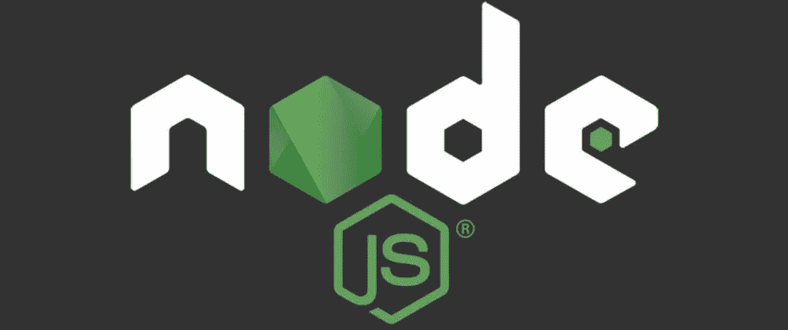

# NodeJS:从外部修改正在运行的服务器行为

> 原文：<https://levelup.gitconnected.com/nodejs-modify-running-server-behaviour-from-outside-445cee1f02b7>

你听说过 Chrome DevTools 协议吗？！



# 开发工具

我认识的每个工程师在职业生涯中都至少使用过一次 DevTools。DevTools 是一个非常有用的工具，它可以使调试 NodeJS 应用程序变得更加容易，当然，前提是你知道如何正确使用它。

我们大多数人认为这个工具是理所当然的，只需点击一下鼠标，我们就可以打开 DevTools 窗口并开始变魔术，但是我们如何在浏览器内部调试本地 NodeJS 进程呢？是如何实现的？主要问题是:我们如何实现我们的定制调试器？

回答这些问题会给我们达到目标的力量。👀

# 目标

想象一下，我们有一个运行在本地机器上的 Express 服务器，在某个时刻，我们决定放弃所有传入的补丁请求，当然，我们可以停止我们的服务器→更改代码→再次运行服务器。但是我们能在不重启/停止服务器的情况下做到这一点吗？让我们看看

# Chrome 开发工具协议(CDP)

> **Chrome DevTools 协议**允许工具对 Chrome、Chrome 和其他基于 Blink 的浏览器进行检测、检查、调试和分析。许多现有项目目前使用该协议。Chrome DevTools 使用这个协议，团队维护它的 API。

基本上，CDP 是一种帮助我们连接应用并调试它们的协议。CDP 就像我们日常使用的任何其他协议一样，所以因为我们是工程师，所以我们可以用它来构建/做任何事情。

CDP 有写得相当好的[文档](https://chromedevtools.github.io/devtools-protocol/)，许多有用和流行的工具在幕后使用它。比如:[popputer](https://github.com/puppeteer/puppeteer)、 [lighthous](https://github.com/GoogleChrome/lighthouse) 、 [vs-code 调试器](https://github.com/Microsoft/vscode-chrome-debug/)、[剧作家](https://github.com/microsoft/playwright)等等。

# 履行

首先，让我们用 ExpressJS 引导一个简单的 Hello World 应用程序，并记录传入请求的方法

使用`node app.js`, simple express 服务器将启动并监听`3000`端口。让我们向它抛出一些请求来证明它是有效的。

```
Input
--->
curl -s  --request PATCH '[http://localhost:3000/'](http://localhost:3000/')
curl -s  --request GET '[http://localhost:3000/'](http://localhost:3000/')
--->Server Output
--->
Example app listening at [http://localhost:3000](http://localhost:3000)
PATCH
GET 
--->
```

启动后，我们需要告诉 NodeJS 应用程序监听调试客户端(换句话说就是 CDP 连接)。为此，我们可以用`--inspect`开关启动我们的应用程序，或者我们可以发送`SIGUSR1`信号，节点将自动处理它。

由于我们不想停止我们的服务器，为了向进程发送信号，我们需要一个 PID，我们可以用`lsof -i :3000`命令得到它，之后执行`kill -SIGUSR1 {PID}`将启用调试模式，我们的应用程序现在看起来像这样:

```
--->
Example app listening at [http://localhost:3000](http://localhost:3000)
Debugger listening on ws://127.0.0.1:9229/a58914a2-86d7-4990-bdf9-53a43e5cb47d
For help, see: [https://nodejs.org/en/docs/inspector](https://nodejs.org/en/docs/inspector)
--->
```

现在我们有了一个正在运行的服务器，在 9229 端口(NodeJS 默认的 CDP 端口)等待 CDP 连接，剩下唯一要做的就是写客户端部分。

这是我们将逐行讨论的 CDP 客户端代码→

## #1 连接到过程→

在`NODE_DEFAULT_DEBUGGER_PORT`创建 CDP 连接

```
const cdp = *await* CDP({ port: 9229 });
```

## #2 启用运行时评估→

启用通过远程评估和镜像对象公开 JavaScript 运行时的运行时域

```
*await* cdp.Runtime.enable();
```

## #3 获取 HTTP 服务器的原型→

使用`cdp.Runtime`域，我们可以查询任何 JS 运行时对象，结果作为镜像对象返回，该对象公开了对象类型、字符串表示和唯一标识符，可用于进一步的对象引用。

Express 应用程序都使用`http` API，`app.listen`调用`require(‘http’).createServer`创建新的`http.Server`实例。既然每个物体都有它的原型，那就让我们开始着手`http.Server.prototype`

我们如何做到这一点？幸运的是，有了`Runtime.evaluate`，我们可以在我们所连接的进程中评估任何代码，所以让我们来寻找我们的原型

```
const prototype = *await* cdp.Runtime.evaluate({
    // specify which prototype we want
    expression: "require('http').Server.prototype", // this is required for "require" to work
    includeCommandLineAPI: true, 

    // True we need a pointer to the prototype of http.Server in the 
    // process heap, otherwise it would return JSON object.
    returnByValue: false,
});
```

## #4 获取对象指针→

我们有一个指向`http.Server`原型的指针，现在是时候用这个原型获得实际的对象镜像了，`Runtime.queryObjects`返回一个指向数组的指针。该数组包含以`http.Server.prototype`为原型的对象列表。

```
const listOfObjects = *await* cdp.Runtime.queryObjects({
    // specify prototype for objects
    prototypeObjectId: prototype.result.objectId,
});
```

## #5 获取服务器实例→

我们用`http.Server.prototype`获取了所有对象指针，现在我们需要 JS 运行时中该对象的实际实例，它们在我们的流程中被初始化。`Runtime.getProperties`返回包含实际实例的指针列表的数组。

由于我们只有一个 http 服务器在运行，返回的数组将只包含一个元素。现在我们在`result[0].value.objectId`有了我们想要的实例

```
const listOfInstances = *await* cdp.Runtime.getProperties({
    // specify objectId
    objectId: listOfObjects.objects.objectId,
});// select first instance from result array
const serverInstance = listOfInstances.result[0].value.objectId;
```

## #6 有趣的部分开始了！→

我们的目标是覆盖`http.Server`的监听器，为此我们需要编写一些函数，从实例中移除监听器，将它们封装在其他神奇的函数中，这些函数会丢弃补丁请求，然后再添加回去。

我在其他`cool_code.js`文件中定义了这个函数，否则我不得不在普通字符串中实现它，这是我比调试 CSS 更讨厌的事情。我们将在完成`inject.js`后通过`cool_code`。我们希望在流程中评估的代码是:

```
var overRideListeners = require(`./injectable`).overRideListeners
```

这定义了一个全局函数`overRideListeners`(稍后实现)，它将负责拦截 HTTP 请求。

```
*await* cdp.Runtime.evaluate({
    expression:
            `var overRideListeners = require('./cool_code')
                                               .overRideListeners`, 
    includeCommandLineAPI: true,
    returnByValue: false,
});
```

## #7 压倒一切！→

因此，我们在流程内部声明了一个神奇的函数，为了达到我们的目标，现在我们需要在 http 实例上调用这个函数。我们之前收购的服务器。令人惊讶的是`Runtime`提供了一个方法`callFunctionOn`，它确实做到了这一点。

```
*await* cdp.Runtime.callFunctionOn({
    objectId: serverInstance,
    functionDeclaration: "function() { overRideListeners(this) }", returnByValue: true,
});
```

## #8 清理→

在这一点上，如果我们做的一切都是正确的(剧透:我们做到了)，我们的 Express 应用程序应该不会处理来自网络的补丁请求。

唯一剩下的事情就是看到`cool_code`的实现。

同时，让我们成为优秀的工程师，关闭打开的连接+释放我们获得的指针。

```
*await* cdp.Runtime.releaseObject({ objectId: serverInstance });
*await* cdp.close();
```

# 酷代码

为了覆盖`http.Server`监听器，我们需要`Shimmer`，一个 npm 库，它做了大量必要的工作，将其他方法包装在您提供的包装器中。

`overRideListener`循序渐进:

*   首先，我们检索`request`事件的所有监听器并保存它们
*   删除当前侦听器
*   用`Shimmer`覆盖它们
*   放弃任何状态代码为 405 的修补程序请求
*   在`request`事件上注册已修改的监听器

这是所有`overRideListener`做的，是的，我知道这并不酷。

# 行动

在本文的第一部分，我们向我们的进程发送了`SIGUSR1`信号，这意味着它仍在等待 CDP 连接，我们有一个准备好的客户端，让我们让它发生

```
node inject.js // activate injection script
```

此消息应该出现在服务器的日志中

```
Debugger attached.
```

这意味着也许我们做的一切都是对的，是时候再次向我们的服务器抛出一些请求了

```
Input
--->
curl -s  --request PATCH '[http://localhost:3000/'](http://localhost:3000/')
curl -s  --request PATCH '[http://localhost:3000/'](http://localhost:3000/')
curl -s  --request GET '[http://localhost:3000/'](http://localhost:3000/')
--->Server Output
--->
Example app listening at [http://localhost:3000](http://localhost:3000)
GET 
--->
```

# 结论

正如您所看到的，在执行 inject.js 之后，我们的进程丢弃了来自网络的每个传入补丁请求，但是像以前一样响应 GET 请求，这意味着我们在不停止/重新启动进程的情况下改变了运行 NodeJS 应用程序的行为——任务完成。

CDP 是一个非常酷的工具，可以使开发变得更加容易。它有多个域，可以通过舒适的、记录良好的 API 进行访问。在本文中，我们只使用了运行时域，但是 CDP 还有更多。其中之一是网络域，它暴露了关于 HTTP、文件、数据和其他请求和响应的信息，它们的头、主体、时间等。

当我在寻找一种以特定格式收集本地服务器内存使用情况的方法时，我来到了 CDP，Chrome 内置的 DevTool 对此没有提供任何东西，经过一些研究后，我来到了 CDP，并有了拥有自己的调试器+分析器的想法。

我希望这很有趣。

如果你有任何问题→ [推特](https://twitter.com/dudupopkhadze)

快乐编码。