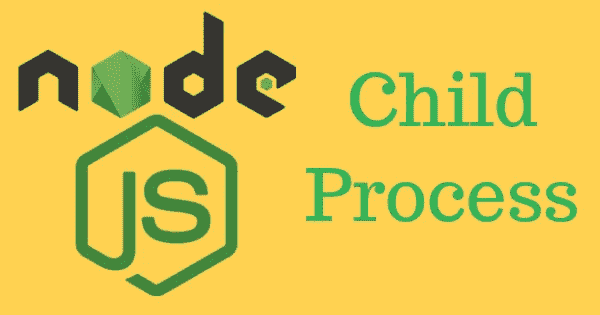

# NodeJS 片段:子流程

> 原文：<https://levelup.gitconnected.com/nodejs-snippet-child-process-46ebf735ea15>

## 将任务卸载到衍生的进程以解除对主线程的阻塞

Node.js 的设计是单线程的，因此需要它保持主节点进程的畅通才能继续执行。此外，Node 仅限于一个线程和 1.76GB(对于 64 位操作系统)的内存使用。因此，需要外部进程并行卸载 CPU 密集型处理。Node 中的`child_process`模块允许我们生成可用于并行运行任何任务的进程。

## 内置 Node.js 模块:child_process

节点模块`**child_process**`允许我们创建新的进程，并在不阻塞单个主线程的情况下，卸载要在后台并行处理的任务。这些子进程可用于任何可执行命令:

*   系统命令:`ls -al`、`pwd`、`node --version`
*   运行节点或 JavaScript 代码:`child.js`或`node calculate.js`
*   任何其他语言的可执行文件:`program.exe`，`./script.sh`

请注意，系统命令可能无法在所有操作系统中运行，这应该由开发人员来处理。

```
const { platform } = require('os');
const command = **platform() === 'win32'** ? 'cls' : 'clear';
```

## 创建新流程

`**spawn()**`在后台异步启动一个新进程，不阻塞主线程。

```
function **spawn**(command, args?, options?): **ChildProcess**;
```

这里的`command`可能需要可选的`arguments`命令和一些 spawn `options`。这将返回衍生进程的一个`ChildProcess`实例。

让我们生成一个子进程和一个执行系统命令:

```
const cp = require("**child_process**");
const child = cp.**spawn**('pwd');const { spawn } = require("**child_process**");
const ls = **spawn**('ls', ['-al', '/usr']);
```

这将在一个单独的衍生进程中执行`ls -al /usr`。进程和回调之间的交互可以利用新产生的子进程的输出。还要注意，在 Windows 操作系统上，运行命令需要一个特殊的标志:`spawn('dir', [], { **shell:true** })`。

## **创建子进程的多种方法**

注:以下命令建立在`spawn`流程之上，以满足特殊需求。

*   `spawn()` →设计用于运行**系统** **命令**，此命令被发送到新进程上运行，但在主节点进程中不执行任何操作。
*   `fork()` →构建在`spawn()`之上的**将旋转一个新的 V8 实例**，用于运行任何基于节点的代码，无论是相同的程序还是另一个程序。这对于并行执行 CPU 密集型任务或扩展应用程序非常有用。与`spawn`的另一个区别是它将内置一个 IPC 频道。
*   `exec()` →当**只有最终结果**是关注点，并且不需要孩子的 stdio 流时，这很有用。`spawn()`返回一个数据流，而`exec()`将返回缓冲区数据，并对其进行编码以便读取。默认情况下，最大缓冲区大小被设置为 200k，但可以扩展，否则会给出错误`maxBuffer exceeded`。
*   `execFile()` →与`exec()`不同，该命令执行时没有创建新的外壳。由于没有创建 shell，一些系统命令可能无法在所有操作系统上运行，`execFile('ls', ...)`可以在 Linux 上运行，但类似的命令`execFile('dir', ...)`在 Windows 上无法运行。

可以使用回调或侦听器来使用子进程:

```
**// Consume using callbacks**const child = execFile('node', ['--version'],
   **(error, stdout, stderr)** => {
      if (error) throw error;
      console.log(stdout);
   });**// Consuming using listeners**const child = execFile('node', ['--version']);
**child.stdout.on**('data',(data) => { console.log(data); });
**child.stderr.on**('data',(data) => { console.log(data); });
```

## **异步或同步创建子流程**

子流程创建可以异步或同步进行。上面提到的通常方法是异步方法，其中函数进程被并行创建和执行，而不阻塞主节点进程。在同步进程创建中，这些方法是 sync，Node.js 事件循环被阻塞，暂停任何代码的执行，直到衍生的进程存在。

这些同步方法包括:`spawnSync`、`execSync`、`execFileSync`，是其异步方法的变体。这些方法在加载场景或应用程序启动时非常有用。

## 进程间通信

主节点进程和派生的子进程由于独立的空间而不共享内存，因此进程之间的通信对于共享数据和协调每个进程至关重要。由`child_process`模块中的**进程间通信**或 **IPC** 完成。

如前所述，`spawn()`或`fork()`将返回`ChildProcess`的实例，该对象实现节点`EventEmitter` API。因此**消息可以从子进程发送到主进程**。

例如`'**exit**'`是子进程终止时发出的事件:

```
const { spawn } = require('child_process');
const child = spawn('ls', ['-al', '/usr']);**child.on**('**exit**', (code) => {
   console.log(`child process exited with code ${code}`);
});
```

另一个重要事件是`'**message**'`事件，用于子进程和父进程之间的通信:

```
// SEND MESSAGES FROM PARENT TO CHILD
In parent → **child.send('Hi')**
In child  → **process.on**(**'message'**, message =>// SEND MESSAGES FROM CHILD TO PARENT
In child  → **process.send**('Hi');
In parent → **child.on**(**'message'**, message =>
```

子进程发出的所有值得注意的事件:`**child.on**('eventType', callback)`

*   `'**exit**'` →子进程退出。当子进程正常退出时，此`signal`变量为空。
*   `'**disconnect**'` →父进程手动调用`child.disconnect`函数
*   `'**error**'` →如果无法产生或终止进程
*   `'**close**'` →子进程的`stdio`流关闭。这个`close`事件不同于`exit`事件，因为多个子进程可能共享同一个`stdio`流，所以一个子进程退出并不意味着流被关闭。
*   `'**message**'` →子进程使用`process.send()`函数向父进程发送消息。

父进程和子进程之间的 IPC 通信

## 标准标准 io 流

此外，`ChildProcess`还包含用于 I/O 的标准`stdio`流，称为`stdin`(可写)、`stdout`(可读)、`stderr`(可读)，这些流在 parent Node.js 进程和衍生的子进程之间建立通信管道。这些流还在 nodejs 中实现了`EventEmitter` API。

在`readable`流上，父进程可以监听`data`事件:

```
const { **spawn** } = require('child_process');
const child = spawn('**pwd**');**child.stdout.on**('**data**', (data) => {
    console.log(`stdout: ${data}`);
});
```

打印出`pwd`命令的输出，并用`code 0`退出子进程。

如果命令出错，触发`child.stderr`的`data`事件处理程序，`exit`事件处理程序将带着`code 1`退出。

```
const { **exec** } = require('child_process');
const child = exec('**pwdsss**');**child.stderr.on**('**data**', (data) => {
   console.log(`stdout: ${data}`);
});
```

如果执行了`pwdsss`的无效命令，并且`stderr`流被激活。**当所有** `**stdio**` **流关闭时，子进程将发出** `**close**` **事件。**

## **父进程和子进程流之间的管道**

在主进程上，`stdin`是一个`readable`流，但是在子进程上，它是一个`writable`流。因此，在主进程中发现相反的情况，这里子进程写入流中，而从主进程的角度来看，可以从流中读取它。

如果有需要从父节点传递到子节点的输入，一个简单的管道可以从父节点的`stdin`传递到子节点的输入流`stdin`。

```
const { spawn } = require('child_process');
const child = spawn('wc');**process.stdin.pipe(child.stdin)**;child.stdout.on('data', (data) => {
   console.log(`\nFrom Child:\n${data}`);
});
```

执行此操作后，在空闲终端中添加随机文本和行，然后进入`Ctrl + D`完成父输入流。来自父进程的输入将通过管道传递给子进程。这个`wc`只是统计输入的行数、字符数。

让我们使用管道将子进程的`stdout`连接到父进程:

```
var ls = child_process.spawn('ls', ['-a', '/home']);
**ls.stdout.pipe(process.stdout);**
```

在这里，它将把子节点的输出流通过管道传输到父节点，以列出目录。像这样，子节点的所有流都可以使用 spawn 选项直接链接到父节点。

```
var cp = require('child_process');var command = 'echo';
var args = ['hello', 'world'];var childProcess = cp.spawnSync(command, args, {
   cwd: process.cwd(),
   env: process.env,
   **stdio: [ process.stdin, process.stdout, process.stderr ]**,
   // stdio: 'inherit' can also be used.
   **encoding: 'utf-8'**
});
```

另一个用例是在子进程之间建立管道:

```
const { spawn } = require('child_process');const find = spawn('find', ['.', '-type', 'f']);
const wc = spawn('wc', ['-l']);find.stdout.pipe(process.stdout);
**find.stdout.pipe(wc.stdin)**;wc.stdout.on('data', (data) => {
   console.log(`Number of files ${data}`);
});
```

这里`find`子进程的输出转化为`wc`子进程当前目录下的文件数列表。

## 子流程对象的摘要

当生成子进程时，我们看到返回了一个类型为`ChildProcess`的对象。该对象的概要如下:

*   事件→ `message`、`error`、`exit`、`disconnect`、`close`
*   属性→ `stdin`、`stdout`、`stderr`、`stdio`、`pid`、`connected`、`kill`、`send()`、`disconnect()`

例如，当使用`spawn()`或`exec()`创建子流程时，可以添加如下选项

*   `SpawnOptions` → `cwd`、`env`、`stdio`、`detached`、`uid`、`gid`、`shell`
*   `ExecOptions` → `encoding`、`timeout`、`shell`、`maxBuffer`、`killSignal`



本文旨在简要概述如何使用`child_process`中的流程来充分利用 nodejs。点击此处了解更多信息:

 [## Node.js 文档

### child_process 模块提供了以相似但不相同的方式产生子进程的能力…

nodejs.org](https://nodejs.org/api/child_process.html) 

注意:Nodejs 内置模块`**cluster**`也使用`child_process`方法`fork`启动新进程。这允许我们使进程能够共享同一个端口，因此它可以主要用于 **nodejs http 服务器伸缩**。

注意:Nodejs 内置模块`**worker_threads**` to 也用于处理轻量级线程的密集型任务。然而，这两个模块的使用案例和需求可能会有所不同。