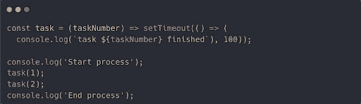

# NodeJS 线程和事件循环

> 原文：<https://levelup.gitconnected.com/nodejs-threads-and-the-event-loop-5f39011d964b>

## 使用 Libuv 的单线程与多线程和事件循环

NodeJS 是 web 开发中使用最多的技术之一，但互联网上有一些误导性的说法。人们常说 NodeJS 是一个异步单线程运行时，但它也被称为多线程，那么哪种说法是正确的？嗯，看情况。

众所周知，Javascript 是一种单线程编程语言，这可能会导致人们相信第一种说法在经验上是正确的。

本文将首先深入什么是异步和线程，然后通过深入分析来探索 NodeJS 的事件循环。

# 同步与异步语言

根据《牛津英语词典》，synchronous 的意思是“同时发生或存在”。

让我们首先记住 Javascript 的本质是同步的。它一次只能做一件事，尽管它能够使用计时器和事件来推迟事件循环中的操作。这意味着它可以等到任务完成后才得到结果，并避免阻塞它唯一的线程。

使用计时器，特别是 *setTimeout* ，可以很容易地说明这种行为。让我们看一个同步代码的例子:

*图 1:同步任务代码片段*

这段代码运行两个任务，并将进程的开始、每个任务的结束和进程的结束打印到控制台。打印结果将是:

*图 2:同步控制台输出*

下面是一个异步代码的例子:

*图 3:异步任务代码片段*

它可能看起来没什么变化，但是看看这个函数。现在它返回一个 *setTimeout* ，这将把 *console.log* 语句的执行延迟**至少**100 毫秒。

我们将很快解释为什么至少是**而不是 100 毫秒。**

让我们看看控制台上会显示什么:

*图 4:异步控制台输出*

令人惊讶？不完全是。这是动态的 Javascript。现在返回 setTimeout 的函数在“End process”日志语句之后运行。这是怎么回事？一旦评估了对的调用，执行就被排队到事件循环中，并且只有在 100 毫秒后结果就绪时才被执行。

这种推迟代码执行的能力对 Javascript 至关重要；因为它只有一个线程，所以它不能因为一些结果不可用或者一些异步操作没有结束而阻塞整个进程。

# 单线程与多线程

进程是由一个或多个线程执行的程序的实例。它有自己的内存空间、文件、调用堆栈、寄存器和计数器。它可以被描绘成:

*图 5:工艺概述和主要部件*

默认情况下，进程将是单线程应用程序。因此，程序只有一个内存空间、一个寄存器队列、一个调用堆栈和一个计数器队列。

为了更快地处理事情，可以产生不同的进程来执行一项任务，这被称为多处理:

*图 6:多重处理*

这样，一个任务可以同时执行两次。同样的任务运行两次可能没什么意义，但是想象一下需要计算两个散列。当它们可以同时计算时，为什么要等一个完成呢？

视情况而定，还有更好的办法。在多线程进程中，所有线程将共享内存空间或堆，但它们将拥有自己的寄存器、堆栈和计数器，允许并行处理，但共享相同的应用数据，如图*图 7:多线程进程*所示，这使得线程之间的通信非常快，而不是多个进程必须使用专用机制来共享数据。

*图 7:多线程进程*

NodeJS 中线程的使用由运行时环境管理(也由开发人员通过 *worker threads* )并使其对 I/O、网络和其他耗时任务更有效。它可以用“加密”库和一些散列函数来说明。

实验场景由一个循环组成，该循环将从“crypto”模块运行两次同步散列函数。然后，将针对相同的任务重复该实验，但是这次异步运行。

时间的测量，虽然没有在代码中表示出来，但是已经用 [*process.hrtime*](https://nodejs.org/api/process.html#processhrtimebigint) 完成了。这些图形是用 Octave 得到的。

# 单线程(和同步功能)

*图 8:单线程同步哈希函数调用*

对该过程进行计时会产生以下结果:

*图 9:单线程同步时间结果*

由于该程序使用的是的同步版本，NodeJS 会阻止执行，直到每次调用该函数返回。值得注意的是，第二个任务(迭代 2)是在第一个任务完成后立即开始的，用了大约相同的时间来完成。这里没什么可看的，只是正常的、连续的、有序的状态。

让我们看看如果程序使用异步版本会发生什么。

# 多线程(和异步功能)

*图 10:多线程异步散列函数调用*

下面我们可以看到相应的时间结果:

*图 11:多线程异步散列时间结果*

由于程序执行异步调用，NodeJS 不需要在每次调用时阻塞，可以并行处理两个任务。这是一个相当大的改进，执行相同工作的时间减少了一半。这是因为 NodeJS 使用了第二个线程来运行第二个任务。这不仅适用于 NodeJS，也适用于任何能够使用线程的语言，唯一的区别是这里没有任何线程处理代码，Node 是在幕后自己处理的。

NodeJS 为它的许多标准库函数提供了同步和异步函数，使用这两种函数会改变线程方面的行为。默认情况下，它总是试图通过使用多线程来提高性能，因此强烈建议尽可能使用异步函数。

# 事件循环

那么 NodeJS 如何利用这些概念并实现它们呢？更重要的是，为什么？

NodeJS 被认为是普通 web 服务器的替代方案，开发它是为了在不同的线程或其他类型的上下文切换中处理每个请求，从硬件资源的角度来看，这是非常昂贵的。正如 NodeJS 创建者 Ryan Dahl 在 runtime 的演示中所说的那样:“实现并发的正确方法不是对每个连接都使用线程，而是拥有一个线程和一个事件循环，这样你就可以完成一些事情。[……]但这要求你做的事情永远不要花太长时间。”这似乎是一个简单的想法，但它永远改变了 web 开发的进程。Dahl 的动机是通过使用一个单线程环境来创建一个高效的运行时，该环境将多线程的使用抽象为阻塞操作。

值得注意的是，NodeJS 是用 Javascript 编写的，但是是在 C 之上，C 为运行时提供了速度和 OS 通信层。大约三分之一的代码是用 c 编写的，这是其组件的顶级表示:

*图 12: NodeJS 组件概述*

这里的概念是:

*   节点绑定是 C 语言编写的模块，用于与较低级别的库(如 libuv 和 V8 引擎)进行交互。
*   [谷歌的 V8](https://v8.dev/docs) 是用 C++和 Javascript 编写的高性能引擎，Node 在其上运行，提供内存分配和垃圾收集等功能。
*   Libuv 是一个用 C 编写的库，最初是为了支持 NodeJS，但是现在被其他工具和语言使用。它创建了一个与内核交互的层，实现了如下特性:“‘句柄’和‘流’为套接字和其他实体提供了高级抽象；此外，还提供了跨平台文件 I/O 和线程功能”。

现在已经描述了组件，让我们更深入地了解一下底层组件及其工作原理。

Libuv 包含 NodeJS 的两个核心组件:事件队列和线程池。任务被推送到事件队列，并根据其性质按一定的顺序进行处理。线程池是处理线程的组件，线程将被 libuv 使用，使用回调来委托阻塞任务的执行，并在它们完成时获得结果。让我们来看一个图形表示:

*图 13: Libuv 和事件循环概述*

在这里，代码语句被按节点推入事件队列。然后，事件循环遍历该队列，并决定应该执行哪些任务。当某个操作阻塞 I/O 时，事件循环在上下文线程中执行它。这是一个非常简单的推理，其中包含了结构化和有序的后续步骤。

如上所述， [NodeJS 事件循环](https://nodejs.org/en/docs/guides/event-loop-timers-and-nexttick/)，顾名思义，是一个无限期运行直到程序结束或退出的事件循环。事件，基本上是关于做什么的指令，被推入一个队列，以严格的方式进行评估。但是，它是如何处理计时器、推迟操作或者能够为阻塞操作生成线程的呢？让我们来看看事件循环阶段的图形表示:

*图 14: NodeJS 事件循环阶段*

这里的每个框代表一个阶段(基本上是一个队列)，它将包含该特定步骤的所有由节点标记的操作。让我们来看看这些阶段:

1.  **定时器**:该阶段执行 *setTimeout()* 和 *setInterval()* 调度的回调。
2.  **待定回调**:执行推迟到下一次循环迭代的 I/O 回调。
3.  **闲置，准备**:仅供内部使用。
4.  **轮询**:检索新的 I/O 事件；执行与 I/O 相关的回调(除了关闭回调、由定时器调度的回调和 setImmediate())之外的几乎所有回调；节点将在适当的时候阻塞这里。
5.  **检查** : *setImmediate()* 回调在这里被调用。
6.  **关闭回调**:一些关闭回调，比如 *socket.on('close '，…)* 。

这些步骤的详细描述可在 [NodeJS 事件循环文件](https://nodejs.org/en/docs/guides/event-loop-timers-and-nexttick/#phases-in-detail)中找到。

这还不是全部，因为还有一层事件队列。这个图中缺少了一个部分:下一个*节拍*和*承诺*队列，也称为**微任务队列**。此队列不直接属于事件循环。更详细的讨论可能需要一篇完全独立的文章，但是这里有一些关于 nextTick() 的信息。基本上，它是一个双队列，优先于事件循环中的其他阶段，将在每个阶段之后处理；将*下一个 Ticks* 优先于*承诺*。

与**微任务队列**相反，由事件循环本身推送和迭代指令的事件队列可以被称为**宏任务队列(或图 13: Libuv 和事件循环概述中描述的事件队列)**。

最后，在执行代码时，NodeJS 有两个队列:微任务队列**和宏任务队列**。每个语句都将作为一个事件被推送到一个或另一个中，这再次取决于它的性质。

*图 15:微观和宏观任务队列概述*

所有这些可能不是很直观，但是有没有比用例子更好的方法来理解事物的功能呢？让我们创建一个利用所有这些概念(定时器、阻塞 I/O、关闭回调等)的程序。)来理解事件循环的事情顺序。

这变得有点技术性，尽管不值得对所有函数进行详细说明，这里是对 setTimeout、setImmediate 和 setInterval 计时器的一些[解释。](https://nodejs.org/en/docs/guides/event-loop-timers-and-nexttick/#setimmediate-vs-settimeout)

该程序的输出将是:

*图 16: NodeJS 事件循环解释片段*

看到输出顺序与陈述出现的顺序不匹配了吗？这是因为语句是在事件循环的不同阶段处理的。我们来详细看看发生了什么。该程序的执行按以下方式发展:

*图 17: NodeJS 事件循环解释控制台输出*

看到输出顺序与陈述出现的顺序不匹配了吗？这是因为语句是在事件循环的不同阶段处理的。

我们来详细看看发生了什么。该程序的执行按以下方式发展:

1.  所有同步调用都执行，所以**“开始”和“结束”被打印到控制台**。然后，所有其他语句都按照上面给出的事件循环图进行调度。这将用相应的语句填充每个步骤的队列。I/O 调用( *crypto.pbkdf2* )将进入*轮询* *队列*， *nextTicks* 和*承诺*进入*微任务队列*和*退出回调*进入*关闭回调队列。*
2.  现在所有的事件都被推入它们的队列，事件循环运行它的第一次迭代。首先，它检查*定时器队列*，但是它仍然是空的，所以它移动到下一个阶段:微任务*队列。这个队列包含两个*下一个滴答*和两个*承诺*。如前所述，因为*微任务队列*在每个阶段之后运行，并且*滴答*具有高优先级，所以它们将首先执行，然后是承诺。因此，它将首先**打印下一个记号，然后是承诺结果**。*
3.  事件循环移动到 I/O 或*轮询*阶段，并调度 *crypto.pbkdf2* 回调。
4.  加密操作完成并发出一个事件，该事件将其回调推入*微任务* *队列*。循环继续，但是所有后续阶段的队列都是空的(除了*关闭回调*，它正在监听退出事件并且还没有准备好 *)* 。
5.  预定的加密回调在*微任务队列*中，它被执行，评估内部语句并将它们推入它们的队列。 *setTimeout* 进入*定时器队列*和 *setImmediate* 将进入*检查队列*，而 *nextTick* 和 *Promise* 进入*微任务队列*。它将执行同步操作**打印“文件读取”**并继续以下阶段。
6.  在*微任务队列*中有新的任务，因此它们将被执行，并且**按顺序打印“第二个下一滴答回调已执行”、“第二个承诺已解决”**。
7.  事件循环前进到下一阶段，即*检查阶段*，在该阶段执行所有立即回调。**“立即执行回调”将被打印**到控制台。
8.  现在**第二次迭代**开始运行第一阶段并处理*定时器队列*，因此**“执行超时回调”将被记录**。
9.  在*关闭回调*阶段之前，阶段队列中没有任何其他元素，该阶段将执行*退出*回调和**打印“流程以代码 0 退出”**。

事件循环可以在这个沙盒中交互体验[。](https://replit.com/@victorigualada/NodeJS-Event-Loop#index.js)

这个例子取自并改编自 [zeroabsolute](https://github.com/zeroabsolute/Node-Internals) 的 GitHub。还有其他很好的例子来理解 NodeJS 的内部工作方式。去看看！

# 结论和最终想法

通过异步和多线程的不同机制，NodeJS 实现了对 Web 服务器更有效的资源管理。它现在被广泛用于绝大多数新的实现，甚至在 web 平台之外，提供了一个简单的入门级别、一个快速的编程环境、来自开发人员的抽象流和线程。

还有一个未涉及的话题。程序员如何随心所欲地利用多线程？通过[工作线程](https://nodejs.org/api/worker_threads.html)的方式，该过程将是一篇独立的技术文章。

如果您对本文有任何疑问，或者需要更多相关信息，请联系[联系](https://www.zartis.com/contact)！

—

## 参考

*   [NodeJS 事件循环](https://nodejs.org/en/docs/guides/event-loop-timers-and-nexttick)
*   [了解*setin mediate*](https://nodejs.dev/es/learn/understanding-setimmediate/)
*   [不要阻塞事件循环](https://nodejs.org/en/docs/guides/dont-block-the-event-loop/)
*   [瑞安·达尔:NodeJS 简介](https://www.youtube.com/watch?v=M-sc73Y-zQA)
*   [Ryan Dahl:原始 Node.js 演示文稿](https://www.youtube.com/watch?v=ztspvPYybIY)
*   [Libuv 文档](http://docs.libuv.org/en/v1.x/design.html)
*   [节点-堆内构件 Github 报告](https://github.com/zeroabsolute/Node-Internals)

**——**

## 作者:

Víctor Igualada Calatrava 是一名专注于后端开发和 DevOps 的软件工程师。他对自动化和结构充满热情，他喜欢学习新事物的所有细节。Víctor 目前正在与 NodeJS 和 key-store 合作，生产通过 CircleCI、Terraform 和 SaltState 交付的高频、低延迟系统。

# 分级编码

感谢您成为我们社区的一员！在你离开之前:

*   👏为故事鼓掌，跟着作者走👉
*   📰查看[级编码出版物](https://levelup.gitconnected.com/?utm_source=pub&utm_medium=post)中的更多内容
*   🔔关注我们:[推特](https://twitter.com/gitconnected) | [LinkedIn](https://www.linkedin.com/company/gitconnected) | [时事通讯](https://newsletter.levelup.dev)

🚀👉 [**加入升级人才集体，找到一份惊艳的工作**](https://jobs.levelup.dev/talent/welcome?referral=true)