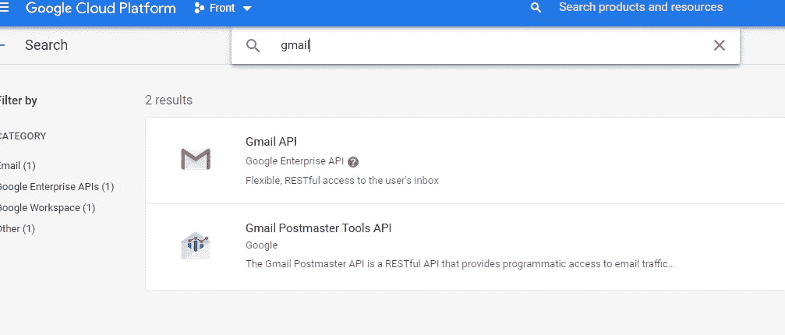
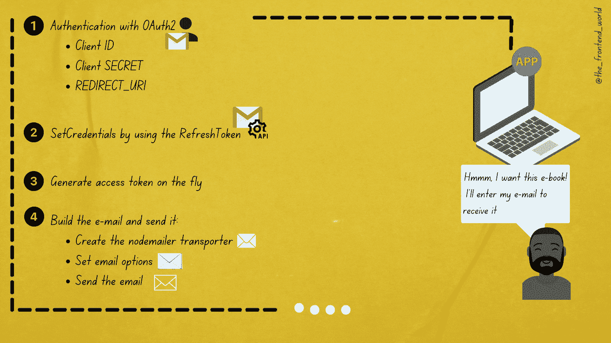

# 带有 Gmail 的 Nodemailer 无法工作？

> 原文：<https://levelup.gitconnected.com/nodemailer-with-gmail-not-working-4ed254258ac>

## 了解其工作原理第一部分:如何在 Gmail 中使用 Nodemailer？…

作者:FAM

您是否正在寻找一种在 Node js 应用程序中发送电子邮件的方法？你已经开始做这件事了吗？别担心，这篇文章会让你成功地发送你的第一封邮件！

因为安全问题，这有点复杂。所以让我澄清一下关于通过 Nodemailer 发送电子邮件的所有事情！

## 要求

*   Nodemailer 用于 NodeJS apps，所以你需要[**安装它**](https://nodejs.org/en/download/) 。
*   Nodemailer 帮你轻松的为你的 node app 发邮件，像做蛋糕一样。所以，当然，我们需要[用 NPM 或纱线安装](https://www.npmjs.com/package/nodemailer)才能使用它。
*   为 Gmail 安装[Google API](https://www.npmjs.com/package/googleapis)。

有两种使用 nodemailer 的方法:

*   简单快捷的方法。
*   OAuth2 认证的安全方式。专业的方式。

# 简单快捷的方法

这种方式很快，但需要在您发送电子邮件的邮件帐户中激活不安全模式:

*   [http://www.google.com/accounts/DisplayUnlockCaptcha](http://www.google.com/accounts/DisplayUnlockCaptcha)
*   [https://www.google.com/settings/security/lesssecureapps](https://www.google.com/settings/security/lesssecureapps)

但是正如您所看到的，这个解决方案并不是最优的。安全问题不是闹着玩的。这是我们在 It 界不能忽视的话题之一。

在某些情况下，您可能希望以这种方式使用它，因此这里有一篇文章向您展示了您需要遵循的步骤。

 [## 如何配合 Gmail 使用 Nodemailer 发送邮件？

### 设置 Nodemailer 并开始发送电子邮件的步骤

medium.com](https://medium.com/geekculture/how-to-use-nodemailer-with-gmail-to-send-e-mails-7198e707025d) 

# OAuth2 认证的安全方式

***/！\ —如果您已经理解了它是如何工作的，并且想要立即跳到代码，请随意这样做。***

这种安全的方式将使您通过不激活低安全模式来保护您的电子邮件帐户，并通过验证您的 web 应用程序来使事情变得正确，因此除了您的应用程序之外，没有其他人有权通过您的电子邮件帐户发送电子邮件。

## 让我们先简单介绍一下 OAuth2

> OAuth 2.0 授权框架**是一种协议，允许用户授权第三方网站或应用程序访问用户的受保护资源**，而不必暴露他们的长期凭证甚至身份。

简单来说:

> *OAuth2 是在两个服务之间进行通信的授权(例如您的应用程序和电子邮件服务(如 Gmail、Outlook 等)*

如果没有有效的身份验证，会发生以下情况:

作者:FAM

现在，OAuth2 协议或框架出现了！

它是这样工作的:

作者:FAM

让我们一步步分析这里发生了什么:

# 1-通过 OAuth2 进行身份验证(上面 gif 中的步骤 4)

## 创建一个项目

您需要创建一个项目来在 Google 控制台云上使用 OAuth。

*   前往[https://console.cloud.google.com/](https://console.cloud.google.com/)
*   连接到 Gmail 帐户，您将从该帐户向您的用户发送电子邮件

因为我们想要发送电子邮件，我们需要的只是 Gmail API，所以我们需要添加到项目中来使用它:

*   在您的项目仪表盘上，点击***+启用 API 和服务。***

*   然后选择 Gmail API 后:

我们已经完成了项目设置。我们现在需要创建应用凭据。

## b-生成凭证

***/！\-如果您已经为您的应用程序生成了凭据，请跳过此步骤！***

这一步很重要。当你通过邮箱发送电子邮件时，首先要进行身份验证:输入你的电子邮件和密码。在这一步中，我们不想注册并以纯文本形式传递我们的密码。那一点也不安全。

> 为了避免使用纯文本的真实密码，我们需要为需要访问所需资源的应用程序生成凭据(客户端 id 和客户端密码)。

凭据不是用来访问我们所有的电子邮件、联系人等。不，我们只需要有限访问的凭证，在这种情况下，我们的应用程序通过它向用户发送电子邮件。

如果您尚未生成应用 OAuth 凭据，请遵循以下步骤:

 [## 我如何获得 OAuth 证书？

### 获取 Google Oauth2 客户端 ID 的步骤？

medium.com](https://medium.com/geekculture/how-do-i-get-an-oauth-credential-35d6d0e5d617) 

# 2-发送您的精彩电子邮件

## 它是怎么工作的？

现在我们有了权利和授权，我们可以享受看到我们的用户收到他们想要的电子书。

好的，我们的朋友**节点邮件**是如何工作的？

这很简单，我们只需要:

*   电子邮件信封:使用传输机制(SMTP 等)创建 Transporter。)
*   邮件正文:设置邮件选项
*   发送电子邮件

当然，第一部分是至关重要的，在这个过程中需要用到它:

用 nodemailer 和 Gmail API 发送邮件的全过程

## b-行动时间，让我们编码

下面是使用 nodemailer 构建电子邮件的下一步。下面是编码部分:

 [## 如何用 Nodemailer 和 OAuth2 发送 Gmail 邮件？

### 使用 Node.js、OAuth2 和 nodemailer 的编码部分

javascript.plainenglish.io](https://javascript.plainenglish.io/sending-emails-with-nodemailer-with-gmail-and-oauth2-e0b609587b7a) 

*我希望这是清楚而有用的。请鼓掌支持我，并分享你的反馈，❤*

## 有用的资源:

*   [https://community.nodemailer.com/2-0-0-beta/using-oauth2/](https://community.nodemailer.com/2-0-0-beta/using-oauth2/)
*   [https://developers . Google . com/identity/protocols/oauth 2/JavaScript-implicit-flow](https://developers.google.com/identity/protocols/oauth2/javascript-implicit-flow)

## 感谢您宝贵的时间，希望这对您有用！

亲爱的读者，我希望这是明确和有用的。我希望你无论在哪里都是安全的，你的家人也是！坚持住。明天会更好！

**让我们在** [**上取得联系**](https://medium.com/@famzil/)**[**Linkedin**](https://www.linkedin.com/in/fatima-amzil-9031ba95/)**[**脸书**](https://www.facebook.com/The-Front-End-World)**[**insta gram**](https://www.instagram.com/the_frontend_world/)**[**Youtube**](https://www.youtube.com/channel/UCaxr-f9r6P1u7Y7SKFHi12g)**或**********

****[www.fam-front.com](http://www.fam-front.com/)****