# 打字稿中的名义打字

> 原文：<https://levelup.gitconnected.com/nominal-typing-in-typescript-c712e7116006>

## 在结构类型系统中定义标称类型

照片由 [Rodion Kutsaev](https://unsplash.com/@frostroomhead?utm_source=unsplash&utm_medium=referral&utm_content=creditCopyText) 在 [Unsplash](https://unsplash.com/?utm_source=unsplash&utm_medium=referral&utm_content=creditCopyText) 上拍摄

# 名词和结构类型

类型系统通常分为结构系统和名义系统。像 Java 和 Scala 这样的语言主要有名义类型系统，而像 Typescript 这样的语言有结构类型系统。让我们简单看一下这两个系统。

## 名义打字

在名义类型系统中，使用类型的名称来检查类型兼容性。如果他们没有相同的名字，那么他们是不兼容的，故事结束。**如果** Typescript 有一个标称的类型系统，那么最后一行的类型检查就会失败:

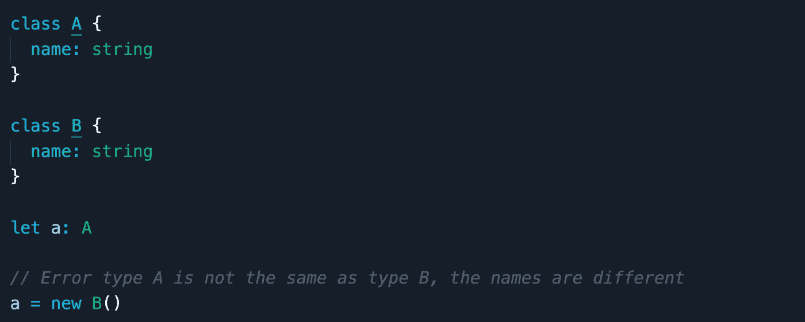

## 结构分型

Typescript 使用结构类型来确定两种类型是否相互兼容。我们所说的结构类型是什么意思？好吧，让我们考虑下面的代码片段:

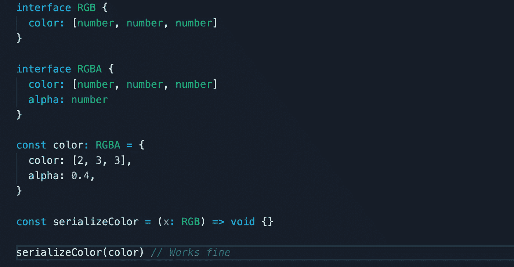

为了确定常量`color` ( `RGBA`)的类型是否与`serializeColor`的参数`x` ( `RGB`)的类型兼容，类型系统必须验证`RGB`的每个成员在`RGBA`中都有对应的兼容成员。在这种情况下，`RGB`只有一个成员`color`，而`RGBA`有一个对应的相同类型的成员— `[number, number, number]` —因此它通过了类型检查。注意类型系统是如何忽略存在于`RGBA` (alpha)上的额外成员的。

# TS 中的标称类型

即使 Typescript 有一个主要的结构化类型系统，如果我们在定义类型时遵循一个标准模式，我们仍然可以实现某种形式的名义类型，这样类型系统将始终把它们视为不同的类型。该结构将充当该类型的唯一标识符和描述符。这样的实现可能看起来像这样:

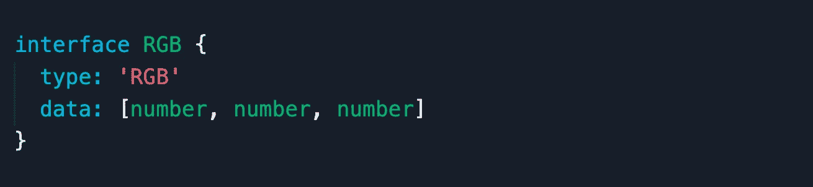

`type`成员表示类型的名称，而`data`成员描述其数据类型。现在，如果我要创建一个类型为`RGB`的值，我必须按照下面的方式来做:

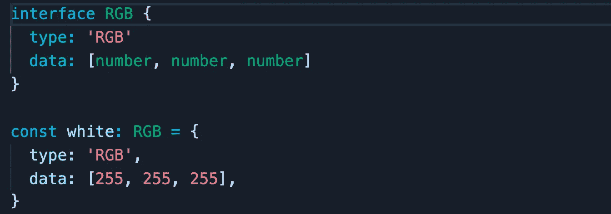

当然，为每一个名义类型的值编写这样的结构将是一项单调乏味的工作。这就是**值构造函数**的作用。值构造函数是一个函数，它有助于构造特定类型的值，而没有所有的样板文件和干扰。让我们为`RGB`创建一个:

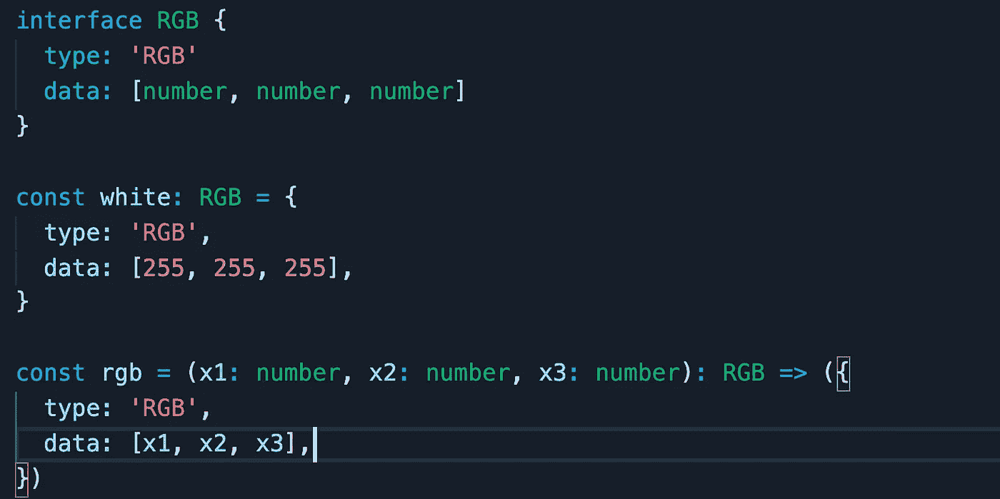

现在我们可以用更少的代码创建一个类型为`RGB`的值:

现在我们已经介绍了值构造函数，让我们在我们的名义类型接口中加入一个:

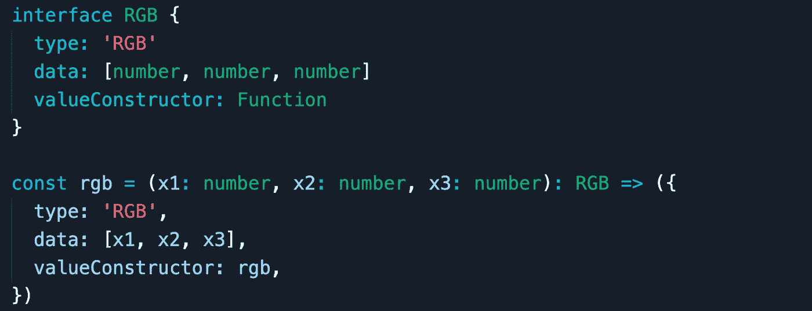

乍一看，你可能有点不确定`valueConstructor`成员给类型系统带来了什么价值，但是它确实有两个用途:

*   与`type`和`data`一起，他们展示了一个类型的完整描述:类型的名称，数据的形状，以及如何构造它。
*   当我们讨论子类型时，我们将会看到，你可以基于值构造函数建立类型保护。

但是在继续讨论子类型之前，我们可以对我们的名义类型接口进行一点改进。由于我们所有的名义类型共享相同的属性，我们可以将它们抽象到一个通用的`NominalType`接口中，如下所示:

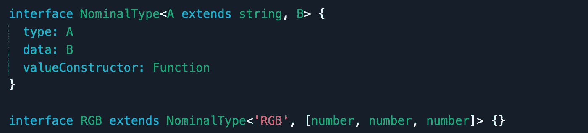

我想分享的一个技巧是，如果您要在将要发布的包中实现名义类型，比如在 npm 上，可以在您的接口中添加一定级别的作用域，以避免与其他库发生冲突，您可以这样做:

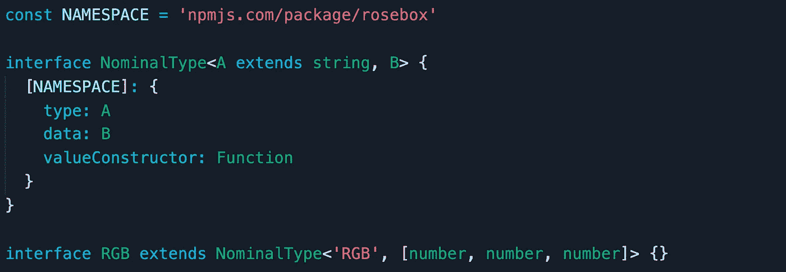

# TS 中的标称子类型

在对类型-子类型关系建模时，我遵循了一些模式，这取决于几个因素，包括但不限于:

*   VS 的代码工具提示如何表示这种类型——有时，当使用`type`关键字时，工具提示会跳过类型的层次结构，所以我可能会使用`interface`关键字而不是`type`来解决这个问题。
*   我需要这种类型仅仅是为了消除一遍又一遍地写同一个标记联合的重复吗？我是否暴露了比父类型更多的操作子类型的函数？

第一种模式是将类型本身建模为联合类型，将其子类型建模为独立的名义类型。假设我们想要实现一个颜色类型；现在，颜色的“类型”有很多，hex，rgb，rgba，hsl，hsla，颜色名等等。

为了简单起见，我们将只支持两种类型的颜色: **rgb** 和 **rgba** 。我们可以通过以下方式对此建模:

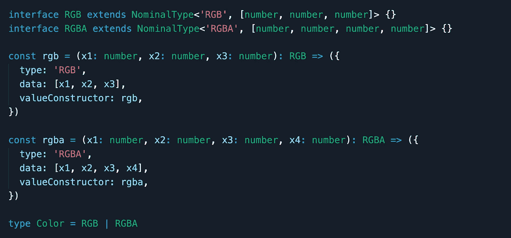

对于这种模式，我们可以根据类型的名称创建类型保护，如下所示:

另一种模式是使用带有类型参数的通用接口来指定子类型，如下所示:

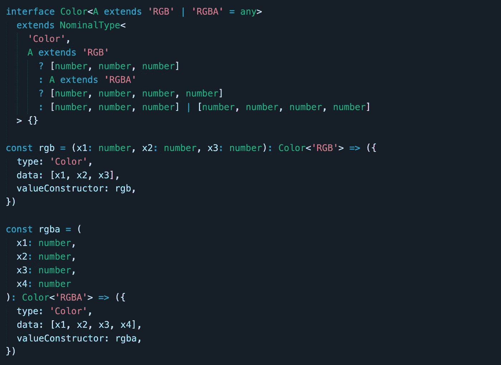

这里，我们用`Color<'RGB'>`和`Color<'RGBA'>`分别表示子类型`RGB`和`RGBA`，用不带类型参数的`Color`接受两者。使用这种模式，我们可以基于`valueConstructor`而不是`name`的值实现类型保护

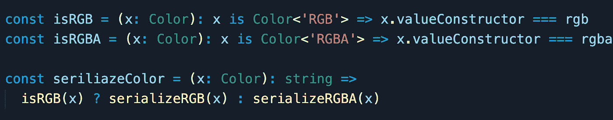

感谢阅读。我希望这有所帮助。如果你有任何想法或问题，请随时留下评论，它可能总是会教一些新的东西:)

> 如果它没有意义，继续重塑它，直到它有意义