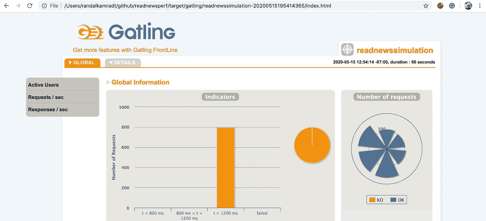
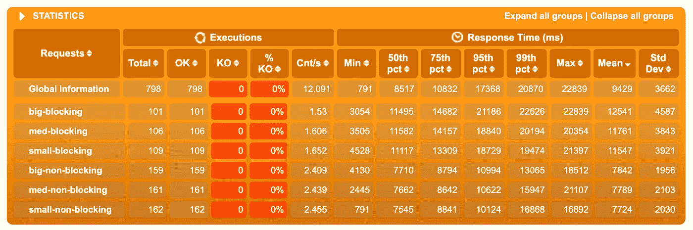
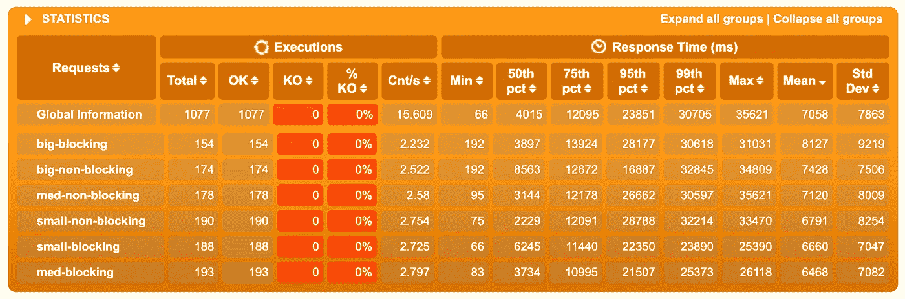
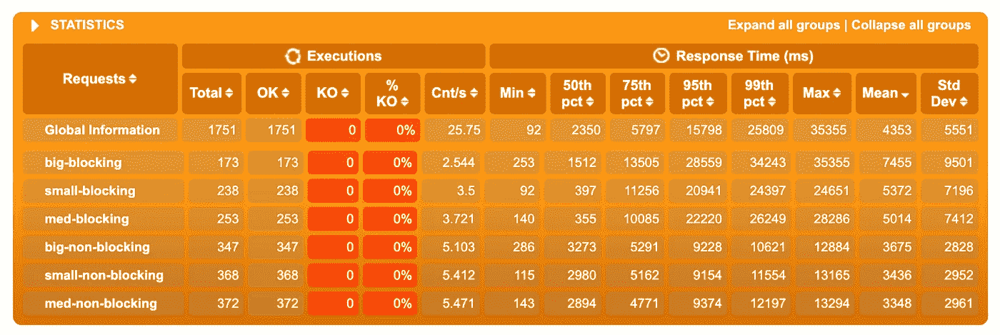
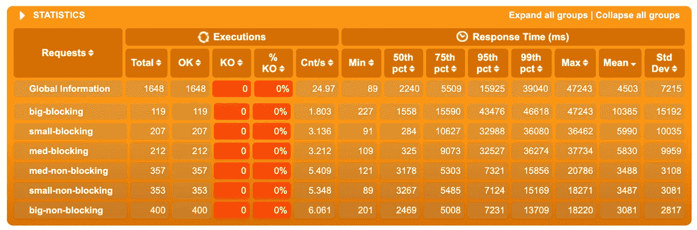
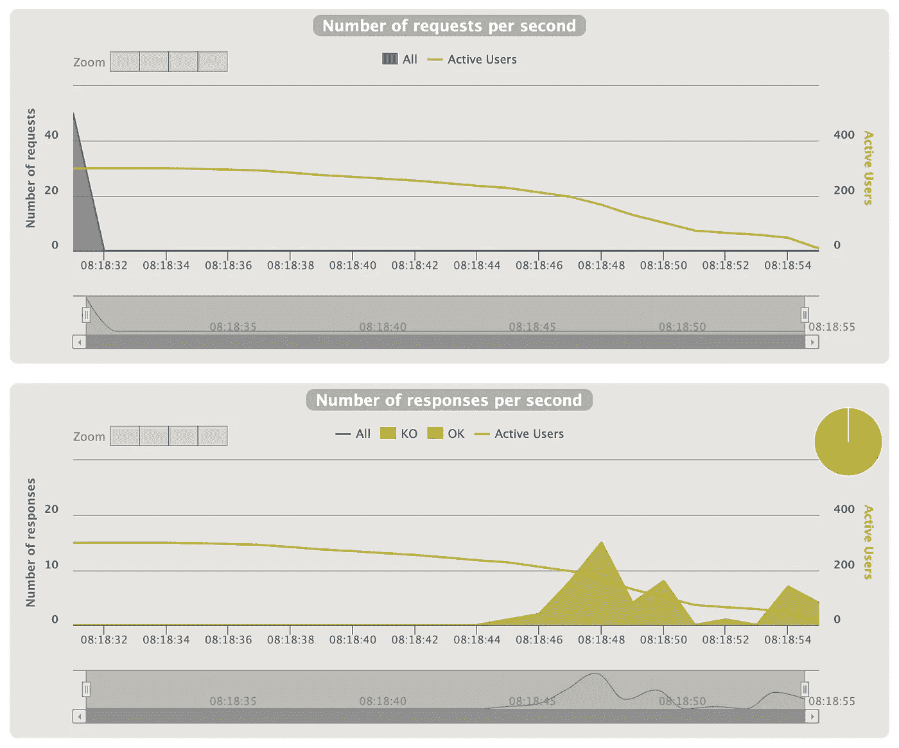
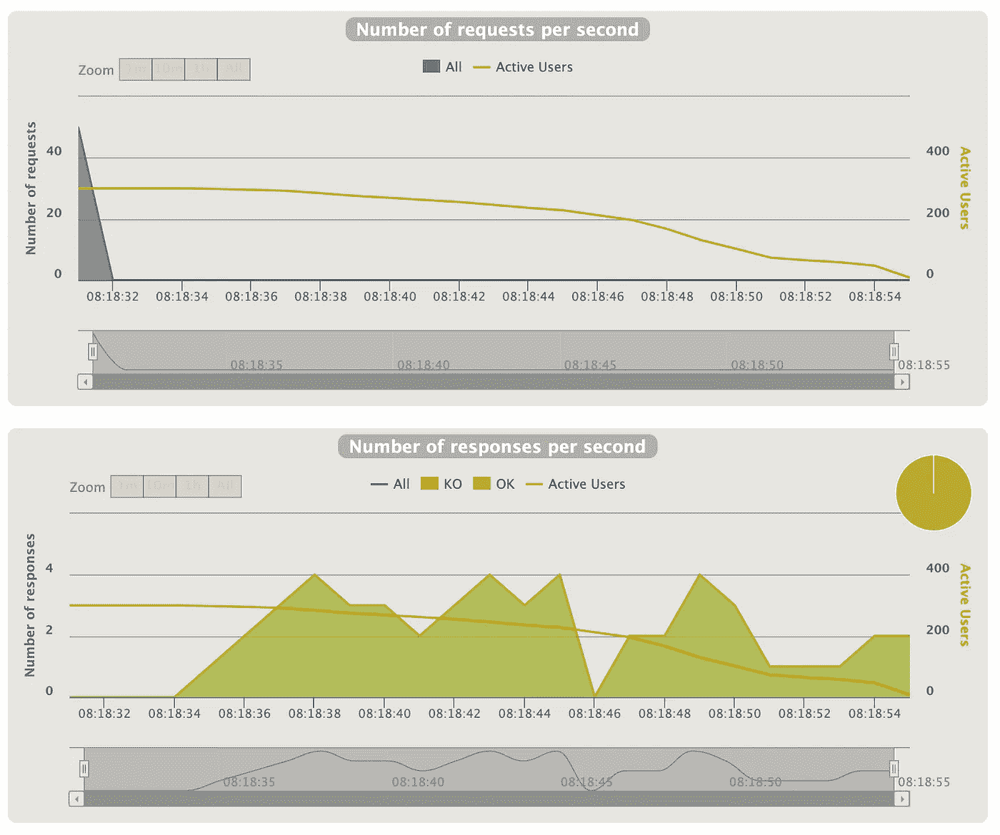

# 非阻塞 Java——超越宣传

> 原文：<https://levelup.gitconnected.com/non-blocking-java-beyond-the-hype-dfdc405848d7>

## 集装箱化世界中阻塞与非阻塞的比较


图片由来自 [Pixabay](https://pixabay.com/?utm_source=link-attribution&utm_medium=referral&utm_campaign=image&utm_content=567950) 的[瑞恩·麦奎尔](https://pixabay.com/users/RyanMcGuire-123690/?utm_source=link-attribution&utm_medium=referral&utm_campaign=image&utm_content=567950)拍摄

本月早些时候，我写了一篇名为[如何使用 Kubernetes Cron Jobs 定期阅读新闻](/how-to-use-kubernetes-cron-jobs-to-periodically-read-the-news-8b3b4513f8b7)的文章。在其中，我创建了两个微服务:一个定期读取新闻 API 并将其存储在数据库中，另一个读取数据库并返回存储的新闻。读取数据库的微服务是用 Java 完成的，我用的是 WebFlux，这是 Spring Boot 的反应式 web 服务。

我使用 WebFlux 是因为我越来越欣赏它所呈现的流畅 API 的优雅。它迫使我在转换和过滤器方面进行思考，类似于 Java 8 刚问世时 Java 流库如何影响我的编码风格。现在，即使是一个`List`对我来说也太具体了，我希望一切都是一个`Flux`。

我不打算写 WebFlux 或者它所基于的 [projectreactor.io](https://projectreactor.io/) 的教程。外面有很多好的教程；也许有一天我会写一些关于它的东西。我真正好奇的是对性能的要求，尽管我过去使用过 WebFlux，但我从未有机会将其与传统的 Spring 服务进行比较。

因此，对于本文，我将制作一个新的微服务，它与旧的微服务相同，只是它使用了老派的 Spring。然后，我将使用 [Gatling](https://gatling.io/) 创建一些性能测试，并运行反应式和非反应式测试，看看我会得出什么结果。最后，由于微服务是在 Kubernetes 上运行的，我将对它们进行扩展，看看这对性能有什么影响。

这篇文章的所有代码和脚本都可以在我的 GitHub 页面上找到，你可以在最后找到链接。为了跟上本文，你应该熟悉 Java、Scala 和一般的编程。您还应该可以访问 Kubernetes 集群，例如我在 [Kubernetes 中从头开始构建的集群](https://medium.com/better-programming/kubernetes-from-scratch-4691283e3995)，以及我在上面提到的[中构建的微服务系统如何使用 Kubernetes Cron 作业来定期阅读新闻](/how-to-use-kubernetes-cron-jobs-to-periodically-read-the-news-8b3b4513f8b7)。

首先，我从 GitHub 存储库中取出原始的`[readnews](https://github.com/rkamradt/readnews/tree/v1.1)`代码，并制作了一个名为`[readnewsblock](https://github.com/rkamradt/readnewsblock/tree/v1.0)`的新 GitHub 存储库。然后我用非反应式的风格重新写了一遍。让我们看看反应式的 read 微服务的核心。

```
 @GetMapping(path="", produces = MediaType.TEXT_EVENT_STREAM_VALUE)
  Flux<Inserts.Articles> getFromMongo(
           final Instant from, 
           final Instant to, 
           final Long limit) {
    long actualLimit = limit == null 
           || limit == 0 
           || limit > MAX_LIMIT 
         ? MAX_LIMIT
         : limit;
    return newsReactiveRepository
          .findAll()
          .flatMap(r -> Flux.fromIterable(r.getArticles()))
          .filter(r -> filterByDate(r, from, to))
          .limitRequest(actualLimit);
  }
```

现在，让我们看看非反应式风格的同一段代码。

```
 @GetMapping(path="", produces = MediaType.APPLICATION_JSON_VALUE)
  List<Inserts.Articles> getFromMongo(
         final Instant from, 
         final Instant to, 
         final Long limit) {
    long actualLimit = limit == null 
           || limit == 0 
           || limit > MAX_LIMIT 
         ? MAX_LIMIT
         : limit;
    return newsRepository
          .findAll()
          .stream()
          .flatMap(r -> r.getArticles().stream())
          .filter(r -> filterByDate(r, from, to))
          .limit(actualLimit)
          .collect(Collectors.toList());
  }
```

风格其实很像。这是因为 projectreactor.io API 大量借用了 Java 流库的术语。把`Flux`换成`List`，实际上代码是一样的。我应该指出，这两个系统都不是非常有效的系统。它读取整个数据库并进行过滤。更好的选择是创建一个索引表，让数据库应用日期过滤器。但是我们在这里不是测试数据库，而是测试应用程序。有时您必须做出选择，这可能会导致使用暴力方法的代码。

不过，我可以马上发现非反应式代码中的其他低效之处。MongoDB 存储库的`findAll`方法返回一个列表，控制器方法`getFromMongo`也返回一个列表。这意味着返回的数据集必须在内存中保存两次，而反应式版本倾向于处理流中的项，可能永远不会一次在内存中保存多个项。不过，所谓的背压也有细微差别，反应式版本的最坏情况是所有项目同时保存在内存中。但这是被动反应的最坏情况，也是被动反应的唯一情况。代码的这一方面将通知我的测试，稍后您将会看到。

## 创建另一个 Kubernetes 服务。

我将使用我的新代码库，并从中创建一个映像。这是通过`mvn clean install jib:build`命令完成的。这将创建一个名为`readnewsblock`的图像，可以在 Kubernetes 描述文件中使用。我将添加一个新的`readnewsblock.yaml`到我的[部署新闻](https://github.com/rkamradt/news-deploy/tree/v1.1)库。以下是新服务的描述文件:

```
apiVersion: apps/v1
kind: Deployment
metadata:
  name: readnewsblock-deployment
  labels:
    app: readnewsblock
spec:
  selector:
    matchLabels:
      app: readnewsblock
  template:
    metadata:
      labels:
        app: readnewsblock
    spec:
      containers:
      - name: readnewsblock
        image: docker.io/rlkamradt/readnewsblock:latest
        ports:
        - containerPort: 8080
        env:
          - name: MONGO_USER
            valueFrom:
              secretKeyRef:
                name: mongo-secret
                key: username
          - name: MONGO_PASS
            valueFrom:
              secretKeyRef:
                name: mongo-secret
                key: password
          - name: MONGO_HOST
            value: mongodb-0.mongodb           
        livenessProbe:
          httpGet:
            path: /actuator/health
            port: 8080
          timeoutSeconds: 10
          initialDelaySeconds: 20
          periodSeconds: 10
---
apiVersion: v1
kind: Service
metadata:
  name: readnewsblock-service
spec:
  type: ClusterIP
  selector:
    app: readnewsblock
  ports:
  - port: 8080
    targetPort: 8080
```

这创建了一个`readnewsblock`微服务的部署，以及一个为其提供内部 IP 和端口的服务。我在这个服务和原始服务中添加了一个东西，那就是`livenessProbe`；这很容易添加，因为只要添加执行器依赖，Spring Boot 应用程序就会有健康端点。超时默认为 1 秒，但是我们的服务非常紧张，所以我们必须将超时设置为 10 秒，以允许偶尔的垃圾收集暂停。

接下来，我们需要为新服务添加一个入口点。我要用一个新的虚拟主机叫做`readnewsblock.local`。这是新的入口描述:

```
apiVersion: networking.k8s.io/v1beta1
kind: Ingress
metadata:
  name: readnews-ingress
  annotations:
    cert-manager.io/issuer: ca-issuer 
spec:
  rules:
  - host: readnews.local
    http:
      paths:
      - backend:
          serviceName: readnews-service
          servicePort: 8080
        path: /
  - host: readnewsblock.local
    http:
      paths:
      - backend:
          serviceName: readnewsblock-service
          servicePort: 8080
        path: /
  tls:
  - hosts:
    - readnewsblock.local
    secretName: readnewsblock-cert
  - hosts:
    - readnews.local
    secretName: readnews-cert
```

现在我们可以应用新的`readnewsblock.yaml`描述和更新的`vhost-ingress.yaml`描述:

```
kubectl apply -f readnewsblock.yaml
kubectl apply -f vhost-ingress.yaml
```

我还将向入口部署添加一些副本。添加副本相对容易，只需一个命令:

```
kubectl scale deployment ingress-nginx-controller --replicas=6 \
    -n ingress-nginx
```

在这种情况下，我的入口控制器被称为`ingress-nginx-controller`，它位于名称空间`ingress-nginx`中。注意，这种扩展是暂时的，下次部署入口控制器时，它将回到描述中的状态。

## 用加特林进行性能测试。

我将使用[加特林 3.3.0](https://gatling.io/) 并从他们的示例性能测试中复制到一个新的`[readnewsperf](https://github.com/rkamradt/readnewsperf/tree/v1.0)`存储库中。Gatling 测试是用 Scala 编写的，但是 DSL 的特性使得它相对容易。此外，我们不会做任何火箭科学，我把它留给我的日常工作。确保安装了`sbt`和`scala`；Mac 用户可以用`brew`，PC 用户可以借朋友的 Mac。

对于我的新加特林项目，我复制了[加特林 SBT 插件演示](https://github.com/gatling/gatling-sbt-plugin-demo)并修改了测试以达到我的终点。下面是基本的测试场景:

```
class ReadNewsSimulation extends Simulation {
  val httpConfBlocking = http
    .baseUrl("[https://readnewsblock.local](https://readnewsblock.local)")
    .acceptHeader("application/json") val httpConfNonBlocking = http
    .baseUrl("[https://readnews.local](https://readnews.local)")
    .acceptHeader("text/event-stream") def generateReadScenario(scenarioName: String,
                           requestName: String,
                           limit: Int):ScenarioBuilder = {
    scenario(scenarioName)
      .exec(http(requestName)
        .get(s"/v1/headlines?limit=${limit}&to=2021-01-01T00:00:00Z"))
  }
  val testTime = 60
  val users = 20 setUp(
     generateReadScenario(
       "BigNonBlocking",
       "big-non-blocking",
       1000).inject(
       constantConcurrentUsers(users)
           .during(testTime)).protocols(httpConfNonBlocking),
     generateReadScenario(
       "MedNonBlocking",
       "med-non-blocking",
       100).inject(
       constantConcurrentUsers(users)
           .during(testTime)).protocols(httpConfNonBlocking),
     generateReadScenario(
       "SmallNonBlocking",
       "small-non-blocking",
       1).inject(
       constantConcurrentUsers(users)
           .during(testTime)).protocols(httpConfNonBlocking),
     generateReadScenario(
       "BigBlocking",
       "big-blocking",
       1000).inject(
       constantConcurrentUsers(users)
           .during(testTime)).protocols(httpConfBlocking),
     generateReadScenario(
       "MedBlocking",
       "med-blocking",
       100).inject(
       constantConcurrentUsers(users)
           .during(testTime)).protocols(httpConfBlocking),
     generateReadScenario(
       "SmallBlocking",
       "small-blocking",
       1).inject(
       constantConcurrentUsers(users)
           .during(testTime)).protocols(httpConfBlocking)
   )
}
```

这首先创建了六个场景。对于阻塞和非阻塞，我分别针对 1 条记录、100 条记录和 1000 条记录使用了 read 服务。我将运行测试 60 秒，我将有 20 个并发用户。因为时间和用户数量是固定的，所以我们可以得到平均响应时间和服务能够响应的请求数量。有许多不同类型的时间/用户变化，我将让您来尝试它们。

我把它分成 1、100 和 1000 条记录，因为我想看看传统的 Java 对于必须在内存中创建列表会有什么反应。我的猜测是，1 条记录请求在阻塞和非阻塞之间的性能是一样的，1000 条记录将是最大的差异。

如果您对反应式 Java 的风格不感兴趣，但希望获得理论上的性能提升，那么 1 条记录和 1000 条记录处理之间的区别就很重要。如果您需要流过大量记录，而不需要一次或多次将它们都放在内存中，那么您只需要尝试 reactive Java。例如，如果您必须对记录进行排序，那么 reactive 可能不会为您带来任何性能提升，因为无论如何您都需要将它们一次全部存储到内存中。

但这都是理论上的，这篇文章的重点是看它在现实生活中是否发挥作用。

## 把这些放在一起。

有了在 Kubernetes 中运行的`readnews`和`readnewsblock`服务，以及分别将 [https://readnews.local](https://readnews.local) 和[https://read news block . local](https://readnewsblock.local)指向每个服务的入口服务，我们就可以运行测试了。请注意，我将在这个测试中使用的数据库是在我的文章[如何使用 Kubernetes Cron Jobs 定期读取新闻](/how-to-use-kubernetes-cron-jobs-to-periodically-read-the-news-8b3b4513f8b7)中创建的，这个 cronjob 已经运行了几个星期，填满了我的数据库。如果你想复制我的结果，你必须等待。但是现在，你可以在我的 [GitHub 库](https://github.com/rkamradt/readnewsperf/tree/v1.0)中找到测试。一旦你克隆了它们，你可以运行`sbt`来打开`sbt`外壳，然后运行`gatling:test`来运行测试。您应该会看到类似这样的内容:

```
Simulation net.kamradtfamily.readnewsperf.ReadNewsSimulation completed in 67 seconds
Parsing log file(s)...
Parsing log file(s) done
Generating reports...================================================================================
---- Global Information --------------------------------------------------------
> request count                                       1751 (OK=1751   KO=0     )
> min response time                                     92 (OK=92     KO=-     )
> max response time                                  35355 (OK=35355  KO=-     )
> mean response time                                  4353 (OK=4353   KO=-     )
> std deviation                                       5551 (OK=5551   KO=-     )
> response time 50th percentile                       2350 (OK=2350   KO=-     )
> response time 75th percentile                       5797 (OK=5797   KO=-     )
> response time 95th percentile                      15798 (OK=15798  KO=-     )
> response time 99th percentile                      25809 (OK=25809  KO=-     )
> mean requests/sec                                  25.75 (OK=25.75  KO=-     )
---- Response Time Distribution ------------------------------------------------
> t < 800 ms                                           644 ( 37%)
> 800 ms < t < 1200 ms                                  60 (  3%)
> t > 1200 ms                                         1047 ( 60%)
> failed                                                 0 (  0%)
================================================================================Reports generated in 0s.
Please open the following file: /Users/randalkamradt/github/readnewsperf/target/gatling/readnewssimulation-20200515200505568/index.html
[info] Simulation ReadNewsSimulation successful.
[info] Simulation(s) execution ended.
[success] Total time: 71 s (01:11), completed May 15, 2020, 1:06:14 PM
sbt:readnewsperf>
```

要查看输出文件，请在浏览器中为日志末尾引用的文件加上 file:///前缀。这应该会将您带到这个屏幕:



这不是很有趣，它只是告诉你，平均来说，你所有的请求都花了一秒多的时间来完成。向下滚动到下一个面板，查看更多有趣的结果



这向您展示了能够通过的请求数量，以及我们场景中六个元素的响应时间。我按平均反应时间排序。正如我所猜测的，大请求比小请求花费的时间长，阻塞比非阻塞花费的时间长。

这绝不是证明非阻塞比阻塞更具执行性的积极证据。你可以运行几次，看看有什么变化。我运行了几次，得到了不同但相似的结果。您还可以尝试调整测试，看看每个测试在不同环境下的表现。

让我们尝试另一件事，我们将扩大 Kubernetes 中的豆荚，看看它们的表现如何。运行以下命令:

```
kubectl scale deployments readnews-deployment --replicas=2
kubectl scale deployments readnewsblock-deployment --replicas=2
```

再次运行测试，看看你得到了什么。这是我得到的:



事情有点复杂，med-blocking 测试表现最好。在确保我已经正确地进行了缩放之后，我又运行了几次这个测试，并且得到了不同的结果。显然，阻塞比非阻塞对更多的豆荚反应更好。这可能是因为我们没有扩展 MongoDB，这对测试有更大的影响。

但是让我们把豆荚扩大到三个复制品。以下是我用三种方法得到的结果:



我们回到了性能更高的非阻塞测试，但是中型测试比小型测试运行得更好。真不敢相信这里是另一个运行:



这一次大无堵做得最好！

同样，由于这个程序的构造方式，所有的变化都必须贯穿整个数据集，只有返回的数据是不同的。有了额外的副本，返回数据的大小不会对整体性能产生太大影响，读取 MongoDB 是瓶颈。也许在我的下一篇文章中，我会尝试向外扩展 MongoDB。

另一件要考虑的事情是，反应式 Java 只使用几个线程，而不是传统的每个请求使用一个线程。我们可以测试这一点的方法是用`atOnceUsers`替换测试中的`constantConcurrentUsers`调用，这将一次命中系统，并查看处理每个请求需要多长时间。我尝试了一下，发现 reactive Java 能够在大约相同的时间内处理请求，并且能够更快地产生响应。在我的测试的六个实例中，每个实例都使用了 50 个用户，总共 300 个用户，所有用户都同时请求。以下是 med-blocking 测试的结果:



对于 med-非阻断试验:



其他规模的测试进行得也差不多。为了找到这些屏幕，您必须选择 details 选项卡，然后您可以单独选择每个测试来查看每个测试的详细统计信息。

目前，我很高兴反应式 Java 在大多数情况下肯定不比传统 Java 差，而且在许多情况下可能更好。因为我喜欢它提供的流畅的 API，这足以让我在所有的 Java 编程冒险中坚持使用它。我不得不做更多的测试来证明反应式 Java 确实更有性能，我也想找到它没有性能的情况，这样我就可以做出更明智的决定。

如果你真的能够跟随并让这个装置在家里工作，继续玩它，尝试优化事情。玩是最好的学习方式，这是一个很好的、简单的沙盒，可以在里面进行尝试。以下是所有代码和脚本的链接:

【https://github.com/rkamradt/readnewsperf/tree/v1.0 号

【https://github.com/rkamradt/news-deploy/tree/v1.1 

[https://github.com/rkamradt/readnewsblock/tree/v1.0](https://github.com/rkamradt/readnewsblock/tree/v1.0)

[https://github.com/rkamradt/readnews/tree/v1.1](https://github.com/rkamradt/readnews/tree/v1.1)