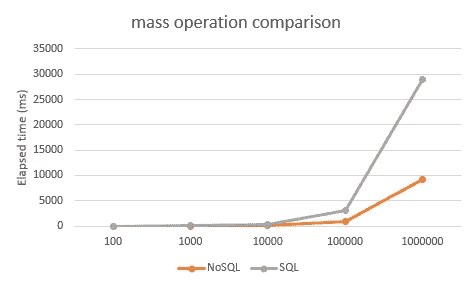
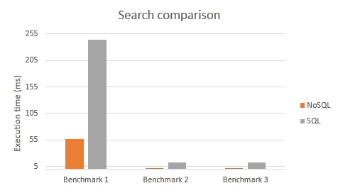
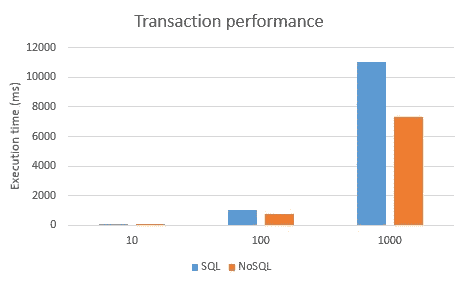
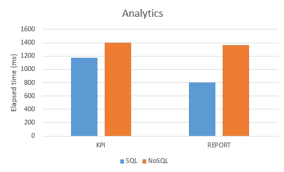

# NoSQL 到底是什么？

> 原文：<https://levelup.gitconnected.com/nosql-or-not-nosql-learn-when-you-should-use-it-45972c017e65>

## NoSQL 还是 NoSQL？了解为什么 NoSQL 数据库不是传统数据库的对手，并帮助您制作更好的软件。

近年来，我们见证了 NoSQL 的崛起，看到它被广泛应用。本文旨在对 SQL 和 NoSQL 技术进行客观的比较，并试图澄清一些不清楚的方面，以帮助人们明智地选择他们的后端。

# 我对 NoSQL 的态度

凡事都有时间，2014 年我开始使用 NoSQL。也许我迟到了，但在此之前我的项目需求完全由传统数据库满足，所以我没有被迫学习 NoSQL。

NoSQL 科技被神秘的气氛所包围。我第一次发现有一个开发人员称之为“NoSQL”的东西，他穿着一件印有“问我关于 MongoDB 的问题”的 t 恤。我当时没问。我被这个答案吓到了，我想象的又长又复杂。然后我看到了两个不同的方面:一方是 NoSQL 的大力支持者，讨厌旧的数据库，另一方是拒绝 NoSQL 所有好处的传统开发者。

就是在我意识到这种情况的时候，我才被说服去发现和学习。这让我想到了一个小项目，我将这两种解决方案与基准进行了比较，以展示 NoSQL 的所有优势和局限性。最后，我明白了 NoSQL 和 SQL 只是为不同项目设计的不同工具(即使在某些情况下你两者都需要)。五年后，我看不出文化差异被填补了。这就是为什么我刷新了这篇文章，删除了无聊的部分，我在这里重新发布。

照片由[法比奥](https://unsplash.com/@fabioha?utm_source=medium&utm_medium=referral)在 [Unsplash](https://unsplash.com?utm_source=medium&utm_medium=referral) 上拍摄

# 什么是 NoSQL

简而言之，NoSQL 是一种新的数据存储后端，它不遵循关系数据库模型。这意味着我们所说的“容器”的工作方式不同于传统的基于 SQL 的后端。

NoSQL 技术的诞生是为了满足传统数据库已经成熟时出现的一系列新需求。当然，近年来，应用程序需求发生了变化，变得更加敏锐(大数据、集群、文件存储库)，因此这种新的存储系统在设计时就考虑到了这些新需求。

但是，我所说的“要求”是什么意思呢？这里有一组 NoSQL 旨在支持的案例。

*   该应用程序处理大量数据(大数据)
*   该应用程序处理快速改变关系和数据类型的数据(半结构化、非结构化和多态数据)。
*   开发人员在一个小团队中使用敏捷方法工作:许多小的冲刺对抗长期的瀑布迭代
*   应用程序作为服务，可以在 web 上发布
*   为成千上万的用户而不是公司内部的少数人提供的应用程序
*   不确定应用程序的未来负载:需要可伸缩性和动态性，需要在后端集群上轻松运行基础软件

市场上提供了许多 NoSQL 解决方案，不管是不是开源的。它们中的每一个的工作方式都有一点不同，可能是专门针对某个特定的需求，但是它们的基本思想和共同特征是提供更好的可伸缩性和性能。为此，他们放弃了通用 RDBMS 的一些特性，引入了新的特性，但保留了足够的有用功能。

# NoSQL 实施

SQL 数据库的一个突破性变化是，SQL 后端是一个通用的存储系统，NoSQL 分布侧重于特定类型的数据。这使得数据库在它们的范围内更有效，并允许我们有一个更高性能的系统。在这一节中，我们将讨论 NoSQL 数据库的应用。请注意，它们可以一起使用(也可以与传统的 SQL 系统一起使用),以便从不同的技术中获得最佳效果。

## 面向文档

这种类型的数据库不需要有一致的数据结构，因此当您必须处理多态数据或数据结构不断变化时，它们非常有用。这种后端可以将规范化的实体(如键值数据集或 EAV 模型)转换成简单的文档集。

*   **目标:**存储非类型化的一组“记录”，称为“文档”
*   **例子:** MongoDB，CouchDB
*   **目标:**异构数据，面向对象工作，敏捷开发

## 图形数据库

我们被告知，NoSQL 数据库已经删除了关系的概念，以实现更好的性能。在这种 DB 中，这是不成立的。相反，图形数据库强化了关系的概念。

他们的目标是通过数据与其他数据的关系来定义数据。当大部分数据结构被设计为保持与实体的关系时，这种类型的数据库可能是有用的(例如，如果您有许多表，而其中大部分是外键列)。

*   **目标:**描述数据关系
*   **例子:** Neo4j，GiraffeDB。
*   **目标:**数据挖掘

## 键值存储

这是一种设计用于存储大量键值对数据的数据库。当数据库用于存储属性、翻译或缓存时，这很有用。

*   **目标:**以键值形式存储数据
*   **示例:** Redis、Cassandra、MemcacheDB
*   **目标:**键值存储

# NoSQL 的优势

我们知道 NoSQL 数据库有一些有趣的优势，他们可以解决传统 RDMS 不能解决的问题。如今，他们在关键系统中的大量应用，如大型云系统和一些大型 SaaS 产品，证实了他们的成熟和有用。但问题是，**我为什么要搬到他们那里去？**在这种情况下，**此举何时有利可图？**我们不能仅凭我们的印象做出这样的决定，阅读一些供应商手册，认为 NoSQL 非常凉爽是不够的。此外，我们不能仅仅因为害怕变化而停留在一个不适当的平台上。

在这一部分，我将尝试解释为什么这个解决方案足够好，可以迁移到什么用例使它更有利可图。

正如我们所说，NoSQL 数据库是为了应对传统关系数据库技术的局限性而创建的。这意味着我们会发现一些改进，或者更好，一些在传统 RDBMS 中不存在并且不能添加的特性，即使生产者会实现它们。

NoSQL 的优势包括能够轻松处理:

*   **大数据:**我们用这个术语来描述包含大量数据的数据集。
*   可变数据:数据可以是结构化的、半结构化的和非结构化的。NoSQL 还可以管理数据的转换。
*   **动态开发:**在我们需要敏捷冲刺、快速迭代、频繁代码推送的环境中，总而言之，拥有一个包含动态性的数据库是非常有帮助的。
*   **面向对象:**易于使用且灵活的编程
*   **可扩展:**我们可以轻松实现高效、可扩展的架构，而不是昂贵的整体架构。即使在传统的数据库中，我们也可以做到这一点，但这很困难，也很有限。
*   **开源:**大多数解决方案都是开源的，因此不需要任何许可费用

**总之:**

NoSQL 数据库更具可伸缩性，提供更好的性能，并且它们的数据模型更接近应用程序内部使用的域模型。越来越多的公司开始了基于 NoSQL 数据库的项目。NoSQL 数据库也趋向于开源，这意味着开发、实现和共享软件的成本相对较低。

# NoSQL 的界限

在评估 NoSQL 数据库的局限性时，重要的是要记住 NoSQL 世界是一个多样化的生态系统。并非所有的 NoSQL 储物产品都有相同程度的缺点。这是一件好事，因为这意味着组织在权衡不同 NoSQL 解决方案的利弊以决定哪一个最适合其特定需求时有很多选择。本章总结了使用 NoSQL 解决方案时您可能会错过的一些功能。

通过阅读这篇文章，你会发现这一章比优点一章扩展得更多。这不是阻止使用 NoSQL 的方法。这一章将公正地描述 NoSQL 技术的所有局限性，只是想让你知道使用它们时你可能会发现的每一个问题。许多要点可能因实现而异(即，当我说支持的工具很少时，它可能对大多数工具都是正确的，但不是对所有工具都是正确的)，因此将它们视为一个概述，它将提醒您可能会发现的风险。我期望的是，在您选择要使用的 NoSQL 产品后，您可以使用本章作为检查表来了解这个问题是否存在于您的特定数据库中，以及它是否与应用程序相关。

## 安全性

安全是每个人都想要的，但却很难达到。理论上，每项技术都可能存在安全问题。在 SQL 系统上，过去有，也许现在还有一个安全问题。那么，为什么我把这个问题标记为 NoSQL 的一个可能问题呢？

NoSQL 的“概念”并不存在与安全性相关的实际问题，但我们可能会遇到与我们所用产品的成熟度相关的安全问题。随着产品的增长，安全问题出现了，然后它们被修复。直觉上，一个年轻的产品可能有许多未知的安全问题。此外，一个年轻的产品在市场上的时间较短，所以顾问没有时间获得他们的经验，许多安全约束可能被忽略。所以，问题在于大多数 NoSQL 平台都很新。对于商业用途，我建议只采用**成熟的解决方案，并有一个供应商在背后支持。**

## 数据一致性

当我们开始学习 RDBMS 时，他们告诉我们 ACID 事务是使操作在整个数据库中保持一致的最佳选择。嗯，大多数 NoSQL 技术不实现这种交易。NoSQL 系统基于[最终](https://en.wikipedia.org/wiki/Eventual_consistency)一致性的原则。在实践中，接受一点一致性风险(一个节点可能与其他节点不同步)，它们获得一些性能提升。是的，这是一种妥协，但我们不能拥有一切。

我不得不提到一些 NoSQL 实现，比如 FoundationDB，允许类似 ACID 的事务来保持 NoSQL 的高性能。顺便说一句，当我们在 NoSQL 的时候，数据一致性仍然是一个关键的部分:基于您正在开发的应用程序，这可能是一个问题，也可能不是。

## 连接

当你与试图让你转向 NoSQL 技术的人交谈时，你可以从他们那里听到的第一个好处是由于关系的消除而带来的性能上的好处。我们都同意一个关系可能会带来性能下降，但是**去掉它们我们会失去什么呢？**

想象你背着一个沉重的背包徒步旅行。当然，放下它你会走得更快。这样做方便吗？要看这个背包里装的是什么，要看背包里的东西对你有什么价值。如果它有一个过夜的帐篷，也许晚一个小时到达目的地会比走得更快更好，但要睡得暖和。如果你带的是有用的一次性用品，也许你可以反其道而行之。

遵循这种平行关系，**我们能接受以松散的一致性来获得绩效吗？**方便值得吗？

退一步讲，我将从连接的起源开始。RDBMS 使用关系将数据从一个表链接到另一个表，以将数据保存在一个位置，而不是复制它们。构建了一个连接来允许我们在查询中重新连接它们。当然，与直接在查询的表中查找数据相比，在表之间建立连接需要额外的计算成本。但是这种成本对于保持关系(无复制、一致性)是必要的。

很明显，虽然这个特性有一个可接受的开销，但这是可以的，并且可能是最好的选择。但是当它减慢了所有的速度或者需要太多的硬件时呢？这个问题允许 NoSQL 开发者声称缺少一个特性的连接，但是 NoSQL 总是解决方案吗？

**不总是这样。有时，我们只需要重新设计数据库结构，可能是删除一些关系或重组数据。是的，我们会失去一些关系，或者我们会复制日期的一部分，但这是可以接受的(在 NoSQL 我们会失去所有的关系)。**

另一个问题是一致性。想想品类和产品。我们可能有一个嵌套的类别树，许多产品作为树的叶子。在传统的 RDMS 中，更改类别树只是更新类别表上的外键(自我关系)。这些更改会自动反映在所有子类别和产品上。在 NoSQL，我们可能会有所有类别/产品的冗余数据，而变化将需要子元素的大规模更新。

## 棘手的交易

让我假设我们的应用程序可以放弃连接来提高速度，在我们的例子中，这是一个可以接受的折衷。我们说过，在许多 NoSQL 实现中，很难保持各种条目的一致性。当你在没有事务的情况下工作时，你可以按顺序进行许多操作，但是过一会儿你就会发现不一致。这对于 NoSQL 的首次实现是真实的，并且一些新技术试图给出交易。您还可以考虑在应用程序级别管理事务，尝试回滚脏数据，但在许多情况下这可能很难管理。

## 供应商技术之间缺少标准

SQL 是一种标准语言。具体的方言可能会有许多变化，但这并不禁止抽象数据访问。想想 Hibernate，NHibernate，Doctrine，Entity Framework 或者其他 ORM。它们证明了 SQL 方言之间的差异并不重要。我们可以得出结论，SQL 是一种标准语言，即使许多供应商实现了不同的数据库技术。此外，如果您不是基于 ORM 层，如果您为一个数据库生成一个查询，大部分代码可以在其他地方重用。这使得迁移更加容易，开发人员可以快速适应不同的数据库解决方案。

另一方面，在 NoSQL 世界，有更多的困惑。每个供应商都实现自己特定的语法，而不涉及任何共享的标准。这意味着在不同的 NoSQL 实现之间迁移应用程序更加困难。这意味着很难找到一个精通许多 NoSQL 技术的程序员。

## 模式灵活性可能是个麻烦

NoSQL 系统的一个特点是它们**不需要模式**。实际上，程序员在保存数据结构时就决定了它。所以没有地方写数据是如何构成的，数据的含义是什么。即使您可以使用一些自动化工具从数据关系开始轻松地重新创建 DB 模型，这也可能是传统应用程序中所缺少的。

而且，**如果出现 bug 怎么办？**我们知道可能会出现代码出错的情况。传统的 RDMS 是搭建起来的，所以如果您转换了一些字段或者字段格式有误，它们会保护您免受不一致的影响。在 NoSQL 的情况下，没有来自数据库的帮助，因为没有任何模式定义，没有任何关于数据的信息应该被保存:**没有人能说数据是否是错误的。**最糟糕的副作用是，流程给开发人员带来了很多权力和很多责任，以至于他们往往不知道所有的流程或完整的结构。

此外，即使你现在知道什么被保存在哪里，你认为下个月你会记得所有的事情吗？第二年呢？并不是所有的项目都需要持续的开发，在我们需要做一些改变之前，可能会有一个业务应用程序保持原样很多年。

在 IT 中，公司经常将项目委托给一些供应商，因此必须考虑这一部分**以确保项目结束时的轻松移交**，可能需要关于数据结构和每个字段/集合含义的准确文档。与模式灵活性相关的最后一个问题是，团队中的每个成员不可能一辈子都在项目中工作，所以对于不是所有成员都完全了解数据结构或者没有足够的文档的小团队来说，人员流动是至关重要的。

## 分析学

将许多嵌套数据保存在单个文档中，您可能会失去诸如“求和”、“计数”等分析功能。糟糕的是，在第一次应用程序开发期间，这可能不是问题，但有人可能会在以后要求一些报告，**那么在这种情况下该怎么办呢？**在数据库被填充后，很难改变数据结构，并且由于明确定义的数据结构的泄漏，这样做可能会产生不可预测的影响。对 NoSQL 来说，分析是一个难点。

此外，虽然有许多商业工具可以连接到您的传统数据库来管理分析部分，但对 NoSQL 系统的支持有限。

可以采取的另一个解决方案是复制 NoSQL 数据库中非结构化数据的某种“关系”,可能会创建许多集合并将一个对象与另一个对象链接起来。如果您计划采用这种方式来实现分析报告，请记住，这可能会降低性能，从而无法与标准 SQL 系统相媲美。当此数据库中涉及的零件最少且记录数量有限时，这是可以接受的。无论如何，即使从我的经验来看，允许在 NoSQL 查询上连接数据的构造，因为后面没有良好定义的关系，非常有限并且性能不如我们期望的那样好(即..在撰写本文时，MongoDB 不支持内部连接，每次只能发展到表，而不需要创建临时表)。

## 工具更少

我们谈到了 NoSQL 查询语言和语法缺乏标准化。这个问题可能也反映在工具上，以及大多数平台的年轻。我说的是用于查询的工具，还有用于在数据库之间迁移数据、管理备份等的工具。
当然，大多数 NoSQL 项目都在增长，我们预计工具也会随之增长，所以这个问题会在某个时候自动解决。

缺乏标准化使得第三方供应商很难构建能够支持多种 NoSQL 解决方案的工具。此外，年轻的平台意味着更少的用户，更少的客户，更少的时间来开发成熟的工具。

# 性能比较

说明如何进行比较是很重要的。首先，我需要将两种溶液置于相同的条件下。例如，这意味着使用相同的硬件和相同的调优级别。所以我在同一台机器上安装了 MongoDB(上一版本)和 SQLServer Express。因为我们对数据库本身的性能不感兴趣，所以我使用基于标准框架的 C#代码构建了我的基准。

在这两种保存数据的方式下，一切都是共享的(实体、逻辑、数据生成)以确保公平。

我们将比较所有操作的列表:

*   批量插入
*   询问
*   分析学
*   交易(或者更好，在 NoSQL 的情况下，交易模拟)

## 单个实体上的批量操作

这个基准测试由一大组要在更短时间内插入的对象组成。使用越来越多的要保存的项目来重复该测试，以证明性能如何在两个系统中扩展。该基准测试以毫秒为单位测量执行时间，并坚持使用单个表/集合。

搜索

该基准侧重于查询特性。我们分离出以下模式:

*   **案例 1 使用主键获取一个实体:**该模式用于使用唯一标识符从数据库获取一个实体
*   **情况 2 全扫描失败:**当你在寻找一个被删除的元素时，数据库必须在回复“否”之前扫描所有的索引。
*   **案例 3 分页查询:**一个复杂的查询，其中有一些过滤器、一个排序条件，并且您只想获取一页数据。

我创建了一些基准来模拟上面模式的不同比率。在一个示例中，第一个基准假设 5%的第一类查询、70%的第二类查询和 25%的第三类查询。该基准测试以毫秒为单位测量执行时间。该基准测试坚持使用单个表\集合。

您可以在 [git-hub](https://github.com/zeppaman/Sql-NoSql-Comparison) 上找到用于执行这些测试的所有代码。

第一个测试是在一个“小”数据集上进行的，大约 2.5 亿行。

第二个测试是在一个“更大”的数据集上进行的，大约有 500 万行。

该基准测试强调了索引查询性能的巨大改善，但是当 MongoDB 用于读取一组数据时，增益会降低，并且在数据增加时保持稳定。

## 交易

我们知道 NoSQL 世界的交易大多不被支持。我们也明白放弃交易可以从业绩中获益，问题是:我能从中获益多少？我构建了这个基准来比较一个主行与多个子行相关的事务中的插入。基准侧重于执行时间，以毫秒表示

## 分析学

该基准侧重于分析。假设我们有一个分类的主-详细数据模型，您希望:

*   **导出:**整体连接整体数据树
*   **报表:**对所有类别中的所有项目求和，即给出所有客户的发票金额
*   **KPI:** 合计所有物料总计合计明细小计

在内部连接后 4M 行的基础上:

# 兴趣点

科技革命不可避免。新技术的出现带来了一些革命性的特性，但通常必须打破开发者的先入之见。有时他们会被误解，所以他们的弱点会在被雇佣后暴露出来。

关于创新我们不得不“对立”的人群:

1.  **“热情”的人:**希望无条件地拥抱变化，并准备抛弃过去所做的一切，转而使用最新的技术；
2.  **“保守”的人:**他们讨厌变化，更喜欢保持习惯，拒绝任何新技术。

在现实生活中，我们必须保持中立，因此了解和理解新技术能为我们做什么，并在项目需要新技术之前做好使用新技术的准备是很重要的。“在职试用”是一个坏习惯，会导致不好的结果。

同样的原则也适用于 NoSQL 技术公司。因为我们前一段时间看了 NoSQL，现在我们知道利弊，所以我们可以利用这种工具。当我们分析这项技术时，我们不能停止关注我们传统习惯中遗漏的东西，比如事务、模式和标准。我们需要学习和熟悉这些技术，这些技术直到几年前还是年轻的和新的，但现在是一个具体的选择。**研究、学习、理解、运用:这是进步的本质。**

## 什么时候我应该使用 NoSQL 数据库？

**为什么 NoSQL 会比使用 SQL 数据库更好？**读完这篇文章后，我相信你会明白 NoSQL 并不是 SQL 数据库的替代品，只是不同的存储系统有不同的功能，在某些特定领域很有用。所以答案不能和“看情况”不同。因为这取决于项目的很多特点。

老实而谨慎地说，当以下所有陈述都为真时，NoSQL 是最佳解决方案:

*   当您的项目需要扩展时，或者将来可能需要扩展时。
*   当您必须处理大数据或者您的数据在不久的将来会变大时
*   当应用程序中的分析组件很简单或不太重要时
*   当您的应用程序需要适合数据库用途时(即..你在图形和数据库中保存数据

在某些情况下，NoSQL 可能是一个不错的选择，但对于建设一个持久的基础设施来说，并不是必不可少的。当然，如果在您的应用程序中，NoSQL 系统满足了 99%的需求，那么就没有理由将它与 RDBMS 结合起来。但是，如果您需要关系、事务和标准 RDBMS 的其他特性，最好将它们作为主存储系统，并使用 NoSQL 来覆盖关键部分(可能源于数据的大小)。

## 在上面的例子中，性能提高了多少？

这取决于具体的使用情况。一方面，我们在大型表或大量使用上有很多好处，但另一方面，我们使用查找而不是在小数据集上连接会有一些性能损失。现实的估计是，如果有采用 NoSQL 数据库的基础，我们可以将性能提高 10 到 100 倍。当然，这种估计考虑了应用程序的所有方面，并且与最终用户体验相关。这意味着您可以在数据库层测量更好的加速，但最终的用户体验被许多减少差距的因素扭曲了(缓存、网络延迟、页面渲染)。

为了解释我所说的，以极限情况为例，当有一个页面进行查询并返回数据时。假设这个页面使用传统数据库获得结果需要 500 毫秒，使用 NoSQL 需要 50 毫秒，呈现页面需要 200 毫秒，通过互联网传输数据需要 1 秒。数据库层的性能提高了-90%，但是对于最终用户来说，1700 只提高了 450 毫秒，所以只有 26%。通过这个例子，我可以解释在一个复杂的系统上很难测量改进，在许多情况下，NoSQL 不足以解决性能问题。更直接地说，如果您认为将应用程序迁移到 NoSQL 可以解决由于糟糕的设计而导致的性能问题，那么您就没有走上正确的道路。

但最大的问题是:为了获得这样的表现，我失去了什么？因为在某些情况下，不可能放弃某些特征，如交易或关系。这是非常重要的了解之前，移动。

## NoSQL 系统已经成熟，可以在生产环境中使用？

主要看你的需求，还是看项目要求比较好。我们可以说，NoSQL 肯定已经成熟到可以使用。所以，如果你需要，你可以毫无畏惧的使用。但并非所有应用程序都需要处理大数据或进行大规模扩展。大多数 Saas 产品都是如此，企业环境中的许多关键应用程序也是如此，但如今大多数应用程序仍然非常简单。

根据我的经验，很难在数据库中找到超过 100 000 行的表。想想您的数据库，排除 2-3 个更大的表，看看行数。它们有多大？数据库应用程序上常见的数据库结构与“小”表(少于 100 000 行)相关。对于这类应用，传统的 RDBMS 已经足够，并且将永远如此。重要的是，而不是开始使用它，是理解的好处和发展模式，以备不时之需。

## SQL 过时了吗？

当人们发明了飞机，汽车就过时了。当然不会。如果飞机比汽车快。它们只是两个不同的系统，有着不同的特点。根据你要开始的旅行类型，你要花在旅行上的时间和预算，你会决定什么是最适合你的选择。同样，NoSQL 的到来也不会让 SQL 过时。它们只是两种不同的数据存储方式，具有不同的特征。你会根据自己的需求决定什么是最适合你的。

有些问题 SQL 不适合，所以你不必用它来启动大数据项目。这就像试图用汽车而不是飞机到达一个岛屿。但是 SQL 仍然有它的长处。许多数据模型最好简单地表示为相互引用的表的集合。这就像试图用飞机去买牛奶一样。NoSQL 数据库不是 SQL 的替代品，但它们是一种选择。

## NoSQL 市场准备好了吗？

回答这个问题的关键点是更接近开发者获得的体验。大多数数据库程序员接受了一年的培训，以用关系的方式思考数据。他们怎么能在这么短的时间内改变想法呢？这并不容易，尤其是当开发人员不得不在许多项目中一起工作，其中一些是 SQL 和其他 NoSQL。将 SQL 上的相同模式复制到 NoSQL 系统的诱惑是难以抗拒的，并且经常导致不好的结果。

所以实际上，有更多关于 SQL 的知识，在 RDBMS 上比在 NoSQL 上有更多熟练的开发人员。与此同时，有些 DBA 将大部分时间花在关系数据库上，我们不能指望在不到十年前诞生的技术上发现同样的情况。SQL 已经进入中小学和大学，NoSQL 也开始进入大学。

在这第一点之后，第二点是，因为这些系统较新，所以开发工具较少，或者它们不像其他系统那样先进，但我确信这不是一个真正的问题。有一些“企业就绪”解决方案，提供了管理所有基本需求的工具，我们希望这些工具将随着平台的增长而增长。

# 最好的解决方案是什么？

没有适用于任何情况的最佳解决方案。答案很简单，还是一样的:*“看情况”。*通过这篇文章，我希望能够让您对此类系统的所有功能有一个大致的了解，并了解它们何时会有用

# 参考

*   [NoSQL 还是不是 NoSQL](https://www.codeproject.com/Articles/1158951/NoSQL-or-not-NoSQL) (我以前的文章)
*   [用于基准测试的 GitHub 项目](https://github.com/zeppaman/Sql-NoSql-Comparison)