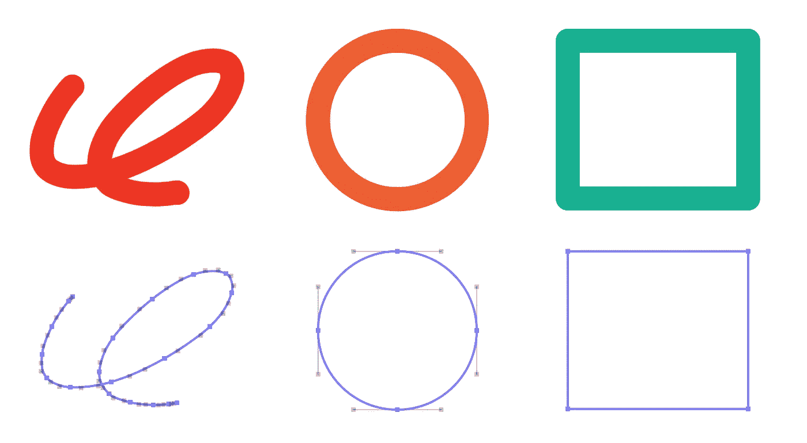
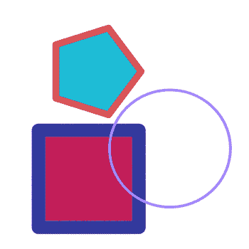
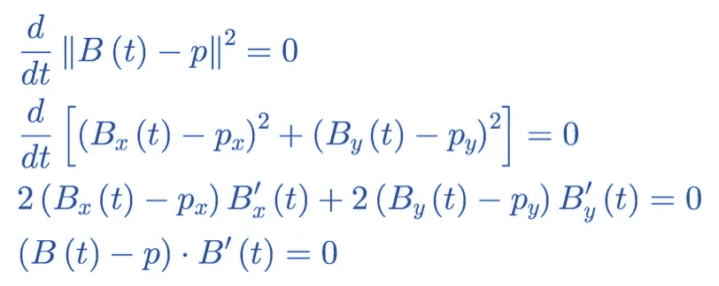
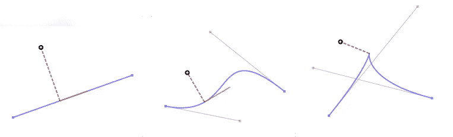
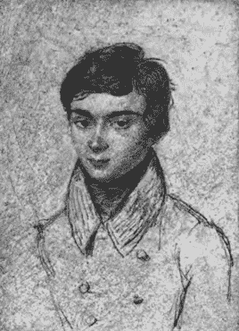
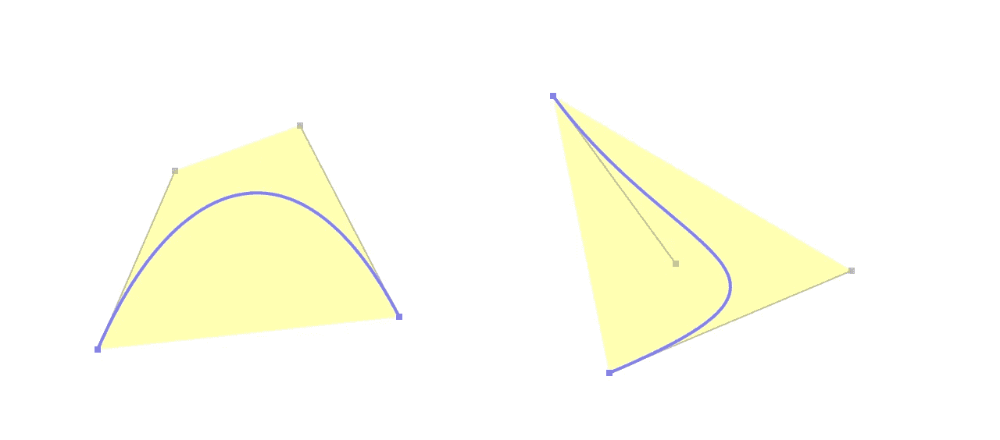
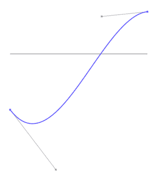

# 显著性对象选择:矢量图形冒险

> 原文：<https://levelup.gitconnected.com/notability-object-selection-adventures-in-vector-graphics-e1ed4bbbb4f6>

*著名工程师福尔摩斯·福特勒*

Notability 的设计中我最喜欢的一个方面是，每一点内容在创建后都是可编辑和可交互的。例如，在你画了一个图之后，你可以在你的文档中选择、缩放和移动它，而不会使它像素化。您可以回放录制的音频，然后轻按手写笔记，将录音导航到您记下这些笔记的时间点。您可以使用部分橡皮擦功能擦除对象以将其分开，然后单独选择那些新细分的对象。这些都是强大的功能——其中一些是笔记记录者所独有的。

Notability 的部分橡皮擦利用了我们的墨迹的矢量表示，允许将对象作为逻辑单元重新格式化。

在这篇文章中，我将带你深入了解我们如何解决实现这些功能所需的特定问题:*显著性如何决定用户选择了哪个对象？*

# 图形路径

为了保持文档的可编辑性和交互性——在它们的内容被创建之后，我们需要以这样一种方式存储它们的内容，即屏幕上显示的图形总是可以被重新创建。在显著性文档中，许多对象不使用像素表示，而是使用矢量表示。这种表示的最基本的构建块之一是图形路径的概念，也称为贝塞尔路径。

苹果为图形路径提供了几个 API。Core Graphics 的历史最长，可在所有苹果平台上使用。此 API 允许您从基本形状(如矩形和椭圆形)构建路径，或者通过虚线、描边和变换其他路径来构建路径。它有一个名为`[CGMutablePath](https://developer.apple.com/documentation/coregraphics/cgpath)`的可变表亲，通过添加直线、圆弧和曲线的命令，可以将一系列直线、圆弧和曲线首尾相连，从而构建几乎任何形状。

苹果更新的图形 API 也可以派上用场:iOS 添加了`[UIBezierPath](https://developer.apple.com/documentation/uikit/uibezierpath)`，它的工作方式基本相同，只是这个类的实例也承担了一些样式和绘图的责任，否则程序员将通过图形上下文来完成这些工作。最近 SwiftUI 添加了自己的 struct，简称为`[Path](https://developer.apple.com/documentation/swiftui/path)`，它通过一个 API 为图形路径概念提供了一个快速、声明性的旋转，最终与旧的 API 相似。

好消息是，无论你选择哪种 API，它们在很大程度上都是可互操作的——在每种情况下，实例都可以使用`init(cgPath:)`从`CGPath`对象直接构造，并通过它们的`cgPath`属性转换回`CGPath`对象。我编写的库 [BézierKit](https://github.com/hfutrell/BezierKit) 也具有相同的互操作性。这是可能的，因为每个 API 都以相同的方式模拟图形路径，如一系列贝塞尔曲线。

## 你是说都是贝塞尔曲线？

一些由贝塞尔曲线构成的显著性图及其底层图形路径

原来苹果的图形路径都是由线性、二次、三次贝塞尔曲线组成的。当你使用`[CGPath.init(rect:)](https://developer.apple.com/documentation/coregraphics/cgpath/1411155-init)`创建一个矩形时，它实际上创建了四条线性贝塞尔曲线(线段)——每条边一条。当你使用`[CGPath.init(ellipseIn:)](https://developer.apple.com/documentation/coregraphics/cgpath/1411177-init)`创建一个椭圆时，它实际上创建了四条三次贝塞尔曲线，这些曲线形成了一个足够好的近似，以至于你察觉不到误差。当您向路径添加弧线时，这些弧线也会转换为一条或多条三次贝塞尔曲线。

由于苹果的图形路径 API 都使用贝塞尔曲线作为它们最底层的原语，所以显著性文档中的对象也使用贝塞尔曲线作为它们的原语也就不足为奇了。由于许多著名的物体简化成贝塞尔曲线，工程任务有时也简化成处理这些曲线。

# 显著性对象选择

在 Notability 中，用户可以点击他们插入的形状或媒体(如照片)来选择它们。在回放录像的过程中，他们可以点击一段内容，将录像导航到创建该内容的时间点。这些便利的功能需要翻译用户的输入来解释他们想要与哪个对象交互。

触摸输入用于从附近的几个候选对象中选择对象

如果对象选择只是确定文档中用户触摸坐标落在图形路径内的最顶端的对象，那么确定选择哪个对象就很容易了:我们可以从最顶端的对象开始遍历每个路径，并使用`[CGPath.contains(_:using:,transform:)](https://developer.apple.com/documentation/coregraphics/cgpath/2427117-contains)`返回路径中包含用户触摸坐标的第一个对象

但是在处理触摸数据时，输入的坐标并不精确。手指一开始就很笨拙，文档可以包含精细的细节，iOS 提供的触摸坐标仅代表屏幕上触摸印象的粗略中心。因此，显著性必须解释用户打算点击哪个对象，即使触摸坐标很近，但没有直接包含在对象的路径中。

我们首先尝试了一些巧妙的解决方法，比如测试触摸坐标附近的多个点，或者根据用`[CGPath.copyStrokingWithWidth](https://developer.apple.com/documentation/coregraphics/cgpath/2427133-copy)`创建的路径的扩展描边副本来测试坐标。首先尝试简单的解决方案总是好的。

但这些变通办法也暴露了一个相关的问题:附近可能有多个对象，在这种情况下，我们希望尽可能地尊重用户的意图，选择最接近他们触摸的对象。解决这个问题实际上意味着找到用户的触摸和附近物体的图形路径之间的距离。由于图形路径是由贝塞尔曲线构成的，这就归结为一个问题:我们如何找到点和贝塞尔曲线之间的距离？

# 点到贝塞尔曲线的最小距离

为了找到点和图形路径之间的距离，我们需要深入研究构成这些路径的基本元素的贝塞尔曲线的数学。

贝塞尔曲线是可以由区间`0≤t≤1`(单位区间)上的多项式函数`B(t)`定义的参数曲线。对于每个值 t，函数`B(t)`产生曲线上一个点的`(x, y)`坐标，`t=0`对应曲线的起点，`t=1`对应曲线的终点。

## 距离方程

距离方程表示点`p`(在我们的例子中，是用户的触摸输入坐标)和贝塞尔曲线`B(t)`(图形路径的一部分)之间的距离。该等式被写成这些量之间的矢量差的长度。

应用一些微积分，点和曲线之间的距离在曲线端点或距离方程的临界点处最小化(为了使数学稍微简单一点，我们实际上考虑距离方程平方的临界点，它们是相同的)。通过求解其导数等于零的位置，可以找到距离方程的临界点，如下所示:

等式 1:距离等式的临界点在其导数等于零的地方被找到。

等式 1 的最后一行将寻找距离等式的临界点的问题框定为求解矢量点积等于零的情况。点积的左侧表示从曲线到点的直线投影，右侧表示曲线的导数。我们通过除以 2，然后应用矢量点积的定义，得出了最后一行。

最后一行的点积有一个有趣的几何解释。当点积的任何一边都不为零时，临界点对应于曲线上的一个位置，在该位置，其切线和投射到该点的线垂直。

与三条不同贝塞尔曲线上的点最近的点的图示:一条线段(左)、一条三次曲线(中)和一条带有退化尖点的三次曲线(右)。在每种情况下，最接近的点对应于等式 1 中的临界点。在具有退化尖点的三次曲线的情况下(右)，临界点是曲线的导数在尖点的峰值处达到零的地方。

## 寻找距离方程的临界点

对于线性和二次曲线，我们实际上可以直接求解临界点。

对于线性曲线，`B(t)`是线性函数，`B’(t)`是常数，这意味着方程 1 的点积产生线性方程，可以用代数方法求解。当所有项展开后，我们得到了点在直线上的矢量投影的经典公式。

对于二次曲线，数学更复杂，但可行。点积的左边表达式是二次多项式，表达式的右边是线性多项式。相乘后，解落在三次多项式的根上。数百年前，数学家们发现了如何为这些根以及四次多项式的根编写公式。这些公式很长，你会很高兴你只需要把它们输入计算机一次。

事情变得非常混乱的是三次曲线，点积的左边表达式是三次多项式，点积的右边表达式是二次多项式。乘以这些解就是一个*五次*(五次)多项式的根。大约在 19 世纪之交，数学家证明了在一般情况下，为 5 次多项式的根编写代数公式是不可能的。我们需要一个*算法*来寻找这些根。

数学家和革命者瓦里斯特·伽罗瓦知道五次方程会带来麻烦，因为他自己对麻烦并不陌生

## 使用贝塞尔裁剪最小化距离方程

多项式求根有许多方法(如果我希望描述所有的方法，我永远也不会完成这篇文章)。相反，我将描述一种优雅而有效的方法，这种方法被称为贝塞尔曲线裁剪。

使贝塞尔曲线如此优雅的几何洞察力被称为贝塞尔曲线的“凸包属性”。属性声明贝塞尔曲线完全落在其控制点的凸包内。你可以把凸包想象成你在这些点周围拉伸橡皮筋得到的多边形。

两条贝塞尔曲线，其控制点的凸包以黄色着色。

凸包属性告诉我们，由于贝塞尔曲线完全包含在其凸包内，所以任何根必须位于凸包与 x 轴重叠的区域。贝塞尔裁剪算法通过确定该范围来工作，并通过细分(裁剪)该范围上的曲线来迭代。一般来说，这种方法收敛很快*，*类似于更广为人知的[牛顿法](https://en.wikipedia.org/wiki/Newton%27s_method)。

这与解方程 1 有什么关系？贝塞尔曲线裁剪是一种关于贝塞尔曲线的算法，但是我们需要找到多项式的零点。事实证明，如果我们在等式 1 的点积乘法中小心，我们可以将该等式保持为贝塞尔曲线的形式(称为“显式贝塞尔曲线”)。例如，如果乘积的左侧是二次贝塞尔曲线，则它的导数是线性贝塞尔曲线，最终的点乘积可以表示为三次贝塞尔曲线。然后可以应用贝塞尔裁剪算法来寻找该曲线(或任何贝塞尔曲线)的根。下面是一个动画例子。

贝塞尔曲线剪辑在行动中

在每次迭代过程中，被裁剪的曲线以蓝色显示，然后其凸包以黄色突出显示。裁剪曲线的凸包与 x 轴相交的范围显示为红色，下一次迭代的输入是裁剪到该范围的曲线。动画只显示了 3 次迭代，因为在进行了那么远之后，曲线被剪切成一条小曲线，看起来*像一个点*，但是如果它继续进行两次迭代，我们可以获得一个误差范围为 12 位精度的根的估计。

# 结论

## 从数学王国归来

让我们缩小范围:我们从讨论显著性中的对象如何使用向量表示以及它如何实现一系列强大的功能开始。接下来，我们讨论了贝塞尔曲线的表示意味着工程挑战有时会归结为寻找曲线的特征。特别是，我们展示了选择最接近用户触摸的对象的挑战如何减少到寻找点和贝塞尔曲线之间的最小距离。我们讨论了如何通过最小化距离方程来解决这个问题，距离方程的临界点可以使用 Bézier 裁剪算法来定位。谈还原论！

如果这看起来像是解决一个特定问题的大量数学运算，那肯定是。然而，这些相同的技术也在应用程序的其他地方使用。例如，贝塞尔裁剪算法最初设计为使曲线彼此相交，它可以通过检查橡皮擦工具的图形路径是否与其他对象相交来帮助使用橡皮擦工具。

这篇博客文章掩盖了许多编程实现细节和数学知识。如果你想了解更多关于贝塞尔曲线背后的数学知识，我推荐你查看下面这篇文章的参考文献。对于交互式演示，您可以查看关于贝塞尔曲线的初级读本,其中充满了 JavaScript 演示。

查看我们的[样本代码](https://github.com/Ginger-Labs/GraphicsPathNearest)，了解这篇博客中讨论的算法的完整实现。该代码示例有一个交互式 Mac 和 iOS 演示，用于确定与贝塞尔曲线上的点最近的点，并且还有一个贝塞尔裁剪算法的工作实现。

## 快速投球，因为你已经跑了这么远

你是一个有抱负的矢量图形专家吗？生姜实验室有职位空缺，你可以在那里完善你的技能！我们正在寻找新的团队成员来帮助从用户界面开发到后端的知名度。即使这篇文章中的数学让你有点眼花缭乱，我们可能会给你一份工作。访问我们的职位页面:

【https://jobs.gingerlabs.com 

[1]: T.W .塞德伯格。《计算机辅助几何设计》[https://scholarsarchive.byu.edu/facpub/1/](https://scholarsarchive.byu.edu/facpub/1/)

[2]: T.W. Sederberg 和 T. Nishita。“曲线相交使用贝塞尔剪裁”[http://nishitalab.org/user/nis/cdrom/cad/CAGD90Curve.pdf](http://nishitalab.org/user/nis/cdrom/cad/CAGD90Curve.pdf)