# 为什么我痴迷于深度学习

> 原文：<https://levelup.gitconnected.com/notes-on-deep-learning-for-coders-1-c4e4f45f4118>

第 1 部分，共 8 部分。


雅各布·博曼在 [Unsplash](https://unsplash.com?utm_source=medium&utm_medium=referral) 上的照片

对我来说，今天你能学到的最有趣、最令人兴奋、最有用的技术之一就是**深度学习**。我只是在去年才开始尝试，我必须承认，在我们的 WhatsApp 小组中分析我朋友的对话，或者通过告诉我应该回答什么来建立一个教我法语的模型，这是一段非常美好的时光。后者证明了我们不应该在现实生活对话中使用电影脚本，但这是另一篇文章的内容:)

除了那些有趣的任务，我们认为深度学习是当今多个领域的最佳技术。我们把这里的“最好”定义为比人类能做的更好！例如，想象一下深度学习模型在医学上检测皮肤癌，在机器人技术上处理物体，分析 MRI 或 CT 扫描等方面可以有多么强大。

我意识到深度学习并没有听起来那么可怕！是的，你需要了解一些数学知识，而模型优化并不容易，因为你需要找出模型中的偏差和过度拟合等问题。但是让一群不同的人使用这项技术是很重要的。我无法想象如果只有一定年龄和教育的科学家才是深度学习的专家会发生什么！

> 偏见是深度学习模型中如此重要的一个方面。用户越多样化，结果就越公正，越有意义。

让我们看看训练一个能分辨猫和狗的模型有多容易。写几行代码就够了。下面的代码将在大约 20 秒后输出一个模型。给定一张猫或狗的图片，该模型将给出几乎完美的答案(错误率约为 0.005)。

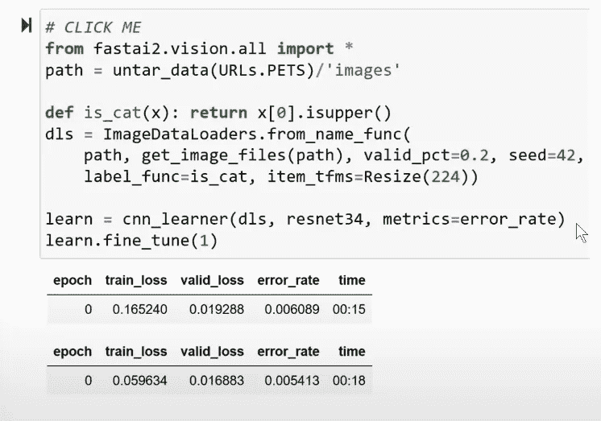

猫对狗 1 比 0。也是从书中认识猫的典范。

我想增强我的深度学习技能，所以我最近参加了两位了不起的研究人员的八部分课程。我将在一个简短的系列文章中分享我的笔记，我希望这将有助于您首次深入了解该领域，并让您和我一样兴奋，因为如果您成为深度学习的超级用户，您将有机会。

## 🧑‍🏫课程

“程序员深度学习(2020)”是由**杰瑞米·霍华德**和**西尔万·古格**主持的现场课程。现场课程遵循他们的书，并且完全写在 Jupyter 笔记本上！作者在他们的工作中投入了很多思考:书、补充材料和代码。

我在下面提到一些重要的参考文献。这门课程有 8 节课，每节大约 2 小时。在课程中，有一个问题列表来指导你学习和理解材料。我建议你也跟着课程走，在阅读笔记之前或之后。答案是我自己的，但图片和内容可能来自课程公共资源库。

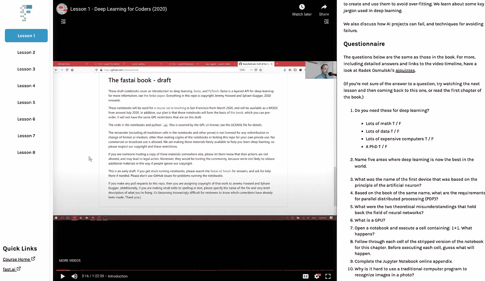

课程界面

1.  [预定](https://www.amazon.com/Deep-Learning-Coders-fastai-PyTorch/dp/1492045527)
2.  [课程网站](https://course.fast.ai/)
3.  [回购](https://github.com/fastai/fastbook)寻找朱庇特笔记本(以及作为笔记本的书籍文本)
4.  Jupyter 笔记本上有最少解释的[报告](https://github.com/fastai/fastbook/tree/master/clean)(同样的笔记本，只是没有书的正文)

## 📝第一课笔记

*   在课程中，我们使用 PyTorch 和作者自己在 PyTorch 之上的库，称为 fastai。他们用 Python 编写了他们的库，从良好的 API 设计实践来看，这实际上是非常有趣的。如果你是 Python 开发者，看看他们的回购吧。

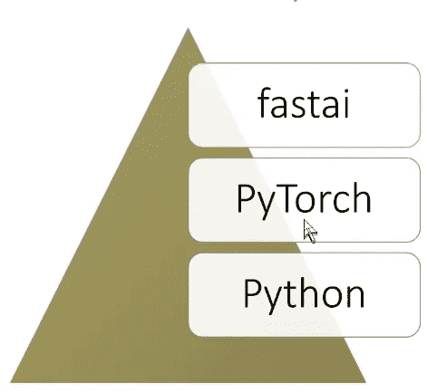

类软件栈，PyTorch 目前超级流行；80%的论文用 PyTorch 代替 TensorFlow。

*   在运行需要强大 GPU 的实验时，你需要一台云机器来让你的生活变得轻松。不要用你连 NVIDIA GPU 都没有的 Mac。如果你想从零开始安装驱动程序，并在 Docker 中显示 NVIDIA 显卡，并在这样做的时候感到有点沮丧，请参见我的另一篇文章[如何做到这一点。](https://javascript.plainenglish.io/visit-websites-without-opening-the-browser-9ee3cf18abdd)
*   否则，抓一台准备深度学习的机器。对于这个课程，我在 [Paperspace](https://www.paperspace.com/) 做了一个免费的账号，并预留了一个免费的预装实例。实例将我的执行排队几分钟，但对于我现在需要的来说已经足够了。我按照课程说明带来了 fastai 笔记本。

## 🤔材料

你可以在下面找到我对本课问题的答案。答案实际上比他们需要的更冗长，以使一个故事能够帮助其他人学习(希望如此！).如果你想跟随，你可以在向下滚动前想到答案。如果你有任何意见，请在评论中告诉我！

> 深度学习需要这些吗？
> 
> 很多数学
> 
> 大量数据
> 
> 许多昂贵的电脑
> 
> 博士学位

```
All desirable to have, but not true, you can learn Deep Learning with none of them.
```

> 说出深度学习现在世界上最好的五个领域。

```
In many areas, currently deep learning is better than humans such as: NLP, Computer Vision, Medicine, Biology, Image generation
```

> 基于人工神经元原理的第一个设备叫什么名字？

```
Deep Learning is just a type of neural network learning (a neural network that is in this case: deep). At 1943 McCulloch developed a mathematical model for neural networks. 
Twenty years after, **Frank Rosenblatt,** envisioned to build the first neural network device. Indeed, he built **"The Mark I Perceptron"** as shown in the below picture. Frank was clearly a patient guy :). The electronic device could learn. For example, they could hold a triangle before the device's eye and it would pick it up as an image and it would register it in the device's units. Today you can find the machine in an exposition in Washington. And that is considered as the birth of AI! Pretty cool!
```

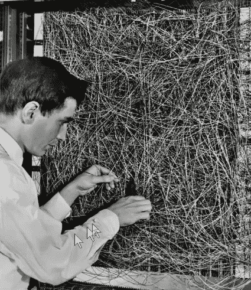

弗兰克·罗森布拉特和他的神经网络

弗兰克一边给最后一根电缆接线一边说:*“我们即将见证这样一台机器的诞生，它能够感知、认识和识别周围环境，无需任何人类训练或控制。”*

## 还有…是的！我们今天就有！

> 基于同名书，并行分布式处理(PDP)有什么要求？

```
MIT released (a very important) series of volumes called: "Parallel Distributed Processing (PDP) (1986)". They described some requirements that are shown below and stated that a system that follows them is able to do "awesome" things.Requirements: Processing units, State of activation, Output function, pattern of connectivity, propagation rule, activation rule, learning rule, environment.**Basically, what you need to know, in order to do "Deep" Learning, is how to implement those requirements in your system.**
```

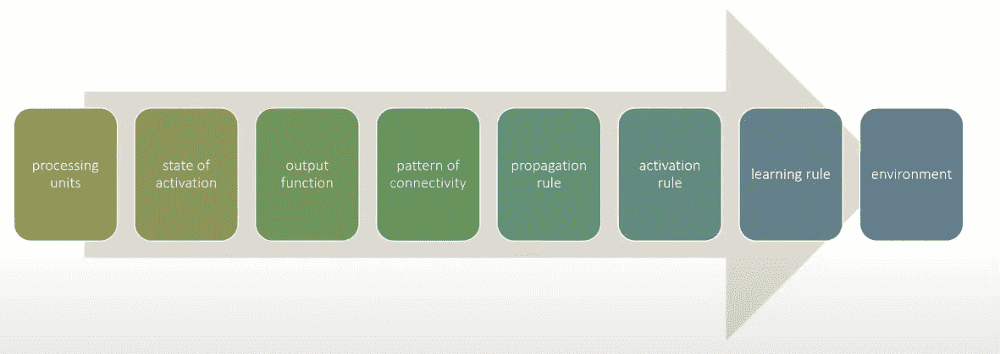

对"牛逼"的要求。

> 阻碍神经网络领域发展的两个理论误解是什么？

```
MIT prof Marvin Minsky wrote a paper explaining that a single layer of neurons couldn't even do XOR and you need multiple layers to address that limitation. But people reading the paepr were left with the impression that neural networks don't work ata ll. For the next 20 years everyone forgot about neural networks!Also, in theory, one extra layer of neurons was enough to allow any mathematical model approximation. Many tries were done with only one extra layer and that lead to slow models. 
```

> 什么是 GPU？

```
GPU: Graphics Processing Unit (* You need NVIDIA for any deep learning, don't bother with something else). 
Why do you need a GPU you might ask? You can actually run the same calculations on a CPU, but it will reach its' limits quick. GPUs are super fast, as they are made to handle high parallel structures.
```

> 打开笔记本，执行包含“1+1”的单元格。会发生什么？

```
If you don't know the answer, please close this browser tab.
```

> 为什么很难使用传统的计算机程序来识别照片中的图像？

```
We could come up with our own program to recognize cats and dogs. In the same way we write programming solutions to problems. But as **Arthur Samuel (IBM 1949)** said, you will "need to spell out every single step of the process in the most exasperating detail". It will be very very complex to describe to a computer how to do that using a simple program. Imagine adding more animals to our problem!So Arthur Samuel named a way to solve these problems as **"Machine Learning"!** And it's about avoiding telling the computer the steps but show to the computer examples and let it figure it out! And he proved the effectiveness by writing a checkers program that beat the current champion of checkers!
```

> 画一张图，概括塞缪尔对机器学习模型的看法。

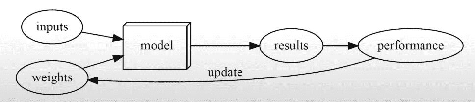

塞缪尔对机器学习的描述。我们给模型输入，例如棋盘状态。但不仅如此。我们也给重量！他说我们需要一些自动的方法来测试特定权重分配的结果有多好。此外，我们需要一种方法来改变权重分配，以最大化性能。但是我们实际上不会这样做；它将是完全自动的！这就是亚瑟·塞缪尔的机器学习定义的诞生！

> 我们通常在深度学习中使用什么术语来表示塞缪尔所谓的“权重”？

```
We refer to the "weights" today as "parameters".
```

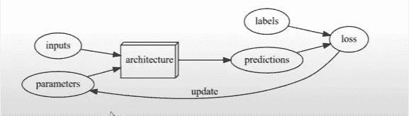

我们今天也称这个模型为架构。不要用“模型”这个词，它会让人混淆！结果被称为预测，性能测量是损失。请注意，损失不仅需要预测，还需要正确的标签。标签也称为因变量。在猫对狗模型的情况下，对于训练期间的任何图像，标签都是狗或猫。为了让这个架构能够学习，您需要有正确标记的数据！否则如何？此外，您必须明白，模型只会根据您用来训练它的输入数据中看到的模式来学习操作。如果一只猫遇到一只鸽子，他们相爱并生下一只鸽子猫宝宝，如果你不给它一个样本图像和标签，并说“这也是一只猫”，你预先训练的模型将对此一无所知。还有，机器学习不做我们所说的推荐动作，它只做预测。这些都是机器学习所固有的重要限制去认识和理解！

> 为什么很难理解为什么深度学习模型会做出一个特定的预测？

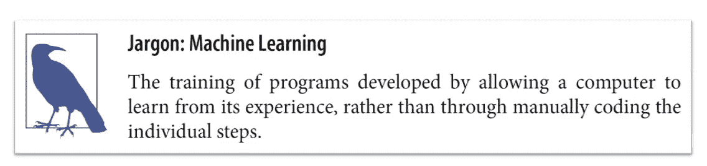

根据这本书，机器学习的定义是什么。

```
We know now what is Machine Learning and how it can solve the checker board game. But what about more complex problems like recognizing cats and dogs? Basically, we use the same idea, just the model(architecture) in the diagram is sooo flexible! The model is so flexible that it can do **anything, it can solve any problem!** What is this completely general way to update the weights of a neural network to make it improve any given task? Is there such a thing? YES! It's called:
                 **STOCHASTIC GRADIENT DESCENT! (SGD)**A neural network will quickly become too complex, with too many layers for any human to comprehend.
```

> 证明神经网络可以以任何精度解决任何数学问题的定理叫什么？

```
If you are puzzled about the model being able to do anything, so I am I. But there is a mathematical proof called the **Universal Approximation Theorem** that shows that this function can solve any problem to any level of accuracy!
```

> 你需要什么来训练一个模特？

```
As we said, it's not enough to have data, you need data AND labels for the data.
```

> 反馈回路如何影响预测性警务模式的推出？

```
The PDP book I mentioned before had one requirement called the "environment". And it's a pretty important one to avoid feedback loops. A feedback loop happens when the more the model is used, the more biased the data and the model becomes. One example is a recommendation engine that recommends the top watched shows by views. Then the people watching might not represent the population, but certain groups that are more active online, and then the more they watch, the more those shows will show up in recommendations.
```

> 对于猫识别模型，我们必须总是使用 224×224 像素的图像吗？

```
No bigger resolution -> more details -> better results, but you pay the price in speed and memory.
```

> 分类和回归有什么区别？

```
The main two types of models are classification and regression.Classification model: Predicts a class or category, e.g. cat vs dog = discrete possibilitiesRegression model: Predicts quantities such as temperature or a number such as the age of a cat or dog, which can be like 6.3
```

> 什么是验证集？什么是测试集？我们为什么需要它们？

```
Validation Set = It's the part of the input data we will use only to figure out if the model is working or not. We don't train the model with the validation set data. 
Instead, after training the model with the other part of the data, the validation set is used to calculate the error rate (at least in fastai). And this is very important. You should always have this extra set of data. It can help you see if you created a proper fit for the data or you have over-fitting. Over-fitting will take the accuracy of your model down. And this is good approach since the program has not seen the validation set, it will contain completely new data. But, not really! Since we can still see the error rate when trying the validation data, we (nasty humans), can make more modifications and overfit our data to the validation set. So we reserve another data set, called the Test Set. In formal competitions like in kaggle.com, this is what is used to judge your model.Test Set = Excluded from the data set completely until the very end, to avoid human introduced bias.
```

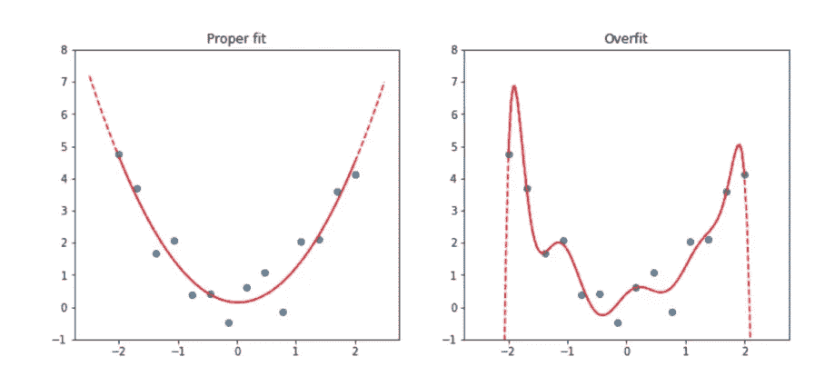

这些图表有相同的数据点。然而，左边的一个具有合适的 fit 体系结构，而右边的一个创建的体系结构不能很好地表示数据集。

> 如果不提供验证集，fastai 会怎么做？

```
fastai is the library on top of PyTorch. It will by default take 20% of the data even if you don't specify a validation set. 
Thank you fastai for keeping us correct :)
```

在开始写的时候，有一个简单的猫狗分类实现。但是深度学习不仅仅是为了图像分类。再来看几个例子。代码非常相似，但做的事情非常不同。

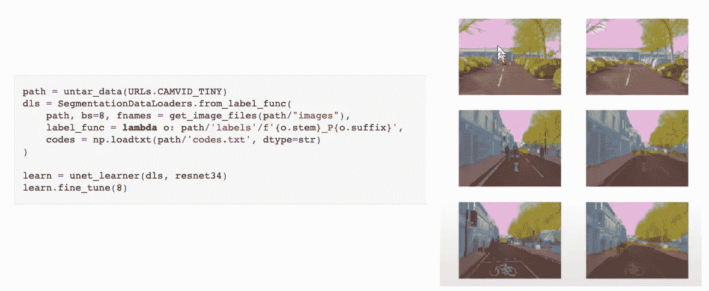

SegmentationDataLoader 可以教会模型识别对象。这在自动驾驶汽车中至关重要！第一列是带标签的输入数据。他们对商品进行了颜色编码，例如汽车是橙色的；天空是粉红色的，等等。右图是经过几秒钟训练后的模型。它几乎可以提取所有物体，并了解它们的样子。再训练几分钟就完美了！

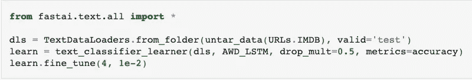

深度学习大放异彩的一个领域是自然语言处理(NLP)。在这个例子中，TextDataLoader 可以以 99.99%的准确率预测句子是否有积极或消极的情绪。

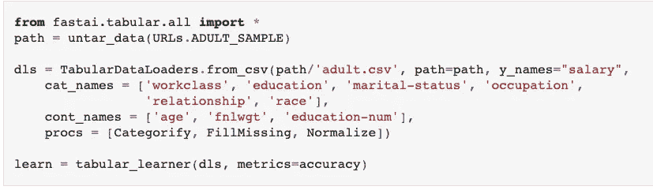

这个 Tabulardataloader 可以根据一个人的社会经济背景(工作阶级、教育程度等)来预测这个人是否有高收入。).嗯嗯…

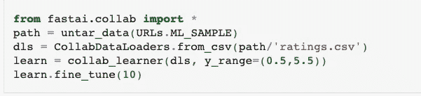

这个 CollabDataLoader 会预测用户会给一部电影哪个等级！嗯……我希望你现在明白了:我们都需要学习深度学习，或者至少意识到这一点！

到第一课结束时，你应该对深度学习有一个整体的看法:历史，应用，实现。你甚至可以自己跑模型！我希望你学到了一些东西，第二课见！