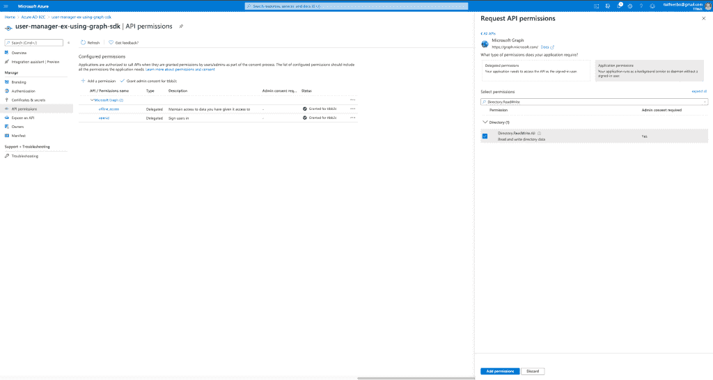
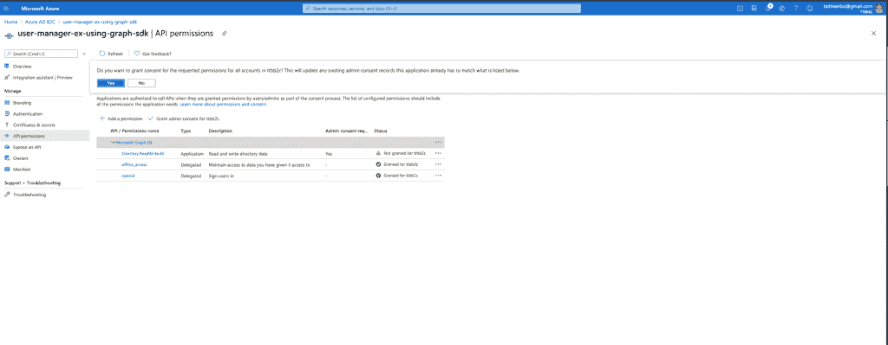
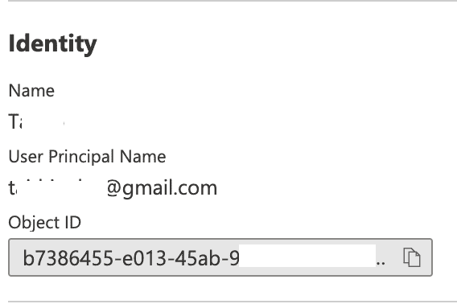
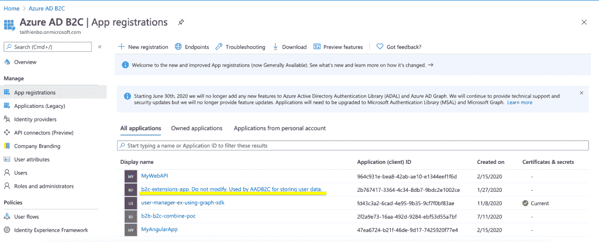

# 关于使用 Microsoft Graph SDK 管理 Azure AD B2C 租户中的用户的说明。

> 原文：<https://levelup.gitconnected.com/notes-on-using-microsoft-graph-sdk-to-manage-users-in-an-azure-ad-b2c-tenant-69132409d34a>


图片由[康格设计](https://pixabay.com/users/congerdesign-509903/?utm_source=link-attribution&utm_medium=referral&utm_campaign=image&utm_content=2481718)来自 [Pixabay](https://pixabay.com/?utm_source=link-attribution&utm_medium=referral&utm_campaign=image&utm_content=2481718)

我最近致力于将现有 SQL 数据库中的用户帐户迁移到 Azure AD B2C。我从微软找到了一些有用的文章，它们记录了不同的迁移方法，并提供了使用 Microsoft Graph SDK 管理用户的示例代码。您可以在参考资料部分找到这些文章和示例项目的链接。

在很大程度上，我在基本的 CRUD 操作上没有遇到太多麻烦。然而，我在处理自定义属性和通过电子邮件检索用户时遇到了一些困难。在这篇文章中，我将分享一些我学到的技巧和注意事项。特别是，我将讨论:

*   管理用户所需的 Microsoft Graph API 权限。
*   关于 UserPrincipalName 属性和通过电子邮件检索用户的警告。
*   在 Azure ADB2C 中设置和检索自定义属性。

# 您可能需要的 Microsoft Graph API 权限

根据有关 Microsoft Graph 权限的文档，您至少需要以下应用程序权限来创建和更新用户简档:

`*Directory.ReadWrite.All*`

根据文件，*目录。ReadWrite.All*

允许应用程序在没有登录用户的情况下读取和写入组织目录中的数据，如用户和组。不允许删除用户或组。

[图表权限参考](https://docs.microsoft.com/en-us/graph/permissions-reference#application-permissions-61)

但是，当您阅读文档时，如果您还想删除用户的帐户或重置用户的密码，上述权限是不够的。对于这些操作，您需要以下权限:

根据文档，用户为*。ReadWrite.All*

> 允许应用程序读取和写入您组织中其他用户的全套简档属性、组成员资格、报告和经理，无需登录用户。还允许应用程序创建和删除非管理用户。不允许重置用户密码。
> 
> [图形权限](https://docs.microsoft.com/en-us/graph/permissions-reference#application-permissions-61)

根据您的设置，在应用程序或委派权限之间进行选择。在我的应用程序中，我使用应用程序权限，因为迁移脚本不涉及用户。欲了解更多信息，请查看此[文档](https://docs.microsoft.com/en-us/azure/active-directory/develop/developer-glossary#permissions)。

以下是如何通过 Azure 门户向应用添加权限:

1.  在 app 注册页面，进入 **API 权限**。
2.  点击**添加一个权限**。
3.  在**下选择一个 API** ，选择**微软图形**。
4.  选择**应用权限**。
5.  搜索并添加所需的权限。



在 Azure ADB2C 中添加 API 权限

无论是用户。ReadWrite.All 和目录。读写。所有权限都需要管理员同意。如果您是租户的管理员，添加权限后，您可以单击“配置的权限”下的“授予{您的租户名称}管理员权限”链接来授予权限。如果您不是管理员，请联系具有管理员权限的人员，该人员可以通过转到 API 权限下的同一个屏幕来给予同意。



授予管理员权限

我没有尝试使用 graph SDK 更新用户密码。但是，如果您需要重置用户密码，您需要为您的应用程序分配*用户管理员*角色。欲了解更多信息，请查看[文档](https://docs.microsoft.com/en-us/azure/active-directory-b2c/microsoft-graph-get-started?tabs=app-reg-ga#enable-user-delete-and-password-update)。

# UserPrincipalName 属性的警告

在通过 id 检索用户对象时，我检查了默认属性，以确定哪些属性可以用于过滤电子邮件。在我得到的属性中，只有“mail”和“userPrincipalName”属性是合适的。然而，在我们的目录中，所有用户都有空白邮件。这应该不成问题，因为我希望能够使用 userPrincipalName 属性，因为在门户中，该属性似乎包含一封电子邮件。



在 azure ADB2C 门户中，用户主体名称显示用户的电子邮件

*然而，我从 graph API 为那个用户返回的 userPrincipalName 的值是用户的对象 id，而不是电子邮件。*

这让我有点吃惊。幸运的是，我已经习惯了惊喜，与不同的 API 一起工作。我想到了使用替代方法，比如过滤多个属性，比如 givenName 和 surName。虽然我们不可能有两个同名同姓的人，但这仍然是可能的，我需要一个确切的结果，所以根据这些属性进行过滤是行不通的。

在咨询了我最好的朋友 Google 之后，我发现通过邮件完成过滤的方法是使用 *issuerAssignedId* 属性。

```
private async Task<User> ExpectExactUserByEmail(string email)
        {
            // https://github.com/microsoftgraph/microsoft-graph-docs/issues/7282
            var filter = $"identities / any(id: id / issuer eq '{_migrationAppOptions.Issuer}' and id / issuerAssignedId eq '{email}')";
            return await ExpectExactUser(filter);
        }

private async Task<User> ExpectExactUser(string filter)
        {
            var users = await _graphClient.Users.Request().Filter(filter).Select(_defaultUserSelectAttributes).GetAsync();
            if (users.Count == 0)
            {
                throw new KeyNotFoundException($"Not able to find user with given filter: {filter}");
            }
            else if (users.Count > 1)
            {
                throw new ArgumentException($"More than one users found with given filter: {filter}");
            }
            return users[0];
        }
```

在上面的代码片段中，请注意过滤是基于身份的，并使用了 issuer 和 issuerAssignedId 属性，按照这个[问题](https://github.com/microsoftgraph/microsoft-graph-docs/issues/7282)。我怀疑这只是因为我们在创建用户时使用了“emailAddress”登录类型。事实上，当使用 SDK 创建用户时，我必须将 graph 用户对象的 Identities 属性设置为:

```
Identities = new ObjectIdentity[] {
  new ObjectIdentity() {
    SignInType = "emailAddress",
    Issuer = _migrationAppOptions.Issuer,
    IssuerAssignedId = adB2CUser.UserEmail
  }
}
```

# 设置和检索自定义用户属性

我曾经看到过过时的帖子，暗示微软 Graph SDK 不支持 Azure AD B2C 中的自定义属性，替代方案是使用[Azure Active Directory Graph API](https://docs.microsoft.com/en-us/azure/active-directory/develop/active-directory-graph-api)。然而，azure active directory graph api 正在逐渐消失，微软 Graph SDK 是其继任者。

在我使用它的时候，Microsoft Graph SDK 确实支持使用自定义属性，因为我能够按照示例代码来设置和检索自定义属性，所以您可以尝试一下。

需要注意的一点是，您需要使用自定义属性的全名，您可以使用以下格式来构造它:

扩展 _ {删除了所有破折号的 b2c 扩展应用程序的客户端} _ {属性名称} '

当您创建 azure ad b2c 租户时，b2c-extensions-app 会自动注册。



B2C-扩展-当您创建租户时，应用程序会自动注册

下面展示了我用来构建完整属性名的代码片段。

```
private string ExtensionAttributeFullName(string attributeName)
        {
            return $"extension_{B2CExtensionsAppClientId.Replace("-", "")}_{attributeName}";
        }
```

在检索用户时，可以使用$select 子句将自定义属性包含在从图中返回的结果中，如下例所示。

```
public async Task < User > GetUserByIdAsync(string userId) {
  var select = $ "id, givenName, surName, extension_2b76741733644c348db79bdc2e1002ce_MigrationSource";
  return await _graphClient.Users[userId].Request().Select(select).GetAsync();
}
```

创建用户时，可以使用字典设置自定义属性，并将其分配给图形用户的 AdditionalData 属性，如下面的代码片段所示。

```
public async Task < User > MergeUser([Required] ADB2CUserDTO adB2CUser) {
  IDictionary < string,
  object > extensionInstance = new Dictionary < string,
  object > {
    {
      _migrationAppOptions.ExtensionAttributeMigrationSourceFullName,
      "My web app"
    }
  };
  User user = new User() {
    AccountEnabled = true,
    DisplayName = adB2CUser.DisplayName,
    PasswordProfile = new PasswordProfile {
      ForceChangePasswordNextSignIn = true,
      Password = _passwordGenerator.GenerateAlphanumericPassword()
    },
    GivenName = adB2CUser.GivenName,
    Surname = adB2CUser.Surname,
    PostalCode = adB2CUser.PostalCode,
    State = adB2CUser.State,
    StreetAddress = adB2CUser.StreetAddress,
    City = adB2CUser.City,
    MobilePhone = adB2CUser.TelephoneNumber,
    Country = adB2CUser.Country,
    Identities = new ObjectIdentity[] {
      new ObjectIdentity() {
        SignInType = "emailAddress",
        Issuer = _migrationAppOptions.Issuer,
        IssuerAssignedId = adB2CUser.UserEmail
      }
    },
    AdditionalData = extensionInstance
  };
  return await _graphClient.Users.Request().AddAsync(user);
}
```

这就是这篇文章的全部内容。一如既往，如果你有任何问题，请随时联系我们。

# 参考

[使用 Microsoft Graph 的最佳实践](https://docs.microsoft.com/en-us/graph/best-practices-concept)

[Git 报告用户迁移示例代码](https://github.com/azure-ad-b2c/user-migration)

[Azure ADB2C 用户属性](https://docs.microsoft.com/en-us/azure/active-directory-b2c/user-profile-attributes)

[用户删除和密码更新权限](https://docs.microsoft.com/en-us/azure/active-directory-b2c/microsoft-graph-get-started?tabs=app-reg-ga#enable-user-delete-and-password-update)

[Microsoft graph 文档问题:无法按身份过滤用户](https://github.com/microsoftgraph/microsoft-graph-docs/issues/7282)

[微软 Graph nuget 包](https://www.nuget.org/packages/Microsoft.Graph)

*原载于 2020 年 11 月 14 日*[](https://www.taithienbo.com/notes-on-using-microsoft-graph-sdk-to-manage-users-in-an-azure-ad-b2c-tenant/)**。**