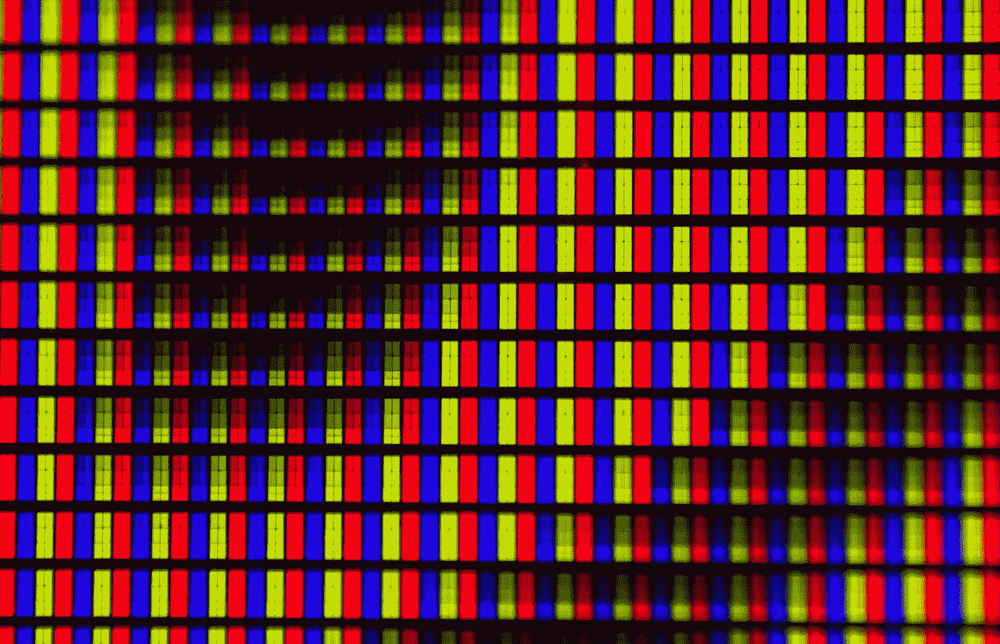
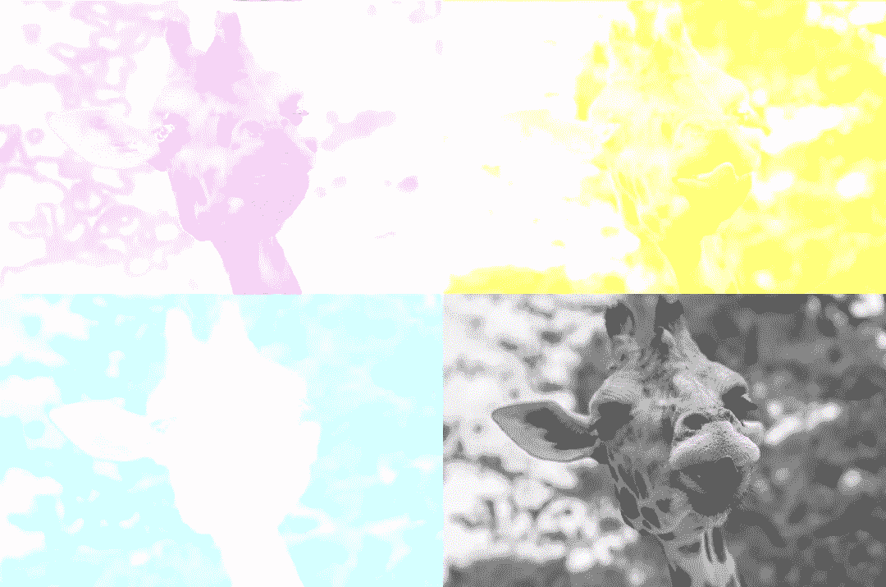
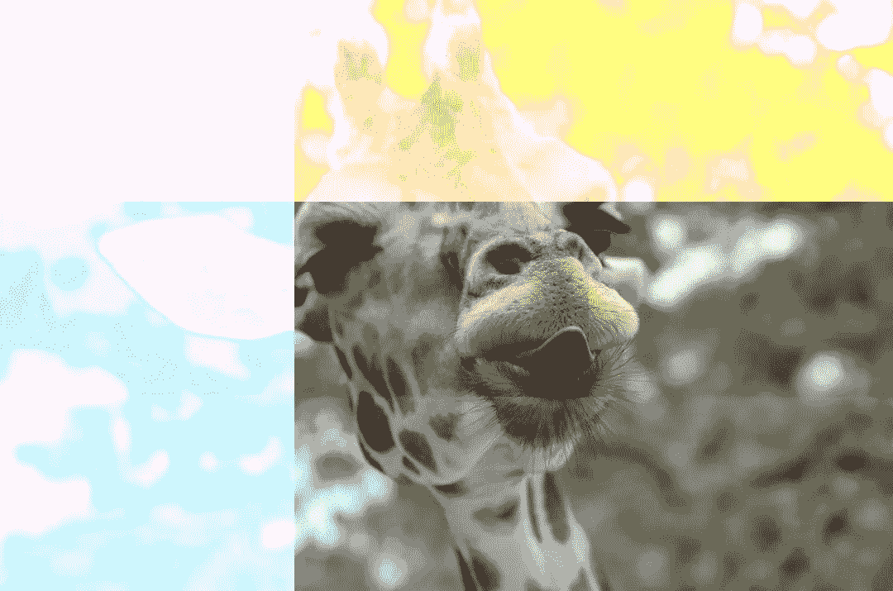
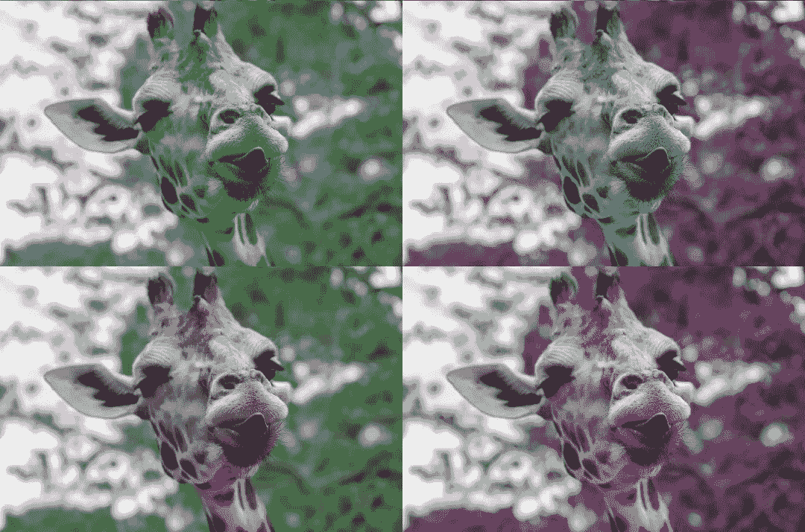

# 臭名昭著的 RGB

> 原文：<https://levelup.gitconnected.com/notorious-rgb-756f19f3e462>

## Javascript 中的图像处理—颜色模型

这是 Javascript 图像处理系列文章的第二部分。在上一期中，我介绍了如何读取图像的像素，在 GPU 上处理它们，并在画布上显示它们。看看这个。

1.  看这张照片

[用我建的演示网站马上开始编辑照片。](https://srmullen.github.io/color_kernels/)

简单回顾一下，我们正在使用 [GPU.js](https://gpu.rocks/) 来并行化我们的图像处理算法。这是显示图像的代码。

像素数据存储为红色、绿色和蓝色强度值。这对于数字图像格式(如 PNG 和 GIF)来说很常见，而且很有意义。计算机屏幕的物理像素由微小的红色、绿色和蓝色光组成，当这些光组合在一起时，我们可以感知可见光谱中的任何颜色。



迈克尔·马森在 [Unsplash](https://unsplash.com?utm_source=medium&utm_medium=referral) 上的照片

这并不是表现颜色的唯一方式。当使用光源(如电脑显示器上的发光二极管)创建颜色时，它工作得很好，但对于其他介质就不太好了。考虑粉刷你的新栅栏。你不会把红色、绿色和蓝色的油漆混合在一起，然后期望它是白色的。HOA 会敲你的门。由于这个原因，RGB 颜色模型被认为是一个*加色*模型。每种成分颜色添加得越多，合成色就越亮。

使用墨水、颜料等时。我们正在研究一个*减法*模型。与其用光来为我们创造颜色，不如让外部光源投射到我们的媒介上。添加到介质中的任何颜料都会吸收光线并反射你看到的颜色。以减色方式添加颜色的标准模式是 CMYK，它代表青色-品红色-黄色-调。关键是黑色的组成部分，这样称呼是因为它给图像增加了细节，或者是维基百科告诉我的。您可能对它们很熟悉，因为它们很可能是彩色打印机墨盒中的墨水。

让我们来看看 CMYK 通道是什么样子的。



CMYK 通道:左下角=青色，左上角=洋红色，右上角=黄色，右下角=键

现在让我们看看 CMYK 通道如何重叠，以创建一个自然的彩色图像。



中心包含所有 CMYK 通道。

# 将 RGB 转换为 CMYK(然后再转换回来)

像 RGB 一样，我们将使用 0 到 1 范围内的 CMYK 值。将 RGB 转换为 CMYK 的公式如下。

```
key = max(red, green, blue)
cyan = (1 - red - key) / (1 - key)
magenta = (1 - green - key) / (1 - key)
yellow = (1 - blue - key) / (1 - key)
```

和 CMYK 转换回 RGB

```
red = (1 - cyan) * (1 - key)
green = (1 - magenta) * (1 - key)
blue = (1 - yellow) * (1 - key)
```

## 在 GPU 上定义函数。

在上一个教程中，我们创建了内核函数。这些将我们的数据移动到 GPU 上进行并行处理。我们也可以编写像普通 Javascript 函数一样工作的函数，但是可以在 GPU 上的内核中使用。GPU.js 提供了一个方法来完成这个任务:`gpu.addFunction.`它接受一个命名函数作为参数。我们在这里用它来帮助简化代码，让它更清楚内核在做什么。

在这个例子中，我们添加了`rgb2cmyk`和`cmyk2rgb`函数。在第 28 行，RGB 值被转换成 CMYK。然后，我们可以随心所欲地处理 CMYK 值。在第 30 到 33 行，它们与内核的一个参数相乘。第 36 行看到我们修改后的 CMYK 值变回 RGB，这样它们就可以写入画布。

[在这里试试这个内核。](https://srmullen.github.io/color_kernels/?mode=cmyk)

# HSV——一罐颜色

HSV 或色调-饱和度-值不同于 RGB 和 CMYK。与它们不同的是，它不是基于颜色混合。相反，它被设计成更符合人类对颜色的感知。HSV 颜色模型通常显示为圆柱体。

[](https://commons.wikimedia.org/wiki/File:HSV_color_solid_cylinder_saturation_gray.png#/media/File:HSV_color_solid_cylinder_saturation_gray.png) [## HSV 彩色实心圆柱饱和度 gray.png

### 来自维基共享，自由媒体仓库

commons.wikimedia.org](https://commons.wikimedia.org/wiki/File:HSV_color_solid_cylinder_saturation_gray.png#/media/File:HSV_color_solid_cylinder_saturation_gray.png) 

沿着圆柱体的圆周是完全饱和的颜色。向圆柱体中心移动会降低颜色的饱和度或强度。值是颜色阴影的度量。值为 0 时总是黑色，值为 1 时没有阴影。

色调是用旋转角度来表示颜色。**为 0 时为红色**。当我们开始围绕圆柱体旋转时，我们到达 120°处的绿色。0 到 120 之间的颜色是红色和绿色之间的线性插值。圆柱体周围的下一个 120 度从绿色变为蓝色，然后在 360 度从蓝色变回红色。我觉得有趣的是，这种线性插值在纯红色、绿色和蓝色角度的中间点产生青色、品红色和黄色。

为了让您了解更改色调的工作原理，下图显示了对每个像素应用 90°增量旋转后的图像外观。



色调旋转:左下角= 0，左上角= 90，右上角= 180，右下角= 270

下面是在 HSV 和 RGB 颜色模型之间转换的代码。颜色模型转换比 CMYK 稍微复杂一点，但是这段代码遵循与 CMYK 转换示例相同的大纲。

在这里使用内核！

还有很多其他的颜色模型可以探索。HSL，或 HSB，(色调-饱和度-明度/亮度)是另一种在概念上类似于 HSV 的常见模型。

## **脚注**

[1]我要涉入 GIF 发音的争论，只是因为我喜欢它。长颈鹿。

[2]我正在使用的公式来自[快速表格](https://www.rapidtables.com/convert/color/cmyk-to-rgb.html)。