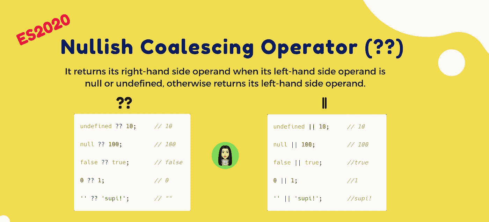
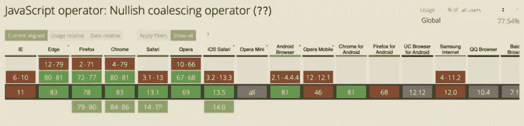

# 零化合并算子(？？)

> 原文：<https://levelup.gitconnected.com/nullish-coalescing-operator-52f14fc4f060>



零融合算子

零化合并运算符(？？)是一个逻辑运算符，当其左侧操作数为空或未定义时，返回其右侧操作数，否则返回其左侧操作数。

示例:

```
const username = null ?? 'suprabha';
console.log(username);
// suprabha
```

# 内容:

> *1。零化合并算子(？？)*
> 
> *2。& &或*
> 
> *3。虚假值*
> 
> *4。没有使用“& &”或“||”运算符*的链接
> 
> *5。浏览器支持*
> 
> *6。参考*

如您所知“ **& &** ”或“ **||** ”运算符用于处理“真”和“假”值。

**JavaScript 中的 Falsy 值:**

*   空
*   不明确的
*   0
*   圆盘烤饼
*   错误的
*   “ “

“&&”或“||”运算符适用于空值或未定义的值，但许多假值会产生意外的结果。

让我们举个例子，这里我们想处理值为 0(零)的响应。所以当你得到的响应是 falsy 时，它会返回右边的值。

```
const response = {
     count : 0
}
const count = response.count || 1;
console.log(count) // 1
```

为了使它工作，我们将使用无效合并运算符"？?"。

无效合并运算符"？?"与运算符“||”非常相似，只是在计算运算符时不使用“真值”。相反，它使用“nullish”的定义，这意味着该值严格等于 null 或未定义。

我们将举同样的例子:

```
const response = {
     count : 0
}
const count = response.count ?? 1;
console.log(count) // 0
```

# 几个要点:

**1。**使用运算符“||”如果第一个操作数为真，则计算第一个操作数。否则，它计算为第二个。使用 nullish 合并运算符时，如果第一个运算符为 falsy 但不是 Nullish，则计算第二个操作数。

```
console.log(false || true);//true
console.log(false ?? true);//false
```

**2** 。零被评估为假值；因此，该表达式使用“||运算符计算右边的值但是，使用 Nullish 合并运算符，零不为空。因此，表达式的计算结果是左边的值。

```
console.log(0 || 1); //1
console.log(0 ?? 1); //0
```

**3。**空字符串""被评估为一个 falsy 值；因此，该表达式使用“||运算符计算右边的值但是，使用 Nullish 合并运算符，空字符串""不为空。因此，表达式的计算结果是左边的值。

```
console.log('' || 'supi!');//supi      
console.log('' ?? 'supi');//''
```

**4。**如果你用未定义或空来检查，结果也是一样的:

```
console.log(undefined || 10); // 10
console.log(undefined ?? 10); // 10
console.log(null || 100); // 100
console.log(null ?? 100); // 100
```

为了更好地理解，我们将介绍更多示例:

```
const response = {
  settings: {
    nullValue: null,
    height: 400,
    animationDuration: 0,
    headerText: '',
    showSplashScreen: false
  }
};const undefinedValue = response.settings.undefinedValue ?? 'some other default'; 
// result: 'some other default'const nullValue = response.settings.nullValue ?? 'some other default'; 
// result: 'some other default'const headerText = response.settings.headerText ?? 'Hello, world!'; 
// result: ''const animationDuration = response.settings.animationDuration ?? 300; 
// result: 0const showSplashScreen = response.settings.showSplashScreen ?? true; 
// result: false
```

# 没有使用&&或||运算符的链接

不能将 AND (&&)和 OR 运算符(||)直接与？？

在这种情况下，将会引发 SyntaxError。

```
null || undefined ?? "supi"; // raises a SyntaxError
true || undefined ?? "supi"; // raises a SyntaxError
```

但是，提供括号来明确表示优先级是正确的:

```
(null || undefined) ?? "supi"; // returns "supi"
```

# 浏览器支持

它可以在 Chrome 或 Firefox 等最新版本中运行。



# 参考

[MDN 无效合并运算符](https://developer.mozilla.org/en-US/docs/Web/JavaScript/Reference/Operators/Nullish_Coalescing_Operator)

# 摘要

*   运算符`??`的优先级很低，比`?`和`=`高一点。
*   禁止与没有明确括号的`||`或`&&`一起使用。

希望这篇文章对你有用。感谢您阅读❤️这篇文章

我希望你喜欢这篇文章。如有任何问题，请随时 ping 我 [**@suprabhasupi**](https://twitter.com/suprabhasupi) 😋

🌟[推特](https://twitter.com/suprabhasupi) |👩🏻‍💻 [suprabha.me](https://www.suprabha.me/) |🌟 [Instagram](http://instagram.com/suprabhasupi)