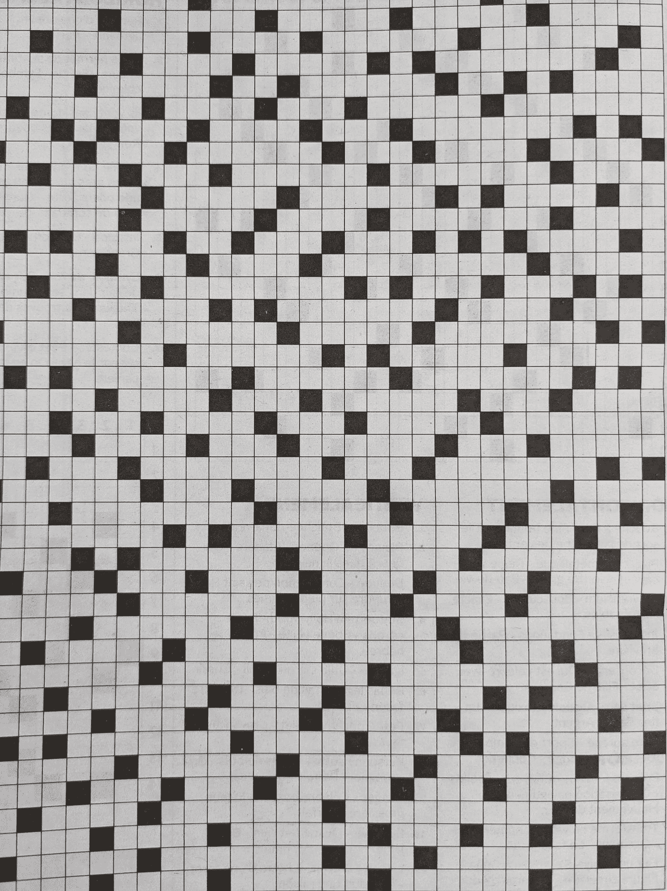
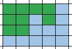
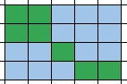
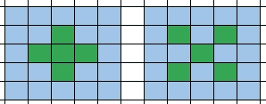
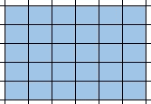
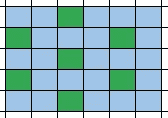
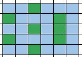
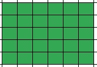
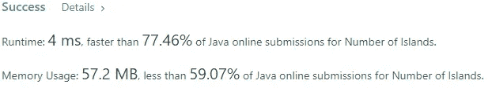

# 岛屿数量盲 75 个 LeetCode 问题

> 原文：<https://levelup.gitconnected.com/number-of-islands-blind-75-leetcode-questions-4a0eb41fb21d>



[西格蒙德](https://unsplash.com/@sigmund?utm_source=medium&utm_medium=referral)在 [Unsplash](https://unsplash.com?utm_source=medium&utm_medium=referral) 上拍照

## 任务描述:

给定一个代表`'1'` s(陆地)和`'0'` s(水域)的地图的`m x n` 2D 二进制网格`grid`，返回*岛屿的数量*。

**岛**被水环绕，由相邻的陆地水平或垂直连接而成。你可以假设网格的四个边缘都被水包围。

**例 1:**

```
**Input:** grid = [
  ["1","1","1","1","0"],
  ["1","1","0","1","0"],
  ["1","1","0","0","0"],
  ["0","0","0","0","0"]
]
**Output:** 1
```

**例二:**

```
**Input:** grid = [
  ["1","1","0","0","0"],
  ["1","1","0","0","0"],
  ["0","0","1","0","0"],
  ["0","0","0","1","1"]
]
**Output:** 3
```

**约束:**

*   `m == grid.length`
*   `n == grid[i].length`
*   `1 <= m, n <= 300`
*   `grid[i][j]`是`'0'`还是`'1'`。

## 推理:

一开始任务好像很难，除非你之前看到这个问题就已经知道该怎么做了。这里我们不考虑这种情况，让我们像第一次看到这个问题一样来处理它。为了更容易理解，让我们用一种更全面的方式来描述这个问题。我将使用一个简单的表格，其中蓝色单元代表水，绿色单元代表陆地。给定网格中的 0 代表水，1 代表陆地。让我们想象一下给出的例子:



第一个例子的可视化



第二个例子的可视化

第一个网格的答案是 1，而第二个是 3。原因是——陆地必须垂直或水平连接。让我们也想象一下。



左侧网格有 1 个岛，右侧有 5 个岛

正如我一直做的那样，我建议你从极其简单的例子开始，如果你愿意的话，也是愚蠢的。



空网格或包含 0 个岛的网格

上面的例子没有任何陆地，所以答案是 0 岛。



具有 7 个岛的网格

上面的例子有 7 个岛。我们怎么能程序化地这么说呢？我们需要遍历整个网格，并计算我们看到陆地的次数。仅此而已。听起来很简单，对吧？但是让我们再举一个例子:



六岛网格

如果我们使用与前面例子中相同的逻辑，我们得到答案 8，但它是错误的。正确答案是 6 个岛。以前的方法的主要缺点是我们计算每一片和平的土地，而不是岛屿。事实证明，为了解决给定的问题，这是我们需要解决的主要问题。

## 解决方案:

一般方法包括两个一般步骤。

第一步是我们需要一个单元一个单元地遍历整个网格。不做是不可能回答主要问题的。

迭代逻辑

我们从左上角开始，遍历每一行，当我们不能继续时，我们跳到下一行。

是时候讨论我们如何计算我们有多少岛屿背后的逻辑了。现在应该很明显，我们从探索任何岛屿的第一部分开始。我们将它添加到答案中，作为我们刚刚探索的 1 个岛。我们需要做的下一件事是防止附加的土地被计算，因为我们已经增加了总计数器。我们如何做到这一点？答案很简单。我们把它抹掉吧。是的，你答对了。一旦我们发现了第一块土地，我们就开始擦除程序。

陆地擦除功能

对于每个单元格，我们通过将单元格的值设置为 0 来擦除其区域，并从该单元格开始，通过向左、向右、向上和向下继续探索网格。最终，我们将探索所有附属的陆地。

这是解决方案的完整源代码

解决办法

正如我上面提到的，我们必须探索整个网格，如果我们考虑像这样的最坏情况，它的成本是 O(行*列)+1:



最坏的情况

我们将以同样的时间复杂度 O(行*列)再次探索整个网格。所以总的时间复杂度是 O(行*列)+ O(行*列)。根据大 O 符号的规则，我们可以省略一部分，结果时间复杂度是 O(行*列)。



解决方案的性能

我希望本文能帮助您理解这个问题背后的逻辑，并使用它来解决其他任务。

回头见！

# 分级编码

感谢您成为我们社区的一员！在你离开之前:

*   👏为故事鼓掌，跟着作者走👉
*   📰查看[级编码出版物](https://levelup.gitconnected.com/?utm_source=pub&utm_medium=post)中的更多内容
*   🔔关注我们:[推特](https://twitter.com/gitconnected) | [LinkedIn](https://www.linkedin.com/company/gitconnected) | [时事通讯](https://newsletter.levelup.dev)

🚀👉 [**加入升级人才集体，找到一份惊艳的工作**](https://jobs.levelup.dev/talent/welcome?referral=true)