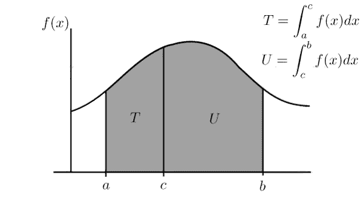
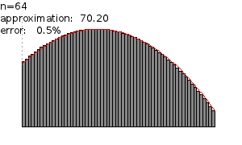
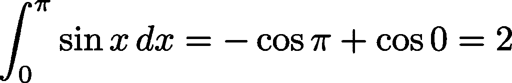
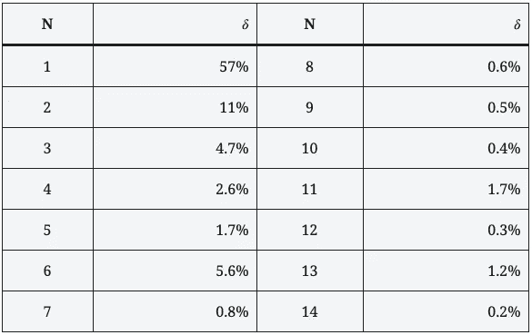

# 数值积分:错误的方法

> 原文：<https://levelup.gitconnected.com/numerical-integration-the-wrong-way-354f690e22b9>

## 一个小小的错误是如何导致灾难的

数值积分方法是那些允许使用计算机计算函数的定积分的方法。简而言之，数值积分是导致在区域 x∈[a，b]中曲线 *y=f(x)* 和*x*-轴之间的面积的评估(在许多情况下是近似值)的过程。



函数 *f(x)* 的 *a* 和 *c* 之间的积分代表灰色阴影区域*T*； *c* 和 *b* 之间的积分就是用 u 表示的面积，a 和 b 之间的积分代表面积 T+U 之和图片取自 Wikimedia Commons(感谢 Juliusross~commonswiki)。

一种最简单同时也是最广泛使用的数值积分方法可以追溯到艾萨克·牛顿的时代(这证明了数值计算并不像人们所认为的那样与计算机的使用密切相关)。它包括将区间[ *a，b* ]分成一系列 *N* 更小的区间[ *xᵢ,xᵢ₊₁* ]，在每一个区间中用常数 *f(x)≃f(xᵢ)=const* 近似 f(x)，并将曲线下的面积近似为底边为 *x* ᵢ₊₁- *x* ᵢ，高为 *f(x̅)* 的矩形的面积之和，其中*对于 *i = 0* ， *xᵢ=a，*而对于 *i=N+1，xᵢ=b.**



这张图片来自维基共享资源(感谢[green green](https://commons.wikimedia.org/wiki/User:Greenbreen))，展示了如何用 N 个矩形的面积之和来近似一个定积分。矩形越多，近似值越好。

其实整数符号(∵)是一个拉长的“s”，来源于拉丁文 *summa* (sum)。积分极值、 *a* 和 *b、*显示在符号的底部和顶部。在一个积分中，被求和的是一个矩形的无穷小底的乘积， *dx，*乘以其高度 *f(x)* 。

在某些情况下，某些函数的积分可以精确地计算出来。例如，学过一点微积分的人知道



在数值上，用 C 程序，这样的积分可以计算如下

```
double integral(double a, double b, int N) { 
  double I = 0., x = a; 
  double dx = (b - a)/N; 
  while (x < b) {
    I += sin(x+0.5*dx)*dx;
    x += dx;
  }
  return I;
}
```

在该函数中，代表积分的变量 *I* 初始设置为 0。变量 *x* 反而等于 *a* 。然后将区间[ *a，b* 分成振幅 *dx* 的 *N* 部分。在 *while* 循环中，在间隔中点计算的 *x* 的正弦值被迭代地添加到变量 *I* 中。它也乘以 *dx* ，每次迭代后 *x* 向右移动。当 *x* 落在区间[ *a，b* ]之外时，变量 *I* 包含其底为 *dx* 且其高度等于每个子区间中点的正弦的矩形的面积之和，这给出了积分的估计。𝛿=|2-*I*|/2 给出了这个估计的准确性的度量，它给出了期望值 2 和估计值*I*之间的百分比差。

下表显示了不同 n 值的𝛿值



当 *N* =1 时，意味着我们在用一个底为π，高等于π/2 的正弦的矩形的面积来近似正弦下的面积，也就是 1。由此估算的面积(π)显然与实际面积(2)有很大不同。随着 *N* 的增加，正如人们所料，误差会减小。但是对于 *N* 的某些值，比如 *N* =6、 *N* =11、 *N* =13，这个误差不仅没有遵循预期的递减趋势，反而比相同参数的类似值大一个数量级。

在最近的一篇[文章](https://medium.com/swlh/programming-etiquette-8327fbe2d036?sk=7cb27b028eae68794466553989147df4)中，我解释了如何根据可能执行的控制类型来选择使用哪条语句来进行循环:如果您可以预测循环将运行的次数，那么对语句使用*更合适，在不可能的情况下保存*而*。*

在这种情况下，按照建议，我们应该使用 *for* 语句进行循环，如下所示:

```
double integral(double a, double b, int N) {
  double I = 0., x = a;
  double dx = (b - a) /N;
  for (int i = 0; i < N; i++) {
    I += sin(x+0.5*dx)*dx;
    x += dx;
  }
  return I;
}
```

在这种情况下，得到的结果完全相同，但是对于 *N* =6，11，13，对应的误差为𝛿=1.1%，分别为 0.3%和 0.2%，完全符合预期。

为什么？事实是，计算机内存中的数字总是用一个有限位数的数字来表示。因此，当您将 *dx* 加到 *x，*时，可能会发生这样的情况，在最后一次迭代中，结果值比 *b* 稍大或稍小，导致最后一个矩形被忽略或在总和中包含一个额外的项。这就是为什么即使 *x* 上的误差(如目前的情况)是 2⁻⁵量级的，最终误差也可能高得灾难性。通过使用 *for* 语句，我们保证实际用于估计的区间数是正确的。

如你所见，采用上述[帖子](https://medium.com/swlh/programming-etiquette-8327fbe2d036?sk=7cb27b028eae68794466553989147df4)中描述的约定不仅是风格问题，还允许控制错误，否则在一般情况下很难控制。此外，这种情况还暗示了另一个"*规则*":当选择一个任意整数时(就像要划分的区间数[ *a，b* ])，最好选择 2 的幂(不是 10，而是 8 或 16；不是 100，而是 64 或者 128；不是 1000，是 1024)。有了这些，舍入误差被降低到最小可能。

> 这个和其他类似的建议包含在我的书《科学编程》中，该书由《世界科学》出版。