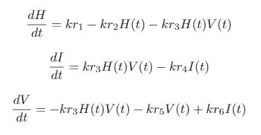
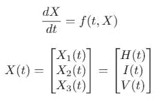

# 数值求解常微分方程系统(一阶常微分方程)

> 原文：<https://levelup.gitconnected.com/numerically-solving-systems-of-ordinary-differential-equations-1st-order-odes-d1d1ebc64051>

用 MATLAB 求解常微分方程组

乔纳森·肯珀在 [Unsplash](https://unsplash.com?utm_source=medium&utm_medium=referral) 上拍摄的照片

常微分方程在不同的应用中扮演着重要的角色。通常，数值技术是解决这些问题的最佳方法。让我们看看如何在 MATLAB 中通过求解一阶常微分方程组来实现这一点。这里我们关注一下艾滋病病毒感染的传播应用。

# 方程式

这些等式是基于健康细胞***【H】***、感染细胞***【I】***和病毒计数***【V】***的量的瞬时平衡。在这个方程组中，带有正号的项增加了细胞或病毒的当量。同样，带负号的短语会减少细胞或病毒的数量。

关于艾滋病传播的三个微分方程

该模型包含六个参数 ***kr1、kr2、kr3、kr4、kr5 和 kr6，*** 提供细胞死亡率、感染传播、病毒复制以及其他影响 HIV 在体内传播的过程。

# 参数值

如上所述，有六个参数及其相应的值。

参数值

# **MATLAB 仿真**

我希望你们都知道，我们可以用 MATLAB 得到一个微分方程的解。然后，让我们看看如何在 MATLAB 中用 ode45 函数求解一个常微分方程组。如前所述，ode45 函数是 MATLAB 中最常用的 ode 求解器。

为此，首先，我们必须将颂诗系统转换成一种新的格式。因此，第一步是将所有这些微分方程组合成一个单一变量的方程式，我们称之为 ***X.***

以“X”的矢量分量表示的值

策略是创建 ***X*** ，一个有三个分量的列向量，每个分量对应一个变量 ***H，I，*** 和 ***V*** 。然后，我们对 ***X*** 的每个元素求导。相应的等式确定原始系统的每个值。

现在我们有了一个向量化的常微分方程系统，下一步是构造一个 MATLAB 函数。此函数计算用于 ode45 函数的导数向量值。我们的' ***模型'*** 函数将为给定的输入值 **t** 和 ***X.*** 生成单个输出 ***dXdt***

用各自的参数值构造的函数

最后一步是通过向我们的导数函数传递一个句柄来调用 ode45 函数，这个函数是一个包含初始和最终时间值的向量。这里的初始条件是 *H_0* = 1000000， *I_0* = 0， *V_0* = 100。

定义的初始条件

# 结论

当我们运行这个脚本时，微分方程的解被记录在输出变量'***【Xsol】'***和 ***'tsol'*** 中。第一个输出是包含用于计算数值解的时间值的向量。第二个输出是包含变量 ***X*** 在***【tsol】***中每次的计算值的矩阵。然后可以提取单个色谱柱进行额外的分析或可视化。

# 参考

诺瓦克和梅，R. M. *病毒动力学:免疫学和病毒学的数学原理:免疫学和病毒学的数学原理*。牛津大学出版社，2000。