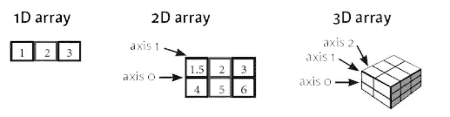

# NumPy 终极备忘单 2021

> 原文：<https://levelup.gitconnected.com/numpy-ultimate-cheatsheet-2021-9dbf8c94f64b>

## 满足您科学计算需求的 NumPy 完整指南

NumPy 是用于数据科学和科学计算的比较流行的 Python 工具之一。它为数组和矩阵提供了一个有效的和可伸缩的接口，从数据类型到涉及这些的操作。因此，这篇文章会给你一个列表，列出一些更相关的和经常使用的 NumPy 函数，以及如何使用它们。


照片由[弗拉多·帕诺维奇](https://unsplash.com/@vlado?utm_source=medium&utm_medium=referral)在 [Unsplash](https://unsplash.com?utm_source=medium&utm_medium=referral) 拍摄

# 目录:

1.  占位符
2.  输入－输出
3.  性能
4.  算术
5.  总计
6.  操纵
7.  奖金

进口货币的惯例是

```
import numpy as np
```

> 请订阅我的 [**电子邮件简讯**](https://tinyurl.com/2npw2fnz) ，在那里我定期用简单的英语和漂亮的可视化总结编程技巧和人工智能研究论文。

# 占位符

*   创建数组

```
np.array([1,2,3])>>> [1,2,3]
```



不同维度的阵列(图片来自 datacamp.com)

*   全零占位符

```
np.zeros(shape=(1,2))>>> [0,0]
```

*   所有 1 的占位符

```
np.ones(shape=(1,2))>>> [1,1]
```

*   均匀间隔阵列(步长)

```
np.arange(start=5, stop=25, step=5)>>> [5,10,15,20]
```

*   均匀间隔阵列(样本大小)

```
np.linspace(start=5, stop=25, num=5)>>> [5,10,15,20,25]
```

*   无规则排列

```
np.random.random(size=(1,2))>>> [0.1, 0.2]
```

# 输入－输出

*   保存数组

```
np.save(file='numpy', arr=a)
```

*   将多个数组保存到未压缩文件中`.npz`

```
np.savez(file='numpy.npz', a, b)
```

*   加载数组

```
np.load(file='numpy.npz')
```

*   从`.txt`装载

```
np.loadtxt(fname='file.txt')
```

*   从`.csv`生成数组

```
np.genfromtxt(fname='file.csv', delimiter=',')
```

*   保存到`.txt`文件(只能保存 1D 或 2D 阵列)

```
np.savetxt(fname='file.txt' X=a)
```

# 性能

*   数组的维数

```
a.shape
```

*   数组长度

```
len(a)
```

*   数组维数

```
a.ndim
```

*   数组的数据类型

```
a.dtype
```

*   转换数据类型:

```
a.astype(int)
```

# 算术

*   减法

```
c = np.subtract(b,a)
c = b - a
```

*   添加

```
c = np.add(b,a)
c = b + a
```

*   分开

```
c = np.divide(b,a)
c = b/a
```

*   乘；成倍增加；（使）繁殖

```
c = np.multiply(b,a)
c = b * a
```

*   指数

```
np.exp(a)
```

*   平方根

```
np.sqrt(a)
```

*   正弦

```
np.sin(a)
```

*   余弦

```
np.cos(a)
```

*   原木

```
np.log(a)
```

# 总计

*   总和

```
a.sum()
```

*   最低限度

```
a.min()
```

*   最高的

```
a.max()
```

*   平均

```
a.mean()
```

*   中位数

```
a.median()
```

*   相关系数

```
a.corrcoef()
```

*   标准偏差

```
np.std(a)
```

# 操纵

*   转置(将维度从(2，1)切换到(1，2))

```
a.T
```

*   使再成形

```
a.reshape(newshape=(2,3))
```

*   子集化

```
a[1,2] #is similar to a[1][2]
```

*   布尔索引

```
a[a<2] #will return elements that satisfy the condition
```

*   垂直连接或堆叠(按行)

```
a = np.array([1, 2, 3])
b = np.array([4, 5, 6])np.vstack(tup=(a,b))>>>[[1,2,3],
   [4,5,6]]
```

*   水平连接或堆叠(按列)

```
a = np.array([1, 2, 3])
b = np.array([4, 5, 6])np.hstack(tup=(a,b))>>>[1,2,3,4,5,6]
```

# 奖金

*   寻求帮助

```
np.info(object=np.ndarray.dtype)
```

*   复制数组

```
b = np.copy(a)
```

*   复制带有视图的数组(如果您更改一个，另一个也会更改)——*不推荐*

```
b = a.view()
```

# 结论

我希望你能从这份小抄中学到一些东西。还有许多更高级的 NumPy 操作没有在本备忘单中介绍，但是这些函数需要额外的练习和解释。请在这里查看 NumPy 的官方文档:[https://numpy.org/doc/stable/index.html](https://numpy.org/doc/stable/index.html)！一如既往，任何意见或反馈都非常感谢！