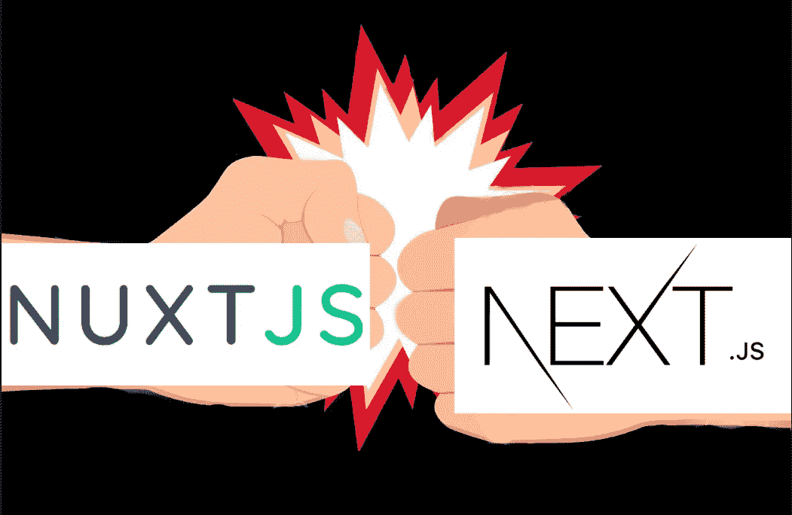
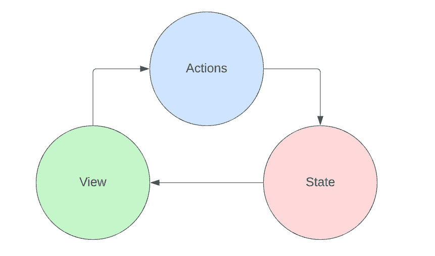

# Nuxt 3 来了！“下一个”是什么？！

> 原文：<https://levelup.gitconnected.com/nuxt-3-is-here-whats-next-2d92aeb34660>

截至【2022 年 3 月，uxt 3 的发布候选是一个令人兴奋的消息。此外，完整的 3.0.0 版本计划于 6 月**日**发布，所以这是你学习新框架的绝佳时机。这是前端开发的最佳框架之一。今天，我要给你 3 个理由**为什么你会在未来的项目中选择 Nuxt 3 而不是 Next.js。**

首先，我想强调的是，这两个框架几乎提供了相同的生活质量。它们都提供 CLI、快速开发、动态路由、SSR、SEO、超快速热重装等等。

这里的关键区别在于，Nuxt 3 是 **Vue 3** 框架，Nex.js 是 **React** 框架。这就是为什么我认为这一切都归结于 Vue 或 React 偏好来决定使用哪个框架。

# 精益:对 JSX 和 Vue 指令做出反应

H 你有没有遇到过这样的情况，你想在 React 中隐藏一个组件，而不知道在 Vue 中如何实现。

在反应中:

在 Vue 中:

当然，你可以用 React 中的 *visible* 属性编写一个组件，但是那是多余的，完全违背了 JSX 的目的。想象一下，有多种情况，那么长的 div 块加上一堆 *{}* 和 *& &* 会变得多糟糕。此外，当你写 JSX 时，它迫使你的大脑用多种语言思考，然后在某些时候你完全失去了对正在发生的事情的控制。有了 Vue，你可以把它分解成模板和脚本，这样阅读起来会更有乐趣。

> " T21 就像服用了类固醇的 HTML . "

# React 挂钩与 Vue 组合 API

看起来很酷，直到你意识到你在代码库中引入了多少样板代码。

在反应中:

你看到了吗，每次定义一个新的状态，我们都需要定义 setSomething？问题不仅仅在于使用状态。大多数钩子都很长。我喜欢 Vue composition API 而不是 React Hooks，因为它感觉更自然和精简。

在 Vue 中:

# 状态管理

在反应中， **Redux** 永远是人们的首选。老实说，这是我用过的最不友好的库之一。首先，你需要写一堆锅炉代码让它工作。第二，当你有更多的状态需要管理时，它会成倍增加。第三，每个 React dev 都在告诉初学者使用它。最近看到同事从 Redux 转到 **MobX** 。

在 Vue 中，你有现成的**反应式 API**，所以你不必做出决定。它做什么都是对的！

总的来说，Nuxt 3 很有前景，值得一试。如果你仍然担心它还没有完全投入生产，好消息是它的第一次全面发布定于 2022 年 6 月**。**

**我希望你今天能学到一些新东西。请考虑订阅并给我一些反馈来支持我的博客，这样我就可以在未来创作更多有影响力的文章。此外，请考虑通过以下方式支持我:**

*   **[我的全新 Patreon(简历/自由职业服务)](https://www.patreon.com/leonto101)**
*   **[中等会员](https://leon101.medium.com/membership)**

**下期帖子再见:)**