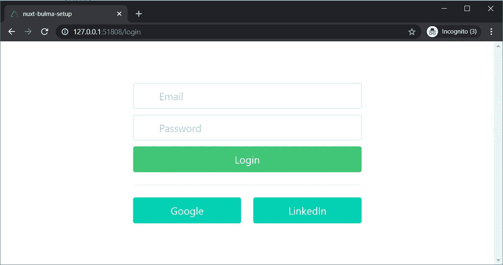

# Nuxt.js 和 font awesome——简单的演练

> 原文：<https://levelup.gitconnected.com/nuxt-js-and-fontawesome-a-simple-walk-through-78f35605d841>


照片由 [Harpal Singh](https://unsplash.com/@aquatium?utm_source=medium&utm_medium=referral) 在 [Unsplash](https://unsplash.com?utm_source=medium&utm_medium=referral) 上拍摄

***更新于 2022 年 6 月。***

👋👋👋学习 Vue.js 找 Vue 工作？查看列出的所有 Vue 工作👇👇👇

[](https://echojobs.io/vuejs-jobs/?found_on=medium) [## 软件工程职位

### 浏览 2022 年 6 月的 1000+ Vue.js 职位，这些职位来自资金雄厚的初创公司，它们现在正在积极招聘。

echojobs.io](https://echojobs.io/vuejs-jobs/?found_on=medium) 

# 背景

如果你读过我的上一篇文章，我们建立了 Nuxt.js 和布尔玛。

[](https://medium.com/swlh/nuxt-js-and-bulma-a-simple-walk-through-be92911b5de4) [## Nuxt.js 和布尔玛——一个简单的演练

### 我已经开始使用 Vue.js，并用 Nuxt.js 编写 web 应用程序，并立即爱上了它的简单性…

medium.com](https://medium.com/swlh/nuxt-js-and-bulma-a-simple-walk-through-be92911b5de4) 

在这篇文章中，我们将讨论如何使用字体牛逼连同 Nuxt.js 和布尔玛。如果你不知道字体真棒，这是一个图标集和工具包，让您添加美丽的矢量图标到您的网站。

# 设置

我将使用我们在上一篇文章中创建的相同存储库。你可以在 GitHub 上的这里查看分支[。目标是创建一个带有图标的登录页面，如下所示:](https://github.com/gaomengen/nuxt-bulma-setup/tree/nuxt-fontawesome)


带有图标的登录页面

你可以看到有 5 个图标:电子邮件，锁定，登录，谷歌和 LinkedIn。我们将解释如何将它们添加到我们的登录页面。但是首先，我们需要准备好页面。幸运的是，有了 Nuxt.js 和布尔玛，这个页面非常容易设置。在我们的存储库中创建一个名为`login.vue`的新文件，如下所示:


创建 login.vue 文件

这段代码生成了一个登录页面。现在运行`yarn dev`，您应该会看到这样一个页面:



没有图标的登录页面

我们使用布尔玛的布局和样式功能来生成上面的页面。它看起来不错，但一些图标可能会使它更好，这是我们接下来要做的。

# 安装字体真棒

有两个版本的字体真棒，我们可以使用:免费和专业。我们将在这里使用免费版本。js 有一个字体 Awesome 模块，要使用它，运行:

```
yarn add @nuxtjs/fontawesome @fortawesome/free-solid-svg-icons @fortawesome/free-brands-svg-icons -Dyarn add @fortawesome/fontawesome-svg-core
```

这个命令安装 Font Awesome core 和它的两组免费图标:solid 和 brands，这是我们实现目标所需要的。

接下来，我们需要配置`nuxt.config.js`来加载图标，这样我们就可以在`login.vue`文件中使用它。

*   首先，将`'@nuxtjs/fontawesome'`添加到`buildModules`到`nuxt.config.js`文件中。
*   其次，配置加载我们需要的图标。这里需要所有的实体和品牌图标来让事情运转起来。

配置好的`nuxt.config.js`应该是这样的。


配置以加载 nuxt.config.js 文件中的图标

配置好要加载的图标后，我们可以在我们的`login.vue`页面中使用它们。打开该文件并在输入标签下添加一个图标，如下所示:


在电子邮件输入标签下添加图标

刷新您的浏览器，您应该会在您的电子邮件输入旁边看到一个漂亮的信封图标:


电子邮件输入中的信封图标

现在，让我解释一下刚刚发生的事情。`<font-awesome-icon :icon="['fas', 'envelope']"/>`由`nuxtjs/fontawesome`模块生成，调用字体牛逼图标。每次需要添加图标的时候，都需要使用这个标签。`'fas'`代表`font awesome solid`，是我们之前和`font awesome brands`一起装的那套。而在`fas` set 里面，有一个叫做`envelope`的图标，这正是我们所需要的。

你可能想知道我们如何找到正确的图标。让我们做一个小练习——在密码输入中添加一个锁图标。为此，我们可以:

1.  在 fontawesome.com 网站上搜索“锁”。你会看到一页不同风格的锁。我们需要的是这样一把坚固的锁:[https://fontawesome.com/icons/lock?style=solid](https://fontawesome.com/icons/lock?style=solid)
2.  打开那个页面，你会看到 HTML 标签`<i class="fas fa-lock"></i>`。
3.  将该标签翻译成 Nuxt.js 样式:`<font-awesome-icon :icon="['fas', 'lock']"/>`

接下来，在密码输入标签下添加这个标签，如下所示:


在密码输入中添加锁图标

之后，刷新你的浏览器，你应该会看到锁图标:


就是这样。我们在密码输入中添加了一个锁图标。现在，您可以在三个按钮上再添加三个按钮:登录、谷歌和 LinkedIn。可以开始在 Font Awesome 网站上搜索，把图标名称翻译成 Nuxt.js 风格。如果你需要的话，我会把它们都列在下面:

```
<span class="icon"><font-awesome-icon :icon="['fas', 'sign-in-alt']"/></span><span class="icon"><font-awesome-icon :icon="['fab', 'google']"/></span><span class="icon"><font-awesome-icon :icon="['fab', 'linkedin']"/></span>
```

您的登录页面的最终外观应该如下所示:


最后外观

# 一些改进

在这一点上，一切都应该工作。但是，如果你想让事情变得更容易或更快，我们可以做两件事。

## 使用自定义组件名称

标签`<font-awesome-icon>`太长了，不能每次都输入。幸运的是，您可以定义自己的定制组件名。在你的`nuxt.config.js`文件中，找到`fontawesome`的部分，添加`component: 'fa'`。就像这样:


添加自定义组件

通过自定义组件名，我们可以使用标签`<fa />`来定义图标，而不是`<font-awesome-icon />`。因此，我们上面定义的图标可以缩短为如下:

```
<fa :icon="['fas', 'envelope']"/>
<fa :icon="['fas', 'lock']"/>
<fa :icon="['fas', 'sign-in-alt']"/>
<fa :icon="['fab', 'google']"/>
<fa :icon="['fab', 'linkedin']"/>
```

更重要的是，对于`fas`中的图标，我们可以只使用图标名称，而不用指定图标集。因此，上面的图标可以简化如下:

```
<fa icon="envelope"/>
<fa icon="lock"/>
<fa icon="sign-in-alt"/>
<fa :icon="['fab', 'google']"/>
<fa :icon="['fab', 'linkedin']"/>
```

## 只加载你需要的图标

到目前为止，我们设置在`nuxt.config.js`文件中加载整个图标集:


加载所有图标集

事实是你只需要加载你需要的图标。在这种情况下，你只需要加载 5 个图标。这将有助于在投入生产时节省资源。

为此，找到需要加载图标的名称。是的，又是人名，但那是在`nuxt.config.js`中使用的人名，而且很容易“猜到”。格式为`fa + PascalCase of the component name`。例如，信封图标名称为`faEnvelope`，签到图标为`faSignInAlt`，LinkedIn 图标为`faLinkedin`。找出名称，然后更新`nuxt.config.js`文件中的`fontawesome`部分，如下所示:


仅加载您需要的内容

您的登录页面应该显示完全相同的页面，有 5 个图标，但有一个自定义的组件名称和一个较轻的负载。

# 结论

我们制作了一个登录页面，上面有好看的图标。布尔玛帮助建立布局和风格的元素。字体牛逼提供了我们需要的图标。而且都是用 Nuxt.js。

如果你有问题或者你有更好的方法，请给我留言。我很想听听！感谢阅读和快乐编码！

👋👋👋学习 Vue.js 找 Vue 工作？查看列出的所有 Vue 工作👇👇👇

[](https://echojobs.io/vuejs-jobs/?found_on=medium) [## 软件工程职位

### 浏览 2022 年 6 月的 1000+ Vue.js 职位，这些职位来自资金雄厚的初创公司，它们现在正在积极招聘。

echojobs.io](https://echojobs.io/vuejs-jobs/?found_on=medium) 

有用的链接

[](https://medium.com/swlh/nuxt-js-and-bulma-a-simple-walk-through-be92911b5de4) [## Nuxt.js 和布尔玛——一个简单的演练

### 我已经开始使用 Vue.js，并用 Nuxt.js 编写 web 应用程序，并立即爱上了它的简单性…

medium.com](https://medium.com/swlh/nuxt-js-and-bulma-a-simple-walk-through-be92911b5de4) [](https://github.com/nuxt-community/fontawesome-module) [## nuxt-社区/font awesome-模块

### 模块在您的 Nuxt.js 项目中使用字体超棒图标。使用 vue-fontawesome 使用 npm 添加依赖项…

github.com](https://github.com/nuxt-community/fontawesome-module) [](https://fontawesome.com/) [## 字体真棒

### 编辑描述

fontawesome.com](https://fontawesome.com/)