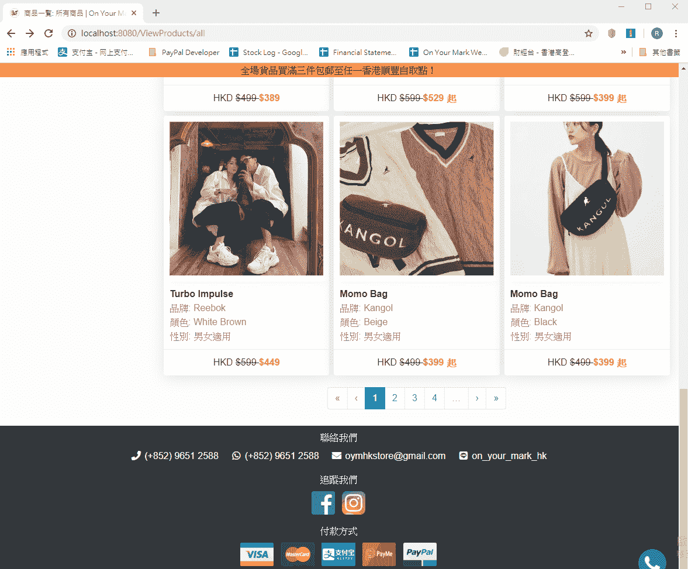
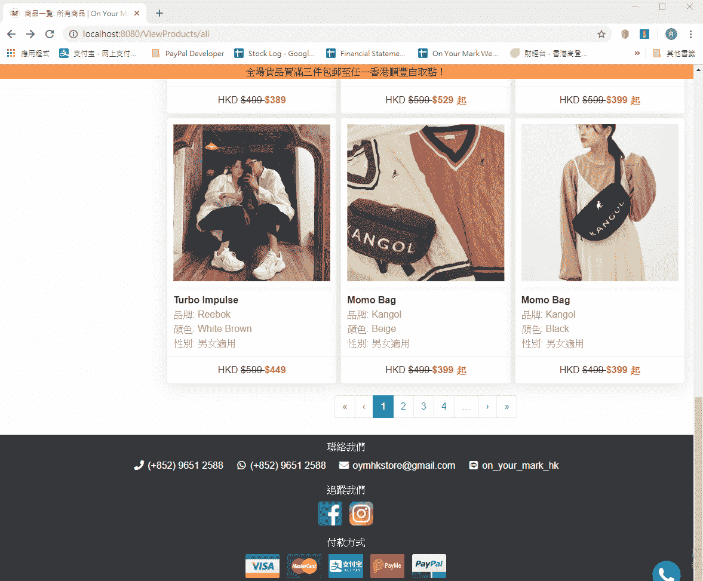

# Nuxt.js —页面加载后触发的自定义 scrollBehavior

> 原文：<https://levelup.gitconnected.com/nuxt-js-custom-scrollbehavior-fired-after-page-loaded-cd94fd6ddd12>

路线之间的滚动行为起着重要的作用，因为它极大地影响了你的网站的可读性。js 允许开发者定制他们自己的滚动行为。然而，在我开始工作后不久，我发现了一个非常令人讨厌的问题，基本上没有人谈论如何解决它。

**问题**

为了定制您的滚动行为，您可以在 Nuxt 路由器中覆盖默认的滚动行为。假设您希望当用户单击“上一页”时，您的页面返回到上一个位置，但是当用户进入新页面时，您的页面滚动回顶部。你可以这样做:

```
export default function (to, from, savedPosition) {
  return savedPosition || { x: 0, y: 0 };
}
```

它看起来很直截了当，**但它不起作用**！问题是**它不会等到带有异步数据的页面完全加载后才开始滚动**。



从上面的 GIF 可以看出，当用户点击上一页时，滚动是在页面加载之前立即完成的。从用户的角度来看，这看起来非常不专业。最重要的是，**滚动位置根本不正确**！

预期内容:



**解决方案**

Nuxt 路由器支持 scrollBehavior 的异步定义。因此，我首先想到的是这样的事情:

```
export default function (to, from, savedPosition) {
  return new Promise(resolve => {
    (...a callback after page loaded).then(() => {
      resolve(savedPosition || { x: 0, y: 0 });
    })
  })
}
```

但问题是，**谷歌**零搜索结果！

为了解决这个问题，我查阅了 scrollBehavior 的官方文档。我发现解决方法比我想象的要复杂得多。以下是我的代码:

```
if (process.client) {
  if ('scrollRestoration' in window.history) {
    window.history.scrollRestoration = 'manual'// reset scrollRestoration to auto when leaving page, allowing page reload
    // and back-navigation from other pages to use the browser to restore the
    // scrolling position.
    window.addEventListener('beforeunload', () => {
      window.history.scrollRestoration = 'auto'
    })// Setting scrollRestoration to manual again when returning to this page.
    window.addEventListener('load', () => {
      window.history.scrollRestoration = 'manual'
    })
  }
}export default function (to, from, savedPosition) {
  let position;//Your Code Starts Hereposition = savedPosition || { x: 0, y: 0 };//Your Code Ends Hereconst nuxt = window.<%= globals.nuxt %>;// triggerScroll is only fired when a new component is loaded
  if (to.path === from.path && to.hash !== from.hash) {
    nuxt.$nextTick(() => nuxt.$emit('triggerScroll'))
  }return new Promise((resolve) => {
    // wait for the out transition to complete (if necessary)
    nuxt.$once('triggerScroll', () => {
      // coords will be used if no selector is provided,
      // or if the selector didn't match any element.
      if (to.hash) {
        let hash = to.hash
        // CSS.escape() is not supported with IE and Edge.
        if (typeof window.CSS !== 'undefined' && typeof window.CSS.escape !== 'undefined') {
          hash = '#' + window.CSS.escape(hash.substr(1))
        }
        try {
          if (document.querySelector(hash)) {
            // scroll to anchor by returning the selector
            position = { selector: hash }
          }
        } catch (e) {
          console.warn('Failed to save scroll position. Please add CSS.escape() polyfill ([https://github.com/mathiasbynens/CSS.escape).'](https://github.com/mathiasbynens/CSS.escape).'))
        }
      }
      resolve(position)
    })
  })
}
```

这是我从默认的 scrollBehavior 中提取的内容。简单地说，你需要首先改变浏览器的滚动行为。之后，您需要将您的滚动挂钩到 Nuxt 实例，告诉它在页面呈现完成后滚动到哪里。就是这样。如果想试试效果如何，也可以直接访问[我的网站](https://onyourmarkhk.com)。

我花了一天的时间来解决这个问题，因为文档非常少。甚至想出一个正确的谷歌关键词都不容易。希望我的文章可以节省你一些时间！