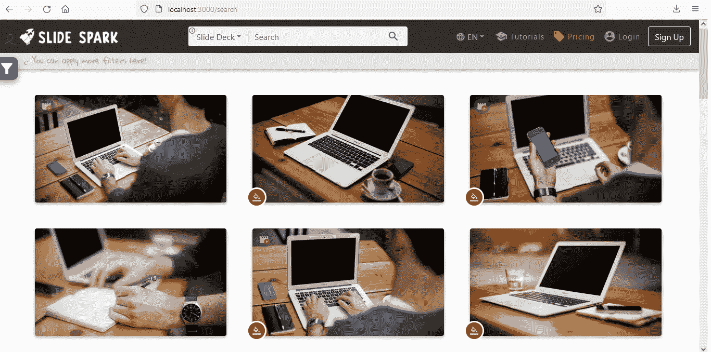
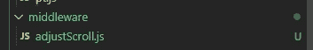
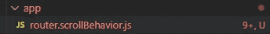
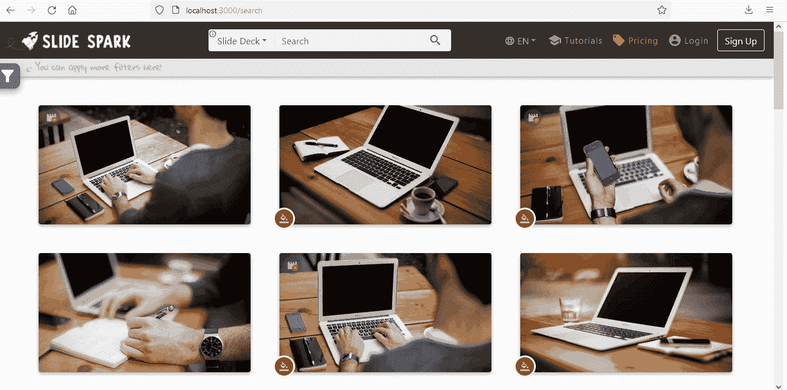

# Nuxt.js |返回没有导航历史的页面时如何保留滚动位置

> 原文：<https://levelup.gitconnected.com/nuxt-js-how-to-retain-scroll-position-when-returning-to-page-without-navigation-history-7f0250886d27>

Nuxt 框架已经提供了一个特性，当用户点击浏览器的 back 按钮时，可以在返回到页面**时保留滚动位置(或者我们使用`$router.go(n)`来触发相同的事件: **popstate navigation** )。**

我当时面临的情况是，需要返回一个带有`$router.replace`而不是`$router.go(-1)`的页面(我在下面解释了这种需要的原因)。这个需求给我出了个问题:`$router.replace` **不触发 popstate 事件**，所以**保持滚动位置**不起作用，页面**总是加载到顶部**。

在本文中，我将详细介绍这个解决方案。激励我写这篇文章的是我没有在谷歌上找到它，我希望它能帮助到某人。

# **问题**

我来详细说说这个问题。我有一个页面，上面有很多卡片和一个登录按钮，这样用户就可以访问这些卡片的详细信息。假设你正在浏览，想登录。登录后，您希望返回您所在的位置。但是看看 Nuxt 的默认行为:



登录后，用户被重定向到顶部的上一页

**认证**后，用户返回到上一页，但是**不再处于他在**的位置。这种行为扰乱了用户体验。

正如我在本文开头所说，这个问题的发生是因为在我的`login.vue`中，我使用`$router.replace`而不是`$router.go(-1)`在登录后返回源页面。你可能想知道，为什么不使用`$router.go(-1)`来解决你的问题呢？使用`$router.replace`是必要的，这样**用户就不能使用浏览器的后退按钮**返回登录屏幕。`$router.go(-1)`允许这样。

# **解决方案**

我们将创建一个**路由器中间件**来**存储**具有 **scrollPos 元属性**的页面的滚动位置(我们也将创建这个)。然后将 Nuxt 的 **scrollBehavior** 更改为当 scrollPos 对象存在于 route 的 meta 属性中时，**在对象中存储的位置**加载页面。

# 1)在 Nuxt 路由器中添加元

在我们想要保留滚动位置的页面上，我们必须用以下对象创建**元属性**:

*(在我的例子中，是有不同卡片的页面，我称之为* `*search.vue*` *)*

```
//**search.vue**export default {
 //...
 **meta: {
  scrollPos: {
    x: 0,
    y: 0
  }
 }**
}
```

逻辑如下，**每一个有这个 **scrollPos 元属性**的页面**，我们将**在这个对象中存储滚动位置**。

# 2)创建路由器中间件

我们将创建一个路由器中间件来检查 route 是否有 scollPos 元属性，如果有，当离开页面时，滚动位置将存储在这个对象上。

在您的 Nuxt 项目中，在文件`**adjustScroll.js**`中创建一个名为`**middleware**`的文件夹:



中间件文件夹

将这段代码粘贴到`**adjustScroll.js**`中:

```
export default function({ from }) { 
  const scrollPos = from?.meta[0].scrollPos
  if (scrollPos && Object.keys(scrollPos).length > 0) {
    scrollPos.y = window.scrollY || 0
    scrollPos.x = window.scrollX || 0
  }
}
```

让我们明白…这个功能会在我们每次在页面间导航时执行。它检查 **scrollPos 对象是否存在于**元属性的数组**中。如果是，它存储滚动位置。**

将该中间件包含在您的 Nuxt 设置中(`**nuxt.config.js**`):

```
//**nuxt.config.js**export default {
  //...
  **router: {
    middleware: ['adjustScroll']
  },**
}
```

好了，我们存储了滚动位置，现在当我们返回页面时，如何滚动呢？下一个话题再看。

# 3)页面加载后的自定义滚动行为

Nuxt 允许我们自定义页面加载后的滚动行为。这就是我们在这里要做的，当 meta 属性中有 scrollPos 对象时，我们将**将页面**滚动到该对象中存储的值**。**

在您的 Nuxt 项目中，创建一个名为`**app**` 的文件夹，并放在文件`**router.scrollBehavior.js**`中:



应用程序文件夹

这个文件允许我们**改变**Nuxt 的**默认滚动行为。由于**不允许我们扩展**，因此[文档](https://nuxtjs.org/docs/configuration-glossary/configuration-router/#scrollbehavior)建议在处更改[中的默认 Nuxt 代码。](https://github.com/nuxt/nuxt.js/blob/dev/packages/vue-app/template/router.scrollBehavior.js)**

我对这段代码做了一些补充，以适应我们的需要，并改变了 nuxt 变量声明的位置。将以下代码复制并粘贴到文件(`**router.scrollBehavior.js**`)中:

> 你的 **linter** 会**抱怨**一些 **Nuxt 自己的内部模板语法**，你可以忽略这些。

```
//**router.scrollBehavior.js**<% if (router.scrollBehavior) { %>
<%= isTest ? '/* eslint-disable quotes, semi, indent, comma-spacing, key-spacing, object-curly-spacing, space-before-function-paren  */' : '' %>
export default <%= serializeFunction(router.scrollBehavior) %>
<%= isTest ? '/* eslint-enable quotes, semi, indent, comma-spacing, key-spacing, object-curly-spacing, space-before-function-paren  */' : '' %>
<% } else { %>import { getMatchedComponents, setScrollRestoration } from './utils'if (process.client) {
  if ('scrollRestoration' in window.history) {
    setScrollRestoration('manual')// reset scrollRestoration to auto when leaving page, allowing page reload
    // and back-navigation from other pages to use the browser to restore the
    // scrolling position.
    window.addEventListener('beforeunload', () => {
      setScrollRestoration('auto')
    })// Setting scrollRestoration to manual again when returning to this page.
    window.addEventListener('load', () => {
      setScrollRestoration('manual')
    })
  }
}function shouldScrollToTop(route) {
   const Pages = getMatchedComponents(route)
   if (Pages.length === 1) {
     const { options = {} } = Pages[0]
     return options.scrollToTop !== false
   }
   return Pages.some(({ options }) => options && options.scrollToTop)
}export default function (to, from, savedPosition) {
  // If the returned position is falsy or an empty object, will retain current scroll position
  let position = false
  const isRouteChanged = to !== fromconst nuxt = window.<%= globals.nuxt %>// savedPosition is only available for popstate navigations (back button)
  const metaScrollPos = nuxt.context.route.meta[0]?.scrollPos 
  if (savedPosition || metaScrollPos) {
    position = savedPosition || metaScrollPos
  } else if (isRouteChanged && shouldScrollToTop(to)) {
    position = { x: 0, y: 0 }
  }if (
    // Initial load (vuejs/vue-router#3199)
    !isRouteChanged ||
    // Route hash changes
    (to.path === from.path && to.hash !== from.hash)
  ) {
    nuxt.$nextTick(() => nuxt.$emit('triggerScroll'))
  }return new Promise((resolve) => {
    // wait for the out transition to complete (if necessary)
    nuxt.$once('triggerScroll', () => {
      // coords will be used if no selector is provided,
      // or if the selector didn't match any element.
      if (to.hash) {
        let hash = to.hash
        // CSS.escape() is not supported with IE and Edge.
        if (typeof window.CSS !== 'undefined' && typeof window.CSS.escape !== 'undefined') {
          hash = '#' + window.CSS.escape(hash.substr(1))
        }
        try {
          const el = document.querySelector(hash)
          if (el) {
            // scroll to anchor by returning the selector
            position = { selector: hash }
            // Respect any scroll-margin-top set in CSS when scrolling to anchor
            const y = Number(getComputedStyle(el)['scroll-margin-top']?.replace('px', ''))
            if (y) {
              position.offset = { y }
            }
          }
        } catch (e) {
          <%= isTest ? '// eslint-disable-next-line no-console' : '' %>
          console.warn('Failed to save scroll position. Please add CSS.escape() polyfill ([https://github.com/mathiasbynens/CSS.escape).'](https://github.com/mathiasbynens/CSS.escape).'))
        }
      }
      resolve(position)
    })
  })
}
<% } %>
```

下面我突出显示了默认模板中我修改了的部分**。我们来了解一下。**

首先，我改变了 nuxt 变量声明的**位置(在默认模板中，它出现在这个条件下面)。这个变量存储了 **Nuxt 上下文**，因为我们需要在下面的条件中访问它，所以我改变了声明的位置。**

第二个变化是在条件句中。我们检查在路由的元属性中是否有一个 scrollPos 对象。如果是这样，我们将存储的值传递给位置变量(它决定滚动)。

```
//..**const nuxt = window.<%= globals.nuxt %>**// savedPosition is only available for popstate navigations (back button)
 **const metaScrollPos = nuxt.context.route.meta[0]?.scrollPos 
  if (savedPosition || metaScrollPos) {
    position = savedPosition || metaScrollPos
  } else if (isRouteChanged && shouldScrollToTop(to)) {
    position = { x: 0, y: 0 }
  }**//...
```

我们的解决方案是完整的。**在元属性**中有 **scrollPos 对象的每个页面**将**存储滚动位置**以备我们返回时使用。如果在某个时候你想让这个页面**加载到顶部**，只需通过编程将 scrollPos 对象更改为{ x: 0，y: 0}

# 最后，我们的中间件运行了



在没有导航历史记录页面之间导航时保留滚动位置

现在登录后的用户返回到他最初的滚动位置:)