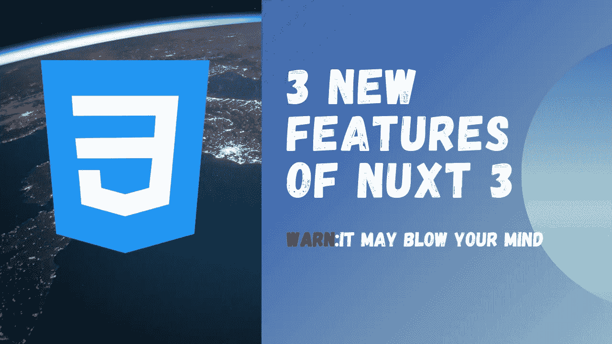

# NuxtJS 3，我们来说说 3 个新特性

> 原文：<https://levelup.gitconnected.com/nuxtjs-3-lets-talk-about-3-new-features-b70fffc5c407>

## Nuxt 3 的科学

## 什么是 Nuxtjs

Nuxt 是生产就绪的 Vue 框架。这和 Nextjs 的反应不相上下。使用 Nuxtjs，您可以创建单页应用程序(spa)和服务器端呈现的应用程序。VueJS 团队已经为 Nuxt 3 工作了大约 16 个月。我们一直在等待，但等待是值得的。Nuxtjs 有很多令人惊讶的特性，但是在本文中我们将讨论 3 个。

## 1.新服务器引擎(Nitro)

Nuxt 应用程序由一个强大的服务器引擎 Nitro 驱动。服务器引擎实现了很多很酷的特性，比如对 Node.js、浏览器、服务工作者等的跨平台支持，无服务器支持开箱即用、自动代码分割和异步加载的块，带有热模块重载的开发服务器。

## 2.自动导入

> Nuxt 自动导入助手函数、组件和 Vue APIs，以便在应用程序中使用，而无需显式导入它们。每个 Nuxt 应用程序也可以基于目录结构为其组件、可组合组件和插件使用自动导入。组件、可组合组件或插件可以使用这些函数。
> 
> ``

简而言之，component 或 composables 文件夹中的任何文件都可以在页面文件夹中使用，而无需导入它。Vue APIs 也可以自动导入。

## 3.改进的数据提取

数据获取，这是在服务器上获取数据并在组件挂载时将其返回给客户端组件的行为，以便组件可以立即访问这些数据。因此，没有数据加载时间。Nuxt 提供了`useFetch`、`useLazyFetch`、`useAsyncData,`和`useLazyAsyncData`来处理应用程序中的数据获取。例子

> `
> 
> <template>
> Page visits: {{ data }}
> </template>iceberg`

## 结论

Nuxtjs 已经得到了很大的功率提升，这只是冰山一角。还有很多其他功能我没有提到。请务必查看 Nuxtjs [文档](https://v3.nuxtjs.org/)。感谢阅读😎