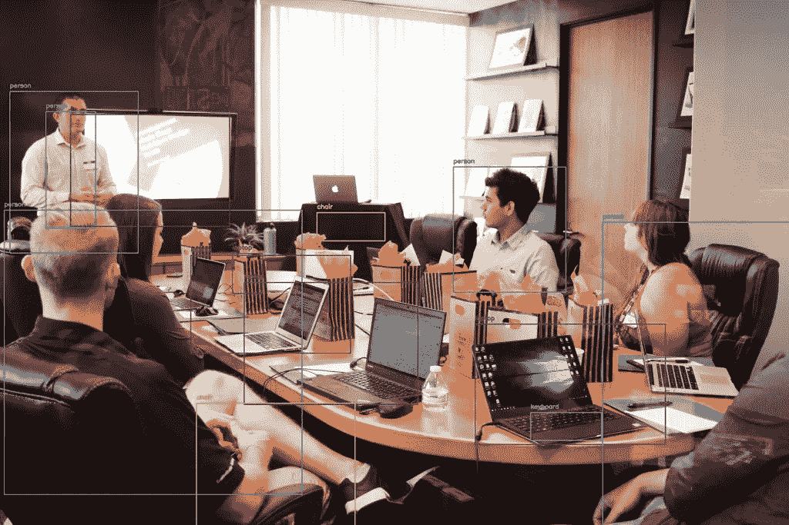
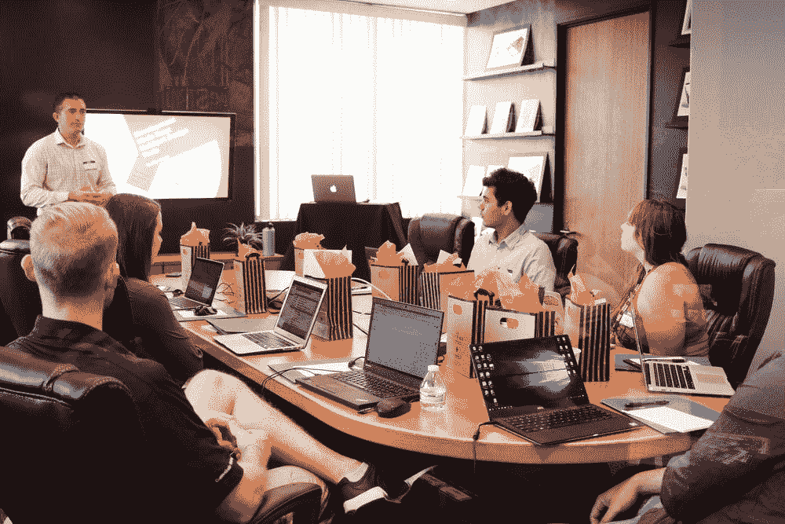

# 用 Cvlib 实现物体检测和包围盒

> 原文：<https://levelup.gitconnected.com/object-detection-and-bounding-boxes-with-cvlib-6340ebefd3eb>

[](https://jorgepit-14189.medium.com/membership) [## 用我的推荐链接加入媒体-乔治皮皮斯

### 阅读乔治·皮皮斯(以及媒体上成千上万的其他作家)的每一个故事。您的会员费直接支持…

jorgepit-14189.medium.com](https://jorgepit-14189.medium.com/membership) 

Python 中使用 cvlib 库的边界框对象检测示例

在这篇文章中，我们将使用 [cvlib](https://www.cvlib.net/) 库为您提供一个使用 Python 中的边界框进行对象检测的示例，这是一个简单、高级、易于使用的 Python 开源计算机视觉库。

# 如何安装 cvlib 库

如果你已经安装了`OpenCV`和`Tensorflow`，你可以`pip install cvlib`，否则，你可以 pip 安装如下:

```
pip install opencv-python tensorflowpip install cvlib
```

# 目标检测

`cvlib`库有一个名为`detect_common_objects()`的函数，返回检测到的标签、边界框坐标和检测到的对象的置信度得分。

让我们创建一个函数，它将图像的文件名、预训练的模型作为输入，在我们的例子中，它将是 YOLOv3 和置信度，并将通过生成一个带有边界框的新图像来返回检测到的对象的标签。

```
import cv2
import cvlib as cv
from cvlib.object_detection import draw_bboxdef object_detection_with_bounding_boxes(filename, model="yolov3", confidence=0.2):# Read the image into a numpy array
    img = cv2.imread(filename)

    # Perform the object detection
    bbox, label, conf = cv.detect_common_objects(img, confidence=confidence, model=model)

    # Print current image's filename
    print(f"========================\nImage processed: {filename}\n")

    # Print detected objects with confidence level
    for l, c in zip(label, conf):
        print(f"Detected object: {l} with confidence level of {c}\n")

    # Create a new image that includes the bounding boxes
    output_image = draw_bbox(img, bbox, label, conf)

    # Save the image in the directory images_with_boxes
    cv2.imwrite(f'images_with_boxes/{filename}', output_image)

    # Display the image with bounding boxes
    display(Image(f'images_with_boxes/{filename}'))
```

让我们试试下面这张从 Unsplash 获得的[图片，我们已经将它保存在我们的工作目录下，命名为](https://images.unsplash.com/photo-1542744173-8e7e53415bb0?ixid=MnwxMjA3fDB8MHxwaG90by1wYWdlfHx8fGVufDB8fHx8&ixlib=rb-1.2.1&auto=format&fit=crop&w=1950&q=80) `[my_image.jpg](https://images.unsplash.com/photo-1542744173-8e7e53415bb0?ixid=MnwxMjA3fDB8MHxwaG90by1wYWdlfHx8fGVufDB8fHx8&ixlib=rb-1.2.1&auto=format&fit=crop&w=1950&q=80)` [。](https://images.unsplash.com/photo-1542744173-8e7e53415bb0?ixid=MnwxMjA3fDB8MHxwaG90by1wYWdlfHx8fGVufDB8fHx8&ixlib=rb-1.2.1&auto=format&fit=crop&w=1950&q=80)



[去飞溅](https://images.unsplash.com/photo-1542744173-8e7e53415bb0?ixid=MnwxMjA3fDB8MHxwaG90by1wYWdlfHx8fGVufDB8fHx8&ixlib=rb-1.2.1&auto=format&fit=crop&w=1950&q=80)

```
object_detection_with_bounding_boxes("my_image.jpg")
```

**输出:**

```
========================
Image processed: my_image.jpgDetected object: laptop with confidence level of 0.7656973004341125Detected object: person with confidence level of 0.6280566453933716Detected object: person with confidence level of 0.5862714052200317Detected object: laptop with confidence level of 0.5759404301643372Detected object: person with confidence level of 0.5740895867347717Detected object: person with confidence level of 0.4282369017601013Detected object: person with confidence level of 0.3663652539253235Detected object: laptop with confidence level of 0.36039528250694275Detected object: chair with confidence level of 0.339595764875412Detected object: tv with confidence level of 0.3152497410774231Detected object: chair with confidence level of 0.3094286322593689Detected object: laptop with confidence level of 0.26004040241241455Detected object: keyboard with confidence level of 0.22592854499816895
```

**和输出图像:**


# 讨论

正如我们所见，我们设法得到了大部分物品，如笔记本电脑、个人、键盘、椅子和电视。如果我们希望通过返回更多检测到的对象来降低算法的严格性，但是假阳性情况的概率更高，我们可以降低置信度。

如果您喜欢这篇文章，您可能会对其他相关教程感兴趣:

*   [带识别的物体检测](https://predictivehacks.com/object-detection-with-rekognition-on-images/)
*   [用 Tensorflow 进行物体检测](https://predictivehacks.com/example-of-object-detection-in-tensorflow/)
*   [图像和视频中的物体检测](https://predictivehacks.com/object-detection-with-yolo/)
*   [OpenCV 中的人脸检测](https://predictivehacks.com/computer-vision-face-detection-in-opencv/)

# 参考资料:

[1] Coursera: [生产中的机器学习介绍](https://www.coursera.org/learn/introduction-to-machine-learning-in-production/supplement/6lQlM/ungraded-lab-deploying-a-deep-learning-model)

最初发布于[预测黑客](https://predictivehacks.com/object-detection-and-bounding-boxes-with-cvlib/)