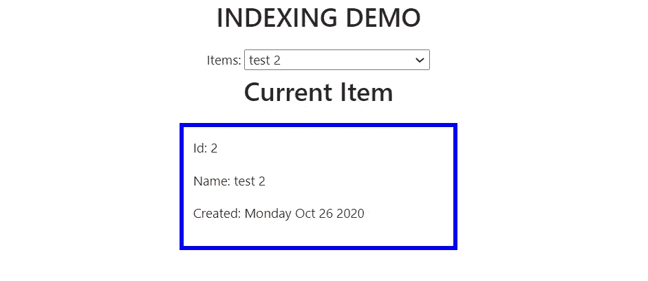

# React 中的对象索引

> 原文：<https://levelup.gitconnected.com/object-indexing-in-react-269295e1eae2>

## 停止过度使用数组函数


格伦·卡斯滕斯-彼得斯在 [Unsplash](https://unsplash.com/s/photos/lists?utm_source=unsplash&utm_medium=referral&utm_content=creditCopyText) 上拍摄的照片

JavaScript 数组方法可能非常方便，但有时会被过度使用。这些数组函数易于调用，少量的代码/降低的复杂性可能会导致开发人员在它们可能不是最有效的方法时过于依赖它们。这就引出了本文的主题，**对象索引**。

索引允许我们将集合中的对象与相关联的某个数字(或索引)相关联。与使用数组中的项的索引来访问该项类似，您可以对对象中的项进行索引，使它们可以在某个键上被访问。查看下面的对象集合，首先作为一个数组，然后作为一个对象。

```
**Array**
[{id: 1, name: "test 1", createdAt: "Sunday Oct 25 2020", "color": "red"}, {id: 2, name: "test 2", createdAt: "Monday Oct 26 2020",  color: "blue"}, ...]**Object** {1: {id: 1, name: "test 1", createdAt: "Sunday Oct 25 2020", color: "red"}, 2: {id: 2, name: "test 2", createdAt: "Monday Oct 26 2020",  color: "blue"}, ...}
```

在数组的例子中，你可以访问数组中的第二项，但是要写`array[1]`。在对象示例中，可以通过写`object[2]`来访问对象中的第二项。

那么索引如何帮助我们做出反应呢？


想象一下在一个数组中有一个项目集合的场景。这些项目作为选项呈现在一个`select`元素中。在`select`元素下面，有一个显示组件，用于呈现所选项的属性(`id, name, createdAt, color`)。请参见下面的示例。



我们可以为`select`元素编写一个`onChange`方法，利用好的 ol’`find`数组方法来更新当前的`item`。大概是这样的:

```
const findItem = (e) =>{
  var newItem = items.find(x=>x.id === e.target.value)
  setItem(newItem) 
};
```

这很好，但是如果数据集更大呢？或者如果操作变得更加复杂呢？如果您要查找的值是集合中某个对象的子对象，该怎么办？

我想说的是，尽管`find`对于我们当前的用例来说并不是非常低效，但当应用程序的复杂性或数据集的大小增加时，它的效率会变得更低。对象索引可以为访问集合中的项目提供快速有效的方法。参见下面的`Items`组件。

```
import {useState, useEffect} from 'react';
import '../App.css';
import SelectedItem from './SelectedItem';
import items from '../items.json';const Items = () =>{

  const [item, setItem] = useState(items[0]) const onChangeItem = (e)=>{
    var id = e.target.value
    findItem(id)
  } const findItem = (id) =>{
    var newItem = items.find(x=>x.id === id)
    setItem(newItem)
  }; return (<div>
    Items: <select style={{width: 200}} value={item.id} onChange={onChangeItem}>
      {items.map(x=>{
        return <option key={x.id} value={x.id}>{x.name}</option>
      })}
    </select>
    <SelectedItem item={item}/>
  </div>);
};export default Items;
```

这里我们使用`find`来检索基于在`select`元素中选择的`id`的项目。如果您试图将整个对象存储为`select`元素的值，您*可能*很难在您的集合中找到`[Object object]`😝。如果我们能够访问一个对象，而该对象的键是项目 id，并且这些键指向伴随的对象，那将会很方便。如果我们没有(比如上面的例子)，我们可以基于 items 数组创建一个。

```
var map = new Object();
items.forEach(x=>{
  map[x.id] = x
})
console.log(map)>  {1: {id: 1, name: "test 1", createdAt: "Sunday Oct 25 2020", color: "red"}, 2: {id: 2, name: "test 2", createdAt: "Monday Oct 26 2020",  color: "blue"}, ...}
```

我们可以使用`useState`将这个对象存储在 state 中，并且我们可以在一个`useEffect`钩子中实现上面的逻辑。

```
const [itemsMap, setTodosMap] = useState(null)useEffect(()=>{
  var map = new Object();
  items.forEach(x=>{
    map[x.id] = x
  })
  setTodosMap(map)
}, [items]) //pass items as dependency so the map gets updated if the items list gets updated
```

这是我们更新的`Items`组件。

```
const Items = () =>{

  const [item, setItem] = useState(items[0])
  const [itemsMap, setTodosMap] = useState(null) useEffect(()=>{
    var map = new Object();
    items.forEach(x=>{
      map[x.id] = x
    })
    setTodosMap(map)
  }, [items]) const onChangeItem = (e)=>{
    var id = e.target.value
    findItem(id)
  } const findItem = (id) =>{
    var newItem = items.find(x=>x.id === id)
    setItem(newItem)
  }; return (<div>
    Items: <select style={{width: 200}} value={item.id} onChange={onChangeItem}>
      {items.map(x=>{
        return <option key={x.id} value={x.id}>{x.name}</option>
      })}
    </select>
    <SelectedItem item={item}/>
  </div>);
};export default Items;
```

现在我们有了地图，我们不再需要使用执行`find`数组方法的`findItem`函数。现在我们需要做的就是使用`onChangeItem`中的`setItem`并将`itemsMap`中已经在`id`索引*的对象传递给它。见下文。*

```
const onChangeItem = (e)=>{
    var id = e.target.value
    setItem(itemsMap[id])
}
```

尽管需要实现更多的代码/逻辑，但从长远来看，每次我们从列表中选择一个新项目时，索引会比使用`find`更有效。通过利用对象索引，我们的 React 应用程序不需要依赖数组方法，如果数据集增长或应用程序复杂性增加，数组方法可能会变得非常昂贵。

这篇文章的源代码可以在 [GitHub](https://github.com/macro6461/medium-object-indexing) 上找到。

[*在这里将你的免费媒体会员升级为付费会员*](https://matt-croak.medium.com/membership) *，每月只需 5 美元，你就可以获得数千位作家的无限量无广告故事。这是一个附属链接，你的会员资格的一部分帮助我为我创造的内容获得奖励。谢谢大家！*

# 参考

[](https://github.com/macro6461/medium-object-indexing) [## macro 6461/介质对象索引

### 这个项目是用 Create React App 引导的。在项目目录中，您可以运行:在…中运行应用程序

github.com](https://github.com/macro6461/medium-object-indexing)