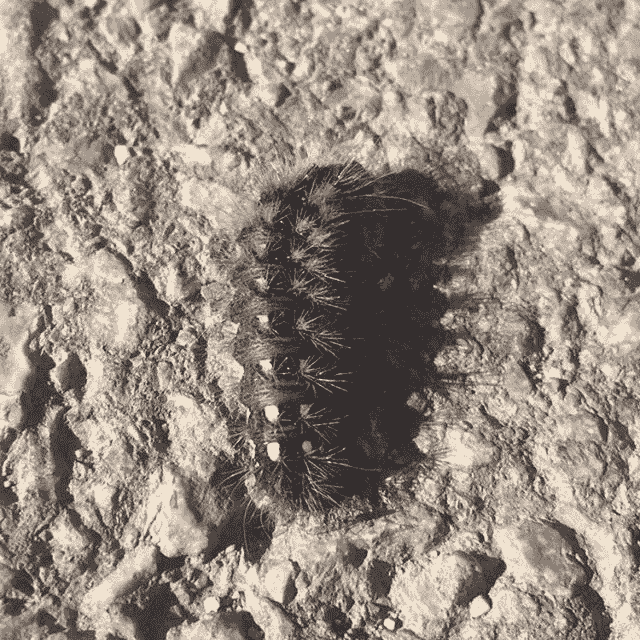
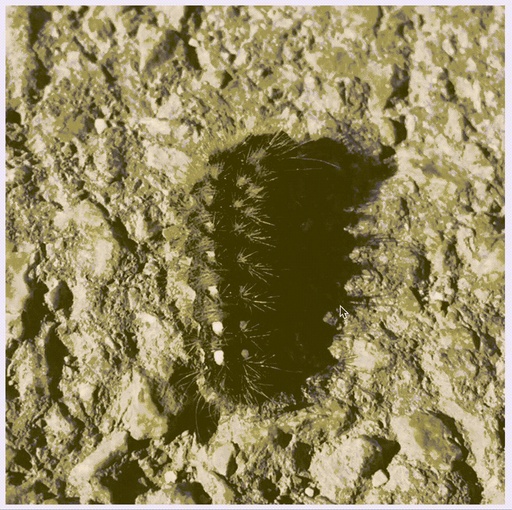

# Vue.js 上的对象标注工具(第 1 部分:绘图框)

> 原文：<https://levelup.gitconnected.com/object-labelling-tool-on-vue-js-part-1-drawing-boxes-3e0b961aa680>

制作自定义对象检测模型是一项非常流行的任务。此外，有很多桌面应用程序可以帮助你贴标签。但是如果你想标记远程呢？或者你想用 CSS 和 JS 在照片上画矩形？这篇文章会帮助你！

首先，我们用 Vue CLI 创建一个新项目:

```
vue create label-demo
```

然后我们启动它并渲染一张照片(我将名为“caterpillar.jpg”的文件放在公共目录中)。不要忘记从`#app`选择器中删除默认的“页边距-顶部:60px”规则，因为它可能会影响检测框的定位。

```
<template>
    <div id="app">
        <h1>Object Labelling Demo</h1>
        **<div id="image-wrapper" :style="{backgroundImage: `url(caterpillar.jpg)`}">
        </div>**
    </div>
</template>
...
<style lang="scss" scoped>
    #app {
        font-family: 'Avenir', Helvetica, Arial, sans-serif;
        -webkit-font-smoothing: antialiased;
        -moz-osx-font-smoothing: grayscale;
        text-align: center;
        color: #2c3e50;

        **#image-wrapper {
            height: 640px;
            width: 640px;
            background-repeat: no-repeat;
            position: relative;
        }**
    }
</style>
```

请注意，此演示假设您的图像具有相同的宽高比(有意义的是，培训配置可能要求您为所有照片确定该值)。之后，将呈现一个以漂亮的毛毛虫图像作为背景图像的 div。



这是一张我们想要检测的图像:)

现在是时候放置我们的第一个检测盒了。我们第一次用静态值渲染它。我们将创建一个名为“盒子”的组件

```
<template>
    <div class="box-wrapper">
        <div class="box" :style="{top: bTop + 'px', left: bLeft + 'px', width: bWidth + 'px', height: bHeight + 'px'}">
        </div>
    </div>
</template>

<script>
    export default {
        name: "Box",
        props: [
            'b-top', 'b-left', 'b-width', 'b-height'
        ]
    }
</script>

<style lang="scss" scoped>
    .box {
        position: absolute;
        border: 2px #90ee90 solid;

        &:hover, &.active {
            background-color: rgba(144, 238, 144, .2);
        }

        z-index: 3;
    }
</style>
```

之后，我们将导入这个组件并使用一些静态数据。这段代码将在毛毛虫周围呈现绿色方框。

```
<template>
    <div id="app">
        <h1>Object Labelling Demo</h1>
        <div id="image-wrapper" :style="{backgroundImage: `url(caterpillar.jpg)`}">
          **<Box b-top="135" b-left="200" b-width="190" b-height="390"/>**
        </div>
    </div>
</template>

<script>
    **import Box from "./components/Box";**
    export default {
        name: 'app',
        **components: {Box},**
    }
</script>
```

结果将是这样的


检测到！

现在终于来画点什么了！实际上这很简单:我们应该添加一些方法，通过创建新的盒子并在`mousemove`上改变它的大小来对`mousedown` - `mouseup`事件做出反应。在`mouseup`之后，我们将刚刚创建的盒子添加到数据中(它的宽度超过 5px)。不要忘记从数据中渲染所有的盒子。代码如下:

```
<template>
    <div id="app">
        <div id="image-wrapper" :style="{backgroundImage: `url(caterpillar.jpg)`}" @mousedown="startDrawingBox" @mousemove="changeBox" @mouseup="stopDrawingBox">
            <Box v-if="drawingBox.active" :b-width="drawingBox.width" :b-height="drawingBox.height" :b-top="drawingBox.top" :b-left="drawingBox.left"/>
            <Box v-for="(*box*, *i*) in boxes" :key="*i*" :b-top="*box*.top" :b-left="*box*.left" :b-width="*box*.width" :b-height="*box*.height"/>
        </div>
    </div>
</template>

<script>
    import Box from "./components/Box";
    import {pick} from 'lodash';

    const getCoursorLeft = (e) => {
        return e.pageX - 10;
    };

    const getCoursorTop = (e) => {
        return e.pageY - 10;
    };

    export default {
        name: 'app',
        components: {Box},
        data: function () {
            return {
                drawingBox: {
                    active: false,
                    top: 0,
                    left: 0,
                    height: 0,
                    width: 0
                },
                boxes: []
            }
        },
        methods: {
            startDrawingBox(e) {
                this.drawingBox = {
                    width: 0,
                    height: 0,
                    top: getCoursorTop(e),
                    left: getCoursorLeft(e),
                    active: true,
                };
            },
            changeBox(e) {
                if (this.drawingBox.active) {
                    this.drawingBox = {
                        ...this.drawingBox,
                        width: getCoursorLeft(e) - this.drawingBox.left,
                        height: getCoursorTop(e) - this.drawingBox.top,
                    };
                }
            },
            stopDrawingBox() {
                if (this.drawingBox.active) {
                    if (this.drawingBox.width > 5) {
                        this.boxes.push({...pick(this.drawingBox, ['width', 'height', 'top', 'left'])});
                    }
                    this.drawingBox = {
                        active: false,
                        top: 0,
                        left: 0,
                        height: 0,
                        width: 0
                    }
                }
            },
        }
    }
</script>
...
```

这就是你将在浏览器中看到的



冥想的

我意识到整篇文章太长了，所以下次我会向你展示我是如何移除盒子并贴上标签的:)