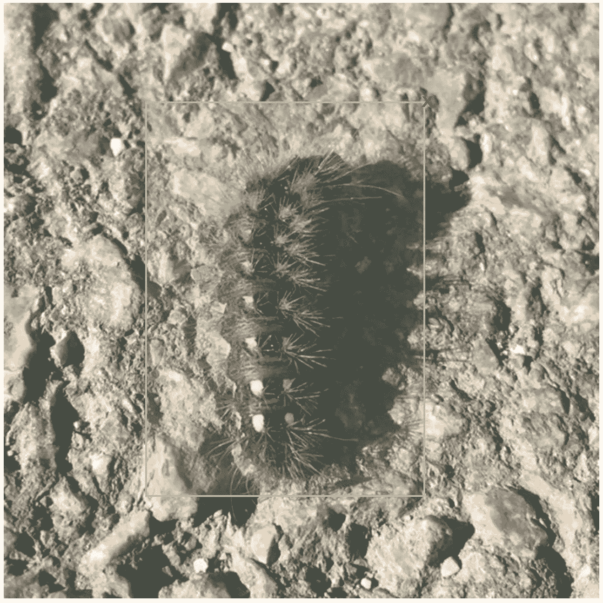
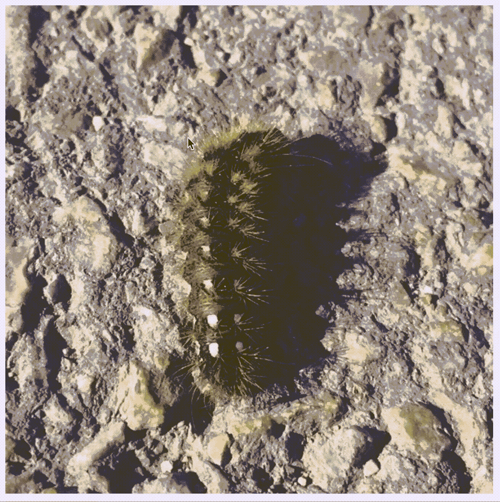
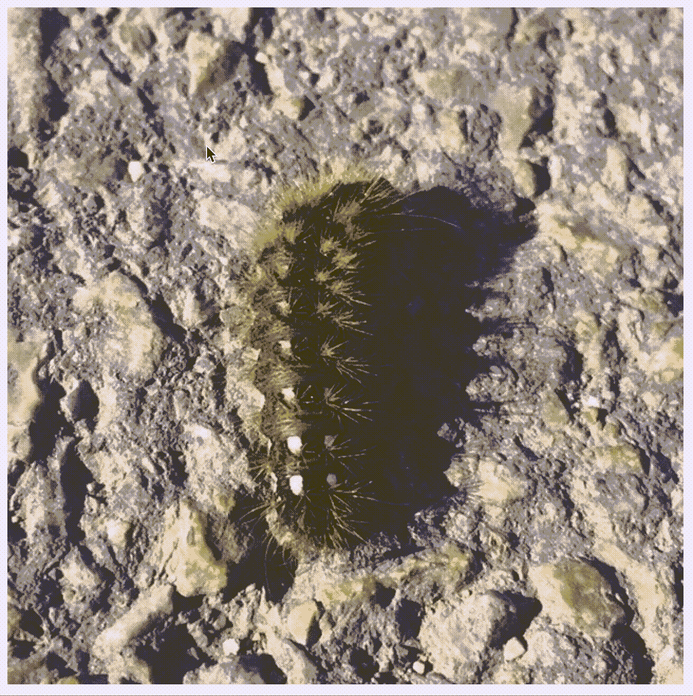

# Vue.js 中的对象标签工具(第 2 部分:选择和移除框)

> 原文：<https://levelup.gitconnected.com/object-labelling-tool-on-vue-js-part-2-selecting-and-removing-boxes-8d7e820bdd4b>

所以，[现在](/object-labelling-tool-on-vue-js-part-1-drawing-boxes-3e0b961aa680)我们可以画多个盒子，但这几乎是我们唯一能做的事情。接下来的步骤应该是移除盒子并贴上标签。我更喜欢从移除开始。实现拖动和调整大小也很棒，但我们至少应该能够删除并再次创建一个框。



这是我们将得到的

首先，让我们使我们的盒子可选择。在前一部分中，我创建了属性`active`来标记当前正在绘制的框。我将使用这个属性，并为`Box`组件添加相应的道具和方法。

```
<template>
    <div class="box-wrapper">
        <div class="box" :style="{
                 top: bTop + 'px', 
                 left: bLeft + 'px', 
                 width: bWidth + 'px', 
                 height: bHeight + 'px'
             }"
             **v-bind:class="{'active': bActive}"
             @mousedown="selectBox"**
        >
        </div>
    </div>
</template>

<script>
    export default {
        name: "Box",
        props: [
            'b-top', 'b-left', 'b-width', 'b-height',
            **'on-select', 'b-active', 'b-index'**
        ],
        methods: {
            **selectBox() {
                this.onSelect(this.bIndex)
            },**
        }
    }
</script>

<style lang="scss" scoped>
    .box {
        position: absolute;
        border: 2px #90ee90 solid;

        &:hover, &.active {
            background-color: rgba(144, 238, 144, .2);
        }

        z-index: 3;
    }
</style>
```

并将所有必要的数据从`App`传递到`Box`

```
<template>
    <div id="app">
        <div id="image-wrapper" :style="{backgroundImage: `url(caterpillar.jpg)`}"
            @mousedown="startDrawingBox" 
            @mousemove="changeBox" 
            @mouseup="stopDrawingBox">
            <Box v-if="drawingBox.active"
                 :b-width="drawingBox.width"
                 :b-height="drawingBox.height"
                 :b-top="drawingBox.top"
                 :b-left="drawingBox.left"/>
            <Box v-for="(*box*, *i*) in boxes" :key="*i*"
                 :b-top="*box*.top" :b-left="*box*.left"
                 :b-width="*box*.width" :b-height="*box*.height"
                 **:b-active="*i*===activeBoxIndex"
                 :on-select="makeBoxActive" :b-index="*i*"**
            />
        </div>
    </div>
</template>
<script>
...
    methods: {
        ...
        **makeBoxActive(i) {
            this.activeBoxIndex = i;
        },**
    }
...
```

您会看到选中的框用浅绿色背景突出显示



不多，但这是诚实的工作:)

现在，如果盒子是活动的，我们应该画一个红色的小叉

```
<template>
    <div class="box-wrapper">
        **<a class="box-delete" 
           v-on:click="removeMyself" 
           v-if="bActive"
           :style="{
               top: (bTop - 18) +'px', 
               left: (bLeft + bWidth) + 'px'
               }">
            x
        </a>**
        <div class="box" :style="{
                 top: bTop + 'px',
                 left: bLeft + 'px',
                 width: bWidth + 'px',
                 height: bHeight + 'px'
             }"
             v-bind:class="{'active': bActive}"
             @mousedown="selectBox"
        >
        </div>
    </div>
</template>

<script>
    export default {
        name: "Box",
        props: [
            'b-top', 'b-left', 'b-width', 'b-height',
            'on-select', 'b-active', 'b-index', **'on-delete'**
        ],
        methods: {
            selectBox() {
                this.onSelect(this.bIndex)
            },
            **removeMyself() {
                this.onDelete(this.bIndex)
            },**
        }
    }
</script>

<style lang="scss" scoped>
    .box {
        position: absolute;
        border: 2px #90ee90 solid;

        &:hover, &.active {
            background-color: rgba(144, 238, 144, .2);
        }

        z-index: 3;
    }
    **.box-delete {
        position: absolute;
        z-index: 6;
        font-weight: bold;
        color: red;
        cursor: pointer;
        font-size: 24px;
        font-weight: bold;
    }**
</style>
```

最后，我们将从`App`中的盒子数据中移除盒子索引的回调传递给`Box`

```
<template>
    <div id="app">
        <div id="image-wrapper"...>
            <Box v-if="drawingBox.active"
                 :b-width="drawingBox.width"
                 :b-height="drawingBox.height"
                 :b-top="drawingBox.top"
                 :b-left="drawingBox.left"/>
            <Box v-for="(*box*, *i*) in boxes" :key="*i*"
                 :b-top="*box*.top" :b-left="*box*.left"
                 :b-width="*box*.width" :b-height="*box*.height"
                 :b-active="*i*===activeBoxIndex"
                 :on-select="makeBoxActive" :b-index="*i*"
                 **:on-delete="removeBox"**
            />
        </div>
    </div>
</template>
<script>
...
    methods: {
        ...
        makeBoxActive(i) {
            this.activeBoxIndex = i;
        },
        **removeBox(i) {
            this.boxes = this.boxes.filter((elem, index) => {
                return index !== i;
            });
            this.activeBoxIndex = null;
        },**
    }
...
```

有用！



如果有什么不清楚的，可以下载[我的回购](https://github.com/kate-kate/label-demo)玩一玩:)