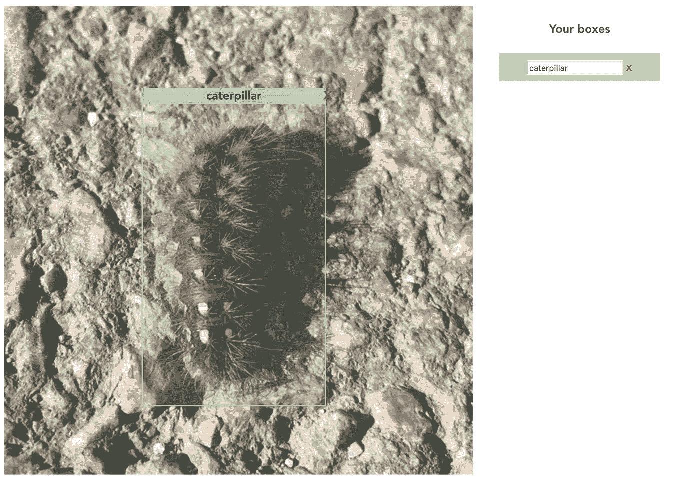

# Vue.js 上的对象标记工具(第 3 部分:标记)

> 原文：<https://levelup.gitconnected.com/object-labelling-tool-on-vue-js-part-3-labelling-f15d4c482143>

现在是时候继续讨论这个问题了。标签是我们在这里的目的。让我们开门见山吧。

如果你需要了解我们如何在 Vue 中绘制方框，请从第 1 部分开始。



这就是我们要通过这种方式实现的目标

首先，我们需要给 Box 组件添加“标签”属性。

```
<template>
    <div class="box-wrapper">
        **<div class="label"
             v-if="bLabel"
             :style="{
                 top: (bTop - 10) + 'px', 
                 left: bLeft + 'px', 
                 width: (bWidth + 4) + 'px'}">
            {{ bLabel }}
        </div>**
        <a class="box-delete"
           v-on:click="removeMyself"
           v-if="bActive"
           :style="{
               top: (bTop - 18) +'px',
               left: (bLeft + bWidth) + 'px'
               }">
            x
        </a>
        <div class="box" :style="{
                 top: bTop + 'px',
                 left: bLeft + 'px',
                 width: bWidth + 'px',
                 height: bHeight + 'px'
             }"
             v-bind:class="{'active': bActive}"
             @mousedown="selectBox"
        >
        </div>
    </div>
</template>

<script>
    export default {
        name: "Box",
        props: [
            'b-top', 'b-left', 'b-width', 'b-height', **'b-label',**
            'on-select', 'b-active', 'b-index', 'on-delete'
        ],
        methods: {
            selectBox() {
                this.onSelect(this.bIndex)
            },
            removeMyself() {
                this.onDelete(this.bIndex)
            },
        }
    }
</script>

<style lang="scss" scoped>
    .box {
        position: absolute;
        border: 2px #90ee90 solid;

        &:hover, &.active {
            background-color: rgba(144, 238, 144, .2);
        }

        z-index: 3;
    }
    **.label {
        position: absolute;
        height: 22px;
        font-size: 16px;
        color: #000;
        font-weight: bold;
        background-color: #90ee90;
        z-index: 4;
    }**
    .box-delete {
        position: absolute;
        z-index: 6;
        font-weight: bold;
        color: red;
        cursor: pointer;
        font-size: 24px;
        font-weight: bold;
    }
</style>
```

所以现在每个盒子都有属性“label ”,我们将输入内容为每个盒子插入一个标签。这是完整的应用程序代码，突出显示了新行。

```
<template>
    <div id="app">
        **<div id="label-bar">
            <h4>Your boxes</h4>
            <ul>
                <li v-for="(*box*, *i*) in boxes" :key="*i*" 
                    v-bind:class="{'active': *i*===activeBoxIndex}">
                    <input v-model="*box*.label" 
                           v-on:click="makeBoxActive(*i*)"/>
                    <a @click="removeBox(*i*)">x</a>
                </li>
            </ul>
        </div>**
        <div id="image-wrapper" :style="{backgroundImage: `url(caterpillar.jpg)`}"
             @mousedown="startDrawingBox"
             @mousemove="changeBox"
             @mouseup="stopDrawingBox">
            <Box v-if="drawingBox.active"
                 :b-width="drawingBox.width"
                 :b-height="drawingBox.height"
                 :b-top="drawingBox.top"
                 :b-left="drawingBox.left"/>
            <Box v-for="(***box***, ***i***) in boxes" :key="***i***"
                 :b-top="***box***.top" :b-left="***box***.left"
                 :b-label="***box***.label"
                 :b-width="***box***.width" :b-height="***box***.height"
                 :b-active="***i***===activeBoxIndex"
                 :on-select="makeBoxActive" :b-index="***i***"
                 :on-delete="removeBox"
            />
        </div>
    </div>
</template>

<script>
    import Box from "./components/Box";
    import {pick} from 'lodash';

    const getCoursorLeft = (e) => {
        return e.pageX - 10;
    };

    const getCoursorTop = (e) => {
        return e.pageY - 10;
    };

    export default {
        name: 'app',
        components: {Box},
        data: function () {
            return {
                drawingBox: {
                    active: false,
                    top: 0,
                    left: 0,
                    height: 0,
                    width: 0
                },
                boxes: [],
                activeBoxIndex: null,
            }
        },
        methods: {
            startDrawingBox(e) {
                this.drawingBox = {
                    width: 0,
                    height: 0,
                    top: getCoursorTop(e),
                    left: getCoursorLeft(e),
                    active: true,
                };
            },
            changeBox(e) {
                if (this.drawingBox.active) {
                    this.drawingBox = {
                        ...this.drawingBox,
                        width: getCoursorLeft(e) - this.drawingBox.left,
                        height: getCoursorTop(e) - this.drawingBox.top,
                    };
                }
            },
            stopDrawingBox() {
                if (this.drawingBox.active) {
                    if (this.drawingBox.width > 5) {
                        this.boxes.push({...pick(this.drawingBox, ['width', 'height', 'top', 'left'])});
                    }
                    this.drawingBox = {
                        active: false,
                        top: 0,
                        left: 0,
                        height: 0,
                        width: 0
                    }
                }
            },
            makeBoxActive(i) {
                this.activeBoxIndex = i;
            },
            removeBox(i) {
                this.boxes = this.boxes.filter((elem, index) => {
                    return index !== i;
                });
                this.activeBoxIndex = null;
            },
        }
    }
</script>

<style lang="scss" scoped>
    #app {
        font-family: 'Avenir', Helvetica, Arial, sans-serif;
        -webkit-font-smoothing: antialiased;
        -moz-osx-font-smoothing: grayscale;
        text-align: center;
        color: #2c3e50;

        #image-wrapper {
            height: 640px;
            width: 640px;
            background-repeat: no-repeat;
            position: relative;
        }

        **#label-bar {
            float: right;
            margin-right: 50px;
            width: 220px;

            ul {
                padding: 0;

                li {
                    list-style-type: none;
                    padding: 8px 16px;

                    &.active {
                        background-color: lightblue;
                    }

                    a {
                        cursor: pointer;
                        display: inline-block;
                        margin-left: 4px;
                        font-weight: bold;
                        color: red;
                    }
                }
            }
        }**
    }

</style>
```

如你所见，我使用了已经存在的函数 *makeBoxActive* 和 *removeBox* 以及相同的*box*数组。在这一步，我们需要添加标签系统的是一个带有输入列表(#label-bar)的侧边栏，突出显示活动输入和单击时显示它们已连接的框，以及一个数据源(框数组)。

当然，这不是完整的标签生命周期，因为我们不保存数据，不上传已经创建的标签和坐标。但是有相当多的格式可以用来保存坐标和标签:csv、xml、json，也许还有你自己的格式。

此外，为了更舒适地工作，还有许多功能需要实现，如标签验证(排除输入错误)、框拖动、框大小调整，所以您在这里看到的是最基本的功能。

请随意评论你想在这个文章周期中看到的东西，以扩展主题，如果有人对此感兴趣，我可能会做续集:)