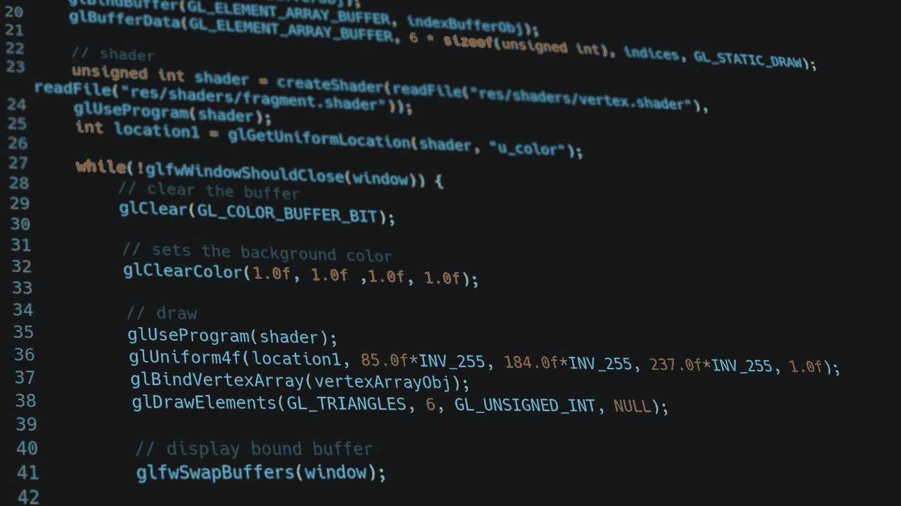

# C++中的面向对象编程

> 原文：<https://levelup.gitconnected.com/object-orientated-programming-in-c-27bcd58bbf5b>

像其他语言一样，C++让你在编写代码时可以选择使用不同的编程范例，而面向对象编程恰好是这些范例之一。



克里希纳·潘迪在 [Unsplash](https://unsplash.com?utm_source=medium&utm_medium=referral) 上拍摄的照片

为了帮助传达一些在面向对象编程中使用的概念，我将从为一个视频游戏开发一个敌人/玩家系统的角度来介绍它们。

所以，让我们假设你正在开发一个游戏，你的角色必须从一个建筑中逃出来，同时必须隐藏起来躲避敌人。你需要做的第一件事是开发一个基类，你可以从这个基类派生出你的玩家和敌人。

```
class base
{
private:
    int m_x = 0;
    int m_y = 0;
    int m_floor = 0;

    unsigned int m_speed = 0;
    unsigned int m_sprint_speed = 0;
    unsigned int m_max_stamina = 0;
}
```

然后我们可以从这个基类中派生出我们的敌人和玩家。这是多态性的一个例子。但是，因为它只继承公共变量和方法，所以我们必须在派生类中包含所有这些变量。

```
class enemy : public base
{
private:
    int m_x = 0;
    int m_y = 0;
    int m_floor = 0;

    unsigned int m_speed = 0;
    unsigned int m_sprint_speed = 0;
    unsigned int m_max_stamina = 0;
};class player : public base
{
private:
    int m_x = 0;
    int m_y = 0;
    int m_floor = 0;

    unsigned int m_speed = 0;
    unsigned int m_sprint_speed = 0;
    unsigned int m_max_stamina = 0;
};
```

虽然让玩家在建筑物周围漫无目的地游荡会让游戏变得更容易，但我们确实需要给他们一点帮助，所以我们引入了导演这个职业。导演类将需要访问玩家和敌人类中的私有数据，所以我们将使它成为基础类、敌人类和玩家类的朋友

```
#include "Director.h"class base
{
    friend class Director
private:
    int m_x = 0;
    int m_y = 0;
    int m_floor = 0;

    unsigned int m_speed = 0;
    unsigned int m_sprint_speed = 0;
    unsigned int m_max_stamina = 0; 
}
```

当你在你的代码中初始化类的时候，你可以做两件事之一:使用 C++内置的默认构造函数或者写你自己的构造函数，我们将做后者。当我们这样做的时候，我们也可以添加析构函数，当你删除一个对象的时候会用到它们

基类目前并不真正需要一个定制的构造函数，所以我们将只使用一个空白的构造函数

```
#include "Director.h"class base
{
    friend class Director
private:
    int m_x = 0;
    int m_y = 0;
    int m_floor = 0;

    unsigned int m_speed = 0;
    unsigned int m_sprint_speed = 0;
    unsigned int m_max_stamina = 0;
public:
    base(); //This is a constructor
    ~base(); //This is a destructor}
```

对于玩家类，我们希望能够设置他们的:最大耐力，冲刺速度和步行速度，这就是为什么我们使用自定义构造函数。

```
class Player : public base
{
    friend class Director;
private:
    int m_x = 0;
    int m_y = 0;
    int m_floor = 0;

    unsigned int m_speed = 0;
    unsigned int m_sprint_speed = 0;
    unsigned int m_max_stamina = 0;
public:
    Player(unsigned int min_speed, unsigned int max_speed, unsigned int max_stamina);
    ~Player();};
```

我们打算在敌人的职业中做同样的事情

```
class enemy : public base
{
    friend class Director;
private:
    int m_x = 0;
    int m_y = 0;
    int m_floor = 0;

    unsigned int m_speed = 0;
    unsigned int m_sprint_speed = 0;
    unsigned int m_max_stamina = 0;
public:
    enemy(unsigned int min_speed, unsigned int max_speed, unsigned int max_stamina);
    ~enemy();};
```

像基类一样，director 也可以有一个空的构造函数。

现在我们已经在头文件中声明了构造函数，我们需要写构造函数在 cpp 文件中做什么。

```
Player(unsigned int min_speed, unsigned int max_speed, unsigned int max_stamina)
    :m_speed(min_speed),m_sprint_speed(max_speed),m_max_stamina(max_stamina)
{
}
```

敌人职业的构造器几乎是一样的。

我之前提到过指挥者职业会帮助敌人职业找到你，所以让我们来实现它，为此我们要使用方法。方法是我们在类中找到的函数。

我们要写的第一个方法将更新玩家的位置

```
#pragma once //This means only include this header file once
#include "base.h"class Director
{
private:
    int player_x = 0;
    int player_y = 0;
    int player_level = 0;
public:
    void update_player_location(Player& player); 
};
```

*   Player&本质上意味着该函数需要一个对 Player 对象的引用

```
#include "Director.h"void Director::update_player_location(Player& player)
{
    player_x = player.m_x;
    player_y = player.m_y;
    player_level = player.m_level;
}
```

如果需要的话，导演也会给敌人的人工智能提供玩家位置的信息。

```
class enemy : public base
{
    friend class Director;
private:
    int m_x = 0;
    int m_y = 0;
    int m_floor = 0; //last known
    int player_x = 0;
    int player_y = 0;
    int player_level = 0;        

    unsigned int m_speed = 0;
    unsigned int m_sprint_speed = 0;
    unsigned int m_max_stamina = 0 enum help
    {
        dont_need = 0, need_some, lost
    };
    help status = dont_need;
private:
    void update_help();public:
    enemy(unsigned int min_speed, unsigned int max_speed, unsigned int max_stamina);
    ~enemy();};
```

我不打算写一个函数来决定敌人的 ai 是否需要来自指挥者的信息，但是本质上它将会查看自从它最后一次看见玩家已经有多长时间了。

```
#pragma once //This means only include this header file once
#include "base.h"class Director
{
private:
    int player_x = 0;
    int player_y = 0;
    int player_level = 0;
public:
    void update_player_location(Player& player);
    void update_enemy(enemy& npc);
};----------------------------------
#include "Director.h"void Director::update_player_location(Player& player)
{
    player_x = player.m_x;
    player_y = player.m_y;
    player_level = player.m_level;
}void Director::update_enemy(enemy& npc)
{
    switch (npc.status)
    {
    case 0:
        break;
    case 1:
         npc.player_level = player_level;
         break;
    case 2:
         npc.player_level = player_level;
         npc.player_x = player_x;
         npc.player_y = player_y;
         break;
   default:
         break;
}
```

需要添加的最后一个方法是动作方法，对玩家来说这是隐藏，对敌人 ai 来说这是攻击。

```
#include "Director.h"class base
{
    friend class Director
private:
    int m_x = 0;
    int m_y = 0;
    int m_floor = 0;

    unsigned int m_speed = 0;
    unsigned int m_sprint_speed = 0;
    unsigned int m_max_stamina = 0;
public:
    base(); //This is a constructor
    ~base(); //This is a destructor virtual void action();
}---------------------------
class enemy : public base
{
    friend class Director;
private:
    int m_x = 0;
    int m_y = 0;
    int m_floor = 0;//last known
    int player_x = 0;
    int player_y = 0;
    int player_level = 0;        

    unsigned int m_speed = 0;
    unsigned int m_sprint_speed = 0;
    unsigned int m_max_stamina = 0enum help
    {
        dont_need = 0, need_some, lost
    };
    help status = dont_need;
private:
    void update_help();public:
    enemy(unsigned int min_speed, unsigned int max_speed, unsigned int max_stamina);
    ~enemy(); void action();
};--------------------------class Player : public base
{
    friend class Director;
private:
    int m_x = 0;
    int m_y = 0;
    int m_floor = 0;

    unsigned int m_speed = 0;
    unsigned int m_sprint_speed = 0;
    unsigned int m_max_stamina = 0;
public:
    Player(unsigned int min_speed, unsigned int max_speed, unsigned int max_stamina);
    ~Player(); void action();}; ---------------------------void base::action()
{
};void enemy::action()
{
    //attack player
};void Player::action()
{
    //hide
};
```

这是一个虚函数的例子，它允许一个函数被写在基类中，但在子类中被修改，并且允许正确的函数被调用，否则如果它不是虚函数，修改它会导致错误。

面向对象编程比范例有好处，比如写起来更快，而且通常会使代码更容易调试。然而，一旦出现问题，它就有可能变得非常糟糕。

我希望这篇文章已经讨论了你在 C++中进行面向对象编程时需要知道的大部分内容，最后，C++中的 OOP 非常有用，应该在可能和有益的地方使用它。