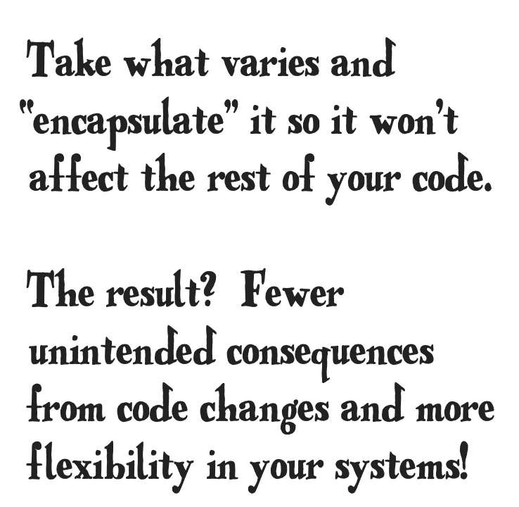
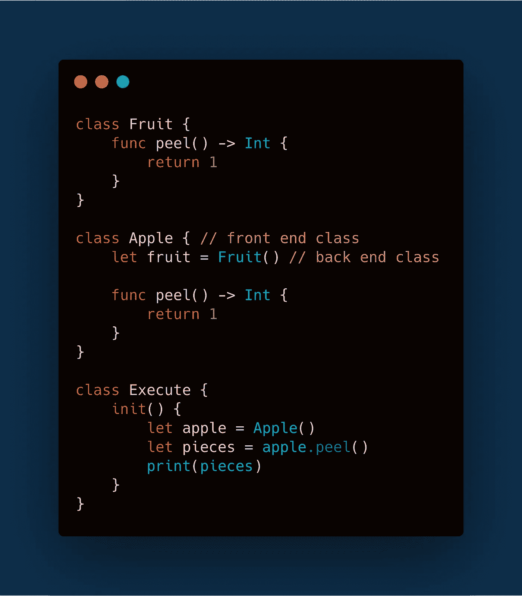

# 面向对象的设计原则

> 原文：<https://levelup.gitconnected.com/object-oriented-design-principles-bb6daf98b185>

## 封装变化的东西，为接口而不是实现编程，更喜欢组合而不是继承，委托原则

[pexels.com](https://www.pexels.com/photo/white-laptop-computer-on-white-wooden-table-3787319/)

编程是对系统进行编码、测试、故障排除、调试和维护的过程。编程原则帮助你写出高质量的代码并保持良好的编码实践。

> *编写代码时，要始终把最终维护你代码的人当成一个知道你住哪儿的暴力精神病患者。* ***——马丁·戈尔丁***

# 以下原则的好处:

*   展开性
*   可读性
*   可维护性
*   模块性

# 封装变化的内容

找出不同之处并封装起来。— *这种方法与关注重新设计的原因相反。不要考虑什么会迫使设计改变，而要考虑你希望在不重新设计的情况下能够改变什么。这里的重点是封装不同的概念。*

头先设计模式

## 理性:

*   当一个变化的概念被恰当地封装在一个模块中时，在发生变化的情况下只有这个模块受到影响。这减少了维护工作和[连锁反应](http://principles-wiki.net/glossary:ripple_effect)。
*   当变化的概念被实现为一个协议时，变化可以被引入而不改变现有的和测试过的代码。这减少了现有代码的测试工作。

**数据变化与包含行为变化**数据变化可以通过注入数据对象来处理。对于行为的变化，隐藏协议背后的潜在变化。然后，当实现改变时，写入协议的软件不需要改变。

一些设计模式使用这些技术来封装不同的概念。

# 类与接口/协议继承

对象的类和类型是不同的。对象的类定义了对象是如何实现的。对象的类型仅指它的协议，即它可以响应的一组请求/要求。该类定义了对象的内部状态及其操作的实现。

一个对象可以有多种类型，即它可以符合多种协议，不同类的对象可以有相同的类型。

这导致了类和接口继承之间的差异。类继承根据共享表示和代码的另一个对象的实现来定义一个对象的实现。接口继承描述了什么时候一个对象可以用来代替另一个对象。

# 编程到接口，而不是实现

> **接口只是签名，他们对实现一无所知。**

接口可以被看作是一个对象和它的客户之间的契约。接口指定了对象可以做的事情。

[pixabay](https://pixabay.com/vectors/plug-socket-adapter-wire-145025/)

类继承是一种通过重用父类中的功能来扩展应用程序功能的机制。它让您几乎免费地获得新的实现，从现有的类中继承您需要的大部分内容。

子类仅仅添加或覆盖操作，并不隐藏父类的操作。然后，所有子类都可以响应这个基类的协议中的请求，使它们成为基类的所有子类型。

**对象类型为接口有什么好处？**

1.  它隐藏了你不需要知道的东西，使对象更容易使用。
2.  它提供了对象行为的契约，所以你可以依赖它

不要将变量声明为特定具体类的实例。相反，只提交给一个接口。

通过抽象对象创建的过程，设计模式为您提供了不同的方法来在实例化时透明地将接口与其实现相关联。创造模式确保你的系统是根据接口而不是实现来编写的。

**“编程到一个接口”实际上意味着“编程到一个超类型”**

通过对超类型[即协议或接口]编程来利用多态性，这样实际的运行时对象就不会被锁定在代码中。我们可以将“编程为超类型”重新表述为“变量的声明类型应该是超类型，通常是接口，这样分配给这些变量的对象可以是超类型的任何具体实现，这意味着声明它们的类不必知道实际的对象类型！”

# 继承之上的组合

在面向对象系统中重用功能的技术是类继承和对象组合。类继承允许你根据另一个类来定义一个类的实现，通常被称为白盒重用，即可见性:通过继承，父类的内部通常对子类是可见的。

对象组合是类继承的替代方法。在这里，新的功能是通过组装或组合对象来获得更复杂的功能。对象组合要求被组合的对象具有定义良好的接口。这种类型的重用被称为黑盒重用，因为看不到对象的内部细节。

通过继承创建的类和对象是紧密耦合的，因为改变继承关系中的超类有破坏代码的风险。通过组合创建的类和对象是*松散耦合的*，这意味着你可以更容易地改变组件部分而不破坏你的代码。由于松散耦合的代码提供了更多的灵活性，许多开发人员已经认识到组合是比继承更好的技术。

**复合超过继承**(或**复合重用原则**)面向对象编程(OOP)中的原则是，类应该通过它们的复合(通过包含实现所需功能的其他类的实例)来实现多态行为和代码重用，而不是从基类或父类继承。

**类继承的优点:**

*   类继承是在编译时静态定义的。
*   这也使得修改被重用的实现变得更加容易。当一个子类覆盖了一些而不是所有的操作时，它也会影响它所继承的操作，假设它们调用了被覆盖的操作。

**类继承的缺点:**

*   首先，您不能在运行时更改从父类继承的实现，因为继承是在编译时定义的。
*   第二，父类通常至少定义其子类的部分物理表示。因为继承将子类暴露给其父实现的细节，所以经常说 ***【继承打破封装】*** 。子类的实现与其父类的实现紧密耦合，父类实现的任何变化都会迫使子类发生变化。
*   当你试图重用一个子类时，实现依赖会引起问题。这种依赖性限制了灵活性，并最终限制了可重用性。解决这个问题的一个办法是只从接口继承，因为它们通常不提供实现。

**构图优势:**

*   对象组合是在运行时动态定义的。
*   对象只能通过它们的接口来访问，这不会破坏封装。任何对象都可以在运行时被另一个对象替换，只要它具有相同的类型。
*   优先使用对象组合而不是类继承有助于保持每个类都被封装并专注于一项任务。你的职业和职业等级将保持较小，并且不太可能成长为难以管理的怪物。基于对象组合的设计将有更多的对象，系统的行为将取决于它们的相互关系，而不是被定义在一个类中。

## 构成与继承:

*   更改后端类(组合)的接口比更改超类(继承)更容易。对后端类接口的更改需要对前端类实现进行更改，但不一定是前端接口。只要前端接口保持不变，只依赖于前端接口的代码仍然有效。相比之下，对超类接口的更改不仅可以将继承层次结构扩展到子类，还可以扩展到只使用子类接口的代码。

*   前端类(组合)比子类(继承)更容易改变接口。正如超类可能是脆弱的，子类可能是刚性的。你不能仅仅改变一个子类的接口，而不确保子类的新接口与其超类型的接口兼容。例如，您不能将一个方法添加到一个子类中，该子类具有与从超类继承的方法相同的签名但不同的返回类型。另一方面，组合允许您在不影响后端类的情况下更改前端类的接口。

*   组合允许您将后端对象的创建延迟到需要时，并在前端对象的整个生命周期中动态地更改后端对象。有了继承，一旦子类被创建，你就可以在你的子类对象映像中得到超类的映像，并且在子类的整个生命周期中它都是子类对象的一部分。
*   添加新的子类(继承)比添加新的前端类(组合)更容易，因为继承伴随着多态性。如果你有一点代码仅仅依赖于一个超类接口，那么这些代码可以不加修改地使用一个新的子类。这对于合成来说是不正确的，除非你使用接口合成。
*   组合比继承提供了更好的类可测试性。

**做什么**做什么**什么时候做**？

*   **想要代码重用？**去作文。
*   **利用多态性？**用协议去构图。
*   **什么时候使用继承？当你有一段关系时。当你认为这是——一个关系将在整个应用程序的生命周期或代码的生命周期中保持不变。**

# 授权原则:

> **不要一个人做所有的事情，把它委派给各自的班级**

运筹学

> **“委托类似于通过对象组合手动完成的继承。”**

这种设计原则的主要好处是没有重复的代码，并且很容易修改行为。

# 参考资料:

 [## 继承之上的组合

### 面向对象编程(OOP)中的复合超越继承(或复合重用原则)是…

en.wikipedia.org](https://en.wikipedia.org/wiki/Composition_over_inheritance)