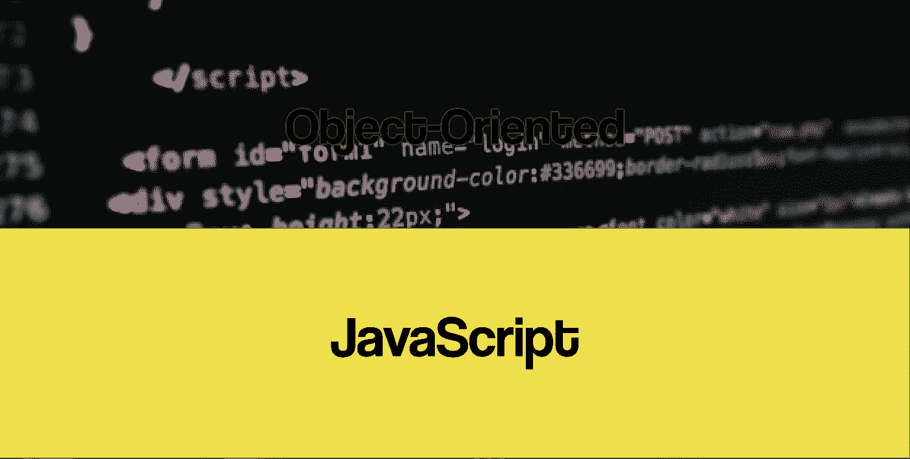
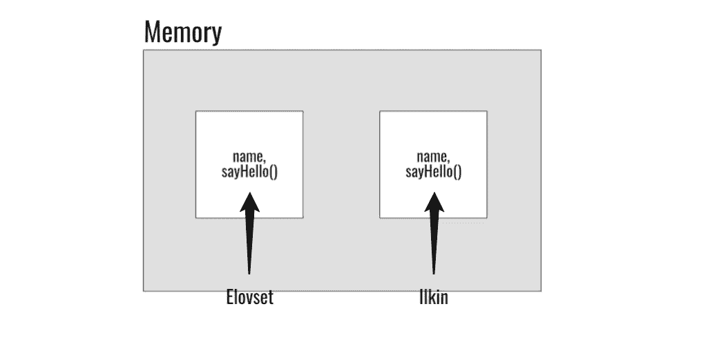
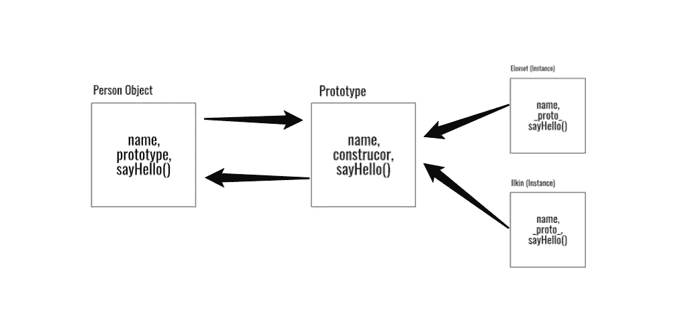

# 面向对象的 JavaScript

> 原文：<https://levelup.gitconnected.com/object-oriented-javascript-da4a24b80a7f>



在本文中，我将为您提供 JavaScript 中 OOP 的基本概述。事实上，本教程不能涵盖整个主题，但会给你一个它是如何工作的想法。

> 我将介绍:

*   **OOP 是什么？**
*   **JS 中的对象**
*   **原型继承**
*   **模块**
*   **封装**

# 1.OOP 是什么？

OOP 是一种围绕对象构建的编程范式。OOP 基本上用于将现实生活中的事物(对象)建模到编程中。它组织代码块，使其可重用，并允许我们在不失去控制的情况下使我们的应用程序更加复杂。可以修改单个对象，而不影响程序的其他方面，因此用面向对象语言编写的程序更容易更新和修改。JavaScript 是面向对象深深扎根的语言之一。

**JS 中的 OOP**

虽然 JavaScript 是一种面向对象的语言，但是大多数人并没有使用它的 OOP 特性。JavaScript 有 5 种原始数据类型(未定义、Null、Boolean、String、Number ),它们都有装箱版本、对象。

```
var a = 1;
var b = new Number(1);
var c = a+b;
typeof(a); //returns ‘number’
typeof(b); //returns ‘object’
typeof(c); //returns ‘number’
```

# 2.JS 中的对象

对象是相关数据和/或功能的集合。我们来想一个现实生活中的物体:汽车。汽车是一个具有颜色、价格、品牌等属性的物体，同时也具有驾驶、左转或右转、漂移等功能。让我们把它和纲领性对象联系起来。

```
var car = {
  color: 'black',
  price: $50.000,
  brand: 'BMW 5 series',
  drive: function() {
   //some code
  },
  turn: function(direction) {
    //some code
  },
  drift: function() {
    //some code
  },
};car.brand; //returns 'BMW 5 series'
car.turn(right); //executes the functionality
car.color; //returns 'black'
```

在这个例子中，car 是一个 JavaScript 对象，它有 3 个属性(颜色、价格、品牌)和 3 个方法(驾驶、转弯、漂移)。我们可以访问带有点符号的对象属性和方法，如:`objectName.property; objectName.method(arg)`

我们也可以用括号符号访问对象的属性，将它们视为关联数组:`objectName['property'];`

JavaScript 是一种动态语言，因此向对象添加属性和方法非常容易。下面的代码将把带有值的“year”属性和“stop”方法添加到汽车对象:`car.year = ‘2018’; car.stop = function(){ //some code here};`

接下来我们要知道的关于对象的事情是`this`关键字。`this`关键字指向我们在其中编写代码的当前对象(它的所有者)。让我们看一个例子:

```
var person = {
  name: 'Ilkin',
  sayHello: function() {
    alert('Hello, ' + this.name + '.');
  }
}
```

在本例中，第 4 行的`this.name`是指 person 对象的 name 属性。

我们已经成功地构造了 JavaScript 对象。因为对象和类不一样，实际上它们是类的实例，我们不能获取我们创建的对象的实例。但是如果我们想创造另一个叫埃洛夫塞特的人呢？我们每次都需要重建 person 对象，这看起来并不冗长。相反，我们可以使用构造函数(称为`Object Constructor`)创建对象，并构建它的一个实例，如以下代码所示:

```
var Person = function(name){
  this.name = name;
  this.sayHello = function() {
    alert('Hello, ' + this.name + '.');
  };
}var elovset = new Person('Elovset');
elovset.sayHello(); //alerts 'Hello, Elovset.'var ilkin = new Person('Ilkin');
ilkin.sayHello(); //alerts 'Hello, Ilkin.'
```

然而，这种方法在内存使用方面有一个缺点。当我们创建一个 Person 实例时，每个实例都创建自己的构造函数，每个实例都有不同的属性和方法，这会破坏内存。



所有实例都发生在内存中

因为这个问题，我们要学习`prototypes`。

# 3.原型继承:

因为 JavaScript 没有直接的类支持(ES6 有一些语法糖)，所以它也没有继承的概念。相反，我们使用`prototype`来实现相同的功能。我们会看到原型继承概念比基于类的继承概念更强大。原型也是一个对象，这意味着原型也可以定义原型。使用这个概念的好处是，当我们将函数附加到原型上时，只存在函数的一个副本，这样可以节省内存。我们可以为原型分配如下功能:

```
var Person = function(name){
  this.name = name;
}Person.prototype.sayHello = function(){ console.log('Hello, ' + this.name); }var elovset = new Person('Elovset');
elovset.sayHello(); //Hello, Elovset is written to the console
```

> 当我们把一个构造函数赋给一个原型时，这个原型就变成了这个构造函数的一个对象，这个对象可以被它的所有实例访问(共享)。



由于原型 via _proto_ property，实例不会出现在内存中

让我们更深入地看看这个例子:

```
//Creating empty constructor function
var Person = function(){
}
Person.prototype.name = 'Ilkin';
Person.prototype.nameIt = function(name){this.name = name;}var elovset = new Person();elovset._proto_; //Returns prototype object
elovset.name; //returns 'Ilkin'
elovset.nameIt('Elovset');
elovset.name; //returns 'Elovset'var kichikxanim = new Person();
kichikxanim.name; //returns 'Ilkin'//adding new properties and methods to prototype
Person.prototype.surname = 'Guluzada';
Person.prototype.sayHello= function(){alert('Hello, ' + this.name)};
elovset.surname; //returns 'Guluzada'
elovset.sayhello(); //alerts 'Hello, Elovset'
```

从上面的示例代码中可以看出，我们可以更改实例属性，但是原型属性仍然保持不变。我们还可以向原型添加属性和方法，并且可以通过所有实例访问它。此外，当我们更改 prototype 中的属性或方法时，它将在构造函数的所有实例中更新。

# 4.模块

模块是应用程序的不同部分，包含代码块并具有不同的功能。再想想汽车——车轮、车门、车架、油门踏板等等。是组装成整辆汽车的零件(模块)。模块在所有严肃的 JavaScript 应用程序中广泛使用，在我们的应用程序中使用模块有几个好处:可重用性、维护和命名空间。与类和继承一样，JavaScript 本身不支持模块，但是有一些方法可以实现模块。以下是他们的例子。

*   **模块模式**

```
(function () {// All variables in closure scope are private
  var name = 'Elovset' var sayHello = function(){
    return 'Hello, ' + name;
  } console.log(sayHello());}());// ‘Hello, Elovset’
```

为了从全局范围区分变量和方法，我们使用匿名闭包。`(function(){ //some code }())`里面的一切都属于闭包作用域，不是全局的。这有助于解决全局范围内的变量或方法混合，并让我们组织我们的代码结构。这种方法几乎没有模仿其他语言(Java、C#、Python)中的类概念。

*   **单个对象(又称对象文字作为名称空间)**

```
var myModule = {};myModule.name = 'Ilkin';
myModule.sayHello = function(){
    return 'Hello, ' + this.name;
  };var helloText = myModule.sayHello();
```

这种方法是解决问题的基本方法。因为对象的每个属性本身就是一个变量，所以我们可以用对象的属性来区分全局变量。

通过执行以下操作来检查我们试图创建的名称空间是否存在是一个很好的实践:`var myModule = myModule || {};`。在这段代码中，它检查`myModule`名称空间是否存在，如果不存在，我们就创建一个。

*   **CommonJS**

CommonJS 模块本质上是一段可重用的 JavaScript，它导出某些对象，并通过编程使它们可用。如果你想深入研究，你应该检查[这个](https://requirejs.org/docs/commonjs.html)。以下代码是如何导入和导出模块的示例:

```
//Inside of a JS file
function myModule() {this.sayHello = function() {
    return 'Hello!';
  } this.sayBye = function() {
    return 'Bye!';
  }}
//We export myModule
module.exports = myModule;//Inside of another JS file
//We import myModule
var myModule = require('myModule');var instance = new myModule();
instance.sayHello(); //returns 'Hello!'
instance.sayGoodbye(); //returns 'Goodbye!'
```

# **5。封装**

封装是面向对象编程中的一个关键概念。它描述了将数据和方法捆绑在一个单元中的思想。基本上，我们将一些数据隐藏在对象之外。同样，JavaScript 不像其他语言那样支持私有和公共关键字，但是我们可以用不同的方法实现同样的事情。默认情况下，我们在创建类属性时使用`this`关键字。使用`this`关键字可以公开我们的属性。如果我们想让我们的属性私有，我们只需要定义没有`this`的变量。

```
var Person = function(nameU, surnameU){ //Public Property 
  this.name = nameU; //Private Property
  var surname = surnameU;

  //Accessing Private Property
  this.getSurname = function()
    { 
     return surname;
    }
}var elovset = new Person('Elovset', 'Qelbiyuva');elovset.name; //returns 'Elovset'
elovset.surname; //returns undefined
elovset.getSurname(); //returns 'Qelbiyuva'
```

还有一种封装方法叫做`Revealed Module Pattern`:

```
var Person = (function(){ 

    *//Private members*
    var surname = 'Qelbiyuva';

    return{
       *//Public members*
       name: 'Elovset',

        sayHello: function(){
            console.log('Hello, ' + this.name);
        }
    }
})();person.surname; //returns undefined
person.name; //returns 'Elovset'
person.sayHello(); //returns 'Hello, Elovset'
```

# 摘要

在今天的文章中，我们首先从总体上讨论了 OOP 范例，然后是 JavaScript。其次，我们看看创建对象的方法，以及如何构建对象的实例。第三，我们看了构造函数和继承原型。之后，我们看了一下模块(CommonJS)及其实现。最后，我们讨论了封装及其用法。这些概念都在 ES5 和 ES6 之前。我计划在接下来的几周里用新版本的 JavaScript (ES5，ES6)来编写 OOP。

了解更多关于 Javascript 中 OOP 的资源:

```
#1: [https://developer.mozilla.org/en-US/docs/Learn/JavaScript/Objects/Object-oriented_JS](https://developer.mozilla.org/en-US/docs/Learn/JavaScript/Objects/Object-oriented_JS)#2: [https://www.udacity.com/course/object-oriented-javascript--ud711](https://www.udacity.com/course/object-oriented-javascript--ud711)#3: [https://www.packtpub.com/web-development/object-oriented-javascript](https://www.packtpub.com/web-development/object-oriented-javascript)#4: [http://shop.oreilly.com/product/9780596806767.do](http://shop.oreilly.com/product/9780596806767.do)
```

我希望你喜欢并在本教程中学到了很多！

***鼓掌，分享更多！:)***

如有任何疑问，请通过以下方式联系我:contact@ilkin-guluzada.com

[](https://levelup.gitconnected.com)[](https://gitconnected.com/learn/javascript) [## 学习 JavaScript -最佳 JavaScript 教程(2019) | gitconnected

### 前 65 名 JavaScript 教程-免费学习 JavaScript。课程由开发人员提交并投票，从而实现…

gitconnected.com](https://gitconnected.com/learn/javascript)