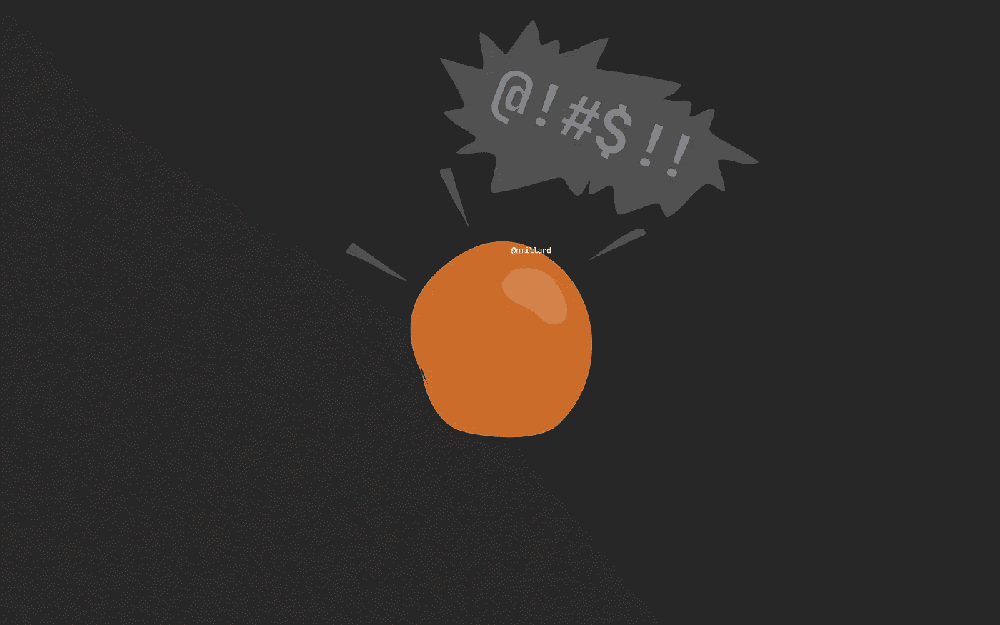

# 面向对象的思维对你来说太复杂了

> 原文：<https://levelup.gitconnected.com/object-oriented-thinking-is-too-complex-for-you-76d59ccd3734>

## 固执己见的

## 尤其是计算机专业的学生，对这个话题很难理解。



尼克拉斯·米勒德的图片。

如果你发现面向对象编程困难而乏味，你并不孤单。一个简单的谷歌搜索“为什么面向对象这么难”显示了一大堆沮丧的想要成为开发者的人。

面向对象编程绝对令人敬畏，它为极其灵活、可测试和易读的代码铺平了道路。尽管这很难做对，而且 OOP 产生了比平常更多的糟糕代码。

对于初学者或门外汉来说，面向对象编程看起来就像一堆时髦词汇，几乎没有内在含义。尤其是如果你已经放弃了它或者同意了 Dijkstra 的观点，OOP 是一个可怕的想法，仅仅因为你不能理解它。

阅读包含以下每一个概念的文章并不罕见。

面向对象编程、OO 思维、DDD、引用和值类型、设计模式、坚实的原则、干净的代码、多态性、继承和封装(OOP 的三大支柱)。举几个例子。

> 要做最简单的事情，你必须掌握的概念数量是惊人的。

难怪任何初学者在开始学习使用 OOP 语言编码时都会不知所措。

## 面向对象编程需要高级思维。

这并不是说你可能永远不会学习 OOP，因为它是一个高级的话题。我只是试图表达学习面向对象的概念是困难的。

作为一个初学者，你的盘子里已经装满了试图理解变量、常数、类、对象、函数和方法等的东西。把面向对象的思想扔进混合物中是不必要的分心。

即使你对算法和数据结构有了很好的理解，我相信你仍然会为使用 OOP 完成简单的任务而挣扎。

## 我明白为什么许多开发人员宣称 OOP 是“坏的”

这并不容易。我明白了。如果你是那种期待出现就能获得奖杯的人，OOP 不适合你。

要想在面向对象的思维方面有所建树，需要付出很大的努力。最初，这令人沮丧，需要大量的试错。

作为初学者，由于几个与代码无关的原因，OOP 也更难阅读。

首先，如果您不熟悉用类建模的领域，那么几乎不可能理解为什么一段代码会存在。

其次，OOP 是一门手艺，天生固执己见。如果你思想封闭，那么你更有可能丢弃任何不符合你世界观的代码。对我的 [if-else 抨击](https://medium.com/swlh/stop-using-if-else-statements-f4d2323e6e4)、if-else 的[替代方案](https://medium.com/swlh/5-ways-to-replace-if-else-statements-857c0ff19357)以及 if-else 的[多态性](/if-else-is-a-poor-mans-polymorphism-ab0b333b7265)的回应就是对此的证明。

## 实现 OOP 设计模式是为了摆脱 if-else 导致的疯狂。

任何开发人员，无论是否自学，首先要做的事情之一就是 if-else 语句。你必须学会在任何问题上抛出 if-else。

为了有效和高效地使用面向对象编程，你肯定需要学习设计模式。一旦你系好安全带，开始阅读常见的设计模式，例如[策略](/simple-strategy-pattern-using-attributes-880c55988215)、[工厂](https://medium.com/swlh/factory-pattern-without-switch-this-is-how-it-should-be-done-cd895e356f44)、[装饰](https://medium.com/swlh/creating-configurable-classes-that-are-easy-to-use-69d78d6881a2)、[中介](https://medium.com/swlh/dynamic-command-dispatching-in-c-d3abe21b3d1b)和 [CQS](/replacing-if-else-with-commands-and-handlers-527e0abe2147) ，你可能会注意到许多模式都有一个共同点:缺少传统的分支，即 if-else 和 switch 语句。

从只知道如何使用 if-else 过渡到更合适的方法，如多态，是您发展技能和扩展编码库的明显标志。不过，这种转变确实引发了一些对变革的抵制。

# 那么，如何才能提高呢？

思想开放，一次解决一个问题。阅读一堆关于同一主题的文章来获得输入和不同的观点。接受你一开始不会理解所有的代码和方法。

别自欺欺人了。面向对象编程是一个高级的话题，大学老师集中使用它作为编程入门不是你的错。

仅仅因为你被教导以一种特定的方式做事并不意味着那是唯一的方法。除非是 if-else，那就是错的。开玩笑，我也确实认识到[有时需要写一些无耻的垃圾代码](/write-shameless-garbage-code-ba6f79d46ed9)。


**Nicklas Millard** 是一名软件开发工程师，供职于一家发展最快的银行，负责构建关键金融服务基础设施。

此前，他是 Big4 的高级技术顾问，为商业客户和政府机构开发软件。

> [新的 YouTube 频道(@Nicklas Millard)](https://www.youtube.com/channel/UCaUy83EAkVdXsZjF3xGSvMw)
> 
> *连接上* [*LinkedIn*](https://www.linkedin.com/in/nicklasmillard/)

```
**Resources for the curious**
--------------------------
Introduction to Change without Migraines by Rick Maurer, 2009
```