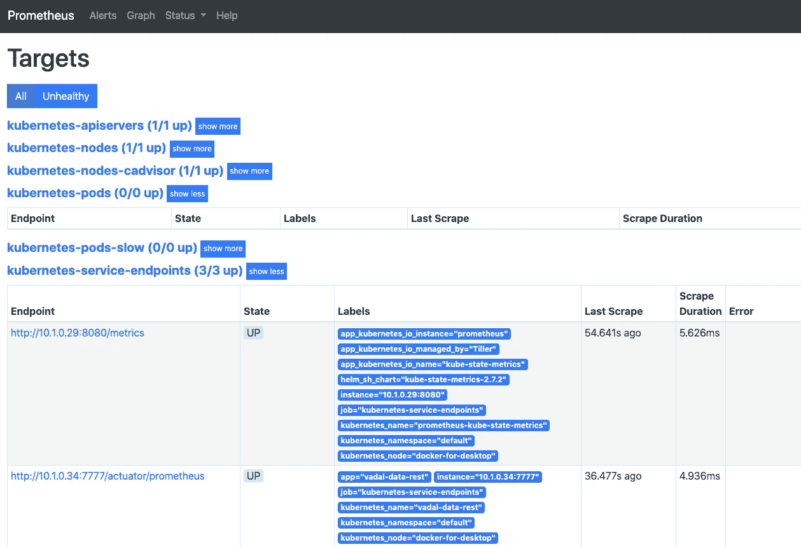
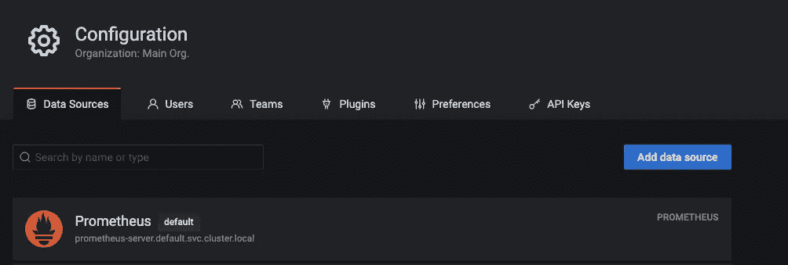
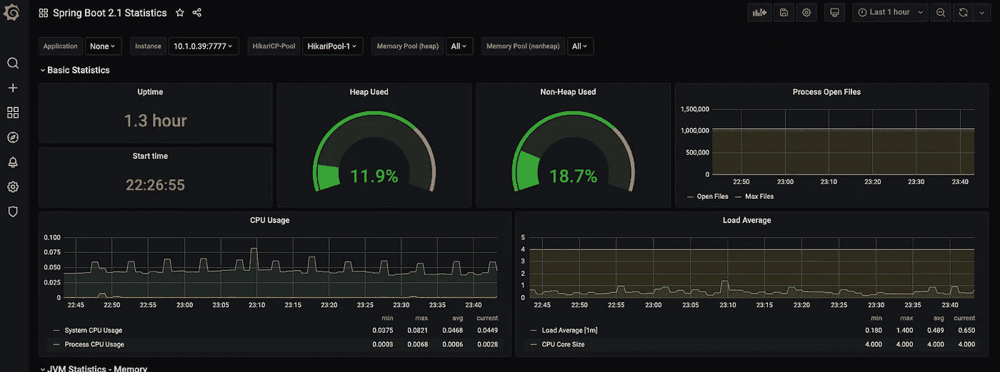
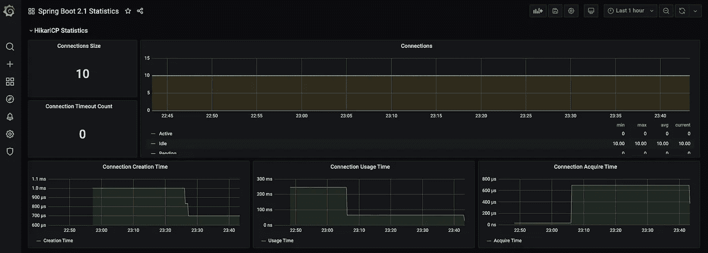
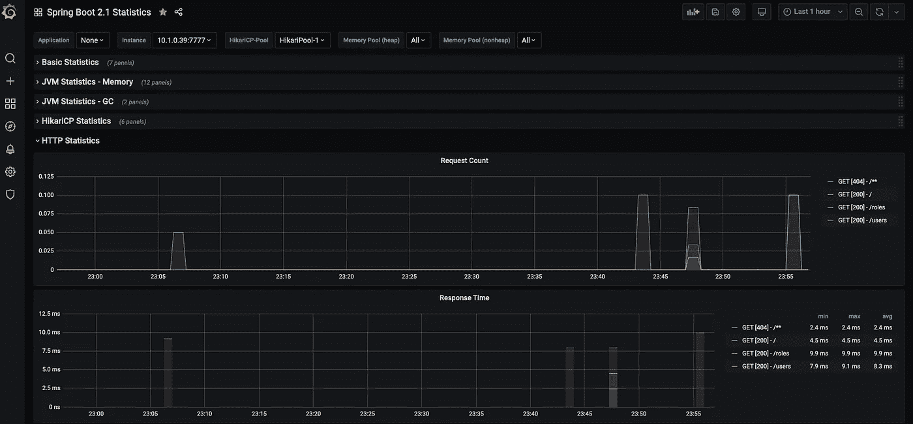

# Prometheus 和 Grafana 对 K8s 中跳羚服务的可观测性

> 原文：<https://levelup.gitconnected.com/observability-of-springboot-services-in-k8s-with-prometheus-and-grafana-61c4e7a9d814>


在 kubernetes (k8s)中，我们可以与 Prometheus 和 Grafana 一起监控我们的春装服务并获得关于它的见解。

继续我们之前的帖子，[春季数据来自 Kubernetes](https://medium.com/@lightphos/spring-data-rest-service-on-kubernetes-675dcbbdffc6) 。我们向 **vadal-data-rest** 服务 pom.xml 添加以下依赖项

```
<!-- Micrometer Prometheus registry  -->
<dependency>
    <groupId>io.micrometer</groupId>
    <artifactId>micrometer-registry-prometheus</artifactId>
</dependency>
```

**构建映像并部署到 k8s**

> mvn spring-boot:构建映像

docker 图像应该有一个更新

> *docker images
> vadal-data-rest 0 . 0 . 1-SNAPSHOT*

告诉 k8s 更新吊舱中的图像:

> *kubectl 补丁部署 vadal-data-rest-p ' { " spec ":{ " template ":{ " spec ":{ " terminationgraceperiodes ":29 } } } '*

# 普罗米修斯

删除任何旧的安装。

> *圣盔德尔——清洗普罗米修斯*

安装它。

> *舵安装—等待—命名普罗米修斯—设置 service.type=NodePort，service . node port = 9090 stable/普罗米修斯*

注意本地集群 url，**Prometheus-server . default . SVC . cluster . local，**我们将需要它来连接 grafana。

使其在端口 30001 上可用

> *kubectl 编辑 svc/prometheus-server*

并将节点端口更改为 30001

```
ports:
  - name: http
    nodePort: 30001
    port: 80
    protocol: TCP
    targetPort: 9090
  selector:
    app: prometheus
    component: server
    release: prometheus
  sessionAffinity: None
  type: NodePort
```

导航到

[http://localhost:30001/](http://localhost:30001/graph)

你应该看看普罗米修斯仪表盘。增加 prometheus 与 vadal-data-rest 服务的连接:

> *kubectl 编辑 svc/vadal-data-rest*

```
apiVersion: v1
 kind: Service
 metadata:
   annotations:
      prometheus.io/path: /actuator/prometheus
      prometheus.io/port: "7777"
      prometheus.io/scrape: "true"
   name: vadal-data-rest
```

导航到普罗米修斯状态>目标，vadal-data-rest 应该显示为一个端点。



注意:prometheus 默认每 15 秒抓取一次数据。

## 格拉夫纳

添加 grafana 为您提供了一个很好的仪表盘来观察您的服务。

**安装**

> *舵安装——名称 grafana stable/grafana*

使其在端口 30002 上可用

> *kubectl 编辑 svc/grafana*

并将节点端口更改为 30002

登录[http://localhost:30002/](http://localhost:30002/?orgId=1)

用户名是 admin

对于密码:

> *kubectl get secret —名称空间默认 graf ana-o JSON path = " { . data . admin-password } " | base64—decode*

将 grafana 连接到普罗米修斯作为数据源。配置数据源为服务器，url 为**prometheus-server . default . SVC . cluster . local**(安装 Prometheus 时会输出)。



使用 id **10280** 导入弹簧靴 2.1 仪表板:

您应该会得到与此类似的结果:



# 结论

对于 spring boot 服务监控，所需要的只是 micrometer-registry-prometheus 依赖关系。有了头盔，安装普罗米修斯和格拉夫纳都很简单。一个额外的步骤是将 rest 服务指向 prometheus，这也可以用一个服务 yml 文件来完成。使用 grafana，您可以查看所有公开的 spring 指标。

下一步[记录](https://medium.com/@lightphos/logs-from-k8s-with-kibana-elasticsearch-and-fluentd-337224e46397)。

*参见:*

[https://developer . IBM . com/technologies/containers/tutorials/monitoring-kubernetes-Prometheus/](https://developer.ibm.com/technologies/containers/tutorials/monitoring-kubernetes-prometheus/)

*原载于 2020 年 7 月 1 日*[*https://blog . ram JEE . uk*](https://blog.ramjee.uk/observability-in-k8s/)*。*