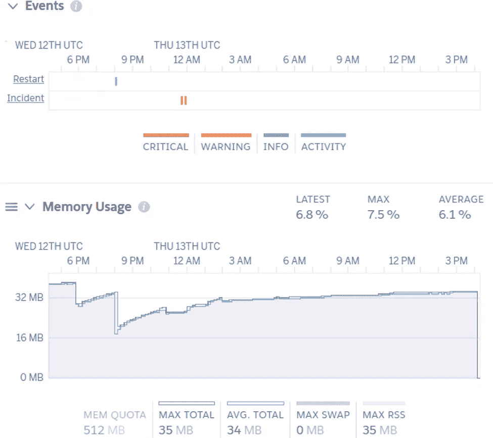
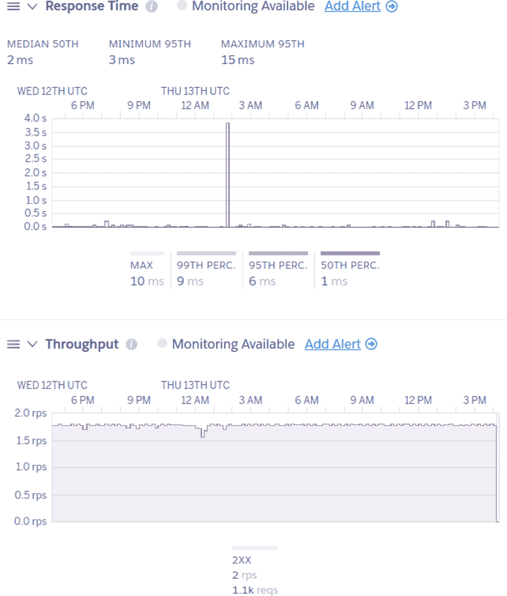
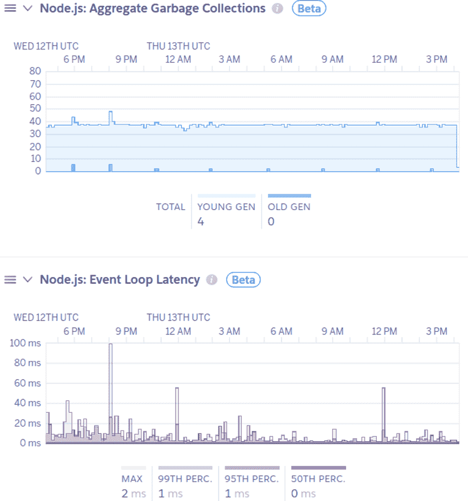
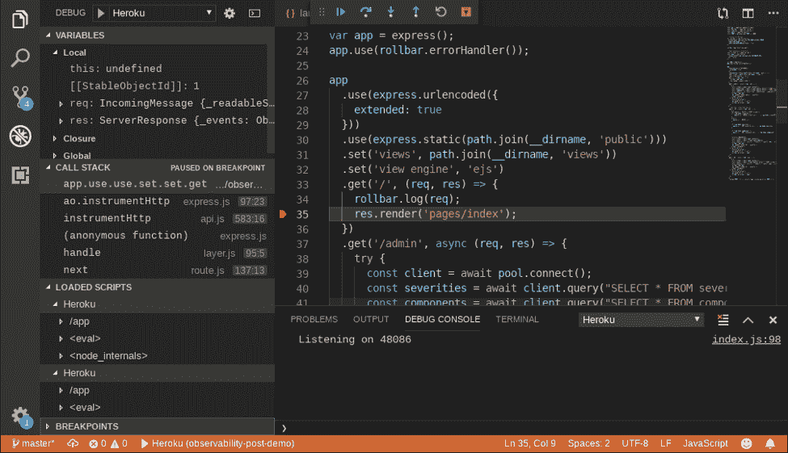
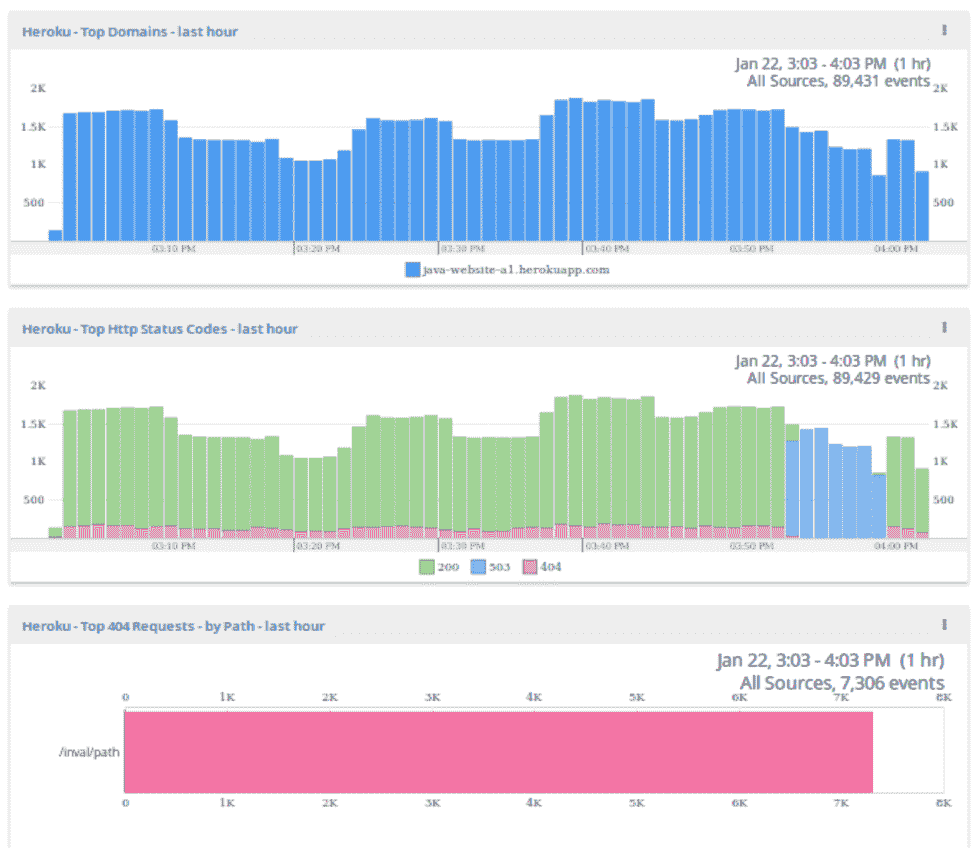
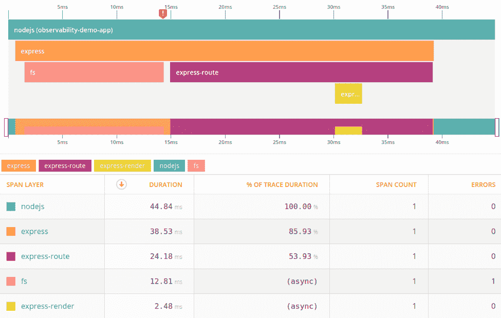

# Heroku 上的可观察性:如何监控托管基础设施上的应用

> 原文：<https://levelup.gitconnected.com/observability-on-heroku-how-to-monitor-apps-on-a-managed-infrastructure-2856565352dd>


[活动发起人](https://unsplash.com/@campaign_creators?utm_source=unsplash&utm_medium=referral&utm_content=creditCopyText)在 [Unsplash](https://unsplash.com/s/photos/computer-graph?utm_source=unsplash&utm_medium=referral&utm_content=creditCopyText) 上的照片

像 Heroku 这样的云平台使得托管应用程序比以往任何时候都更容易:只需上传你的代码，他们就会为你部署。但是一个常见的误解是，因为您不拥有基础设施，所以您不能真正监控您的应用程序或看到幕后的情况。

幸运的是，Heroku 让你可以完全观察你的应用程序。您可以使用许多日志记录和调试工具(如 Heroku Dashboard、Logplex 和 in-dyno 远程调试)来访问重要的指标，包括 CPU 和 RAM 使用情况、日志、HTTP 请求和运行时指标。您甚至可以通过第三方插件扩展您的监控功能，从错误监控服务到完整的应用性能监控(APM)解决方案。

# 使用 Heroku 的内置工具进行观察和调试

Heroku 平台内置了以下方法，可供所有应用程序使用:

**聚合** [**日志**](https://devcenter.heroku.com/articles/logging)

日志提供了关于您的应用和基础架构的详细记录。它们对于从应用程序中提取数据以进行故障排除和调试、监控操作和跟踪请求非常有用。日志通常还用于审计和法规遵从性。Logplex 是 Heroku 的日志路由工具，可以存储长达一周的日志，但是您可以使用日志插件或 [log drain](https://devcenter.heroku.com/articles/log-drains) 来自动导出您的日志。

Heroku [汇总运行应用程序和 Heroku 平台本身创建的日志](https://devcenter.heroku.com/articles/logging)。其中包括:

*   构建日志
*   在所有正在运行的 dynos(容器)中，将应用程序日志打印到 stdout 或 stderr
*   Heroku 平台生成的系统日志，如应用重启或崩溃
*   API 日志，是由您或其他用户执行的管理操作
*   来自附加服务的日志，如附加的数据库

您可以通过 Heroku 仪表板、Heroku CLI 或直接通过 [Logplex](https://devcenter.heroku.com/articles/logplex) 使用日志来访问日志。

[**Heroku 仪表盘**](https://devcenter.heroku.com/articles/heroku-dashboard)

仪表盘为您提供了应用程序的概览摘要。它对于实时监控、检测异常(如崩溃或资源消耗的变化)和总体趋势非常有用。例如，如果您正在部署新应用程序或升级现有应用程序，仪表板可以立即显示对资源使用和吞吐量的影响。

只要登录，你就会看到仪表板:它提供了你的应用程序，资源和加载项的完整概述。它显示 dyno 活动、指标(由[流程类型](https://devcenter.heroku.com/articles/procfile#procfile-format)聚合)、日志和影响应用的活动。仪表板还可以通知您潜在的问题，并将您链接到相关的文档资源。

控制面板显示以下指标:

*   内存容量和使用
*   CPU 负载
*   [用户发起的事件](https://devcenter.heroku.com/articles/metrics#events)，如配置更改和 dyno 重启
*   [Heroku 平台事件](https://devcenter.heroku.com/articles/error-codes)



*Heroku 仪表盘上报告的事件历史和 RAM 使用情况*

根据您的流程类型，您甚至可以获得更具体的指标。例如，使用 web 进程类型的应用程序显示了 [HTTP 响应时间和吞吐量](https://devcenter.heroku.com/articles/metrics#metrics-gathered-for-web-dynos-only):



*Heroku 仪表板上 web dynos 的指标。*

[**语言运行时指标**](https://devcenter.heroku.com/articles/language-runtime-metrics)

为了更深入地了解您的应用程序的特定运行时环境，运行时指标通过添加特定于语言的指标来补充仪表板，以帮助调试和优化您的应用程序。Heroku 收集了几种语言的运行时指标，包括 Java、Go、Node.js 和 Ruby。

这些指标提供了关于您的应用的更多信息，如详细的内存分配、垃圾收集运行和延迟。例如，Node.js 应用程序可以报告它们在垃圾收集、垃圾收集运行、事件循环延迟和事件循环块上花费的时间。启用语言运行时指标后，这些指标会自动添加到仪表板中。

虽然它们可能会使用额外的资源，但启用运行时指标需要几秒钟。对于 Java 和 Node.js，不需要修改代码。



*Heroku 收集的 Node.js 运行时指标子集*

[Heroku Exec](https://devcenter.heroku.com/articles/exec)

Heroku Exec 对于调试无法在本地重现的问题非常有用。它创建了一个到 dyno 的 SSH 隧道，让你运行命令和[打开远程调试会话](https://devcenter.heroku.com/articles/exec#remote-debugging)。对于无法通过日志或指标解决的问题，Heroku Exec 可以让您直接找到问题的根源。

要启用 Node.js 应用程序的远程调试，可以通过向 Procfile 添加— inspect= <port>参数来打开远程调试端口。对于 Java 应用程序，您需要启用 Java 调试线协议(JDWP)。您还可以使用 Heroku CLI 的 Java 插件来运行 VisualVM、jmap 和 jstack 等调试工具。详细说明见 [Heroku Exec 文档](https://devcenter.heroku.com/articles/exec#remote-debugging)。</port>

重新部署应用程序后，使用以下命令将远程调试端口转发到您的本地系统:

```
$ heroku ps:forward <port>
```

例如，这里我们使用 Visual Studio 代码来调试正在运行的 Node.js dyno:



*使用 Visual Studio 代码实时调试 Heroku 应用*

# 通过附加组件进行监控

如果本地解决方案不能满足您的需求，您可以从提供额外监控功能的[数百个插件](https://elements.heroku.com/addons)中进行选择。我们将在这里列出其中的几个。

**测井**

日志插件提供了额外的日志管理功能，如搜索、索引、绘图和创建警报。

第三方服务提供了几个[日志插件](https://elements.heroku.com/addons/#logging)，如 [Sumo Logic](https://elements.heroku.com/addons/sumologic) 和 [logz.io](https://elements.heroku.com/addons/logzio) 。此外，许多服务可以自动解析 Heroku 日志，使它们更容易搜索和跟踪定制仪表板和警报的趋势。例如，网络安全管理软件产品 Loggly 为 Heroku 日志提供了一个[预配置的仪表板，让您直观地了解 HTTP 状态代码以及哪些路径缺少资源。](https://www.loggly.com/solution/heroku-logging/)



*绘制导致网络安全管理软件产品日志中 404 错误的顶级域、HTTP 状态代码和路径的图表*

**应用性能监控(APM)**

有[几个监视插件](https://elements.heroku.com/addons/#monitoring)可以从厂商那里得到，比如[新遗迹 APM](https://elements.heroku.com/addons/newrelic) 和[侦察兵](https://elements.heroku.com/addons/scout)。这些附加组件让您可以收集更详细的应用程序性能指标，包括单个事务时间、数据库调用、缓存命中和在各种组件上花费的时间。这可以帮助您确定性能问题和错误的原因。

例如， [AppOptics](https://elements.heroku.com/addons/appoptics) 显示了通过 Node.js 应用程序跟踪的请求的细分，显示了等待文件系统和路由所花费的时间的细分:



*在网络安全管理软件产品应用程序中跟踪 Node.js 请求*

# 结论

您希望尽可能轻松地管理您的应用程序。有几种方法可以让你通过 Heroku 等云提供商监控你的应用，无论是通过详细的基础设施指标还是日志。