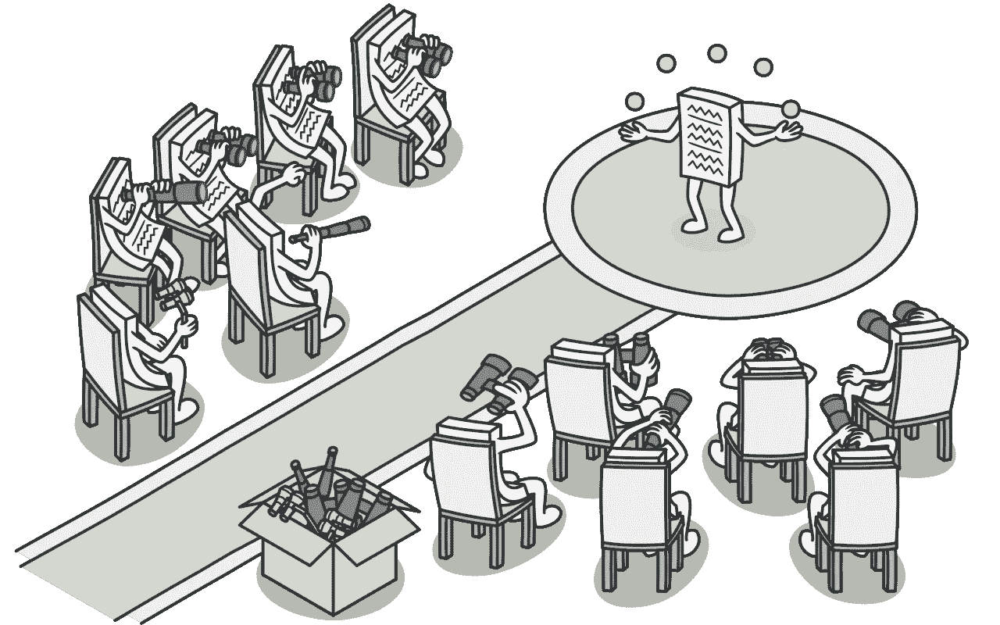
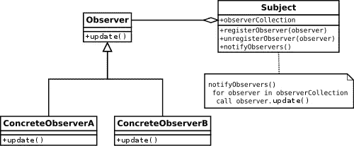

# Typescript 中的观察者设计模式实现

> 原文：<https://levelup.gitconnected.com/observer-design-pattern-implementation-in-typescript-332477ee5b30>

在这篇文章中，我们将学习观察者模式和这种设计模式的用法。



观察者设计模式

## 观察者设计模式定义

根据 GoF 的定义，观察者模式定义了对象之间一对多的依赖关系，因此当一个对象改变状态时，它的所有依赖对象都会得到通知并自动更新。它也被称为发布-订阅模式。

简而言之，当你想知道另一个对象的变化时，你可以使用**观察者设计模式**。

观察者设计模式是一种**行为模式**，这意味着它是一种对象间通信的*模式*。

这种设计模式的其他名称有**事件订阅者**、**监听器、发布订阅者**

## **这种设计模式的真实例子有哪些？**

社交应用程序是这种设计模式的真实例子。当我们在 Instagram 上关注某人时，我们只是想了解这个人的状态变化。

如果您使用 NodeJS 或 Javascript，您应该熟悉事件监听器。我们听一个事件，我们想做一些事情。例如，当输入值改变时，我们想重新计算一些东西。这与我们通常使用观察者设计模式想要做的事情非常相似。

另一个简单的例子是，当我们想从商店购买一种产品，但它已经卖完了，我们希望当它再次可用时得到通知。我们只是想知道这个产品的状态。在我们购买该产品后，我们不想知道该产品的变化。我们将在实现中使用这些简单的概念。

## 设计模式 UML

让我们看一下 UML，然后，我们将使用 typescript 实现一个简单的示例:



观察者设计模式 UML

主题**是我们想知道的事情。它包含了一些我们可能在不同文章中看到的不同名称的方法:**

*   **register observer**=**register****=****attach**=**subscribe**:这是我们用来添加一个观察者的方法。
*   **unregister observer****= unregister =****detach****=****unsubscribe**:这是我们用来删除一个观察者的方法。
*   **notify observer****=****notify**:这个方法将对每个观察器运行另一个方法，换句话说，这个方法将通知观察器有变化。
*   **更新**:这个方法是在 Observer 类中实现的，这是我们在主题改变时想要做的事情。

## 空谈不值钱！

让我们看看如何使用 Typescript 实现这一点:

首先，我们应该安装 Typescript 来将我们的代码转换成 JavaScript。

```
npm init -y
npm install typescript
```

让我们创建我们的类型脚本文件:

Typescript 中观察者设计模式的基本实现

实现之后，我们在第 35 行和第 36 行创建了两个观察者。在第 38 行，我们创建了一个主题。

在第 40 行`firstObserver`订阅了主题。因此，如果我们运行 notify，我们应该只会看到`firstObserver`的日志。

在第 42 行，我们订阅了`secondObserver`，所以如果运行`notify`，现在我们应该可以看到这两个观察者的日志。

在第 46 行，我们取消了对`secondObserver`的订阅，所以如果执行`notify`，我们应该只能看到来自`firstObserver`的日志。

最后，日志应该是这样的:

```
[LOG]: "Observer 1 is updating..."[LOG]: "-----"[LOG]: "Observer 1 is updating..."[LOG]: "Observer 2 is updating..."[LOG]: "-----"[LOG]: "Observer 2 is updating..."
```

## **让我们实现一些更有意义的东西吧！**

简单设计模式的例子

假设我们有一个 CR7 社交页面，我们想关注这个页面上的新闻。每个想关注这个页面的人都应该订阅，每次我们有一条新闻，我们就调用`notify`函数，在这里我们传递新闻，这个函数将新闻传递给粉丝，他们的*更新*实现可以很容易地将这条新闻添加到他们的`feed`数组中。之后，通过调用`showFeed`函数我们可以看到这些粉丝的反馈。

这是我们应该在控制台中看到的输出:

```
[LOG]: "alice recieved  a news"[LOG]: "bob recieved  a news"[LOG]: "bob recieved  a news"[LOG]: "alice:CR7 has sent off"[LOG]: "bob:CR7 has sent off,CR7 scored a goal against Inter Milan."
```

这是对这种设计模式的简单解释。就我个人而言，我只在看到一些例子时才理解这种东西，这里我的意图是通过使用简单的例子和用法来解释这种设计模式。

## 参考

[https://howtodoinjava . com/design-patterns/behavioral/observer-design-pattern/#:~:text = A % 20 real % 20 world % 20 example % 20 of，at % 20 any % 20 point % 20 of % 20 time](https://howtodoinjava.com/design-patterns/behavioral/observer-design-pattern/#:~:text=A%20real%20world%20example%20of,at%20any%20point%20of%20time)。

[https://refactoring.guru/design-patterns/observer](https://refactoring.guru/design-patterns/observer)