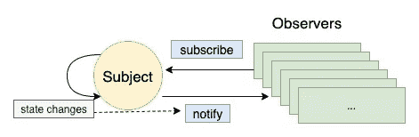
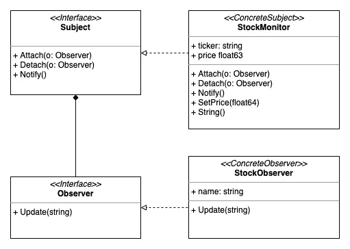

# Golang 中的观察者设计模式及实例

> 原文：<https://levelup.gitconnected.com/observer-design-pattern-in-golang-with-an-example-6c24898059b1>

## 在 Golang 中实现观察者设计模式

[粘土银行](https://unsplash.com/@claybanks?utm_source=medium&utm_medium=referral)在 [Unsplash](https://unsplash.com?utm_source=medium&utm_medium=referral) 拍摄的照片

**观察者设计模式**是一个软件设计模式，它允许你定义一个订阅机制来通知多个对象他们正在观察的对象发生的任何事件。

这是最简单也是最广泛使用的模式之一。它有许多真实的用例。以下是一些最常见的。

*   新闻公司与订户之间的报纸订阅。
*   手机闹钟在特定的时间醒来。
*   移动天气应用程序不断更新温度和湿度。
*   股票交易应用程序显示最新的股票价格。

对观察者模式感到有点好奇？让我们做好准备，了解更多。

# 主体和观察者

主体和观察者的关系，由作者绘制

观察者模式的两个重要概念是**主体**和**观察者**。

*   **观察者**:对主体感兴趣的对象
*   **主体**:是被观察的对象。

我们举个例子说明一下。

假设你对新闻感兴趣，并想订阅最新的新闻。这里有一个新闻聚合器。它从各种来源收集新闻，然后把新闻发布给你。

在这个例子中，新闻聚合器是主题，而您是观察者之一。每次聚合器更新新闻时，都会通知所有订阅者该新闻。

主体和观察者的关系是**一对多**。这意味着一个主体维护一个观察者列表。**当受试者感知到一些状态变化时，它会通知所有观察者这种变化**。这就是为什么我们把这种模式归为行为范畴。

# Go 中的实现

假设你对股票市场感兴趣。您有以下需求:

*   你想跟踪某个特定公司的股票价格(例如苹果公司)。
*   你不想错过任何股票价格的更新，尤其是当价格下跌到某一点的时候。
*   你希望得到所有股票价格更新的通知。

现在，您可以使用观察者模式来实现这一点。太棒了。

UML 图

上图是观察者模式的 UML。这对我们了解所有物体的全貌很有帮助。

现在让我们先来关注一下*主体和观察者接口*。

观察者-主体-界面

*   *主题接口*定义了三个必要的方法签名。`attach`和`detach`用于将观察者与被摄对象连接和分离。`notify`用于通知该主题的所有观察者。
*   *观察者接口*定义了一个方法签名`Update`。符合某个条件时会被主体触发。

接下来，我们创建一个具体的观察者 *StockObserver* 来实现观察者接口。

具体观察者

类似地，我们创建一个具体的 subject *StockMonitor* 来实现 subject 接口。

我们还为 S *tockMonitor 对象定义了一些内部字段和方法。*

*   `observers`定义一个附加到`stockMonitor`对象的观察点切片
*   `ticker`定义某种股票的代号(如 AAPL)
*   `price`定义某种股票的价格
*   `setPrice`用于设置一只股票的价格
*   `String`用于打印受试者的内部状态

最后，主文件来了。

主文件

在这一部分

*   我们创建两个观察者，`observerA`和`*observerB*`。
*   将它们连接到`stockMonitor`上。
*   改变`stockMonitor`的价格。我们看到`observerA`和`obsererB`都被通知了。
*   将`observerA`从`stockMonitor`上拆下，改变股价。我们可以看到只有`observerB`被通知。

# 松散耦合考虑

在观察者模式中，主体和观察者是松散耦合的。

*   主体只知道观察者，反之则不然。
*   观察者可以连接到多个主题
*   新的观察者可以在任何时候附在主题上。在附加之后，它将被通知所有的更改。
*   从主题中分离观察者不会通知观察者所做的更改。

发现这篇文章很有用👏？看看我下面的其他文章吧！

 [## 举例说明戈兰语中的固体原理

### 对于有经验的程序员来说，这些坚实的原则并不陌生。它们为我们提供了如何安排功能和…

levelup.gitconnected.com](/solid-principles-in-golang-explained-by-examples-4a4cccf47388)  [## Golang 频道是如何工作的

### 了解戈朗通道的内部运作

levelup.gitconnected.com](/how-does-golang-channel-works-6d66acd54753)